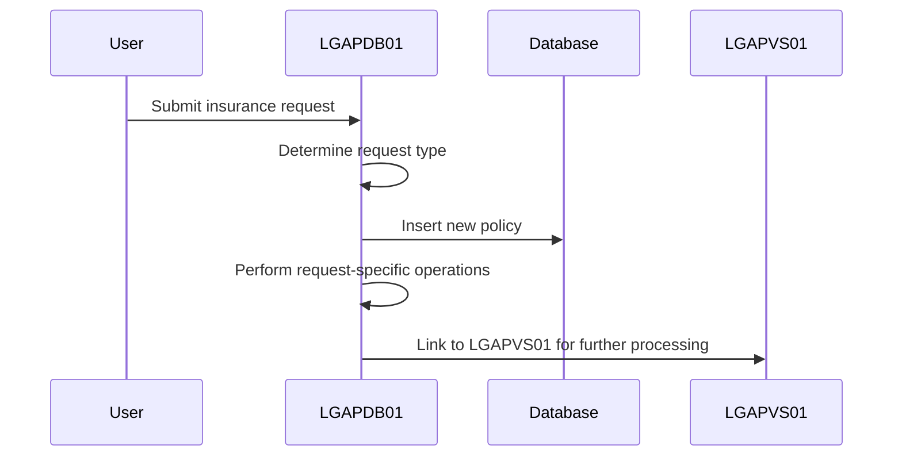
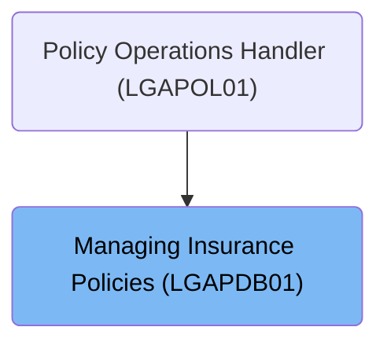
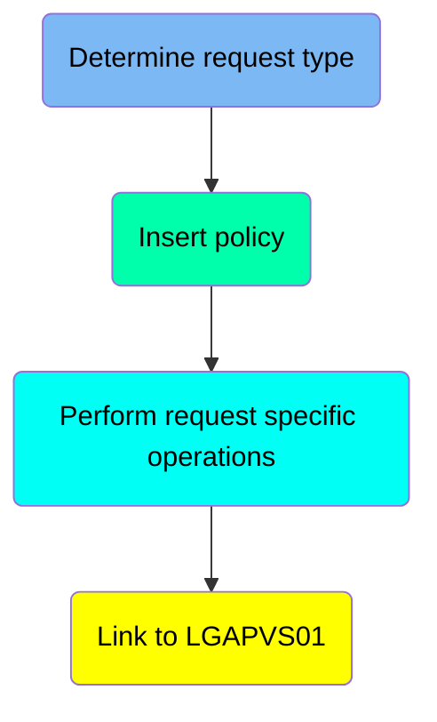
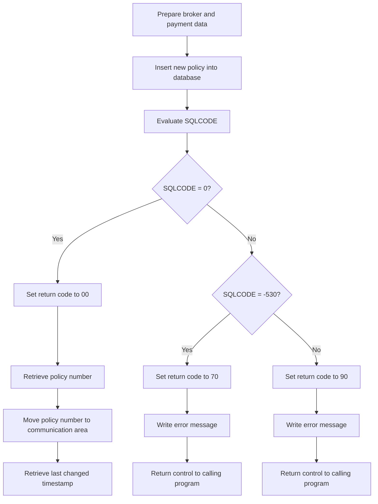
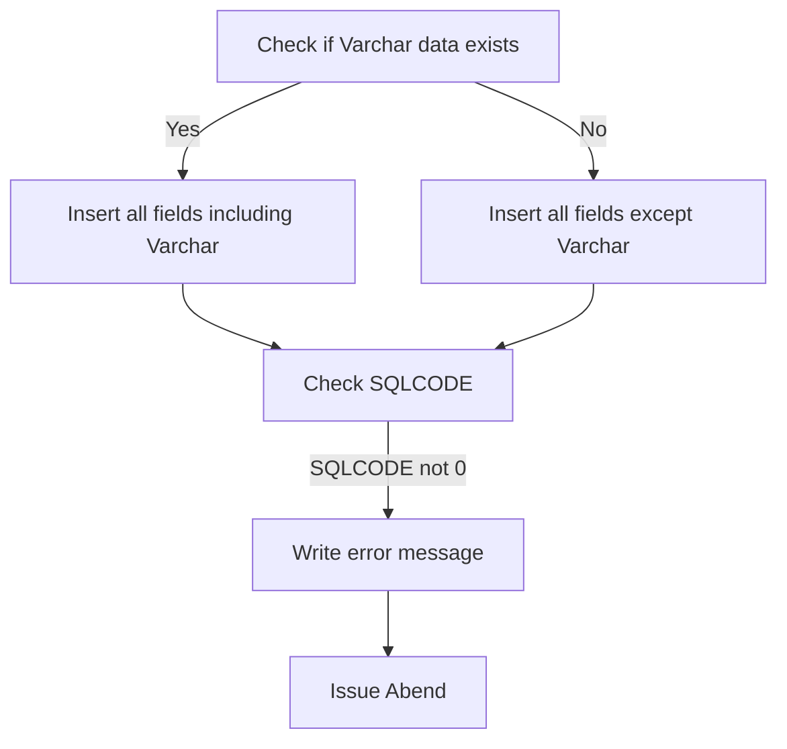
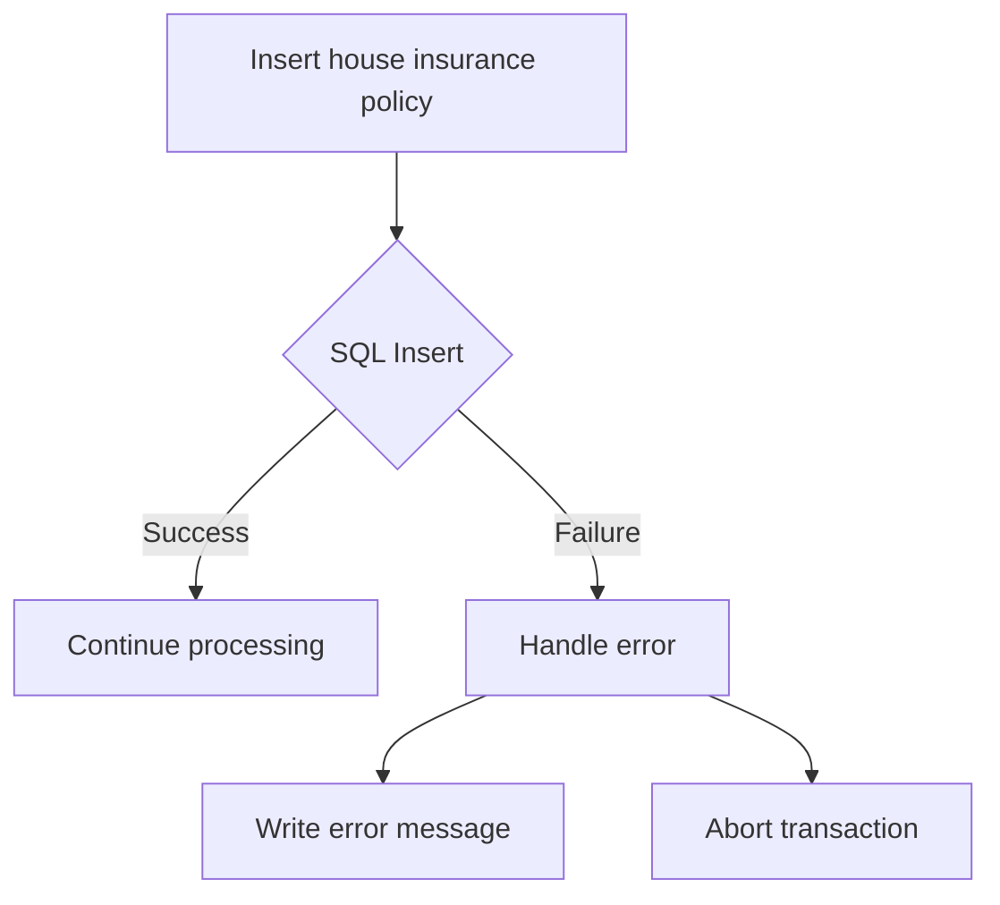

This document explains the process of managing insurance policies (<SwmToken path="base/src/lgapdb01.cbl" pos="2:6:6" line-data="       PROGRAM-ID. LGAPDB01.">`LGAPDB01`</SwmToken>). The program handles various operations related to insurance policies, including determining the request type, inserting new policies, performing request-specific operations, and linking to another program for further processing.

The main steps are:

- Determine the type of insurance request
- Insert a new policy into the database
- Perform operations specific to the request type
- Link to the <SwmToken path="base/src/lgapdb01.cbl" pos="268:9:9" line-data="             EXEC CICS Link Program(LGAPVS01)">`LGAPVS01`</SwmToken> program for additional processing



# Where is this program used?

This program is used once, as represented in the following diagram:



# Process insurance requests (<SwmToken path="base/src/lgapdb01.cbl" pos="190:1:1" line-data="       MAINLINE SECTION.">`MAINLINE`</SwmToken>)

Let's split this section into smaller parts:



## Determine request type

First, we'll zoom into this section of the flow:

```mermaid
graph TD
  A[Evaluate CA-REQUEST-ID] -->|01AEND| B[Set policy type to Endowment]
  A -->|01AHOU| C[Set policy type to House]
  A -->|01AMOT| D[Set policy type to Motor]
  A -->|01ACOM| E[Set policy type to Commercial]
  A -->|Other| F[Set return code to 99 and return]

%% Swimm:
%% graph TD
%%   A[Evaluate <SwmToken path="base/src/lgapdb01.cbl" pos="218:3:7" line-data="           EVALUATE CA-REQUEST-ID">`CA-REQUEST-ID`</SwmToken>] -->|<SwmToken path="base/src/lgapdb01.cbl" pos="220:4:4" line-data="             WHEN &#39;01AEND&#39;">`01AEND`</SwmToken>| B[Set policy type to Endowment]
%%   A -->|<SwmToken path="base/src/lgapdb01.cbl" pos="224:4:4" line-data="             WHEN &#39;01AHOU&#39;">`01AHOU`</SwmToken>| C[Set policy type to House]
%%   A -->|<SwmToken path="base/src/lgapdb01.cbl" pos="228:4:4" line-data="             WHEN &#39;01AMOT&#39;">`01AMOT`</SwmToken>| D[Set policy type to Motor]
%%   A -->|<SwmToken path="base/src/lgapdb01.cbl" pos="232:4:4" line-data="             WHEN &#39;01ACOM&#39;">`01ACOM`</SwmToken>| E[Set policy type to Commercial]
%%   A -->|Other| F[Set return code to 99 and return]
```



<SwmSnippet path="/base/src/lgapdb01.cbl" line="218">

---

### Evaluating the Request ID

Going into the evaluation of the request ID, the code determines the type of insurance policy being processed. If the request ID indicates an endowment policy, it adjusts the required length and sets the policy type to endowment. For a house policy, it adjusts the length and sets the type to house. For a motor policy, it adjusts the length and sets the type to motor. For a commercial policy, it adjusts the length and sets the type to commercial.

```cobol
           EVALUATE CA-REQUEST-ID

             WHEN '01AEND'
               ADD WS-FULL-ENDOW-LEN TO WS-REQUIRED-CA-LEN
               MOVE 'E' TO DB2-POLICYTYPE

             WHEN '01AHOU'
               ADD WS-FULL-HOUSE-LEN TO WS-REQUIRED-CA-LEN
               MOVE 'H' TO DB2-POLICYTYPE

             WHEN '01AMOT'
               ADD WS-FULL-MOTOR-LEN TO WS-REQUIRED-CA-LEN
               MOVE 'M' TO DB2-POLICYTYPE

             WHEN '01ACOM'
               ADD WS-FULL-COMM-LEN TO WS-REQUIRED-CA-LEN
               MOVE 'C' TO DB2-POLICYTYPE
```

---

</SwmSnippet>

<SwmSnippet path="/base/src/lgapdb01.cbl" line="236">

---

### Handling Other Request IDs

Next, if the request ID does not match any of the specified types (endowment, house, motor, or commercial), the code sets a return code indicating an unrecognized request and returns control to the calling program. This ensures that any unrecognized request IDs are handled appropriately by terminating the process.

```cobol
             WHEN OTHER
               MOVE '99' TO CA-RETURN-CODE
               EXEC CICS RETURN END-EXEC

           END-EVALUATE
```

---

</SwmSnippet>

## Insert policy

<SwmSnippet path="/base/src/lgapdb01.cbl" line="247">

---

### Inserting a new policy

The code is responsible for inserting a new policy into the database. This step ensures that the policy data is correctly inserted into the <SwmToken path="base/src/lgapdb01.cbl" pos="222:9:9" line-data="               MOVE &#39;E&#39; TO DB2-POLICYTYPE">`DB2`</SwmToken> database while handling potential SQL errors.

```cobol
           PERFORM P100-T
```

---

</SwmSnippet>

## Perform request specific operations

<SwmSnippet path="/base/src/lgapdb01.cbl" line="249">

---

The code evaluates the type of insurance policy request and performs the corresponding operation for endowment, house, motor, or commercial policies. If the request type is not recognized, it sets the return code to '99'.

```cobol
           EVALUATE CA-REQUEST-ID

             WHEN '01AEND'
               PERFORM P200-E

             WHEN '01AHOU'
               PERFORM P300-H

             WHEN '01AMOT'
               PERFORM P400-M

             WHEN '01ACOM'
               PERFORM P500-BIZ

             WHEN OTHER
               MOVE '99' TO CA-RETURN-CODE

           END-EVALUATE
```

---

</SwmSnippet>

## Link to <SwmToken path="base/src/lgapdb01.cbl" pos="268:9:9" line-data="             EXEC CICS Link Program(LGAPVS01)">`LGAPVS01`</SwmToken>

<SwmSnippet path="/base/src/lgapdb01.cbl" line="268">

---

### Linking to <SwmToken path="base/src/lgapdb01.cbl" pos="268:9:9" line-data="             EXEC CICS Link Program(LGAPVS01)">`LGAPVS01`</SwmToken> Program

The following code snippet shows how the MAINLINE function links to the <SwmToken path="base/src/lgapdb01.cbl" pos="268:9:9" line-data="             EXEC CICS Link Program(LGAPVS01)">`LGAPVS01`</SwmToken> program. This step is crucial as it handles various types of insurance policy data and writes this data to a file.

```cobol
             EXEC CICS Link Program(LGAPVS01)
                  Commarea(DFHCOMMAREA)
                LENGTH(32500)
             END-EXEC.
```

---

</SwmSnippet>

# Insert Policy (<SwmToken path="base/src/lgapdb01.cbl" pos="247:3:5" line-data="           PERFORM P100-T">`P100-T`</SwmToken>)

Lets' zoom into the program flow:



<SwmSnippet path="/base/src/lgapdb01.cbl" line="281">

---

### Preparing broker and payment data

Going into the <SwmToken path="base/src/lgapdb01.cbl" pos="281:1:3" line-data="       P100-T.">`P100-T`</SwmToken> function, the first step is to prepare the broker and payment data for insertion into the POLICY table. This involves moving the broker ID and payment information to the corresponding <SwmToken path="base/src/lgapdb01.cbl" pos="283:9:9" line-data="           MOVE CA-BROKERID TO DB2-BROKERID-INT">`DB2`</SwmToken> variables.

```cobol
       P100-T.

           MOVE CA-BROKERID TO DB2-BROKERID-INT
           MOVE CA-PAYMENT TO DB2-PAYMENT-INT

           MOVE ' INSERT POLICY' TO EM-SQLREQ
           EXEC SQL
             INSERT INTO POLICY
                       ( POLICYNUMBER,
                         CUSTOMERNUMBER,
                         ISSUEDATE,
                         EXPIRYDATE,
                         POLICYTYPE,
                         LASTCHANGED,
                         BROKERID,
                         BROKERSREFERENCE,
                         PAYMENT           )
                VALUES ( DEFAULT,
                         :DB2-CUSTOMERNUM-INT,
                         :CA-ISSUE-DATE,
                         :CA-EXPIRY-DATE,
                         :DB2-POLICYTYPE,
                         CURRENT TIMESTAMP,
                         :DB2-BROKERID-INT,
                         :CA-BROKERSREF,
                         :DB2-PAYMENT-INT      )
           END-EXEC
```

---

</SwmSnippet>

<SwmSnippet path="/base/src/lgapdb01.cbl" line="281">

---

### Inserting a new policy into the database

Next, the function inserts a new policy into the POLICY table. The SQL INSERT statement is used to add the policy details, including the customer number, issue date, expiry date, policy type, broker ID, broker's reference, and payment information.

```cobol
       P100-T.

           MOVE CA-BROKERID TO DB2-BROKERID-INT
           MOVE CA-PAYMENT TO DB2-PAYMENT-INT

           MOVE ' INSERT POLICY' TO EM-SQLREQ
           EXEC SQL
             INSERT INTO POLICY
                       ( POLICYNUMBER,
                         CUSTOMERNUMBER,
                         ISSUEDATE,
                         EXPIRYDATE,
                         POLICYTYPE,
                         LASTCHANGED,
                         BROKERID,
                         BROKERSREFERENCE,
                         PAYMENT           )
                VALUES ( DEFAULT,
                         :DB2-CUSTOMERNUM-INT,
                         :CA-ISSUE-DATE,
                         :CA-EXPIRY-DATE,
                         :DB2-POLICYTYPE,
                         CURRENT TIMESTAMP,
                         :DB2-BROKERID-INT,
                         :CA-BROKERSREF,
                         :DB2-PAYMENT-INT      )
           END-EXEC
```

---

</SwmSnippet>

<SwmSnippet path="/base/src/lgapdb01.cbl" line="309">

---

### Evaluating the SQLCODE

Now, the function evaluates the SQLCODE to determine the outcome of the INSERT operation. If the SQLCODE is 0, it indicates a successful insertion, and the return code is set to '00'.

```cobol
           Evaluate SQLCODE

             When 0
               MOVE '00' TO CA-RETURN-CODE

             When -530
               MOVE '70' TO CA-RETURN-CODE
               PERFORM WRITE-ERROR-MESSAGE
               EXEC CICS RETURN END-EXEC

             When Other
               MOVE '90' TO CA-RETURN-CODE
               PERFORM WRITE-ERROR-MESSAGE
               EXEC CICS RETURN END-EXEC

           END-Evaluate.
```

---

</SwmSnippet>

<SwmSnippet path="/base/src/lgapdb01.cbl" line="309">

---

### Handling SQL errors

If the SQLCODE is -530, it indicates a foreign key constraint violation, and the return code is set to '70'. An error message is written, and control is returned to the calling program. For any other SQLCODE, the return code is set to '90', an error message is written, and control is returned to the calling program.

```cobol
           Evaluate SQLCODE

             When 0
               MOVE '00' TO CA-RETURN-CODE

             When -530
               MOVE '70' TO CA-RETURN-CODE
               PERFORM WRITE-ERROR-MESSAGE
               EXEC CICS RETURN END-EXEC

             When Other
               MOVE '90' TO CA-RETURN-CODE
               PERFORM WRITE-ERROR-MESSAGE
               EXEC CICS RETURN END-EXEC

           END-Evaluate.
```

---

</SwmSnippet>

<SwmSnippet path="/base/src/lgapdb01.cbl" line="326">

---

### Retrieving the policy number

Then, the function retrieves the policy number assigned to the newly inserted policy using the SQL function <SwmToken path="base/src/lgapdb01.cbl" pos="327:12:14" line-data="             SET :DB2-POLICYNUM-INT = IDENTITY_VAL_LOCAL()">`IDENTITY_VAL_LOCAL()`</SwmToken>.

```cobol
           EXEC SQL
             SET :DB2-POLICYNUM-INT = IDENTITY_VAL_LOCAL()
           END-EXEC
```

---

</SwmSnippet>

<SwmSnippet path="/base/src/lgapdb01.cbl" line="329">

---

### Moving the policy number to the communication area

Next, the function moves the retrieved policy number to the communication area and prepares it for further processing.

```cobol
           MOVE DB2-POLICYNUM-INT TO CA-POLICY-NUM
           MOVE CA-POLICY-NUM TO EM-POLNUM

           EXEC SQL
             SELECT LASTCHANGED
               INTO :CA-LASTCHANGED
               FROM POLICY
               WHERE POLICYNUMBER = :DB2-POLICYNUM-INT
           END-EXEC.
           EXIT.
```

---

</SwmSnippet>

<SwmSnippet path="/base/src/lgapdb01.cbl" line="329">

---

### Retrieving the last changed timestamp

Finally, the function retrieves the last changed timestamp for the newly inserted policy from the POLICY table.

```cobol
           MOVE DB2-POLICYNUM-INT TO CA-POLICY-NUM
           MOVE CA-POLICY-NUM TO EM-POLNUM

           EXEC SQL
             SELECT LASTCHANGED
               INTO :CA-LASTCHANGED
               FROM POLICY
               WHERE POLICYNUMBER = :DB2-POLICYNUM-INT
           END-EXEC.
           EXIT.
```

---

</SwmSnippet>

# Insert policy (<SwmToken path="base/src/lgapdb01.cbl" pos="252:3:5" line-data="               PERFORM P200-E">`P200-E`</SwmToken>)

Lets' zoom into the program flow:



<SwmSnippet path="/base/src/lgapdb01.cbl" line="343">

---

### Moving numeric fields to integer format

Going into the <SwmToken path="base/src/lgapdb01.cbl" pos="343:1:3" line-data="       P200-E.">`P200-E`</SwmToken> function, the numeric fields for the term and sum assured are converted to integer format. This conversion is necessary for the subsequent database insertion.

```cobol
       P200-E.

      *    Move numeric fields to integer format
           MOVE CA-E-TERM        TO DB2-E-TERM-SINT
           MOVE CA-E-SUM-ASSURED TO DB2-E-SUMASSURED-INT

           MOVE ' INSERT ENDOW ' TO EM-SQLREQ
      *----------------------------------------------------------------*
      *    There are 2 versions of INSERT...                           *
      *      one which updates all fields including Varchar            *
      *      one which updates all fields Except Varchar               *
      *----------------------------------------------------------------*
           SUBTRACT WS-REQUIRED-CA-LEN FROM EIBCALEN
               GIVING WS-VARY-LEN
```

---

</SwmSnippet>

<SwmSnippet path="/base/src/lgapdb01.cbl" line="358">

---

### Handling Varchar data

Next, the function checks if there is Varchar data present by calculating its length. If the length is greater than zero, it indicates that Varchar data is present.

```cobol
           IF WS-VARY-LEN IS GREATER THAN ZERO
      *       Commarea contains data for Varchar field
              MOVE CA-E-PADDING-DATA
                  TO WS-VARY-CHAR(1:WS-VARY-LEN)
              EXEC SQL
                INSERT INTO ENDOWMENT
                          ( POLICYNUMBER,
                            WITHPROFITS,
                            EQUITIES,
                            MANAGEDFUND,
                            FUNDNAME,
                            TERM,
                            SUMASSURED,
                            LIFEASSURED,
                            PADDINGDATA    )
                   VALUES ( :DB2-POLICYNUM-INT,
                            :CA-E-W-PRO,
                            :CA-E-EQU,
                            :CA-E-M-FUN,
                            :CA-E-FUND-NAME,
                            :DB2-E-TERM-SINT,
                            :DB2-E-SUMASSURED-INT,
                            :CA-E-LIFE-ASSURED,
                            :WS-VARY-FIELD )
              END-EXEC
```

---

</SwmSnippet>

<SwmSnippet path="/base/src/lgapdb01.cbl" line="358">

---

### Inserting data with Varchar fields

If Varchar data is present, the function inserts all fields including the Varchar data into the endowment policy details in the <SwmToken path="base/src/lgapdb01.cbl" pos="373:6:6" line-data="                   VALUES ( :DB2-POLICYNUM-INT,">`DB2`</SwmToken> database. This ensures that all relevant policy details, including any additional Varchar data, are stored.

```cobol
           IF WS-VARY-LEN IS GREATER THAN ZERO
      *       Commarea contains data for Varchar field
              MOVE CA-E-PADDING-DATA
                  TO WS-VARY-CHAR(1:WS-VARY-LEN)
              EXEC SQL
                INSERT INTO ENDOWMENT
                          ( POLICYNUMBER,
                            WITHPROFITS,
                            EQUITIES,
                            MANAGEDFUND,
                            FUNDNAME,
                            TERM,
                            SUMASSURED,
                            LIFEASSURED,
                            PADDINGDATA    )
                   VALUES ( :DB2-POLICYNUM-INT,
                            :CA-E-W-PRO,
                            :CA-E-EQU,
                            :CA-E-M-FUN,
                            :CA-E-FUND-NAME,
                            :DB2-E-TERM-SINT,
                            :DB2-E-SUMASSURED-INT,
                            :CA-E-LIFE-ASSURED,
                            :WS-VARY-FIELD )
              END-EXEC
```

---

</SwmSnippet>

<SwmSnippet path="/base/src/lgapdb01.cbl" line="383">

---

### Inserting data without Varchar fields

If no Varchar data is present, the function inserts all fields except the Varchar data into the endowment policy details in the <SwmToken path="base/src/lgapdb01.cbl" pos="394:6:6" line-data="                   VALUES ( :DB2-POLICYNUM-INT,">`DB2`</SwmToken> database. This ensures that the essential policy details are stored even if there is no additional Varchar data.

```cobol
           ELSE
              EXEC SQL
                INSERT INTO ENDOWMENT
                          ( POLICYNUMBER,
                            WITHPROFITS,
                            EQUITIES,
                            MANAGEDFUND,
                            FUNDNAME,
                            TERM,
                            SUMASSURED,
                            LIFEASSURED    )
                   VALUES ( :DB2-POLICYNUM-INT,
                            :CA-E-W-PRO,
                            :CA-E-EQU,
                            :CA-E-M-FUN,
                            :CA-E-FUND-NAME,
                            :DB2-E-TERM-SINT,
                            :DB2-E-SUMASSURED-INT,
                            :CA-E-LIFE-ASSURED )
              END-EXEC
```

---

</SwmSnippet>

<SwmSnippet path="/base/src/lgapdb01.cbl" line="406">

---

### Handling SQL errors

If the SQL insertion results in an error, the function sets the return code to '90' and performs the error logging routine. This routine logs the error and updates the error communication area.

```cobol
             MOVE '90' TO CA-RETURN-CODE
             PERFORM WRITE-ERROR-MESSAGE
```

---

</SwmSnippet>

<SwmSnippet path="/base/src/lgapdb01.cbl" line="409">

---

### Issuing an Abend

If an error occurs during the SQL insertion, the function issues an Abend to ensure that the transaction is rolled back and the database remains consistent.

```cobol
             EXEC CICS ABEND ABCODE('LGSQ') NODUMP END-EXEC
             EXEC CICS RETURN END-EXEC
           END-IF.

           EXIT.
```

---

</SwmSnippet>

# Insert house record (<SwmToken path="base/src/lgapdb01.cbl" pos="255:3:5" line-data="               PERFORM P300-H">`P300-H`</SwmToken>)

Lets' zoom into the program flow:



<SwmSnippet path="/base/src/lgapdb01.cbl" line="415">

---

### Inserting house insurance policy details

The code snippet demonstrates the process of inserting house insurance policy details into the database (HOUSE). It starts by preparing the necessary values and then constructs an SQL insert statement to add the policy details into the HOUSE table. The values inserted include the policy number, property type, number of bedrooms, value, house name, house number, and postcode.

```cobol
       P300-H.

           MOVE CA-H-VAL       TO DB2-H-VALUE-INT
           MOVE CA-H-BED    TO DB2-H-BEDROOMS-SINT

           MOVE ' INSERT HOUSE ' TO EM-SQLREQ
           EXEC SQL
             INSERT INTO HOUSE
                       ( POLICYNUMBER,
                         PROPERTYTYPE,
                         BEDROOMS,
                         VALUE,
                         HOUSENAME,
                         HOUSENUMBER,
                         POSTCODE          )
                VALUES ( :DB2-POLICYNUM-INT,
                         :CA-H-P-TYP,
                         :DB2-H-BEDROOMS-SINT,
                         :DB2-H-VALUE-INT,
                         :CA-H-H-NAM,
                         :CA-H-HOUSE-NUMBER,
                         :CA-H-PCD      )
           END-EXEC
```

---

</SwmSnippet>

<SwmSnippet path="/base/src/lgapdb01.cbl" line="439">

---

### Handling SQL errors

If the SQL insert operation fails, the code snippet handles the error by setting a return code and performing an error message write operation. It then aborts the transaction to ensure data consistency and returns control to the calling program.

```cobol
           IF SQLCODE NOT EQUAL 0
             MOVE '90' TO CA-RETURN-CODE
             PERFORM WRITE-ERROR-MESSAGE
             EXEC CICS ABEND ABCODE('LGSQ') NODUMP END-EXEC
             EXEC CICS RETURN END-EXEC
           END-IF.

           EXIT.
```

---

</SwmSnippet>

&nbsp;

*This is an auto-generated document by Swimm 🌊 and has not yet been verified by a human*

<SwmMeta version="3.0.0" repo-id="Z2l0aHViJTNBJTNBa3luZHJ5bC1jaWNzLWdlbmFwcCUzQSUzQVN3aW1tLURlbW8=" repo-name="kyndryl-cics-genapp"><sup>Powered by [Swimm](/)</sup></SwmMeta>
