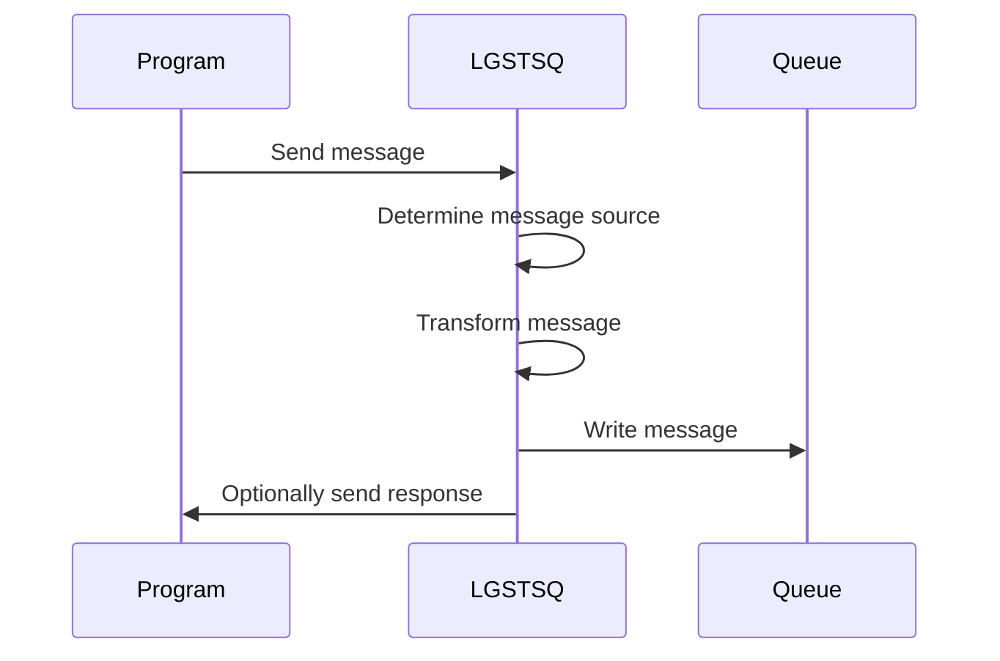
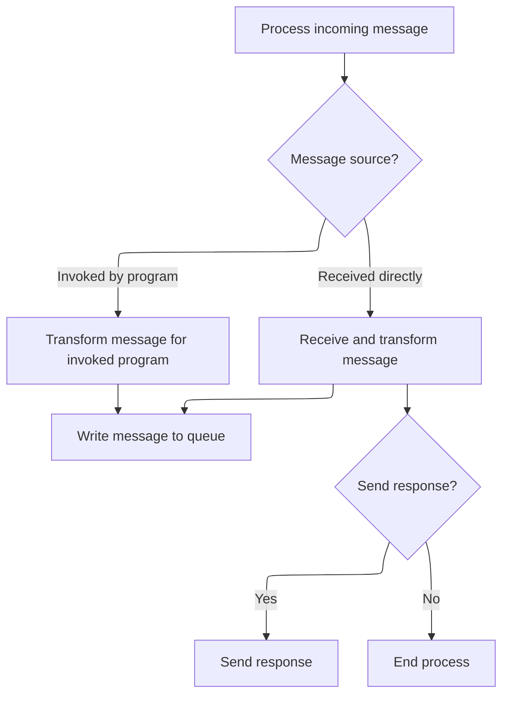

The document describes the Message Queue Handler (LGSTSQ) program, which processes incoming messages from various sources and writes them to queues. This program manages communication between different programs and queues within the system. It determines the source of the message, transforms it accordingly, and writes it to the appropriate queue. Optionally, it can send a response back to the source.

For example, if a message is received directly, it is transformed and written to the queue. Optionally, a response can be sent back to the source.

The main steps are:

- Process incoming message
- Determine message source
- Transform message for invoked program or receive and transform message
- Write message to queue
- Optionally send response



## Dependencies

# Where is this program used?

This program is used multiple times in the codebase as represented in the following diagram:

```mermaid
graph TD
  g9ev1("Adding Customer Passwords (LGACDB02)") --> 7ldvy("Message Queue Handler (LGSTSQ)"):::currentEntity
click g9ev1 openCode "base/src/lgacdb02.cbl:1"
0vpjq("Adding Policy Records (LGAPVS01)") --> 7ldvy("Message Queue Handler (LGSTSQ)"):::currentEntity
click 0vpjq openCode "base/src/lgapvs01.cbl:1"
avb6o("Updating Customer Details (LGUCUS01)") --> 7ldvy("Message Queue Handler (LGSTSQ)"):::currentEntity
click avb6o openCode "base/src/lgucus01.cbl:1"
sg4sg("Updating Policy Records (LGUPVS01)") --> 7ldvy("Message Queue Handler (LGSTSQ)"):::currentEntity
click sg4sg openCode "base/src/lgupvs01.cbl:1"
jfb3w("Deleting Policy Records (LGDPDB01)") --> 7ldvy("Message Queue Handler (LGSTSQ)"):::currentEntity
click jfb3w openCode "base/src/lgdpdb01.cbl:1"
p82lg("Policy Inquiry (LGIPDB01)") --> 7ldvy("Message Queue Handler (LGSTSQ)"):::currentEntity
click p82lg openCode "base/src/lgipdb01.cbl:1"
o033v("Updating Policy Details (LGUPOL01)") --> 7ldvy("Message Queue Handler (LGSTSQ)"):::currentEntity
click o033v openCode "base/src/lgupol01.cbl:1"
qjfmc("Adding Customer Details (LGACDB01)") --> 7ldvy("Message Queue Handler (LGSTSQ)"):::currentEntity
click qjfmc openCode "base/src/lgacdb01.cbl:1"
xegz4("Adding Customer (LGACUS01)") --> 7ldvy("Message Queue Handler (LGSTSQ)"):::currentEntity
click xegz4 openCode "base/src/lgacus01.cbl:1"
f2xy9("Policy Inquiry Logic (LGIPOL01)") --> 7ldvy("Message Queue Handler (LGSTSQ)"):::currentEntity
click f2xy9 openCode "base/src/lgipol01.cbl:1"
s8kix("Updating Customer Details (LGUCDB01)") --> 7ldvy("Message Queue Handler (LGSTSQ)"):::currentEntity
click s8kix openCode "base/src/lgucdb01.cbl:1"
bddtt("Deleting Policy (LGDPOL01)") --> 7ldvy("Message Queue Handler (LGSTSQ)"):::currentEntity
click bddtt openCode "base/src/lgdpol01.cbl:1"
or6yb("Updating Customer Records (LGUCVS01)") --> 7ldvy("Message Queue Handler (LGSTSQ)"):::currentEntity
click or6yb openCode "base/src/lgucvs01.cbl:1"
afnef("Adding Customer Records (LGACVS01)") --> 7ldvy("Message Queue Handler (LGSTSQ)"):::currentEntity
click afnef openCode "base/src/lgacvs01.cbl:1"
c3ona("Adding Policy Details (LGAPDB01)") --> 7ldvy("Message Queue Handler (LGSTSQ)"):::currentEntity
click c3ona openCode "base/src/lgapdb01.cbl:1"
pio6w("Inquiring Customer Details (LGICUS01)") --> 7ldvy("Message Queue Handler (LGSTSQ)"):::currentEntity
click pio6w openCode "base/src/lgicus01.cbl:1"
zi3i4("Adding Policy Details (LGAPOL01)") --> 7ldvy("Message Queue Handler (LGSTSQ)"):::currentEntity
click zi3i4 openCode "base/src/lgapol01.cbl:1"
u34me("Updating Policy Details (LGUPDB01)") --> 7ldvy("Message Queue Handler (LGSTSQ)"):::currentEntity
click u34me openCode "base/src/lgupdb01.cbl:1"
b3hnk("Deleting Policy Records (LGDPVS01)") --> 7ldvy("Message Queue Handler (LGSTSQ)"):::currentEntity
click b3hnk openCode "base/src/lgdpvs01.cbl:1"
nc9ax("Inquiring Customer Details (LGICDB01)") --> 7ldvy("Message Queue Handler (LGSTSQ)"):::currentEntity
click nc9ax openCode "base/src/lgicdb01.cbl:1"
  
  
click 7ldvy openCode "base/src/lgstsq.cbl:1"
    classDef currentEntity color:#000000,fill:#7CB9F4

%% Swimm:
%% graph TD
%%   g9ev1("Adding Customer Passwords (LGACDB02)") --> 7ldvy("Message Queue Handler (LGSTSQ)"):::currentEntity
%% click g9ev1 openCode "<SwmPath>[base/src/lgacdb02.cbl](base/src/lgacdb02.cbl)</SwmPath>:1"
%% 0vpjq("Adding Policy Records (LGAPVS01)") --> 7ldvy("Message Queue Handler (LGSTSQ)"):::currentEntity
%% click 0vpjq openCode "<SwmPath>[base/src/lgapvs01.cbl](base/src/lgapvs01.cbl)</SwmPath>:1"
%% avb6o("Updating Customer Details (LGUCUS01)") --> 7ldvy("Message Queue Handler (LGSTSQ)"):::currentEntity
%% click avb6o openCode "<SwmPath>[base/src/lgucus01.cbl](base/src/lgucus01.cbl)</SwmPath>:1"
%% sg4sg("Updating Policy Records (LGUPVS01)") --> 7ldvy("Message Queue Handler (LGSTSQ)"):::currentEntity
%% click sg4sg openCode "<SwmPath>[base/src/lgupvs01.cbl](base/src/lgupvs01.cbl)</SwmPath>:1"
%% jfb3w("Deleting Policy Records (LGDPDB01)") --> 7ldvy("Message Queue Handler (LGSTSQ)"):::currentEntity
%% click jfb3w openCode "<SwmPath>[base/src/lgdpdb01.cbl](base/src/lgdpdb01.cbl)</SwmPath>:1"
%% p82lg("Policy Inquiry (LGIPDB01)") --> 7ldvy("Message Queue Handler (LGSTSQ)"):::currentEntity
%% click p82lg openCode "<SwmPath>[base/src/lgipdb01.cbl](base/src/lgipdb01.cbl)</SwmPath>:1"
%% o033v("Updating Policy Details (LGUPOL01)") --> 7ldvy("Message Queue Handler (LGSTSQ)"):::currentEntity
%% click o033v openCode "<SwmPath>[base/src/lgupol01.cbl](base/src/lgupol01.cbl)</SwmPath>:1"
%% qjfmc("Adding Customer Details (LGACDB01)") --> 7ldvy("Message Queue Handler (LGSTSQ)"):::currentEntity
%% click qjfmc openCode "<SwmPath>[base/src/lgacdb01.cbl](base/src/lgacdb01.cbl)</SwmPath>:1"
%% xegz4("Adding Customer (LGACUS01)") --> 7ldvy("Message Queue Handler (LGSTSQ)"):::currentEntity
%% click xegz4 openCode "<SwmPath>[base/src/lgacus01.cbl](base/src/lgacus01.cbl)</SwmPath>:1"
%% f2xy9("Policy Inquiry Logic (LGIPOL01)") --> 7ldvy("Message Queue Handler (LGSTSQ)"):::currentEntity
%% click f2xy9 openCode "<SwmPath>[base/src/lgipol01.cbl](base/src/lgipol01.cbl)</SwmPath>:1"
%% s8kix("Updating Customer Details (LGUCDB01)") --> 7ldvy("Message Queue Handler (LGSTSQ)"):::currentEntity
%% click s8kix openCode "<SwmPath>[base/src/lgucdb01.cbl](base/src/lgucdb01.cbl)</SwmPath>:1"
%% bddtt("Deleting Policy (LGDPOL01)") --> 7ldvy("Message Queue Handler (LGSTSQ)"):::currentEntity
%% click bddtt openCode "<SwmPath>[base/src/lgdpol01.cbl](base/src/lgdpol01.cbl)</SwmPath>:1"
%% or6yb("Updating Customer Records (LGUCVS01)") --> 7ldvy("Message Queue Handler (LGSTSQ)"):::currentEntity
%% click or6yb openCode "<SwmPath>[base/src/lgucvs01.cbl](base/src/lgucvs01.cbl)</SwmPath>:1"
%% afnef("Adding Customer Records (LGACVS01)") --> 7ldvy("Message Queue Handler (LGSTSQ)"):::currentEntity
%% click afnef openCode "<SwmPath>[base/src/lgacvs01.cbl](base/src/lgacvs01.cbl)</SwmPath>:1"
%% c3ona("Adding Policy Details (LGAPDB01)") --> 7ldvy("Message Queue Handler (LGSTSQ)"):::currentEntity
%% click c3ona openCode "<SwmPath>[base/src/lgapdb01.cbl](base/src/lgapdb01.cbl)</SwmPath>:1"
%% pio6w("Inquiring Customer Details (LGICUS01)") --> 7ldvy("Message Queue Handler (LGSTSQ)"):::currentEntity
%% click pio6w openCode "<SwmPath>[base/src/lgicus01.cbl](base/src/lgicus01.cbl)</SwmPath>:1"
%% zi3i4("Adding Policy Details (LGAPOL01)") --> 7ldvy("Message Queue Handler (LGSTSQ)"):::currentEntity
%% click zi3i4 openCode "<SwmPath>[base/src/lgapol01.cbl](base/src/lgapol01.cbl)</SwmPath>:1"
%% u34me("Updating Policy Details (LGUPDB01)") --> 7ldvy("Message Queue Handler (LGSTSQ)"):::currentEntity
%% click u34me openCode "<SwmPath>[base/src/lgupdb01.cbl](base/src/lgupdb01.cbl)</SwmPath>:1"
%% b3hnk("Deleting Policy Records (LGDPVS01)") --> 7ldvy("Message Queue Handler (LGSTSQ)"):::currentEntity
%% click b3hnk openCode "<SwmPath>[base/src/lgdpvs01.cbl](base/src/lgdpvs01.cbl)</SwmPath>:1"
%% nc9ax("Inquiring Customer Details (LGICDB01)") --> 7ldvy("Message Queue Handler (LGSTSQ)"):::currentEntity
%% click nc9ax openCode "<SwmPath>[base/src/lgicdb01.cbl](base/src/lgicdb01.cbl)</SwmPath>:1"
%%   
%%   
%% click 7ldvy openCode "<SwmPath>[base/src/lgstsq.cbl](base/src/lgstsq.cbl)</SwmPath>:1"
%%     classDef currentEntity color:#000000,fill:#7CB9F4
```



# Initializing System Information



<SwmSnippet path="/base/src/lgstsq.cbl" line="55">

---

In MAINLINE, we start by clearing <SwmToken path="base/src/lgstsq.cbl" pos="57:7:9" line-data="           MOVE SPACES TO WRITE-MSG.">`WRITE-MSG`</SwmToken> and <SwmToken path="base/src/lgstsq.cbl" pos="58:7:9" line-data="           MOVE SPACES TO WS-RECV.">`WS-RECV`</SwmToken>. Then, we use CICS ASSIGN to get the system identifier and the name of the invoking program, storing them in <SwmToken path="base/src/lgstsq.cbl" pos="60:9:13" line-data="           EXEC CICS ASSIGN SYSID(WRITE-MSG-SYSID)">`WRITE-MSG-SYSID`</SwmToken> and <SwmToken path="base/src/lgstsq.cbl" pos="64:9:11" line-data="           EXEC CICS ASSIGN INVOKINGPROG(WS-INVOKEPROG)">`WS-INVOKEPROG`</SwmToken>. This sets up the context for the rest of the flow.

```cobol
       MAINLINE SECTION.

           MOVE SPACES TO WRITE-MSG.
           MOVE SPACES TO WS-RECV.

           EXEC CICS ASSIGN SYSID(WRITE-MSG-SYSID)
                RESP(WS-RESP)
           END-EXEC.

           EXEC CICS ASSIGN INVOKINGPROG(WS-INVOKEPROG)
                RESP(WS-RESP)
           END-EXEC.
```

---

</SwmSnippet>

<SwmSnippet path="/base/src/lgstsq.cbl" line="68">

---

Next in MAINLINE, we check <SwmToken path="base/src/lgstsq.cbl" pos="68:3:5" line-data="           IF WS-INVOKEPROG NOT = SPACES">`WS-INVOKEPROG`</SwmToken>. If it's not spaces, we set <SwmToken path="base/src/lgstsq.cbl" pos="69:9:11" line-data="              MOVE &#39;C&#39; To WS-FLAG">`WS-FLAG`</SwmToken> to 'C', use <SwmToken path="base/src/lgstsq.cbl" pos="70:3:5" line-data="              MOVE COMMA-DATA  TO WRITE-MSG-MSG">`COMMA-DATA`</SwmToken> for <SwmToken path="base/src/lgstsq.cbl" pos="70:9:13" line-data="              MOVE COMMA-DATA  TO WRITE-MSG-MSG">`WRITE-MSG-MSG`</SwmToken>, and set <SwmToken path="base/src/lgstsq.cbl" pos="71:7:11" line-data="              MOVE EIBCALEN    TO WS-RECV-LEN">`WS-RECV-LEN`</SwmToken> to EIBCALEN. Otherwise, we receive data into <SwmToken path="base/src/lgstsq.cbl" pos="71:7:9" line-data="              MOVE EIBCALEN    TO WS-RECV-LEN">`WS-RECV`</SwmToken>, set <SwmToken path="base/src/lgstsq.cbl" pos="69:9:11" line-data="              MOVE &#39;C&#39; To WS-FLAG">`WS-FLAG`</SwmToken> to 'R', and adjust <SwmToken path="base/src/lgstsq.cbl" pos="71:7:11" line-data="              MOVE EIBCALEN    TO WS-RECV-LEN">`WS-RECV-LEN`</SwmToken> accordingly.

```cobol
           IF WS-INVOKEPROG NOT = SPACES
              MOVE 'C' To WS-FLAG
              MOVE COMMA-DATA  TO WRITE-MSG-MSG
              MOVE EIBCALEN    TO WS-RECV-LEN
           ELSE
              EXEC CICS RECEIVE INTO(WS-RECV)
                  LENGTH(WS-RECV-LEN)
                  RESP(WS-RESP)
              END-EXEC
              MOVE 'R' To WS-FLAG
              MOVE WS-RECV-DATA  TO WRITE-MSG-MSG
              SUBTRACT 5 FROM WS-RECV-LEN
           END-IF.
```

---

</SwmSnippet>

<SwmSnippet path="/base/src/lgstsq.cbl" line="82">

---

We handle 'Q=' in <SwmToken path="base/src/lgstsq.cbl" pos="83:3:7" line-data="           IF WRITE-MSG-MSG(1:2) = &#39;Q=&#39; THEN">`WRITE-MSG-MSG`</SwmToken> by extracting and adjusting for further processing.

```cobol
           MOVE 'GENAERRS' TO STSQ-NAME.
           IF WRITE-MSG-MSG(1:2) = 'Q=' THEN
              MOVE WRITE-MSG-MSG(3:4) TO STSQ-EXT
              MOVE WRITE-MSG-REST TO TEMPO
              MOVE TEMPO          TO WRITE-MSG-MSG
              SUBTRACT 7 FROM WS-RECV-LEN
           END-IF.
```

---

</SwmSnippet>

<SwmSnippet path="/base/src/lgstsq.cbl" line="90">

---

We write to TDQ for immediate processing, adjusting <SwmToken path="base/src/lgstsq.cbl" pos="90:7:11" line-data="           ADD 5 TO WS-RECV-LEN.">`WS-RECV-LEN`</SwmToken> beforehand.

```cobol
           ADD 5 TO WS-RECV-LEN.

      * Write output message to TDQ CSMT
      *
           EXEC CICS WRITEQ TD QUEUE(STDQ-NAME)
                     FROM(WRITE-MSG)
                     RESP(WS-RESP)
                     LENGTH(WS-RECV-LEN)

           END-EXEC.
```

---

</SwmSnippet>

<SwmSnippet path="/base/src/lgstsq.cbl" line="105">

---

We write to TSQ with NOSUSPEND for non-blocking storage.

```cobol
           EXEC CICS WRITEQ TS QUEUE(STSQ-NAME)
                     FROM(WRITE-MSG)
                     RESP(WS-RESP)
                     NOSUSPEND
                     LENGTH(WS-RECV-LEN)

           END-EXEC.
```

---

</SwmSnippet>

<SwmSnippet path="/base/src/lgstsq.cbl" line="113">

---

Finally, if <SwmToken path="base/src/lgstsq.cbl" pos="113:3:5" line-data="           If WS-FLAG = &#39;R&#39; Then">`WS-FLAG`</SwmToken> is 'R', we send a text message using EXEC CICS SEND TEXT with options like WAIT, ERASE, LENGTH(1), and FREEKB, then return from MAINLINE.

```cobol
           If WS-FLAG = 'R' Then
             EXEC CICS SEND TEXT FROM(FILLER-X)
              WAIT
              ERASE
              LENGTH(1)
              FREEKB
             END-EXEC.

           EXEC CICS RETURN
           END-EXEC.
```

---

</SwmSnippet>

&nbsp;

*This is an auto-generated document by Swimm 🌊 and has not yet been verified by a human*

<SwmMeta version="3.0.0" repo-id="Z2l0aHViJTNBJTNBa3luZHJ5bC1jaWNzLWdlbmFwcCUzQSUzQVN3aW1tLURlbW8=" repo-name="kyndryl-cics-genapp"><sup>Powered by [Swimm](/)</sup></SwmMeta>
