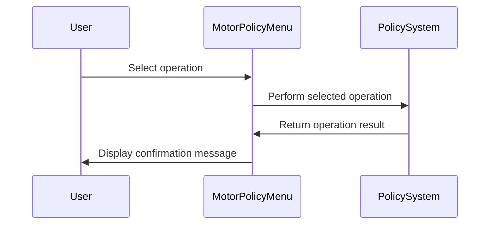

The document describes the Motor Policy Menu (<SwmToken path="base/src/lgtestp1.cbl" pos="11:6:6" line-data="       PROGRAM-ID. LGTESTP1.">`LGTESTP1`</SwmToken>) program, which facilitates user interactions for managing motor insurance policies. It provides a menu-driven interface for performing policy inquiries, additions, deletions, and updates.

For example, if a user selects option '2' to add a new policy, the system processes the input and outputs 'New Motor Policy Inserted'.

The main steps are:

- Display main menu
- Handle user input
- Evaluate user selection
- Perform policy inquiry
- Add new policy
- Delete existing policy
- Update policy details
- Display operation confirmation



## Dependencies

### Programs

- <SwmToken path="base/src/lgtestp1.cbl" pos="72:10:10" line-data="                 EXEC CICS LINK PROGRAM(&#39;LGIPOL01&#39;)">`LGIPOL01`</SwmToken> (<SwmPath>[base/src/lgipol01.cbl](base/src/lgipol01.cbl)</SwmPath>) - <SwmLink doc-title="Policy Inquiry Logic (LGIPOL01)">[Policy Inquiry Logic (LGIPOL01)](/.swm/policy-inquiry-logic-lgipol01.9ezlc51y.sw.md)</SwmLink>
- LGIPDB01 (<SwmPath>[base/src/lgipdb01.cbl](base/src/lgipdb01.cbl)</SwmPath>) - <SwmLink doc-title="Policy Inquiry (LGIPDB01)">[Policy Inquiry (LGIPDB01)](/.swm/policy-inquiry-lgipdb01.183np482.sw.md)</SwmLink>
- LGSTSQ (<SwmPath>[base/src/lgstsq.cbl](base/src/lgstsq.cbl)</SwmPath>) - <SwmLink doc-title="Message Queue Handler (LGSTSQ)">[Message Queue Handler (LGSTSQ)](/.swm/message-queue-handler-lgstsq.e7y8uelv.sw.md)</SwmLink>
- <SwmToken path="base/src/lgtestp1.cbl" pos="115:10:10" line-data="                 EXEC CICS LINK PROGRAM(&#39;LGAPOL01&#39;)">`LGAPOL01`</SwmToken> (<SwmPath>[base/src/lgapol01.cbl](base/src/lgapol01.cbl)</SwmPath>) - <SwmLink doc-title="Adding Policy Details (LGAPOL01)">[Adding Policy Details (LGAPOL01)](/.swm/adding-policy-details-lgapol01.kinp27r0.sw.md)</SwmLink>
- LGAPDB01 (<SwmPath>[base/src/lgapdb01.cbl](base/src/lgapdb01.cbl)</SwmPath>) - <SwmLink doc-title="Adding Policy Details (LGAPDB01)">[Adding Policy Details (LGAPDB01)](/.swm/adding-policy-details-lgapdb01.9o8n772r.sw.md)</SwmLink>
- LGAPVS01 (<SwmPath>[base/src/lgapvs01.cbl](base/src/lgapvs01.cbl)</SwmPath>) - <SwmLink doc-title="Adding Policy Records (LGAPVS01)">[Adding Policy Records (LGAPVS01)](/.swm/adding-policy-records-lgapvs01.hs8lg2t7.sw.md)</SwmLink>
- <SwmToken path="base/src/lgtestp1.cbl" pos="139:10:10" line-data="                 EXEC CICS LINK PROGRAM(&#39;LGDPOL01&#39;)">`LGDPOL01`</SwmToken> (<SwmPath>[base/src/lgdpol01.cbl](base/src/lgdpol01.cbl)</SwmPath>) - <SwmLink doc-title="Deleting Policy (LGDPOL01)">[Deleting Policy (LGDPOL01)](/.swm/deleting-policy-lgdpol01.m4xoedhy.sw.md)</SwmLink>
- LGDPDB01 (<SwmPath>[base/src/lgdpdb01.cbl](base/src/lgdpdb01.cbl)</SwmPath>) - <SwmLink doc-title="Deleting Policy Records (LGDPDB01)">[Deleting Policy Records (LGDPDB01)](/.swm/deleting-policy-records-lgdpdb01.t1v6h4u2.sw.md)</SwmLink>
- LGDPVS01 (<SwmPath>[base/src/lgdpvs01.cbl](base/src/lgdpvs01.cbl)</SwmPath>) - <SwmLink doc-title="Deleting Policy Records (LGDPVS01)">[Deleting Policy Records (LGDPVS01)](/.swm/deleting-policy-records-lgdpvs01.c9cypss1.sw.md)</SwmLink>
- <SwmToken path="base/src/lgtestp1.cbl" pos="216:10:10" line-data="                 EXEC CICS LINK PROGRAM(&#39;LGUPOL01&#39;)">`LGUPOL01`</SwmToken> (<SwmPath>[base/src/lgupol01.cbl](base/src/lgupol01.cbl)</SwmPath>) - <SwmLink doc-title="Updating Policy Details (LGUPOL01)">[Updating Policy Details (LGUPOL01)](/.swm/updating-policy-details-lgupol01.5nve4qbm.sw.md)</SwmLink>
- LGUPDB01 (<SwmPath>[base/src/lgupdb01.cbl](base/src/lgupdb01.cbl)</SwmPath>) - <SwmLink doc-title="Updating Policy Details (LGUPDB01)">[Updating Policy Details (LGUPDB01)](/.swm/updating-policy-details-lgupdb01.17dw3gy8.sw.md)</SwmLink>
- LGUPVS01 (<SwmPath>[base/src/lgupvs01.cbl](base/src/lgupvs01.cbl)</SwmPath>) - <SwmLink doc-title="Updating Policy Records (LGUPVS01)">[Updating Policy Records (LGUPVS01)](/.swm/updating-policy-records-lgupvs01.j9n26r47.sw.md)</SwmLink>

### Copybooks

- SQLCA
- LGPOLICY (<SwmPath>[base/src/lgpolicy.cpy](base/src/lgpolicy.cpy)</SwmPath>)
- LGCMAREA (<SwmPath>[base/src/lgcmarea.cpy](base/src/lgcmarea.cpy)</SwmPath>)
- SSMAP

# Transaction Termination

## Handling User Input and Conditions

<SwmSnippet path="/base/src/lgtestp1.cbl" line="257">

---

<SwmToken path="base/src/lgtestp1.cbl" pos="257:1:3" line-data="       ENDIT-STARTIT.">`ENDIT-STARTIT`</SwmToken> marks the beginning of the flow where the program returns control to CICS using the EXEC CICS RETURN statement. It specifies <SwmToken path="base/src/lgtestp1.cbl" pos="259:4:4" line-data="                TRANSID(&#39;SSP1&#39;)">`SSP1`</SwmToken> as the transaction ID for re-invocation and passes the <SwmToken path="base/src/lgtestp1.cbl" pos="260:3:5" line-data="                COMMAREA(COMM-AREA)">`COMM-AREA`</SwmToken> back to CICS, setting up for the next interaction.

```cobol
       ENDIT-STARTIT.
           EXEC CICS RETURN
                TRANSID('SSP1')
                COMMAREA(COMM-AREA)
                END-EXEC.
```

---

</SwmSnippet>

<SwmSnippet path="/base/src/lgtestp1.cbl" line="52">

---

In <SwmToken path="base/src/lgtestp1.cbl" pos="52:1:3" line-data="       A-GAIN.">`A-GAIN`</SwmToken>, the flow starts by setting up CICS HANDLE AID and HANDLE CONDITION to manage user interactions and error conditions. HANDLE AID defines actions for keys like <SwmToken path="base/src/lgtestp1.cbl" pos="56:1:1" line-data="                     PF3(ENDIT) END-EXEC.">`PF3`</SwmToken>, while HANDLE CONDITION deals with errors like MAPFAIL.

```cobol
       A-GAIN.

           EXEC CICS HANDLE AID
                     CLEAR(CLEARIT)
                     PF3(ENDIT) END-EXEC.
           EXEC CICS HANDLE CONDITION
                     MAPFAIL(ENDIT)
                     END-EXEC.

           EXEC CICS RECEIVE MAP('SSMAPP1')
                     INTO(SSMAPP1I)
                     MAPSET('SSMAP') END-EXEC.
```

---

</SwmSnippet>

<SwmSnippet path="/base/src/lgtestp1.cbl" line="66">

---

<SwmToken path="base/src/lgtestp1.cbl" pos="66:1:3" line-data="           EVALUATE ENP1OPTO">`EVALUATE ENP1OPTO`</SwmToken> determines the operation and links to specific programs for execution.

```cobol
           EVALUATE ENP1OPTO

             WHEN '1'
                 Move '01IMOT'   To CA-REQUEST-ID
                 Move ENP1CNOO   To CA-CUSTOMER-NUM
                 Move ENP1PNOO   To CA-POLICY-NUM
                 EXEC CICS LINK PROGRAM('LGIPOL01')
                           COMMAREA(COMM-AREA)
                           LENGTH(32500)
                 END-EXEC
```

---

</SwmSnippet>

<SwmSnippet path="/base/src/lgtestp1.cbl" line="80">

---

Data from the communication area is moved to ENP1 fields, setting up details like issue date and vehicle info for further operations or display.

```cobol
                 Move CA-ISSUE-DATE     To  ENP1IDAI
                 Move CA-EXPIRY-DATE    To  ENP1EDAI
                 Move CA-M-MAKE         To  ENP1CMKI
                 Move CA-M-MODEL        To  ENP1CMOI
                 Move CA-M-VALUE        To  ENP1VALI
                 Move CA-M-REGNUMBER    To  ENP1REGI
                 Move CA-M-COLOUR       To  ENP1COLI
                 Move CA-M-CC           To  ENP1CCI
                 Move CA-M-MANUFACTURED To  ENP1MANI
                 Move CA-M-PREMIUM      To  ENP1PREI
                 Move CA-M-ACCIDENTS    To  ENP1ACCI
```

---

</SwmSnippet>

<SwmSnippet path="/base/src/lgtestp1.cbl" line="91">

---

EXEC CICS SEND MAP displays the map on the terminal, allowing users to interact with the data presented, using the mapset 'SSMAP'.

```cobol
                 EXEC CICS SEND MAP ('SSMAPP1')
                           FROM(SSMAPP1O)
                           MAPSET ('SSMAP')
                 END-EXEC
```

---

</SwmSnippet>

<SwmSnippet path="/base/src/lgtestp1.cbl" line="97">

---

Data is set up for the addition operation.

```cobol
             WHEN '2'
                 Move '01AMOT'          To CA-REQUEST-ID
                 Move ENP1CNOI          To CA-CUSTOMER-NUM
                 Move 0                 To CA-PAYMENT
                 Move 0                 To CA-BROKERID
                 Move '        '        To CA-BROKERSREF
                 Move ENP1IDAI          To CA-ISSUE-DATE
                 Move ENP1EDAI          To CA-EXPIRY-DATE
                 Move ENP1CMKI          To CA-M-MAKE
                 Move ENP1CMOI          To CA-M-MODEL
                 Move ENP1VALI          To CA-M-VALUE
                 Move ENP1REGI          To CA-M-REGNUMBER
                 Move ENP1COLI          To CA-M-COLOUR
                 Move ENP1CCI           To CA-M-CC
                 Move ENP1MANI          To CA-M-MANUFACTURED
                 Move ENP1PREI          To CA-M-PREMIUM
                 Move ENP1ACCI          To CA-M-ACCIDENTS
```

---

</SwmSnippet>

<SwmSnippet path="/base/src/lgtestp1.cbl" line="115">

---

<SwmToken path="base/src/lgtestp1.cbl" pos="115:10:10" line-data="                 EXEC CICS LINK PROGRAM(&#39;LGAPOL01&#39;)">`LGAPOL01`</SwmToken> processes new policy additions.

```cobol
                 EXEC CICS LINK PROGRAM('LGAPOL01')
                           COMMAREA(COMM-AREA)
                           LENGTH(32500)
                 END-EXEC
```

---

</SwmSnippet>

<SwmSnippet path="/base/src/lgtestp1.cbl" line="124">

---

After adding a new policy, the system confirms success by displaying 'New Motor Policy Inserted' to the user.

```cobol
                 Move CA-CUSTOMER-NUM To ENP1CNOI
                 Move CA-POLICY-NUM   To ENP1PNOI
                 Move ' '             To ENP1OPTI
                 Move 'New Motor Policy Inserted'
                   To  ERP1FLDO
                 EXEC CICS SEND MAP ('SSMAPP1')
                           FROM(SSMAPP1O)
                           MAPSET ('SSMAP')
                 END-EXEC
```

---

</SwmSnippet>

<SwmSnippet path="/base/src/lgtestp1.cbl" line="135">

---

<SwmToken path="base/src/lgtestp1.cbl" pos="66:3:3" line-data="           EVALUATE ENP1OPTO">`ENP1OPTO`</SwmToken> value '3' triggers the deletion operation, calling <SwmToken path="base/src/lgtestp1.cbl" pos="139:10:10" line-data="                 EXEC CICS LINK PROGRAM(&#39;LGDPOL01&#39;)">`LGDPOL01`</SwmToken> to remove a policy.

```cobol
             WHEN '3'
                 Move '01DMOT'   To CA-REQUEST-ID
                 Move ENP1CNOO   To CA-CUSTOMER-NUM
                 Move ENP1PNOO   To CA-POLICY-NUM
                 EXEC CICS LINK PROGRAM('LGDPOL01')
                           COMMAREA(COMM-AREA)
                           LENGTH(32500)
                 END-EXEC
```

---

</SwmSnippet>

<SwmSnippet path="/base/src/lgtestp1.cbl" line="148">

---

After a policy is deleted, spaces are moved to ENP1 fields to clear out previous data.

```cobol
                 Move Spaces            To  ENP1IDAI
                 Move Spaces            To  ENP1EDAI
                 Move Spaces            To  ENP1CMKI
                 Move Spaces            To  ENP1CMOI
                 Move Spaces            To  ENP1VALI
                 Move Spaces            To  ENP1REGI
                 Move Spaces            To  ENP1COLI
                 Move Spaces            To  ENP1CCI
                 Move Spaces            To  ENP1MANI
                 Move 'Motor Policy Deleted'
                   To  ERP1FLDO
```

---

</SwmSnippet>

<SwmSnippet path="/base/src/lgtestp1.cbl" line="159">

---

The system confirms deletion success by sending a map displaying 'Motor Policy Deleted' to the terminal.

```cobol
                 EXEC CICS SEND MAP ('SSMAPP1')
                           FROM(SSMAPP1O)
                           MAPSET ('SSMAP')
                 END-EXEC
                 EXEC CICS SEND MAP ('SSMAPP1')
                           FROM(SSMAPP1O)
                           MAPSET ('SSMAP')
                 END-EXEC
```

---

</SwmSnippet>

<SwmSnippet path="/base/src/lgtestp1.cbl" line="169">

---

<SwmToken path="base/src/lgtestp1.cbl" pos="66:3:3" line-data="           EVALUATE ENP1OPTO">`ENP1OPTO`</SwmToken> value '4' triggers the update operation, calling <SwmToken path="base/src/lgtestp1.cbl" pos="173:10:10" line-data="                 EXEC CICS LINK PROGRAM(&#39;LGIPOL01&#39;)">`LGIPOL01`</SwmToken> to retrieve policy details for updating.

```cobol
             WHEN '4'
                 Move '01IMOT'   To CA-REQUEST-ID
                 Move ENP1CNOO   To CA-CUSTOMER-NUM
                 Move ENP1PNOO   To CA-POLICY-NUM
                 EXEC CICS LINK PROGRAM('LGIPOL01')
                           COMMAREA(COMM-AREA)
                           LENGTH(32500)
                 END-EXEC
```

---

</SwmSnippet>

<SwmSnippet path="/base/src/lgtestp1.cbl" line="181">

---

Data like issue date and vehicle details are updated in ENP1 fields, preparing for the update operation.

```cobol
                 Move CA-ISSUE-DATE     To  ENP1IDAI
                 Move CA-EXPIRY-DATE    To  ENP1EDAI
                 Move CA-M-MAKE         To  ENP1CMKI
                 Move CA-M-MODEL        To  ENP1CMOI
                 Move CA-M-VALUE        To  ENP1VALI
                 Move CA-M-REGNUMBER    To  ENP1REGI
                 Move CA-M-COLOUR       To  ENP1COLI
                 Move CA-M-CC           To  ENP1CCI
                 Move CA-M-MANUFACTURED To  ENP1MANI
                 Move CA-M-PREMIUM      To  ENP1PREI
                 Move CA-M-ACCIDENTS    To  ENP1ACCI
```

---

</SwmSnippet>

<SwmSnippet path="/base/src/lgtestp1.cbl" line="192">

---

The system uses SEND and RECEIVE MAP to facilitate user interaction during updates, allowing data input and display.

```cobol
                 EXEC CICS SEND MAP ('SSMAPP1')
                           FROM(SSMAPP1O)
                           MAPSET ('SSMAP')
                 END-EXEC
                 EXEC CICS RECEIVE MAP('SSMAPP1')
                           INTO(SSMAPP1I)
                           MAPSET('SSMAP') END-EXEC
```

---

</SwmSnippet>

<SwmSnippet path="/base/src/lgtestp1.cbl" line="200">

---

Data is set up for the update operation.

```cobol
                 Move '01UMOT'          To CA-REQUEST-ID
                 Move ENP1CNOI          To CA-CUSTOMER-NUM
                 Move 0                 To CA-PAYMENT
                 Move 0                 To CA-BROKERID
                 Move '        '        To CA-BROKERSREF
                 Move ENP1IDAI          To CA-ISSUE-DATE
                 Move ENP1EDAI          To CA-EXPIRY-DATE
                 Move ENP1CMKI          To CA-M-MAKE
                 Move ENP1CMOI          To CA-M-MODEL
                 Move ENP1VALI          To CA-M-VALUE
                 Move ENP1REGI          To CA-M-REGNUMBER
                 Move ENP1COLI          To CA-M-COLOUR
                 Move ENP1CCI           To CA-M-CC
                 Move ENP1MANI          To CA-M-MANUFACTURED
                 Move ENP1PREI          To CA-M-PREMIUM
                 Move ENP1ACCI          To CA-M-ACCIDENTS
```

---

</SwmSnippet>

<SwmSnippet path="/base/src/lgtestp1.cbl" line="216">

---

<SwmToken path="base/src/lgtestp1.cbl" pos="216:10:10" line-data="                 EXEC CICS LINK PROGRAM(&#39;LGUPOL01&#39;)">`LGUPOL01`</SwmToken> processes policy updates.

```cobol
                 EXEC CICS LINK PROGRAM('LGUPOL01')
                           COMMAREA(COMM-AREA)
                           LENGTH(32500)
                 END-EXEC
```

---

</SwmSnippet>

<SwmSnippet path="/base/src/lgtestp1.cbl" line="224">

---

After updating a policy, the system confirms success by displaying 'Motor Policy Updated' to the user.

```cobol
                 Move CA-CUSTOMER-NUM To ENP1CNOI
                 Move CA-POLICY-NUM   To ENP1PNOI
                 Move ' '             To ENP1OPTI
                 Move 'Motor Policy Updated'
                   To  ERP1FLDO
                 EXEC CICS SEND MAP ('SSMAPP1')
                           FROM(SSMAPP1O)
                           MAPSET ('SSMAP')
                 END-EXEC
```

---

</SwmSnippet>

<SwmSnippet path="/base/src/lgtestp1.cbl" line="236">

---

If an invalid option is entered, the system prompts the user with 'Please enter a valid option' and resets the input.

```cobol
             WHEN OTHER

                 Move 'Please enter a valid option'
                   To  ERP1FLDO
                 Move -1 To ENP1OPTL

                 EXEC CICS SEND MAP ('SSMAPP1')
                           FROM(SSMAPP1O)
                           MAPSET ('SSMAP')
                           CURSOR
                 END-EXEC
                 GO TO ENDIT-STARTIT

           END-EVALUATE.


      *    Send message to terminal and return

           EXEC CICS RETURN
           END-EXEC.
```

---

</SwmSnippet>

## Initializing and Displaying Main Menu

<SwmSnippet path="/base/src/lgtestp1.cbl" line="30">

---

In <SwmToken path="base/src/lgtestp1.cbl" pos="30:1:1" line-data="       MAINLINE SECTION.">`MAINLINE`</SwmToken>, the flow checks if EIBCALEN is greater than zero to decide if it should transition to <SwmToken path="base/src/lgtestp1.cbl" pos="33:5:7" line-data="              GO TO A-GAIN.">`A-GAIN`</SwmToken>, indicating data has been passed.

```cobol
       MAINLINE SECTION.

           IF EIBCALEN > 0
              GO TO A-GAIN.
```

---

</SwmSnippet>

<SwmSnippet path="/base/src/lgtestp1.cbl" line="35">

---

Fields are initialized for a clean start.

```cobol
           Initialize SSMAPP1I.
           Initialize SSMAPP1O.
           Initialize COMM-AREA.
           MOVE '0000000000'   To ENP1CNOO.
           MOVE '0000000000'   To ENP1PNOO.
           MOVE '000000'       To ENP1VALO.
           MOVE '00000'        To ENP1CCO.
           MOVE '000000'       To ENP1ACCO.
           MOVE '000000'       To ENP1PREO.
```

---

</SwmSnippet>

<SwmSnippet path="/base/src/lgtestp1.cbl" line="47">

---

The system displays the main menu by sending a map with the ERASE option to clear the screen first, using mapset 'SSMAP'.

```cobol
           EXEC CICS SEND MAP ('SSMAPP1')
                     MAPSET ('SSMAP')
                     ERASE
                     END-EXEC.
```

---

</SwmSnippet>

&nbsp;

*This is an auto-generated document by Swimm 🌊 and has not yet been verified by a human*

<SwmMeta version="3.0.0" repo-id="Z2l0aHViJTNBJTNBa3luZHJ5bC1jaWNzLWdlbmFwcCUzQSUzQVN3aW1tLURlbW8=" repo-name="kyndryl-cics-genapp"><sup>Powered by [Swimm](/)</sup></SwmMeta>
