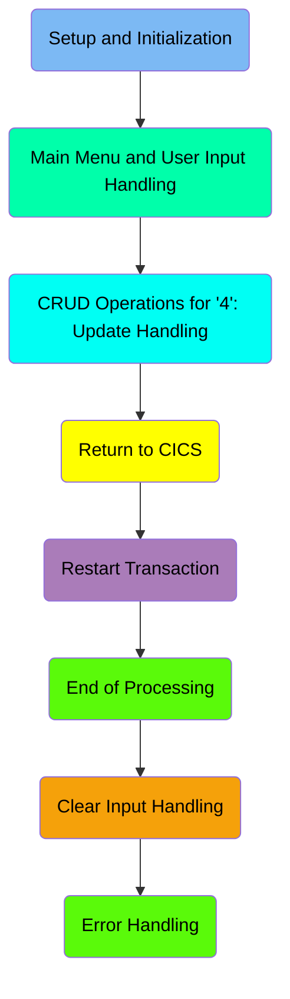
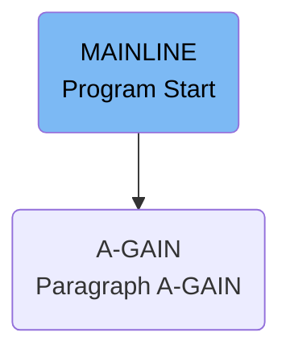
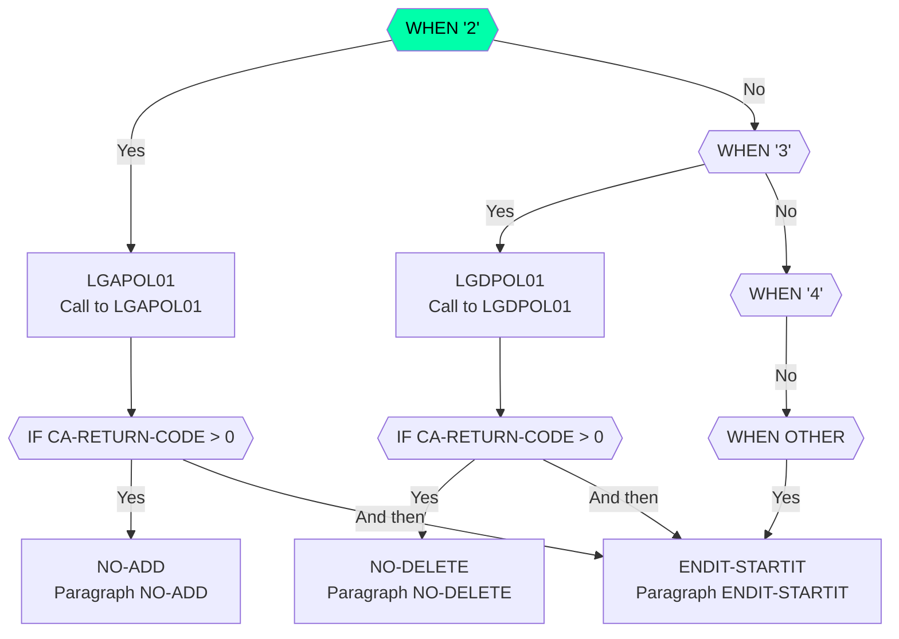
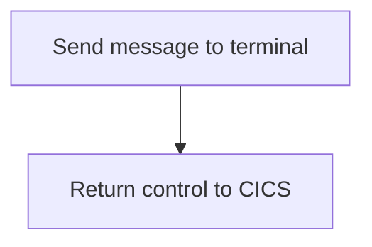
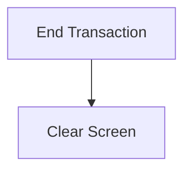
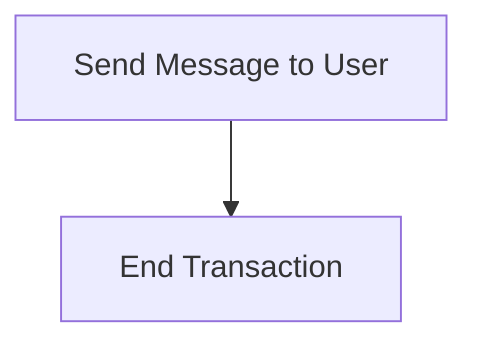
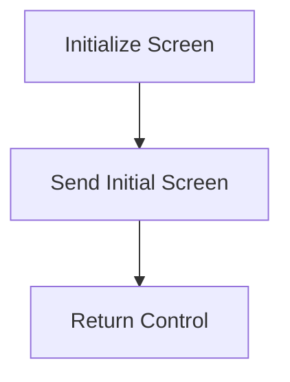
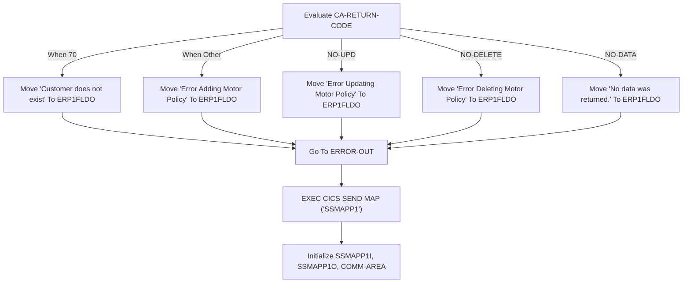

The <SwmToken path="base/src/lgtestp1.cbl" pos="11:6:6" line-data="       PROGRAM-ID. LGTESTP1.">`LGTESTP1`</SwmToken> program is responsible for managing insurance policy operations within the system. It handles the setup and initialization, displays the main menu, processes user inputs, and performs CRUD operations for insurance policies. The program achieves this by linking to other programs like <SwmToken path="base/src/lgtestp1.cbl" pos="115:10:10" line-data="                 EXEC CICS LINK PROGRAM(&#39;LGAPOL01&#39;)">`LGAPOL01`</SwmToken> and <SwmToken path="base/src/lgtestp1.cbl" pos="139:10:10" line-data="                 EXEC CICS LINK PROGRAM(&#39;LGDPOL01&#39;)">`LGDPOL01`</SwmToken> for adding and deleting policies, respectively, and ensuring proper error handling and transaction management.

The <SwmToken path="base/src/lgtestp1.cbl" pos="11:6:6" line-data="       PROGRAM-ID. LGTESTP1.">`LGTESTP1`</SwmToken> program starts by initializing necessary variables and displaying the main menu to the user. It then waits for user input to determine the desired operation, such as adding, deleting, or updating an insurance policy. Depending on the user's choice, the program sets the appropriate request ID and calls the corresponding program (e.g., <SwmToken path="base/src/lgtestp1.cbl" pos="115:10:10" line-data="                 EXEC CICS LINK PROGRAM(&#39;LGAPOL01&#39;)">`LGAPOL01`</SwmToken> for adding a policy). After performing the operation, it checks the return code to handle any errors and updates the user interface accordingly. Finally, the program returns control to CICS, ensuring that all resources are properly released and the transaction is completed.

Here is a high level diagram of the program:



# Setup and Initialization



<SwmSnippet path="/base/src/lgtestp1.cbl" line="30">

---

## MAINLINE Section

The <SwmToken path="base/src/lgtestp1.cbl" pos="30:1:1" line-data="       MAINLINE SECTION.">`MAINLINE`</SwmToken> section is the entry point of the program. It first checks if <SwmToken path="base/src/lgtestp1.cbl" pos="32:3:3" line-data="           IF EIBCALEN &gt; 0">`EIBCALEN`</SwmToken> (which holds the length of the communication area) is greater than 0. If true, it jumps to the <SwmToken path="base/src/lgtestp1.cbl" pos="33:5:7" line-data="              GO TO A-GAIN.">`A-GAIN`</SwmToken> section to handle repeated calls.

```cobol
       MAINLINE SECTION.

           IF EIBCALEN > 0
              GO TO A-GAIN.

           Initialize SSMAPP1I.
           Initialize SSMAPP1O.
           Initialize COMM-AREA.
           MOVE '0000000000'   To ENP1CNOO.
           MOVE '0000000000'   To ENP1PNOO.
           MOVE '000000'       To ENP1VALO.
           MOVE '00000'        To ENP1CCO.
           MOVE '000000'       To ENP1ACCO.
           MOVE '000000'       To ENP1PREO.


      * Display Main Menu
           EXEC CICS SEND MAP ('SSMAPP1')
                     MAPSET ('SSMAP')
                     ERASE
                     END-EXEC.
```

---

</SwmSnippet>

<SwmSnippet path="/base/src/lgtestp1.cbl" line="35">

---

## Initializing Variables

The program initializes several variables that are used throughout the application. These include <SwmToken path="base/src/lgtestp1.cbl" pos="35:3:3" line-data="           Initialize SSMAPP1I.">`SSMAPP1I`</SwmToken>, <SwmToken path="base/src/lgtestp1.cbl" pos="36:3:3" line-data="           Initialize SSMAPP1O.">`SSMAPP1O`</SwmToken>, and <SwmToken path="base/src/lgtestp1.cbl" pos="37:3:5" line-data="           Initialize COMM-AREA.">`COMM-AREA`</SwmToken>. It also sets initial values for various fields such as <SwmToken path="base/src/lgtestp1.cbl" pos="38:9:9" line-data="           MOVE &#39;0000000000&#39;   To ENP1CNOO.">`ENP1CNOO`</SwmToken>, <SwmToken path="base/src/lgtestp1.cbl" pos="39:9:9" line-data="           MOVE &#39;0000000000&#39;   To ENP1PNOO.">`ENP1PNOO`</SwmToken>, <SwmToken path="base/src/lgtestp1.cbl" pos="40:9:9" line-data="           MOVE &#39;000000&#39;       To ENP1VALO.">`ENP1VALO`</SwmToken>, <SwmToken path="base/src/lgtestp1.cbl" pos="41:9:9" line-data="           MOVE &#39;00000&#39;        To ENP1CCO.">`ENP1CCO`</SwmToken>, <SwmToken path="base/src/lgtestp1.cbl" pos="42:9:9" line-data="           MOVE &#39;000000&#39;       To ENP1ACCO.">`ENP1ACCO`</SwmToken>, and <SwmToken path="base/src/lgtestp1.cbl" pos="43:9:9" line-data="           MOVE &#39;000000&#39;       To ENP1PREO.">`ENP1PREO`</SwmToken>.

```cobol
           Initialize SSMAPP1I.
           Initialize SSMAPP1O.
           Initialize COMM-AREA.
           MOVE '0000000000'   To ENP1CNOO.
           MOVE '0000000000'   To ENP1PNOO.
           MOVE '000000'       To ENP1VALO.
           MOVE '00000'        To ENP1CCO.
           MOVE '000000'       To ENP1ACCO.
           MOVE '000000'       To ENP1PREO.
```

---

</SwmSnippet>

<SwmSnippet path="/base/src/lgtestp1.cbl" line="46">

---

## Displaying Main Menu

The program then displays the main menu by sending the <SwmToken path="base/src/lgtestp1.cbl" pos="47:11:11" line-data="           EXEC CICS SEND MAP (&#39;SSMAPP1&#39;)">`SSMAPP1`</SwmToken> map using the <SwmToken path="base/src/lgtestp1.cbl" pos="47:1:7" line-data="           EXEC CICS SEND MAP (&#39;SSMAPP1&#39;)">`EXEC CICS SEND MAP`</SwmToken> command. This allows the user to interact with the application and choose various options.

```cobol
      * Display Main Menu
           EXEC CICS SEND MAP ('SSMAPP1')
                     MAPSET ('SSMAP')
                     ERASE
                     END-EXEC.
```

---

</SwmSnippet>

<SwmSnippet path="/base/src/lgtestp1.cbl" line="52">

---

## <SwmToken path="base/src/lgtestp1.cbl" pos="52:1:3" line-data="       A-GAIN.">`A-GAIN`</SwmToken> Section

The <SwmToken path="base/src/lgtestp1.cbl" pos="52:1:3" line-data="       A-GAIN.">`A-GAIN`</SwmToken> section handles repeated calls to the program. It sets up handlers for various conditions such as <SwmToken path="base/src/lgtestp1.cbl" pos="54:7:7" line-data="           EXEC CICS HANDLE AID">`AID`</SwmToken> and <SwmToken path="base/src/lgtestp1.cbl" pos="58:1:1" line-data="                     MAPFAIL(ENDIT)">`MAPFAIL`</SwmToken>, and then receives the map <SwmToken path="base/src/lgtestp1.cbl" pos="61:10:10" line-data="           EXEC CICS RECEIVE MAP(&#39;SSMAPP1&#39;)">`SSMAPP1`</SwmToken> into <SwmToken path="base/src/lgtestp1.cbl" pos="62:3:3" line-data="                     INTO(SSMAPP1I)">`SSMAPP1I`</SwmToken>.

```cobol
       A-GAIN.

           EXEC CICS HANDLE AID
                     CLEAR(CLEARIT)
                     PF3(ENDIT) END-EXEC.
           EXEC CICS HANDLE CONDITION
                     MAPFAIL(ENDIT)
                     END-EXEC.

           EXEC CICS RECEIVE MAP('SSMAPP1')
                     INTO(SSMAPP1I)
                     MAPSET('SSMAP') END-EXEC.
```

---

</SwmSnippet>

# Main Menu and User Input Handling



<SwmSnippet path="/base/src/lgtestp1.cbl" line="97">

---

## Handling Policy Addition

First, we handle the addition of a new motor policy. The system sets the request ID to <SwmToken path="base/src/lgtestp1.cbl" pos="98:4:4" line-data="                 Move &#39;01AMOT&#39;          To CA-REQUEST-ID">`01AMOT`</SwmToken> and initializes various fields related to the policy. Then, it calls the <SwmToken path="base/src/lgtestp1.cbl" pos="115:10:10" line-data="                 EXEC CICS LINK PROGRAM(&#39;LGAPOL01&#39;)">`LGAPOL01`</SwmToken> program to add the policy. If the return code is greater than 0, it rolls back the transaction and goes to the <SwmToken path="base/src/lgtestp1.cbl" pos="286:1:3" line-data="       NO-ADD.">`NO-ADD`</SwmToken> paragraph. Otherwise, it updates the map with the new policy details and sends it back to the user.

```cobol
             WHEN '2'
                 Move '01AMOT'          To CA-REQUEST-ID
                 Move ENP1CNOI          To CA-CUSTOMER-NUM
                 Move 0                 To CA-PAYMENT
                 Move 0                 To CA-BROKERID
                 Move '        '        To CA-BROKERSREF
                 Move ENP1IDAI          To CA-ISSUE-DATE
                 Move ENP1EDAI          To CA-EXPIRY-DATE
                 Move ENP1CMKI          To CA-M-MAKE
                 Move ENP1CMOI          To CA-M-MODEL
                 Move ENP1VALI          To CA-M-VALUE
                 Move ENP1REGI          To CA-M-REGNUMBER
                 Move ENP1COLI          To CA-M-COLOUR
                 Move ENP1CCI           To CA-M-CC
                 Move ENP1MANI          To CA-M-MANUFACTURED
                 Move ENP1PREI          To CA-M-PREMIUM
                 Move ENP1ACCI          To CA-M-ACCIDENTS
      **********
                 EXEC CICS LINK PROGRAM('LGAPOL01')
                           COMMAREA(COMM-AREA)
                           LENGTH(32500)
```

---

</SwmSnippet>

<SwmSnippet path="/base/src/lgtestp1.cbl" line="135">

---

## Handling Policy Deletion

Next, we handle the deletion of an existing motor policy. The system sets the request ID to <SwmToken path="base/src/lgtestp1.cbl" pos="136:4:4" line-data="                 Move &#39;01DMOT&#39;   To CA-REQUEST-ID">`01DMOT`</SwmToken> and initializes various fields related to the policy. Then, it calls the <SwmToken path="base/src/lgtestp1.cbl" pos="139:10:10" line-data="                 EXEC CICS LINK PROGRAM(&#39;LGDPOL01&#39;)">`LGDPOL01`</SwmToken> program to delete the policy. If the return code is greater than 0, it rolls back the transaction and goes to the <SwmToken path="base/src/lgtestp1.cbl" pos="145:5:7" line-data="                   GO TO NO-DELETE">`NO-DELETE`</SwmToken> paragraph. Otherwise, it clears the policy details from the map and sends a confirmation message back to the user.

```cobol
             WHEN '3'
                 Move '01DMOT'   To CA-REQUEST-ID
                 Move ENP1CNOO   To CA-CUSTOMER-NUM
                 Move ENP1PNOO   To CA-POLICY-NUM
                 EXEC CICS LINK PROGRAM('LGDPOL01')
                           COMMAREA(COMM-AREA)
                           LENGTH(32500)
                 END-EXEC
                 IF CA-RETURN-CODE > 0
                   Exec CICS Syncpoint Rollback End-Exec
                   GO TO NO-DELETE
                 END-IF

                 Move Spaces            To  ENP1IDAI
                 Move Spaces            To  ENP1EDAI
                 Move Spaces            To  ENP1CMKI
                 Move Spaces            To  ENP1CMOI
                 Move Spaces            To  ENP1VALI
                 Move Spaces            To  ENP1REGI
                 Move Spaces            To  ENP1COLI
                 Move Spaces            To  ENP1CCI
```

---

</SwmSnippet>

<SwmSnippet path="/base/src/lgtestp1.cbl" line="95">

---

## Handling Other Operations

Finally, for any other operations, the system goes to the <SwmToken path="base/src/lgtestp1.cbl" pos="167:5:7" line-data="                 GO TO ENDIT-STARTIT">`ENDIT-STARTIT`</SwmToken> paragraph, which returns control to the main transaction.

```cobol
                 GO TO ENDIT-STARTIT
```

---

</SwmSnippet>

<SwmSnippet path="/base/src/lgtestp1.cbl" line="286">

---

### <SwmToken path="base/src/lgtestp1.cbl" pos="286:1:3" line-data="       NO-ADD.">`NO-ADD`</SwmToken> Paragraph

The <SwmToken path="base/src/lgtestp1.cbl" pos="286:1:3" line-data="       NO-ADD.">`NO-ADD`</SwmToken> paragraph handles errors that occur during the addition of a new motor policy. It evaluates the return code and sets an appropriate error message before going to the <SwmToken path="base/src/lgtestp1.cbl" pos="290:5:7" line-data="               Go To ERROR-OUT">`ERROR-OUT`</SwmToken> paragraph.

```cobol
       NO-ADD.
           Evaluate CA-RETURN-CODE
             When 70
               Move 'Customer does not exist'          To  ERP1FLDO
               Go To ERROR-OUT
             When Other
               Move 'Error Adding Motor Policy'        To  ERP1FLDO
               Go To ERROR-OUT
           End-Evaluate.
```

---

</SwmSnippet>

<SwmSnippet path="/base/src/lgtestp1.cbl" line="300">

---

### <SwmToken path="base/src/lgtestp1.cbl" pos="300:1:3" line-data="       NO-DELETE.">`NO-DELETE`</SwmToken> Paragraph

The <SwmToken path="base/src/lgtestp1.cbl" pos="300:1:3" line-data="       NO-DELETE.">`NO-DELETE`</SwmToken> paragraph handles errors that occur during the deletion of a motor policy. It sets an error message before going to the <SwmToken path="base/src/lgtestp1.cbl" pos="302:5:7" line-data="           Go To ERROR-OUT.">`ERROR-OUT`</SwmToken> paragraph.

```cobol
       NO-DELETE.
           Move 'Error Deleting Motor Policy'    To  ERP1FLDO
           Go To ERROR-OUT.
```

---

</SwmSnippet>

<SwmSnippet path="/base/src/lgtestp1.cbl" line="257">

---

### <SwmToken path="base/src/lgtestp1.cbl" pos="257:1:3" line-data="       ENDIT-STARTIT.">`ENDIT-STARTIT`</SwmToken> Paragraph

The <SwmToken path="base/src/lgtestp1.cbl" pos="257:1:3" line-data="       ENDIT-STARTIT.">`ENDIT-STARTIT`</SwmToken> paragraph returns control to the main transaction by executing a CICS RETURN command with the transaction ID and communication area.

```cobol
       ENDIT-STARTIT.
           EXEC CICS RETURN
                TRANSID('SSP1')
                COMMAREA(COMM-AREA)
                END-EXEC.
```

---

</SwmSnippet>

## Interim Summary

So far, we saw how the program initializes variables, displays the main menu, and handles repeated calls. We also covered how the program manages policy addition and deletion, including error handling. Now, we will focus on the CRUD operations for updating policies, detailing the steps involved in setting request IDs, linking to programs, and handling return codes.

# CRUD Operations for '4': Update Handling

```mermaid
graph TD
  A[Start] --> B[Set Request ID and Customer Number]
  B --> C[Link to LGIPOL01 Program]
  C --> D{Check Return Code}
  D -- Success --> E[Move Policy Data to Fields]
  E --> F[Send Map SSMAPP1]
  F --> G[Receive Map SSMAPP1]
  G --> H[Set Update Request ID and Customer Number]
  H --> I[Link to LGUPOL01 Program]
  I --> J{Check Return Code}
  J -- Success --> K[Move Updated Data to Fields]
  K --> L[Send Map SSMAPP1]
  D -- Failure --> M[No Data]
  J -- Failure --> N[No Update]

%% Swimm:
%% graph TD
%%   A[Start] --> B[Set Request ID and Customer Number]
%%   B --> C[Link to <SwmToken path="base/src/lgtestp1.cbl" pos="173:10:10" line-data="                 EXEC CICS LINK PROGRAM(&#39;LGIPOL01&#39;)">`LGIPOL01`</SwmToken> Program]
%%   C --> D{Check Return Code}
%%   D -- Success --> E[Move Policy Data to Fields]
%%   E --> F[Send Map SSMAPP1]
%%   F --> G[Receive Map SSMAPP1]
%%   G --> H[Set Update Request ID and Customer Number]
%%   H --> I[Link to <SwmToken path="base/src/lgtestp1.cbl" pos="216:10:10" line-data="                 EXEC CICS LINK PROGRAM(&#39;LGUPOL01&#39;)">`LGUPOL01`</SwmToken> Program]
%%   I --> J{Check Return Code}
%%   J -- Success --> K[Move Updated Data to Fields]
%%   K --> L[Send Map SSMAPP1]
%%   D -- Failure --> M[No Data]
%%   J -- Failure --> N[No Update]
```



<SwmSnippet path="/base/src/lgtestp1.cbl" line="69">

---

## Setting Request ID and Customer Number

First, we set the request ID to <SwmToken path="base/src/lgtestp1.cbl" pos="170:4:4" line-data="                 Move &#39;01IMOT&#39;   To CA-REQUEST-ID">`01IMOT`</SwmToken> and move the customer and policy numbers to the communication area. This prepares the data for the subsequent program call.

```cobol
                 Move '01IMOT'   To CA-REQUEST-ID
                 Move ENP1CNOO   To CA-CUSTOMER-NUM
                 Move ENP1PNOO   To CA-POLICY-NUM
```

---

</SwmSnippet>

<SwmSnippet path="/base/src/lgtestp1.cbl" line="72">

---

## Linking to <SwmToken path="base/src/lgtestp1.cbl" pos="173:10:10" line-data="                 EXEC CICS LINK PROGRAM(&#39;LGIPOL01&#39;)">`LGIPOL01`</SwmToken> Program

Next, we link to the <SwmToken path="base/src/lgtestp1.cbl" pos="173:10:10" line-data="                 EXEC CICS LINK PROGRAM(&#39;LGIPOL01&#39;)">`LGIPOL01`</SwmToken> program, passing the communication area and its length. This program retrieves the motor policy information from the database.

More about <SwmToken path="base/src/lgtestp1.cbl" pos="173:10:10" line-data="                 EXEC CICS LINK PROGRAM(&#39;LGIPOL01&#39;)">`LGIPOL01`</SwmToken>: <SwmLink doc-title="Inquiring Policy Details (LGIPOL01)">[Inquiring Policy Details (LGIPOL01)](/.swm/inquiring-policy-details-lgipol01.a4iime4v.sw.md)</SwmLink>

```cobol
                 EXEC CICS LINK PROGRAM('LGIPOL01')
                           COMMAREA(COMM-AREA)
                           LENGTH(32500)
                 END-EXEC
```

---

</SwmSnippet>

<SwmSnippet path="/base/src/lgtestp1.cbl" line="76">

---

## Checking Return Code

Then, we check if the return code is greater than 0. If it is, we go to the <SwmToken path="base/src/lgtestp1.cbl" pos="178:5:7" line-data="                   GO TO NO-DATA">`NO-DATA`</SwmToken> section, indicating that no data was returned.

```cobol
                 IF CA-RETURN-CODE > 0
                   GO TO NO-DATA
                 END-IF
```

---

</SwmSnippet>

<SwmSnippet path="/base/src/lgtestp1.cbl" line="80">

---

## Moving Policy Data to Fields

Moving to the next step, we transfer the retrieved policy data from the communication area to the respective fields in the program. This includes issue date, expiry date, make, model, value, registration number, color, engine capacity, manufacture date, premium, and accidents.

```cobol
                 Move CA-ISSUE-DATE     To  ENP1IDAI
                 Move CA-EXPIRY-DATE    To  ENP1EDAI
                 Move CA-M-MAKE         To  ENP1CMKI
                 Move CA-M-MODEL        To  ENP1CMOI
                 Move CA-M-VALUE        To  ENP1VALI
                 Move CA-M-REGNUMBER    To  ENP1REGI
                 Move CA-M-COLOUR       To  ENP1COLI
                 Move CA-M-CC           To  ENP1CCI
                 Move CA-M-MANUFACTURED To  ENP1MANI
                 Move CA-M-PREMIUM      To  ENP1PREI
                 Move CA-M-ACCIDENTS    To  ENP1ACCI
```

---

</SwmSnippet>

<SwmSnippet path="/base/src/lgtestp1.cbl" line="192">

---

## Sending and Receiving Map <SwmToken path="base/src/lgtestp1.cbl" pos="192:11:11" line-data="                 EXEC CICS SEND MAP (&#39;SSMAPP1&#39;)">`SSMAPP1`</SwmToken>

Next, we send the map <SwmToken path="base/src/lgtestp1.cbl" pos="192:11:11" line-data="                 EXEC CICS SEND MAP (&#39;SSMAPP1&#39;)">`SSMAPP1`</SwmToken> to display the retrieved policy information and then receive the map to capture any user input or updates.

```cobol
                 EXEC CICS SEND MAP ('SSMAPP1')
                           FROM(SSMAPP1O)
                           MAPSET ('SSMAP')
                 END-EXEC
                 EXEC CICS RECEIVE MAP('SSMAPP1')
                           INTO(SSMAPP1I)
                           MAPSET('SSMAP') END-EXEC
```

---

</SwmSnippet>

<SwmSnippet path="/base/src/lgtestp1.cbl" line="200">

---

## Setting Update Request ID and Customer Number

We then set the request ID to <SwmToken path="base/src/lgtestp1.cbl" pos="200:4:4" line-data="                 Move &#39;01UMOT&#39;          To CA-REQUEST-ID">`01UMOT`</SwmToken> for updating the policy and move the customer number to the communication area.

```cobol
                 Move '01UMOT'          To CA-REQUEST-ID
                 Move ENP1CNOI          To CA-CUSTOMER-NUM
                 Move 0                 To CA-PAYMENT
```

---

</SwmSnippet>

<SwmSnippet path="/base/src/lgtestp1.cbl" line="216">

---

## Linking to <SwmToken path="base/src/lgtestp1.cbl" pos="216:10:10" line-data="                 EXEC CICS LINK PROGRAM(&#39;LGUPOL01&#39;)">`LGUPOL01`</SwmToken> Program

Next, we link to the <SwmToken path="base/src/lgtestp1.cbl" pos="216:10:10" line-data="                 EXEC CICS LINK PROGRAM(&#39;LGUPOL01&#39;)">`LGUPOL01`</SwmToken> program, passing the communication area and its length. This program updates the motor policy information in the database.

```cobol
                 EXEC CICS LINK PROGRAM('LGUPOL01')
                           COMMAREA(COMM-AREA)
                           LENGTH(32500)
                 END-EXEC
```

---

</SwmSnippet>

<SwmSnippet path="/base/src/lgtestp1.cbl" line="220">

---

## Checking Return Code

Then, we check if the return code is greater than 0. If it is, we go to the <SwmToken path="base/src/lgtestp1.cbl" pos="221:5:7" line-data="                   GO TO NO-UPD">`NO-UPD`</SwmToken> section, indicating that there was an error updating the policy.

```cobol
                 IF CA-RETURN-CODE > 0
                   GO TO NO-UPD
                 END-IF
```

---

</SwmSnippet>

<SwmSnippet path="/base/src/lgtestp1.cbl" line="224">

---

## Moving Updated Data to Fields

Next, we transfer the updated policy data from the communication area to the respective fields in the program and set a message indicating that the motor policy was updated.

```cobol
                 Move CA-CUSTOMER-NUM To ENP1CNOI
                 Move CA-POLICY-NUM   To ENP1PNOI
                 Move ' '             To ENP1OPTI
                 Move 'Motor Policy Updated'
                   To  ERP1FLDO
```

---

</SwmSnippet>

<SwmSnippet path="/base/src/lgtestp1.cbl" line="91">

---

## Sending Map <SwmToken path="base/src/lgtestp1.cbl" pos="229:11:11" line-data="                 EXEC CICS SEND MAP (&#39;SSMAPP1&#39;)">`SSMAPP1`</SwmToken>

Finally, we send the map <SwmToken path="base/src/lgtestp1.cbl" pos="229:11:11" line-data="                 EXEC CICS SEND MAP (&#39;SSMAPP1&#39;)">`SSMAPP1`</SwmToken> to display the updated policy information to the user.

```cobol
                 EXEC CICS SEND MAP ('SSMAPP1')
                           FROM(SSMAPP1O)
                           MAPSET ('SSMAP')
                 END-EXEC
```

---

</SwmSnippet>

# Return to CICS

This is the next section of the flow.



<SwmSnippet path="/base/src/lgtestp1.cbl" line="252">

---

## Sending message to terminal

First, we prepare to send a message to the terminal. This step ensures that the user receives the necessary information before the transaction ends.

```cobol
      *    Send message to terminal and return

```

---

</SwmSnippet>

<SwmSnippet path="/base/src/lgtestp1.cbl" line="254">

---

## Return control to CICS

Next, we use the <SwmToken path="base/src/lgtestp1.cbl" pos="254:1:5" line-data="           EXEC CICS RETURN">`EXEC CICS RETURN`</SwmToken> command to return control to CICS. This marks the end of the transaction and ensures that resources are properly released.

```cobol
           EXEC CICS RETURN
           END-EXEC.

```

---

</SwmSnippet>

<SwmSnippet path="/base/src/lgtestp1.cbl" line="263">

---

### ENDIT Function

The <SwmToken path="base/src/lgtestp1.cbl" pos="263:1:1" line-data="       ENDIT.">`ENDIT`</SwmToken> function is called to send a specific message (<SwmToken path="base/src/lgtestp1.cbl" pos="265:3:3" line-data="                     FROM(MSGEND)">`MSGEND`</SwmToken>) to the terminal. It uses the <SwmToken path="base/src/lgtestp1.cbl" pos="264:1:7" line-data="           EXEC CICS SEND TEXT">`EXEC CICS SEND TEXT`</SwmToken> command to send the message and then returns control to CICS with <SwmToken path="base/src/lgtestp1.cbl" pos="270:1:5" line-data="           EXEC CICS RETURN">`EXEC CICS RETURN`</SwmToken>.

```cobol
       ENDIT.
           EXEC CICS SEND TEXT
                     FROM(MSGEND)
                     LENGTH(LENGTH OF MSGEND)
                     ERASE
                     FREEKB
           END-EXEC
           EXEC CICS RETURN
           END-EXEC.
```

---

</SwmSnippet>

# Restart Transaction



<SwmSnippet path="/base/src/lgtestp1.cbl" line="258">

---

## End Transaction

First, the <SwmToken path="base/src/lgtestp1.cbl" pos="258:1:5" line-data="           EXEC CICS RETURN">`EXEC CICS RETURN`</SwmToken> command is used to return control to the user interface. The <SwmToken path="base/src/lgtestp1.cbl" pos="259:1:6" line-data="                TRANSID(&#39;SSP1&#39;)">`TRANSID('SSP1')`</SwmToken> specifies the next transaction ID to be executed, which is <SwmToken path="base/src/lgtestp1.cbl" pos="259:4:4" line-data="                TRANSID(&#39;SSP1&#39;)">`SSP1`</SwmToken>. The <SwmToken path="base/src/lgtestp1.cbl" pos="260:1:6" line-data="                COMMAREA(COMM-AREA)">`COMMAREA(COMM-AREA)`</SwmToken> passes the communication area back to the next transaction.

```cobol
           EXEC CICS RETURN
                TRANSID('SSP1')
                COMMAREA(COMM-AREA)
                END-EXEC.
```

---

</SwmSnippet>

<SwmSnippet path="/base/src/lgtestp1.cbl" line="273">

---

## Clear Screen

Next, the <SwmToken path="base/src/lgtestp1.cbl" pos="273:1:1" line-data="       CLEARIT.">`CLEARIT`</SwmToken> paragraph is called to clear the screen. It initializes the map <SwmToken path="base/src/lgtestp1.cbl" pos="275:3:3" line-data="           Initialize SSMAPP1I.">`SSMAPP1I`</SwmToken> and sends the map <SwmToken path="base/src/lgtestp1.cbl" pos="276:11:11" line-data="           EXEC CICS SEND MAP (&#39;SSMAPP1&#39;)">`SSMAPP1`</SwmToken> to the user interface using the <SwmToken path="base/src/lgtestp1.cbl" pos="276:1:7" line-data="           EXEC CICS SEND MAP (&#39;SSMAPP1&#39;)">`EXEC CICS SEND MAP`</SwmToken> command. Finally, it returns control to the user interface with the same transaction ID <SwmToken path="base/src/lgtestp1.cbl" pos="282:4:4" line-data="                TRANSID(&#39;SSP1&#39;)">`SSP1`</SwmToken> and communication area.

```cobol
       CLEARIT.

           Initialize SSMAPP1I.
           EXEC CICS SEND MAP ('SSMAPP1')
                     MAPSET ('SSMAP')
                     MAPONLY
           END-EXEC

           EXEC CICS RETURN
                TRANSID('SSP1')
                COMMAREA(COMM-AREA)
                END-EXEC.
```

---

</SwmSnippet>

# End of Processing



<SwmSnippet path="/base/src/lgtestp1.cbl" line="264">

---

## Sending Message to User

First, the program sends a message to the user using the <SwmToken path="base/src/lgtestp1.cbl" pos="264:1:7" line-data="           EXEC CICS SEND TEXT">`EXEC CICS SEND TEXT`</SwmToken> command. This command takes the message from <SwmToken path="base/src/lgtestp1.cbl" pos="265:3:3" line-data="                     FROM(MSGEND)">`MSGEND`</SwmToken>, specifies its length, and ensures the screen is cleared (<SwmToken path="base/src/lgtestp1.cbl" pos="267:1:1" line-data="                     ERASE">`ERASE`</SwmToken>) and the keyboard is unlocked (<SwmToken path="base/src/lgtestp1.cbl" pos="268:1:1" line-data="                     FREEKB">`FREEKB`</SwmToken>). This step is crucial for communicating the end of the transaction to the user.

```cobol
           EXEC CICS SEND TEXT
                     FROM(MSGEND)
                     LENGTH(LENGTH OF MSGEND)
                     ERASE
                     FREEKB
           END-EXEC
```

---

</SwmSnippet>

<SwmSnippet path="/base/src/lgtestp1.cbl" line="254">

---

## Ending the Transaction

Next, the program ends the transaction using the <SwmToken path="base/src/lgtestp1.cbl" pos="270:1:5" line-data="           EXEC CICS RETURN">`EXEC CICS RETURN`</SwmToken> command. This command signifies the end of the current transaction, allowing the system to process any subsequent transactions.

```cobol
           EXEC CICS RETURN
           END-EXEC.
```

---

</SwmSnippet>

# Clear Input Handling

This is the next section of the flow.



<SwmSnippet path="/base/src/lgtestp1.cbl" line="35">

---

## Initializing Screen

First, the screen is initialized using <SwmToken path="base/src/lgtestp1.cbl" pos="275:3:3" line-data="           Initialize SSMAPP1I.">`SSMAPP1I`</SwmToken>. This sets up the necessary parameters and data structures for the initial screen display.

```cobol
           Initialize SSMAPP1I.
```

---

</SwmSnippet>

<SwmSnippet path="/base/src/lgtestp1.cbl" line="276">

---

## Sending Initial Screen

Next, the initial screen is sent to the user using the <SwmToken path="base/src/lgtestp1.cbl" pos="276:1:7" line-data="           EXEC CICS SEND MAP (&#39;SSMAPP1&#39;)">`EXEC CICS SEND MAP`</SwmToken> command. This command specifies the map <SwmToken path="base/src/lgtestp1.cbl" pos="276:11:11" line-data="           EXEC CICS SEND MAP (&#39;SSMAPP1&#39;)">`SSMAPP1`</SwmToken> and the mapset <SwmToken path="base/src/lgtestp1.cbl" pos="277:5:5" line-data="                     MAPSET (&#39;SSMAP&#39;)">`SSMAP`</SwmToken>, ensuring that only the map is sent without any data.

```cobol
           EXEC CICS SEND MAP ('SSMAPP1')
                     MAPSET ('SSMAP')
                     MAPONLY
           END-EXEC
```

---

</SwmSnippet>

<SwmSnippet path="/base/src/lgtestp1.cbl" line="258">

---

## Returning Control

Then, control is returned to CICS with the <SwmToken path="base/src/lgtestp1.cbl" pos="281:1:5" line-data="           EXEC CICS RETURN">`EXEC CICS RETURN`</SwmToken> command. This specifies the transaction ID <SwmToken path="base/src/lgtestp1.cbl" pos="282:4:4" line-data="                TRANSID(&#39;SSP1&#39;)">`SSP1`</SwmToken> and passes the communication area <SwmToken path="base/src/lgtestp1.cbl" pos="283:3:5" line-data="                COMMAREA(COMM-AREA)">`COMM-AREA`</SwmToken> back to CICS for further processing.

```cobol
           EXEC CICS RETURN
                TRANSID('SSP1')
                COMMAREA(COMM-AREA)
                END-EXEC.
```

---

</SwmSnippet>

# Error Handling



<SwmSnippet path="/base/src/lgtestp1.cbl" line="287">

---

## Evaluating <SwmToken path="base/src/lgtestp1.cbl" pos="287:3:7" line-data="           Evaluate CA-RETURN-CODE">`CA-RETURN-CODE`</SwmToken>

First, the code evaluates the <SwmToken path="base/src/lgtestp1.cbl" pos="287:3:7" line-data="           Evaluate CA-RETURN-CODE">`CA-RETURN-CODE`</SwmToken> to determine the appropriate error message. If the code is 70, it moves the message 'Customer does not exist' to <SwmToken path="base/src/lgtestp1.cbl" pos="289:15:15" line-data="               Move &#39;Customer does not exist&#39;          To  ERP1FLDO">`ERP1FLDO`</SwmToken> and then goes to the <SwmToken path="base/src/lgtestp1.cbl" pos="290:5:7" line-data="               Go To ERROR-OUT">`ERROR-OUT`</SwmToken> section. For any other code, it moves the message 'Error Adding Motor Policy' to <SwmToken path="base/src/lgtestp1.cbl" pos="289:15:15" line-data="               Move &#39;Customer does not exist&#39;          To  ERP1FLDO">`ERP1FLDO`</SwmToken> and also goes to the <SwmToken path="base/src/lgtestp1.cbl" pos="290:5:7" line-data="               Go To ERROR-OUT">`ERROR-OUT`</SwmToken> section.

```cobol
           Evaluate CA-RETURN-CODE
             When 70
               Move 'Customer does not exist'          To  ERP1FLDO
               Go To ERROR-OUT
             When Other
               Move 'Error Adding Motor Policy'        To  ERP1FLDO
               Go To ERROR-OUT
           End-Evaluate.
```

---

</SwmSnippet>

<SwmSnippet path="/base/src/lgtestp1.cbl" line="296">

---

## Handling <SwmToken path="base/src/lgtestp1.cbl" pos="296:1:3" line-data="       NO-UPD.">`NO-UPD`</SwmToken> Condition

Next, the code handles the <SwmToken path="base/src/lgtestp1.cbl" pos="296:1:3" line-data="       NO-UPD.">`NO-UPD`</SwmToken> condition by moving the message 'Error Updating Motor Policy' to <SwmToken path="base/src/lgtestp1.cbl" pos="297:15:15" line-data="           Move &#39;Error Updating Motor Policy&#39;    To  ERP1FLDO">`ERP1FLDO`</SwmToken> and then going to the <SwmToken path="base/src/lgtestp1.cbl" pos="298:5:7" line-data="           Go To ERROR-OUT.">`ERROR-OUT`</SwmToken> section.

```cobol
       NO-UPD.
           Move 'Error Updating Motor Policy'    To  ERP1FLDO
           Go To ERROR-OUT.
```

---

</SwmSnippet>

<SwmSnippet path="/base/src/lgtestp1.cbl" line="300">

---

## Handling <SwmToken path="base/src/lgtestp1.cbl" pos="300:1:3" line-data="       NO-DELETE.">`NO-DELETE`</SwmToken> Condition

Then, the code handles the <SwmToken path="base/src/lgtestp1.cbl" pos="300:1:3" line-data="       NO-DELETE.">`NO-DELETE`</SwmToken> condition by moving the message 'Error Deleting Motor Policy' to <SwmToken path="base/src/lgtestp1.cbl" pos="301:15:15" line-data="           Move &#39;Error Deleting Motor Policy&#39;    To  ERP1FLDO">`ERP1FLDO`</SwmToken> and then going to the <SwmToken path="base/src/lgtestp1.cbl" pos="302:5:7" line-data="           Go To ERROR-OUT.">`ERROR-OUT`</SwmToken> section.

```cobol
       NO-DELETE.
           Move 'Error Deleting Motor Policy'    To  ERP1FLDO
           Go To ERROR-OUT.
```

---

</SwmSnippet>

<SwmSnippet path="/base/src/lgtestp1.cbl" line="304">

---

## Handling <SwmToken path="base/src/lgtestp1.cbl" pos="304:1:3" line-data="       NO-DATA.">`NO-DATA`</SwmToken> Condition

Following that, the code handles the <SwmToken path="base/src/lgtestp1.cbl" pos="304:1:3" line-data="       NO-DATA.">`NO-DATA`</SwmToken> condition by moving the message 'No data was returned.' to <SwmToken path="base/src/lgtestp1.cbl" pos="305:16:16" line-data="           Move &#39;No data was returned.&#39;            To  ERP1FLDO">`ERP1FLDO`</SwmToken> and then going to the <SwmToken path="base/src/lgtestp1.cbl" pos="306:5:7" line-data="           Go To ERROR-OUT.">`ERROR-OUT`</SwmToken> section.

```cobol
       NO-DATA.
           Move 'No data was returned.'            To  ERP1FLDO
           Go To ERROR-OUT.
```

---

</SwmSnippet>

<SwmSnippet path="/base/src/lgtestp1.cbl" line="308">

---

## <SwmToken path="base/src/lgtestp1.cbl" pos="308:1:3" line-data="       ERROR-OUT.">`ERROR-OUT`</SwmToken> Section

Finally, the <SwmToken path="base/src/lgtestp1.cbl" pos="308:1:3" line-data="       ERROR-OUT.">`ERROR-OUT`</SwmToken> section sends a map using <SwmToken path="base/src/lgtestp1.cbl" pos="309:1:13" line-data="           EXEC CICS SEND MAP (&#39;SSMAPP1&#39;)">`EXEC CICS SEND MAP ('SSMAPP1')`</SwmToken> and initializes <SwmToken path="base/src/lgtestp1.cbl" pos="314:3:3" line-data="           Initialize SSMAPP1I.">`SSMAPP1I`</SwmToken>, <SwmToken path="base/src/lgtestp1.cbl" pos="310:3:3" line-data="                     FROM(SSMAPP1O)">`SSMAPP1O`</SwmToken>, and <SwmToken path="base/src/lgtestp1.cbl" pos="316:3:5" line-data="           Initialize COMM-AREA.">`COMM-AREA`</SwmToken>.

```cobol
       ERROR-OUT.
           EXEC CICS SEND MAP ('SSMAPP1')
                     FROM(SSMAPP1O)
                     MAPSET ('SSMAP')
           END-EXEC.

           Initialize SSMAPP1I.
           Initialize SSMAPP1O.
           Initialize COMM-AREA.
```

---

</SwmSnippet>

&nbsp;

*This is an auto-generated document by Swimm 🌊 and has not yet been verified by a human*

<SwmMeta version="3.0.0" repo-id="Z2l0aHViJTNBJTNBa3luZHJ5bC1jaWNzLWdlbmFwcCUzQSUzQVN3aW1tLURlbW8=" repo-name="kyndryl-cics-genapp"><sup>Powered by [Swimm](https://app.swimm.io/)</sup></SwmMeta>
