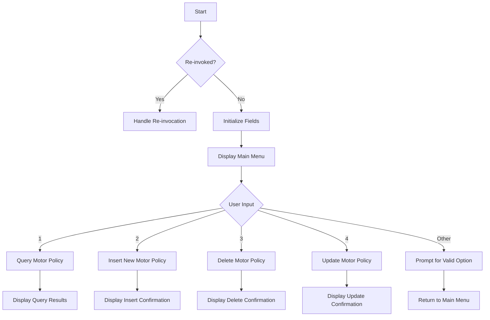

This document will cover the <SwmToken path="base/src/lgtestp1.cbl" pos="11:6:6" line-data="       PROGRAM-ID. LGTESTP1.">`LGTESTP1`</SwmToken> program. We'll cover:

1. What the Program Does
2. Program Flow
3. Program Sections

## What the Program Does

The <SwmToken path="base/src/lgtestp1.cbl" pos="11:6:6" line-data="       PROGRAM-ID. LGTESTP1.">`LGTESTP1`</SwmToken> program is designed to handle motor policy transactions. It provides a menu for users to perform various operations such as querying, inserting, updating, and deleting motor policy information. The program interacts with different CICS programs to perform these operations and displays the results back to the user.

## Program Flow

The program starts by checking if it is being re-invoked. If not, it initializes various fields and displays the main menu. Based on the user's input, it performs different operations:

1. Query Motor Policy
2. Insert New Motor Policy
3. Delete Motor Policy
4. Update Motor Policy If an invalid option is selected, it prompts the user to enter a valid option.



<SwmSnippet path="/base/src/lgtestp1.cbl" line="30">

---

### MAINLINE SECTION

First, the program checks if it is being re-invoked by examining the <SwmToken path="base/src/lgtestp1.cbl" pos="32:3:3" line-data="           IF EIBCALEN &gt; 0">`EIBCALEN`</SwmToken> field. If it is, it jumps to the <SwmToken path="base/src/lgtestp1.cbl" pos="33:5:7" line-data="              GO TO A-GAIN.">`A-GAIN`</SwmToken> section. Otherwise, it initializes various fields and displays the main menu.

```cobol
       MAINLINE SECTION.

           IF EIBCALEN > 0
              GO TO A-GAIN.

           Initialize SSMAPP1I.
           Initialize SSMAPP1O.
           Initialize COMM-AREA.
           MOVE '0000000000'   To ENP1CNOO.
           MOVE '0000000000'   To ENP1PNOO.
           MOVE '000000'       To ENP1VALO.
           MOVE '00000'        To ENP1CCO.
           MOVE '000000'       To ENP1ACCO.
           MOVE '000000'       To ENP1PREO.


      * Display Main Menu
           EXEC CICS SEND MAP ('SSMAPP1')
                     MAPSET ('SSMAP')
                     ERASE
                     END-EXEC.
```

---

</SwmSnippet>

<SwmSnippet path="/base/src/lgtestp1.cbl" line="52">

---

### <SwmToken path="base/src/lgtestp1.cbl" pos="52:1:3" line-data="       A-GAIN.">`A-GAIN`</SwmToken> SECTION

Now, the program sets up handlers for different AID keys and conditions. It then waits for user input by receiving the map.

```cobol
       A-GAIN.

           EXEC CICS HANDLE AID
                     CLEAR(CLEARIT)
                     PF3(ENDIT) END-EXEC.
           EXEC CICS HANDLE CONDITION
                     MAPFAIL(ENDIT)
                     END-EXEC.

           EXEC CICS RECEIVE MAP('SSMAPP1')
                     INTO(SSMAPP1I)
                     MAPSET('SSMAP') END-EXEC.
```

---

</SwmSnippet>

<SwmSnippet path="/base/src/lgtestp1.cbl" line="66">

---

### EVALUATE SECTION

Then, the program evaluates the user's input (<SwmToken path="base/src/lgtestp1.cbl" pos="66:3:3" line-data="           EVALUATE ENP1OPTO">`ENP1OPTO`</SwmToken>) and performs different operations based on the input:

- When '1': Queries motor policy information by linking to the <SwmToken path="base/src/lgtestp1.cbl" pos="72:10:10" line-data="                 EXEC CICS LINK PROGRAM(&#39;LGIPOL01&#39;)">`LGIPOL01`</SwmToken> program.
- When '2': Inserts a new motor policy by linking to the <SwmToken path="base/src/lgtestp1.cbl" pos="115:10:10" line-data="                 EXEC CICS LINK PROGRAM(&#39;LGAPOL01&#39;)">`LGAPOL01`</SwmToken> program.
- When '3': Deletes a motor policy by linking to the <SwmToken path="base/src/lgtestp1.cbl" pos="139:10:10" line-data="                 EXEC CICS LINK PROGRAM(&#39;LGDPOL01&#39;)">`LGDPOL01`</SwmToken> program.
- When '4': Updates a motor policy by first querying the current information and then linking to the <SwmToken path="base/src/lgtestp1.cbl" pos="216:10:10" line-data="                 EXEC CICS LINK PROGRAM(&#39;LGUPOL01&#39;)">`LGUPOL01`</SwmToken> program.
- When other: Prompts the user to enter a valid option.

```cobol
           EVALUATE ENP1OPTO

             WHEN '1'
                 Move '01IMOT'   To CA-REQUEST-ID
                 Move ENP1CNOO   To CA-CUSTOMER-NUM
                 Move ENP1PNOO   To CA-POLICY-NUM
                 EXEC CICS LINK PROGRAM('LGIPOL01')
                           COMMAREA(COMM-AREA)
                           LENGTH(32500)
                 END-EXEC
                 IF CA-RETURN-CODE > 0
                   GO TO NO-DATA
                 END-IF

                 Move CA-ISSUE-DATE     To  ENP1IDAI
                 Move CA-EXPIRY-DATE    To  ENP1EDAI
                 Move CA-M-MAKE         To  ENP1CMKI
                 Move CA-M-MODEL        To  ENP1CMOI
                 Move CA-M-VALUE        To  ENP1VALI
                 Move CA-M-REGNUMBER    To  ENP1REGI
                 Move CA-M-COLOUR       To  ENP1COLI
```

---

</SwmSnippet>

<SwmSnippet path="/base/src/lgtestp1.cbl" line="257">

---

### <SwmToken path="base/src/lgtestp1.cbl" pos="257:1:3" line-data="       ENDIT-STARTIT.">`ENDIT-STARTIT`</SwmToken> SECTION

Finally, the program returns control to CICS with the transaction ID <SwmToken path="base/src/lgtestp1.cbl" pos="259:4:4" line-data="                TRANSID(&#39;SSP1&#39;)">`SSP1`</SwmToken> and the communication area.

```cobol
       ENDIT-STARTIT.
           EXEC CICS RETURN
                TRANSID('SSP1')
                COMMAREA(COMM-AREA)
                END-EXEC.
```

---

</SwmSnippet>

&nbsp;

*This is an auto-generated document by Swimm 🌊 and has not yet been verified by a human*

<SwmMeta version="3.0.0" repo-id="Z2l0aHViJTNBJTNBa3luZHJ5bC1jaWNzLWdlbmFwcCUzQSUzQVN3aW1tLURlbW8=" repo-name="kyndryl-cics-genapp"><sup>Powered by [Swimm](/)</sup></SwmMeta>
