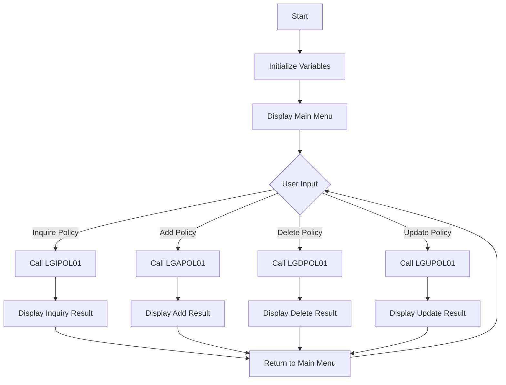

This document will cover the <SwmToken path="base/src/lgtestp1.cbl" pos="11:6:6" line-data="       PROGRAM-ID. LGTESTP1.">`LGTESTP1`</SwmToken> program. We'll cover:

1. What the Program Does
2. Program Flow
3. Program Sections

## What the Program Does

The <SwmToken path="base/src/lgtestp1.cbl" pos="11:6:6" line-data="       PROGRAM-ID. LGTESTP1.">`LGTESTP1`</SwmToken> program is designed to handle various motor policy transactions within an insurance application. It provides a menu for users to select different operations such as inquiring, adding, deleting, and updating motor policies. The program initializes necessary variables, displays the main menu, handles user input, and calls other programs to perform the selected operations.

## Program Flow

The program flow of <SwmToken path="base/src/lgtestp1.cbl" pos="11:6:6" line-data="       PROGRAM-ID. LGTESTP1.">`LGTESTP1`</SwmToken> is as follows:

1. Initialize variables and display the main menu.
2. Handle user input and determine the selected operation.
3. Based on the selected operation, call the appropriate program to inquire, add, delete, or update a motor policy.
4. Display the result of the operation and return to the main menu.



<SwmSnippet path="/base/src/lgtestp1.cbl" line="30">

---

### MAINLINE SECTION

First, the program initializes variables and displays the main menu to the user. This sets up the initial state for the program and prepares it to handle user input.

```cobol
       MAINLINE SECTION.

           IF EIBCALEN > 0
              GO TO A-GAIN.

           Initialize SSMAPP1I.
           Initialize SSMAPP1O.
           Initialize COMM-AREA.
           MOVE '0000000000'   To ENP1CNOO.
           MOVE '0000000000'   To ENP1PNOO.
           MOVE '000000'       To ENP1VALO.
           MOVE '00000'        To ENP1CCO.
           MOVE '000000'       To ENP1ACCO.
           MOVE '000000'       To ENP1PREO.


      * Display Main Menu
           EXEC CICS SEND MAP ('SSMAPP1')
                     MAPSET ('SSMAP')
                     ERASE
                     END-EXEC.
```

---

</SwmSnippet>

<SwmSnippet path="/base/src/lgtestp1.cbl" line="52">

---

### <SwmToken path="base/src/lgtestp1.cbl" pos="52:1:3" line-data="       A-GAIN.">`A-GAIN`</SwmToken> SECTION

Next, the program handles user input by setting up handlers for different keys and conditions. This prepares the program to receive and process user commands.

```cobol
       A-GAIN.

           EXEC CICS HANDLE AID
                     CLEAR(CLEARIT)
                     PF3(ENDIT) END-EXEC.
           EXEC CICS HANDLE CONDITION
                     MAPFAIL(ENDIT)
                     END-EXEC.

           EXEC CICS RECEIVE MAP('SSMAPP1')
                     INTO(SSMAPP1I)
                     MAPSET('SSMAP') END-EXEC.
```

---

</SwmSnippet>

<SwmSnippet path="/base/src/lgtestp1.cbl" line="66">

---

### EVALUATE SECTION

Then, the program evaluates the user input and determines the selected operation. Based on the input, it calls the appropriate program to perform the selected operation (inquire, add, delete, or update a motor policy).

```cobol
           EVALUATE ENP1OPTO

             WHEN '1'
                 Move '01IMOT'   To CA-REQUEST-ID
                 Move ENP1CNOO   To CA-CUSTOMER-NUM
                 Move ENP1PNOO   To CA-POLICY-NUM
                 EXEC CICS LINK PROGRAM('LGIPOL01')
                           COMMAREA(COMM-AREA)
                           LENGTH(32500)
                 END-EXEC
                 IF CA-RETURN-CODE > 0
                   GO TO NO-DATA
                 END-IF

                 Move CA-ISSUE-DATE     To  ENP1IDAI
                 Move CA-EXPIRY-DATE    To  ENP1EDAI
                 Move CA-M-MAKE         To  ENP1CMKI
                 Move CA-M-MODEL        To  ENP1CMOI
                 Move CA-M-VALUE        To  ENP1VALI
                 Move CA-M-REGNUMBER    To  ENP1REGI
                 Move CA-M-COLOUR       To  ENP1COLI
```

---

</SwmSnippet>

<SwmSnippet path="/base/src/lgtestp1.cbl" line="257">

---

### <SwmToken path="base/src/lgtestp1.cbl" pos="257:1:3" line-data="       ENDIT-STARTIT.">`ENDIT-STARTIT`</SwmToken> SECTION

Finally, the program returns to the main menu, allowing the user to perform another operation or exit the program.

```cobol
       ENDIT-STARTIT.
           EXEC CICS RETURN
                TRANSID('SSP1')
                COMMAREA(COMM-AREA)
                END-EXEC.
```

---

</SwmSnippet>

&nbsp;

*This is an auto-generated document by Swimm 🌊 and has not yet been verified by a human*

<SwmMeta version="3.0.0" repo-id="Z2l0aHViJTNBJTNBa3luZHJ5bC1jaWNzLWdlbmFwcCUzQSUzQVN3aW1tLURlbW8=" repo-name="kyndryl-cics-genapp"><sup>Powered by [Swimm](/)</sup></SwmMeta>
