The repository contains a general insurance application (GenApp) for IBM CICS Transaction Server for z/OS (CICS TS). It demonstrates application modernization by providing a sample application that exercises various components of CICS TS, allowing users to insert, query, and delete policy information stored in an IBM Db2 database.

## Main Components

```mermaid
graph TD;
 g2klt("Updating Policy Details (LGUPOL01)") --> l0avq("Updating Policy Details (LGUPDB01)")
 915xx("Deleting Policy Information (LGDPOL01)") --> evhgw("Deleting Policy Records (LGDPDB01)")
 0stnw("Adding Customer (LGACUS01)") --> 9o2tb("Adding Customer Details (LGACDB01)")
 53kah("Retrieving Customer Details (LGICUS01)") --> to4or("Retrieving Customer Details (LGICDB01)")
 ykje0("Updating Customer Details (LGUCUS01)") --> 7yqwc("Updating Customer Details (LGUCDB01)")
 o6cnq("Adding Policy Details (LGAPDB01)") --> 2hato("Adding Policy Records (LGAPVS01)")
 guih1("Customer Transactions Menu (LGTESTC1)") --> 0stnw("Adding Customer (LGACUS01)")
 6z0jo("House Policy Menu (LGTESTP3)") --> 04c8g("Inquiring Policy Details (LGIPOL01)")
 7tsph("Motor Policy Menu (LGTESTP1)") --> 04c8g("Inquiring Policy Details (LGIPOL01)")
 7qu6s("Endowment Policy Menu (LGTESTP2)") --> 04c8g("Inquiring Policy Details (LGIPOL01)")
 4u3sz("Commercial Policy Menu (LGTESTP4)") --> 04c8g("Inquiring Policy Details (LGIPOL01)")
 9o2tb("Adding Customer Details (LGACDB01)") --> oz6nn("Adding Customer Passwords (LGACDB02)")
 guih1("Customer Transactions Menu (LGTESTC1)") --> ykje0("Updating Customer Details (LGUCUS01)")
 04c8g("Inquiring Policy Details (LGIPOL01)") --> sufue("Inquiring Policy Data (LGIPDB01)")
 l0avq("Updating Policy Details (LGUPDB01)") --> uebhh("Updating Policy Records (LGUPVS01)")
 6z0jo("House Policy Menu (LGTESTP3)") --> 915xx("Deleting Policy Information (LGDPOL01)")
 7tsph("Motor Policy Menu (LGTESTP1)") --> 915xx("Deleting Policy Information (LGDPOL01)")
 7qu6s("Endowment Policy Menu (LGTESTP2)") --> 915xx("Deleting Policy Information (LGDPOL01)")
 4u3sz("Commercial Policy Menu (LGTESTP4)") --> 915xx("Deleting Policy Information (LGDPOL01)")
 6z0jo("House Policy Menu (LGTESTP3)") --> g2klt("Updating Policy Details (LGUPOL01)")
 7tsph("Motor Policy Menu (LGTESTP1)") --> g2klt("Updating Policy Details (LGUPOL01)")
 7qu6s("Endowment Policy Menu (LGTESTP2)") --> g2klt("Updating Policy Details (LGUPOL01)")
 7yqwc("Updating Customer Details (LGUCDB01)") --> nfft0("Updating Customer Records (LGUCVS01)")
 cg6fp("Adding Policy Details (LGAPOL01)") --> o6cnq("Adding Policy Details (LGAPDB01)")
 guih1("Customer Transactions Menu (LGTESTC1)") --> 53kah("Retrieving Customer Details (LGICUS01)")
 9o2tb("Adding Customer Details (LGACDB01)") --> 4a4k1("Adding Customer Records (LGACVS01)")
 6z0jo("House Policy Menu (LGTESTP3)") --> cg6fp("Adding Policy Details (LGAPOL01)")
 7tsph("Motor Policy Menu (LGTESTP1)") --> cg6fp("Adding Policy Details (LGAPOL01)")
 7qu6s("Endowment Policy Menu (LGTESTP2)") --> cg6fp("Adding Policy Details (LGAPOL01)")
 4u3sz("Commercial Policy Menu (LGTESTP4)") --> cg6fp("Adding Policy Details (LGAPOL01)")
 evhgw("Deleting Policy Records (LGDPDB01)") --> 5druc("Deleting Policy Records (LGDPVS01)")
```

&nbsp;

### Adding Customer Details (<SwmToken path="/base/src/lgacus01.cbl" pos="58:3:3" line-data="       77  LGACDB01                    PIC X(8)       VALUE &#39;LGACDB01&#39;.">`LGACDB01`</SwmToken>)

<SwmToken path="/base/src/lgacus01.cbl" pos="58:3:3" line-data="       77  LGACDB01                    PIC X(8)       VALUE &#39;LGACDB01&#39;.">`LGACDB01`</SwmToken> is a program that adds customer details to a Db2 database. It handles the insertion of a customer's name, address, and date of birth into the DB2 customer table, creating a new customer entry. The program initializes necessary variables, processes the incoming communication area, checks its length, and then performs the insertion of the customer details into the database. If successful, it returns control to the caller; otherwise, it handles errors appropriately.

- <SwmLink doc-title="Adding Customer Passwords (LGACDB02)">[Adding Customer Passwords (LGACDB02)](/.swm/adding-customer-passwords-lgacdb02.yipnfb7p.sw.md)</SwmLink>

### Adding Customer Passwords (<SwmToken path="/base/src/lgacdb02.cbl" pos="13:6:6" line-data="       PROGRAM-ID. LGACDB02.">`LGACDB02`</SwmToken>)

Adding Customer Passwords (<SwmToken path="/base/src/lgacdb02.cbl" pos="13:6:6" line-data="       PROGRAM-ID. LGACDB02.">`LGACDB02`</SwmToken>) involves inserting a customer's password into the security table with details such as customer number, password, state indicator, and password change count. The process includes initializing variables, handling communication areas, and executing SQL operations to update the database.

- <SwmLink doc-title="Managing Customer Information (LGACDB01)">[Managing Customer Information (LGACDB01)](/.swm/managing-customer-information-lgacdb01.z0s7skqm.sw.md)</SwmLink>

### Updating Customer Details (<SwmToken path="/base/src/lgucdb01.cbl" pos="10:6:6" line-data="       PROGRAM-ID. LGUCDB01.">`LGUCDB01`</SwmToken>)

Updating Customer Details (<SwmToken path="/base/src/lgucdb01.cbl" pos="10:6:6" line-data="       PROGRAM-ID. LGUCDB01.">`LGUCDB01`</SwmToken>) refers to the process of modifying customer information in the database using the <SwmToken path="/base/src/lgucdb01.cbl" pos="10:6:6" line-data="       PROGRAM-ID. LGUCDB01.">`LGUCDB01`</SwmToken> program, which handles the update operation and error management.

- <SwmLink doc-title="Updating Customer Information (LGUCDB01)">[Updating Customer Information (LGUCDB01)](/.swm/updating-customer-information-lgucdb01.qw5fu84a.sw.md)</SwmLink>

### Customer Transactions Menu (<SwmToken path="/base/src/lgtestc1.cbl" pos="11:6:6" line-data="       PROGRAM-ID. LGTESTC1.">`LGTESTC1`</SwmToken>)

Customer Transactions Menu (<SwmToken path="/base/src/lgtestc1.cbl" pos="11:6:6" line-data="       PROGRAM-ID. LGTESTC1.">`LGTESTC1`</SwmToken>) is a COBOL program that provides the presentation logic for customer-related transactions, handling operations like querying, inserting, updating, and deleting customer information within the general insurance application.

- <SwmLink doc-title="Handling Customer Operations (LGTESTC1)">[Handling Customer Operations (LGTESTC1)](/.swm/handling-customer-operations-lgtestc1.jjzhyi1x.sw.md)</SwmLink>

### Updating Customer Details (<SwmToken path="/base/src/lgucus01.cbl" pos="11:6:6" line-data="       PROGRAM-ID. LGUCUS01.">`LGUCUS01`</SwmToken>)

Updating Customer Details (<SwmToken path="/base/src/lgucus01.cbl" pos="11:6:6" line-data="       PROGRAM-ID. LGUCUS01.">`LGUCUS01`</SwmToken>) refers to the process of modifying existing customer information within the application. The program <SwmToken path="/base/src/lgucus01.cbl" pos="11:6:6" line-data="       PROGRAM-ID. LGUCUS01.">`LGUCUS01`</SwmToken> handles the business transaction logic for updating customer details. It initializes working storage variables, checks the communication area (commarea), and performs the update by calling the procedure <SwmToken path="/base/src/lgucus01.cbl" pos="126:1:5" line-data="       UPDATE-CUSTOMER-INFO.">`UPDATE-CUSTOMER-INFO`</SwmToken>. This procedure links to another program, <SwmToken path="/base/src/lgucdb01.cbl" pos="10:6:6" line-data="       PROGRAM-ID. LGUCDB01.">`LGUCDB01`</SwmToken>, which updates the required tables in the database. If any errors occur, the program writes error messages to queues for further analysis.

- <SwmLink doc-title="Updating Customer Information (LGUCUS01)">[Updating Customer Information (LGUCUS01)](/.swm/updating-customer-information-lgucus01.5ep8jkr6.sw.md)</SwmLink>

### Inquiring Policy Data (<SwmToken path="/base/src/lgipdb01.cbl" pos="13:6:6" line-data="       PROGRAM-ID. LGIPDB01.">`LGIPDB01`</SwmToken>)

Inquiring Policy Data (<SwmToken path="/base/src/lgipdb01.cbl" pos="13:6:6" line-data="       PROGRAM-ID. LGIPDB01.">`LGIPDB01`</SwmToken>) refers to the process of retrieving detailed information about individual insurance policies from the Db2 database. The program <SwmToken path="/base/src/lgipdb01.cbl" pos="13:6:6" line-data="       PROGRAM-ID. LGIPDB01.">`LGIPDB01`</SwmToken> is designed to handle inquiries for various types of policies, including endowment, house, motor, and commercial policies. It performs SQL queries to fetch the relevant policy data based on customer and policy numbers, processes the data, and returns it to the caller. The program ensures that the data is correctly formatted and handles any errors that may occur during the data retrieval process.

- <SwmLink doc-title="Policy Information Retrieval (LGIPDB01)">[Policy Information Retrieval (LGIPDB01)](/.swm/policy-information-retrieval-lgipdb01.znlqbzzt.sw.md)</SwmLink>

### Updating Policy Records (<SwmToken path="/base/src/lgupvs01.cbl" pos="11:6:6" line-data="       PROGRAM-ID. LGUPVS01.">`LGUPVS01`</SwmToken>)

Updating Policy Records (<SwmToken path="/base/src/lgupvs01.cbl" pos="11:6:6" line-data="       PROGRAM-ID. LGUPVS01.">`LGUPVS01`</SwmToken>) involves modifying existing policy information stored in a VSAM KSDS file. The program reads the current policy data, updates the necessary fields based on the request type, and then rewrites the updated policy back to the file. This process ensures that the policy records are kept current and accurate.

- <SwmLink doc-title="Updating Policy Records (LGUPVS01)">[Updating Policy Records (LGUPVS01)](/.swm/updating-policy-records-lgupvs01.11l04vtv.sw.md)</SwmLink>

### Deleting Policy Records (<SwmToken path="/base/src/lgdpdb01.cbl" pos="13:6:6" line-data="       PROGRAM-ID. LGDPDB01.">`LGDPDB01`</SwmToken>)

Deleting Policy Records (<SwmToken path="/base/src/lgdpdb01.cbl" pos="13:6:6" line-data="       PROGRAM-ID. LGDPDB01.">`LGDPDB01`</SwmToken>) involves removing a specific policy record from the Db2 database. The program <SwmToken path="/base/src/lgdpdb01.cbl" pos="13:6:6" line-data="       PROGRAM-ID. LGDPDB01.">`LGDPDB01`</SwmToken> handles this operation by executing an SQL DELETE statement that targets the policy record based on the customer number and policy number. If the deletion is successful or if the record is not found, the operation is considered successful. Any errors encountered during the process are logged and appropriate error messages are generated.

- <SwmLink doc-title="Deleting Policy Information (LGDPDB01)">[Deleting Policy Information (LGDPDB01)](/.swm/deleting-policy-information-lgdpdb01.4iufc8fu.sw.md)</SwmLink>

### Commercial Policy Menu (<SwmToken path="/base/src/lgtestp4.cbl" pos="11:6:6" line-data="       PROGRAM-ID. LGTESTP4.">`LGTESTP4`</SwmToken>)

Commercial Policy Menu (<SwmToken path="/base/src/lgtestp4.cbl" pos="11:6:6" line-data="       PROGRAM-ID. LGTESTP4.">`LGTESTP4`</SwmToken>) refers to the presentation logic for managing commercial property policies, allowing users to perform transactions like insert, query, and delete within the insurance application.

- <SwmLink doc-title="Policy Management Flow (LGTESTP4)">[Policy Management Flow (LGTESTP4)](/.swm/policy-management-flow-lgtestp4.vx4n1efq.sw.md)</SwmLink>

### Motor Policy Menu (<SwmToken path="/base/src/lgtestp1.cbl" pos="11:6:6" line-data="       PROGRAM-ID. LGTESTP1.">`LGTESTP1`</SwmToken>)

Motor Policy Menu (<SwmToken path="/base/src/lgtestp1.cbl" pos="11:6:6" line-data="       PROGRAM-ID. LGTESTP1.">`LGTESTP1`</SwmToken>) is the presentation logic for managing motor policy transactions, allowing users to add, update, delete, and inquire about motor policies.

- <SwmLink doc-title="Handling User Input and Operations (LGTESTP1)">[Handling User Input and Operations (LGTESTP1)](/.swm/handling-user-input-and-operations-lgtestp1.v16ier5t.sw.md)</SwmLink>

### Deleting Policy Information (<SwmToken path="/base/src/lgdpol01.cbl" pos="11:6:6" line-data="       PROGRAM-ID. LGDPOL01.">`LGDPOL01`</SwmToken>)

Deleting Policy Information (<SwmToken path="/base/src/lgdpol01.cbl" pos="11:6:6" line-data="       PROGRAM-ID. LGDPOL01.">`LGDPOL01`</SwmToken>) involves executing the business logic required to remove a policy record from the system. This process includes validating the input data, ensuring the communication area is correctly set up, and then calling the appropriate routine to delete the policy from the Db2 database.

- <SwmLink doc-title="Deleting Policy Information (LGDPOL01)">[Deleting Policy Information (LGDPOL01)](/.swm/deleting-policy-information-lgdpol01.sf6u0vqb.sw.md)</SwmLink>

### House Policy Menu (<SwmToken path="/base/src/lgtestp3.cbl" pos="11:6:6" line-data="       PROGRAM-ID. LGTESTP3.">`LGTESTP3`</SwmToken>)

House Policy Menu (<SwmToken path="/base/src/lgtestp3.cbl" pos="11:6:6" line-data="       PROGRAM-ID. LGTESTP3.">`LGTESTP3`</SwmToken>) is a component that manages house policy transactions, allowing users to add, update, query, and delete house policy information.

- <SwmLink doc-title="House Policy Menu (LGTESTP3)">[House Policy Menu (LGTESTP3)](/.swm/house-policy-menu-lgtestp3.uc39vnee.sw.md)</SwmLink>

### Endowment Policy Menu (<SwmToken path="/base/src/lgtestp2.cbl" pos="11:6:6" line-data="       PROGRAM-ID. LGTESTP2.">`LGTESTP2`</SwmToken>)

Endowment Policy Menu (<SwmToken path="/base/src/lgtestp2.cbl" pos="11:6:6" line-data="       PROGRAM-ID. LGTESTP2.">`LGTESTP2`</SwmToken>) refers to the presentation logic for handling endowment policy transactions, providing a user interface for managing policy data.

- <SwmLink doc-title="Handling Life Policy Deletion (LGTESTP2)">[Handling Life Policy Deletion (LGTESTP2)](/.swm/handling-life-policy-deletion-lgtestp2.7v3gklr7.sw.md)</SwmLink>

### Updating Policy Details (<SwmToken path="/base/src/lgupol01.cbl" pos="11:6:6" line-data="       PROGRAM-ID. LGUPOL01.">`LGUPOL01`</SwmToken>)

Updating Policy Details (<SwmToken path="/base/src/lgupol01.cbl" pos="11:6:6" line-data="       PROGRAM-ID. LGUPOL01.">`LGUPOL01`</SwmToken>) involves the business logic for handling updates to various types of insurance policies, validating input data, and linking to the database update program.

- <SwmLink doc-title="Handling Policy Information (LGUPOL01)">[Handling Policy Information (LGUPOL01)](/.swm/handling-policy-information-lgupol01.uutnl1xi.sw.md)</SwmLink>

### Updating Customer Records (<SwmToken path="/base/src/lgucvs01.cbl" pos="11:6:6" line-data="       PROGRAM-ID. LGUCVS01.">`LGUCVS01`</SwmToken>)

Updating Customer Records (<SwmToken path="/base/src/lgucvs01.cbl" pos="11:6:6" line-data="       PROGRAM-ID. LGUCVS01.">`LGUCVS01`</SwmToken>) involves reading and rewriting customer data stored in a VSAM KSDS file. The process includes reading the existing customer record, updating it, and then rewriting it back to the file. Error handling is implemented to manage any issues that arise during the read or write operations, ensuring data integrity and proper error reporting.

- <SwmLink doc-title="Reading and Rewriting Customer Data (LGUCVS01)">[Reading and Rewriting Customer Data (LGUCVS01)](/.swm/reading-and-rewriting-customer-data-lgucvs01.chxua0ys.sw.md)</SwmLink>

### Retrieving Customer Details (<SwmToken path="/base/src/lgicdb01.cbl" pos="12:6:6" line-data="       PROGRAM-ID. LGICDB01.">`LGICDB01`</SwmToken>)

Retrieving Customer Details (<SwmToken path="/base/src/lgicdb01.cbl" pos="12:6:6" line-data="       PROGRAM-ID. LGICDB01.">`LGICDB01`</SwmToken>)

- <SwmLink doc-title="Handling Errors and Customer Data (LGICDB01)">[Handling Errors and Customer Data (LGICDB01)](/.swm/handling-errors-and-customer-data-lgicdb01.48861ybs.sw.md)</SwmLink>

### Adding Policy Details (<SwmToken path="/base/src/lgapdb01.cbl" pos="13:6:6" line-data="       PROGRAM-ID. LGAPDB01.">`LGAPDB01`</SwmToken>)

Adding Policy Details (<SwmToken path="/base/src/lgapdb01.cbl" pos="13:6:6" line-data="       PROGRAM-ID. LGAPDB01.">`LGAPDB01`</SwmToken>) involves inserting comprehensive policy information into the Db2 database, covering different policy types and ensuring data integrity through proper formatting and error handling.

- <SwmLink doc-title="Policy Data Insertion (LGAPDB01)">[Policy Data Insertion (LGAPDB01)](/.swm/policy-data-insertion-lgapdb01.jnvyvzbt.sw.md)</SwmLink>

### Initializing Counters (LGSETUP)

LGSETUP initializes counters and temporary storage queues by deleting existing queues and counters, setting new low and high customer values, and recreating named counters for the next available customer number.

- <SwmLink doc-title="Setting Up Customer Data and Counters (LGSETUP)">[Setting Up Customer Data and Counters (LGSETUP)](/.swm/setting-up-customer-data-and-counters-lgsetup.7zrqhzs1.sw.md)</SwmLink>

### Retrieving Customer Details (<SwmToken path="/base/src/lgicus01.cbl" pos="13:6:6" line-data="       PROGRAM-ID. LGICUS01.">`LGICUS01`</SwmToken>)

Retrieving Customer Details (<SwmToken path="/base/src/lgicus01.cbl" pos="13:6:6" line-data="       PROGRAM-ID. LGICUS01.">`LGICUS01`</SwmToken>) involves inquiring customer business logic and obtaining customer details from the database by linking to the <SwmToken path="/base/src/lgicdb01.cbl" pos="12:6:6" line-data="       PROGRAM-ID. LGICDB01.">`LGICDB01`</SwmToken> program, with error handling for communication area issues.

- <SwmLink doc-title="Retrieving Customer Information (LGICUS01)">[Retrieving Customer Information (LGICUS01)](/.swm/retrieving-customer-information-lgicus01.f0c1rh31.sw.md)</SwmLink>

### Updating Policy Details (<SwmToken path="/base/src/lgupdb01.cbl" pos="10:6:6" line-data="       PROGRAM-ID. LGUPDB01.">`LGUPDB01`</SwmToken>)

Updating Policy Details (<SwmToken path="/base/src/lgupdb01.cbl" pos="10:6:6" line-data="       PROGRAM-ID. LGUPDB01.">`LGUPDB01`</SwmToken>) involves fetching the current policy record, verifying timestamps, and updating the relevant policy-specific tables and the main policy table in the IBM Db2 database, ensuring data integrity and preventing concurrent modifications.

- <SwmLink doc-title="Updating Policy Information (LGUPDB01)">[Updating Policy Information (LGUPDB01)](/.swm/updating-policy-information-lgupdb01.q9gnfw26.sw.md)</SwmLink>

### Adding Customer Records (<SwmToken path="/base/src/lgacvs01.cbl" pos="11:6:6" line-data="       PROGRAM-ID. LGACVS01.">`LGACVS01`</SwmToken>)

Adding Customer Records (<SwmToken path="/base/src/lgacvs01.cbl" pos="11:6:6" line-data="       PROGRAM-ID. LGACVS01.">`LGACVS01`</SwmToken>) involves inserting customer details into a VSAM KSDS file, managing unique customer numbers, and handling errors during the write operation.

- <SwmLink doc-title="Updating Customer Records (LGACVS01)">[Updating Customer Records (LGACVS01)](/.swm/updating-customer-records-lgacvs01.vkv87eub.sw.md)</SwmLink>

### Adding Policy Details (<SwmToken path="/base/src/lgapol01.cbl" pos="13:6:6" line-data="       PROGRAM-ID. LGAPOL01.">`LGAPOL01`</SwmToken>)

Adding Policy Details (<SwmToken path="/base/src/lgapol01.cbl" pos="13:6:6" line-data="       PROGRAM-ID. LGAPOL01.">`LGAPOL01`</SwmToken>) involves handling the business logic to insert comprehensive details of different insurance policies into the system, ensuring data integrity and error handling throughout the process.

- <SwmLink doc-title="Handling Main Menu and User Input (LGAPOL01)">[Handling Main Menu and User Input (LGAPOL01)](/.swm/handling-main-menu-and-user-input-lgapol01.ju6hxncq.sw.md)</SwmLink>

### Deleting Policy Records (<SwmToken path="/base/src/lgdpvs01.cbl" pos="11:6:6" line-data="       PROGRAM-ID. LGDPVS01.">`LGDPVS01`</SwmToken>)

Deleting Policy Records (<SwmToken path="/base/src/lgdpvs01.cbl" pos="11:6:6" line-data="       PROGRAM-ID. LGDPVS01.">`LGDPVS01`</SwmToken>) involves removing policy records from a VSAM file using a CICS command, with error handling to log any issues that occur during the deletion process.

- <SwmLink doc-title="Handling Customer and Policy Data (LGDPVS01)">[Handling Customer and Policy Data (LGDPVS01)](/.swm/handling-customer-and-policy-data-lgdpvs01.xneg2muu.sw.md)</SwmLink>

### Programs

- <SwmLink doc-title="Handling Messages (LGSTSQ)">[Handling Messages (LGSTSQ)](/.swm/handling-messages-lgstsq.di7or3tb.sw.md)</SwmLink>
- <SwmLink doc-title="Handling Customer Data Transactions (LGICVS01)">[Handling Customer Data Transactions (LGICVS01)](/.swm/handling-customer-data-transactions-lgicvs01.chbhokey.sw.md)</SwmLink>
- <SwmLink doc-title="Handling Policy Information (LGIPVS01)">[Handling Policy Information (LGIPVS01)](/.swm/handling-policy-information-lgipvs01.87tb27t4.sw.md)</SwmLink>
- <SwmLink doc-title="Transaction Counter Flow (LGWEBST5)">[Transaction Counter Flow (LGWEBST5)](/.swm/transaction-counter-flow-lgwebst5.pc4d6pka.sw.md)</SwmLink>

&nbsp;

*This is an auto-generated document by Swimm 🌊 and has not yet been verified by a human*

<SwmMeta version="3.0.0" repo-id="Z2l0aHViJTNBJTNBa3luZHJ5bC1jaWNzLWdlbmFwcCUzQSUzQVN3aW1tLURlbW8=" repo-name="kyndryl-cics-genapp">Powered by [Swimm](https://app.swimm.io/)</SwmMeta>
