The repository contains a general insurance application (GenApp) for IBM CICS Transaction Server for z/OS (CICS TS). It demonstrates application modernization by providing a COBOL application that exercises various CICS TS components, allowing users to insert, query, and delete insurance policy information stored in an IBM Db2 database.

## Main Components

```mermaid
graph TD;
 udyah("Updating Policy Details (LGUPOL01)") --> aqze9("Updating Policy Details (LGUPDB01)")
 nwicg("Inquiring Policy Details (LGIPOL01)") --> nkl8y("Retrieving Policy Information (LGIPDB01)")
 9nvuc("Adding Policy Details (LGAPOL01)") --> itsyg("Adding Policy Information (LGAPDB01)")
 kz58d("Deleting Insurance Policies (LGDPOL01)") --> hw2sy("Deleting Policy Records (LGDPDB01)")
 hw2sy("Deleting Policy Records (LGDPDB01)") --> 9mmn8("Deleting Policy Records (LGDPVS01)")
 cibt8("Customer Menu (LGTESTC1)") --> gj0mk("Adding New Customers (LGACUS01)")
 gj0mk("Adding New Customers (LGACUS01)") --> 7pzld("Adding Customer Details (LGACDB01)")
 7pzld("Adding Customer Details (LGACDB01)") --> gkh6z("Adding Customer Passwords (LGACDB02)")
 itsyg("Adding Policy Information (LGAPDB01)") --> 17df9("Adding Policy Records (LGAPVS01)")
 u5ja3("House Policy Menu (LGTESTP3)") --> nwicg("Inquiring Policy Details (LGIPOL01)")
 elojb("Endowment Policy Menu (LGTESTP2)") --> nwicg("Inquiring Policy Details (LGIPOL01)")
 u2nc7("Commercial Policy Menu (LGTESTP4)") --> nwicg("Inquiring Policy Details (LGIPOL01)")
 ginx1("Motor Policy Presentation (LGTESTP1)") --> nwicg("Inquiring Policy Details (LGIPOL01)")
 liciu("Updating Customer Details (LGUCUS01)") --> dx898("Updating Customer Details (LGUCDB01)")
 cibt8("Customer Menu (LGTESTC1)") --> liciu("Updating Customer Details (LGUCUS01)")
 aqze9("Updating Policy Details (LGUPDB01)") --> 58al4("Updating Policy Records (LGUPVS01)")
 u5ja3("House Policy Menu (LGTESTP3)") --> kz58d("Deleting Insurance Policies (LGDPOL01)")
 elojb("Endowment Policy Menu (LGTESTP2)") --> kz58d("Deleting Insurance Policies (LGDPOL01)")
 u2nc7("Commercial Policy Menu (LGTESTP4)") --> kz58d("Deleting Insurance Policies (LGDPOL01)")
 ginx1("Motor Policy Presentation (LGTESTP1)") --> kz58d("Deleting Insurance Policies (LGDPOL01)")
 u5ja3("House Policy Menu (LGTESTP3)") --> udyah("Updating Policy Details (LGUPOL01)")
 elojb("Endowment Policy Menu (LGTESTP2)") --> udyah("Updating Policy Details (LGUPOL01)")
 ginx1("Motor Policy Presentation (LGTESTP1)") --> udyah("Updating Policy Details (LGUPOL01)")
 dx898("Updating Customer Details (LGUCDB01)") --> pyr8p("Updating Customer Records (LGUCVS01)")
 a2j6e("Customer Inquiries (LGICUS01)") --> xpgzn("Retrieving Customer Details (LGICDB01)")
 cibt8("Customer Menu (LGTESTC1)") --> a2j6e("Customer Inquiries (LGICUS01)")
 7pzld("Adding Customer Details (LGACDB01)") --> t3uoj("Adding Customer Details (LGACVS01)")
 u5ja3("House Policy Menu (LGTESTP3)") --> 9nvuc("Adding Policy Details (LGAPOL01)")
 elojb("Endowment Policy Menu (LGTESTP2)") --> 9nvuc("Adding Policy Details (LGAPOL01)")
 u2nc7("Commercial Policy Menu (LGTESTP4)") --> 9nvuc("Adding Policy Details (LGAPOL01)")
 ginx1("Motor Policy Presentation (LGTESTP1)") --> 9nvuc("Adding Policy Details (LGAPOL01)")
```

## Top Level Flows

### Customer Menu (LGTESTC1)

Customer Menu (LGTESTC1) is a COBOL program that manages customer transactions, providing functionalities to insert, query, and update customer information in an IBM Db2 database through a CICS Transaction Server interface.

- <SwmLink doc-title="Customer Menu (LGTESTC1)">[Customer Menu (LGTESTC1)](/.swm/customer-menu-lgtestc1.1jwbhi4n.sw.md)</SwmLink>

### Commercial Policy Menu (LGTESTP4)

The Commercial Policy Menu (LGTESTP4) is a COBOL program that handles the presentation logic for commercial property policies within the general insurance application.

- <SwmLink doc-title="Commercial Policy Menu (LGTESTP4)">[Commercial Policy Menu (LGTESTP4)](/.swm/commercial-policy-menu-lgtestp4.keqj2lwc.sw.md)</SwmLink>

### House Policy Menu (LGTESTP3)

House Policy Menu (LGTESTP3) is a COBOL program that facilitates the management of house insurance policies by providing options to insert, query, update, and delete policy information.

- <SwmLink doc-title="House Policy Menu (LGTESTP3)">[House Policy Menu (LGTESTP3)](/.swm/house-policy-menu-lgtestp3.j7gkwid7.sw.md)</SwmLink>

### Endowment Policy Menu (LGTESTP2)

Endowment Policy Menu (LGTESTP2) handles the presentation logic for endowment policy transactions, allowing users to perform operations like inserting, querying, updating, and deleting policy information.

- <SwmLink doc-title="Endowment Policy Menu (LGTESTP2)">[Endowment Policy Menu (LGTESTP2)](/.swm/endowment-policy-menu-lgtestp2.dsbigvc7.sw.md)</SwmLink>

## Programs

### Adding Policy Records (LGAPVS01)

Adding Policy Records (LGAPVS01) involves processing policy information, evaluating the request type, and writing the policy details to a VSAM file, while handling any potential errors.

- <SwmLink doc-title="Adding Policy Records (LGAPVS01)">[Adding Policy Records (LGAPVS01)](/.swm/adding-policy-records-lgapvs01.c4crfwo7.sw.md)</SwmLink>

### Adding New Customers (LGACUS01)

Adding New Customers (LGACUS01) refers to the business logic for inserting new customer records into the system, ensuring data integrity and handling errors appropriately.

- <SwmLink doc-title="Adding New Customers (LGACUS01)">[Adding New Customers (LGACUS01)](/.swm/adding-new-customers-lgacus01.xye3ga8o.sw.md)</SwmLink>

### Inquiring Policy Details (LGIPOL01)

Inquiring Policy Details (LGIPOL01)

- <SwmLink doc-title="Inquiring Policy Details (LGIPOL01)">[Inquiring Policy Details (LGIPOL01)](/.swm/inquiring-policy-details-lgipol01.a4iime4v.sw.md)</SwmLink>

### Retrieving Customer Number (LGICVS01)

Retrieving Customer Number (LGICVS01) involves obtaining a random customer number from a VSAM KSDS Customer dataset using a control TSQ for the random seed, and returning the number through Commarea or screen display.

- <SwmLink doc-title="Retrieving Customer Number (LGICVS01)">[Retrieving Customer Number (LGICVS01)](/.swm/retrieving-customer-number-lgicvs01.s7zrpzj3.sw.md)</SwmLink>

### Updating Customer Details (LGUCDB01)

Updating Customer Details (LGUCDB01) involves modifying customer information in the IBM Db2 database using a COBOL program that executes an SQL UPDATE statement and handles any errors that may occur during the process.

- <SwmLink doc-title="Updating Customer Details (LGUCDB01)">[Updating Customer Details (LGUCDB01)](/.swm/updating-customer-details-lgucdb01.iigxw6ku.sw.md)</SwmLink>

### Adding Customer Passwords (LGACDB02)

Adding customer passwords involves inserting the customer's password and related details into the CUSTOMER_SECURE table in the database, and handling any errors that occur during this process.

- <SwmLink doc-title="Adding Customer Passwords (LGACDB02)">[Adding Customer Passwords (LGACDB02)](/.swm/adding-customer-passwords-lgacdb02.7l3ez3bb.sw.md)</SwmLink>

### Adding Customer Details (LGACDB01)

Adding Customer Details (LGACDB01) refers to the process of inserting new customer information into the Db2 database. This involves obtaining a unique customer number and storing various customer details such as name, address, and date of birth.

- <SwmLink doc-title="Adding Customer Details (LGACDB01)">[Adding Customer Details (LGACDB01)](/.swm/adding-customer-details-lgacdb01.tbc4xojj.sw.md)</SwmLink>

### Updating Customer Details (LGUCUS01)

Updating Customer Details (LGUCUS01) involves modifying customer information by initializing variables, checking commarea, and linking to another program for database updates, with error handling included.

- <SwmLink doc-title="Updating Customer Details (LGUCUS01)">[Updating Customer Details (LGUCUS01)](/.swm/updating-customer-details-lgucus01.nmwnv0h9.sw.md)</SwmLink>

### Retrieving Policy Information (LGIPDB01)

Retrieving Policy Information (LGIPDB01) involves executing SQL queries to fetch detailed insurance policy records from a Db2 database, converting data formats, and managing communication areas to return the data to the caller, with error handling for various scenarios.

- <SwmLink doc-title="Retrieving Policy Information (LGIPDB01)">[Retrieving Policy Information (LGIPDB01)](/.swm/retrieving-policy-information-lgipdb01.q633bzop.sw.md)</SwmLink>

### Updating Policy Records (LGUPVS01)

Updating Policy Records (LGUPVS01) involves reading an existing policy record from a VSAM KSDS file, updating it with new data based on the request type, and rewriting the updated record back to the file, with error handling to ensure data integrity.

- <SwmLink doc-title="Updating Policy Records (LGUPVS01)">[Updating Policy Records (LGUPVS01)](/.swm/updating-policy-records-lgupvs01.65cn83to.sw.md)</SwmLink>

### Deleting Policy Records (LGDPDB01)

Deleting Policy Records (LGDPDB01) involves executing an SQL DELETE statement to remove policy records from the Db2 database, handling various policy types, and ensuring proper error handling and logging.

- <SwmLink doc-title="Deleting Policy Records (LGDPDB01)">[Deleting Policy Records (LGDPDB01)](/.swm/deleting-policy-records-lgdpdb01.6f0ohhon.sw.md)</SwmLink>

### Motor Policy Presentation (LGTESTP1)

Motor Policy Presentation (LGTESTP1) handles the presentation logic for motor policy transactions, allowing users to manage motor policy information in the insurance application.

- <SwmLink doc-title="Motor Policy Presentation (LGTESTP1)">[Motor Policy Presentation (LGTESTP1)](/.swm/motor-policy-presentation-lgtestp1.bfs9pthg.sw.md)</SwmLink>

### Deleting Insurance Policies (LGDPOL01)

Deleting Insurance Policies (LGDPOL01) involves executing the business logic necessary to remove policy records. The program performs initial checks on the communication area (commarea) to ensure it is valid and contains the required information. If the request is recognized, it calls the DELETE-POLICY-DB2-INFO routine, which links to the LGDPDB01 program to delete the policy record from the Db2 database. The process includes error handling to manage any issues that arise during the deletion.

- <SwmLink doc-title="Deleting Insurance Policies (LGDPOL01)">[Deleting Insurance Policies (LGDPOL01)](/.swm/deleting-insurance-policies-lgdpol01.1gbfsqsp.sw.md)</SwmLink>

### Updating Policy Details (LGUPOL01)

Updating Policy Details (LGUPOL01) involves the business logic for handling updates to various insurance policies, validating input data, and linking to the database update program LGUPDB01.

- <SwmLink doc-title="Updating Policy Details (LGUPOL01)">[Updating Policy Details (LGUPOL01)](/.swm/updating-policy-details-lgupol01.i8otazzz.sw.md)</SwmLink>

### Updating Customer Records (LGUCVS01)

Updating Customer Records (LGUCVS01) involves reading a customer record from a VSAM KSDS file, updating the record, and rewriting it back to the file. Error handling is performed if any issues arise during these operations.

- <SwmLink doc-title="Updating Customer Records (LGUCVS01)">[Updating Customer Records (LGUCVS01)](/.swm/updating-customer-records-lgucvs01.g1etz950.sw.md)</SwmLink>

### Retrieving Customer Details (LGICDB01)

Retrieving Customer Details (LGICDB01) involves executing a COBOL program that interacts with an IBM Db2 database to fetch customer information. The program processes incoming requests by validating the communication area, converting customer numbers to the appropriate format, and performing SQL queries to retrieve customer details such as name, date of birth, address, and contact information. The results are then returned to the caller, with error handling mechanisms in place to manage any issues during the retrieval process.

- <SwmLink doc-title="Retrieving Customer Details (LGICDB01)">[Retrieving Customer Details (LGICDB01)](/.swm/retrieving-customer-details-lgicdb01.mx84ber5.sw.md)</SwmLink>

### Adding Policy Information (LGAPDB01)

Adding Policy Information (LGAPDB01) involves inserting detailed insurance policy data into a Db2 database. The program processes and formats the input data, executes SQL insert statements for different policy types, and handles errors to maintain data integrity.

- <SwmLink doc-title="Adding Policy Information (LGAPDB01)">[Adding Policy Information (LGAPDB01)](/.swm/adding-policy-information-lgapdb01.iuyvorm7.sw.md)</SwmLink>

### Updating Transaction Counts (LGASTAT1)

Updating Transaction Counts (LGASTAT1)

- <SwmLink doc-title="Updating Transaction Counts (LGASTAT1)">[Updating Transaction Counts (LGASTAT1)](/.swm/updating-transaction-counts-lgastat1.a8rk96bh.sw.md)</SwmLink>

### Initializing Temporary Storage (LGSETUP)

Initializing Temporary Storage (LGSETUP) involves setting up counters and temporary storage queues to ensure the application starts with accurate and updated values, matching the restored Db2 database.

- <SwmLink doc-title="Initializing Temporary Storage (LGSETUP)">[Initializing Temporary Storage (LGSETUP)](/.swm/initializing-temporary-storage-lgsetup.trpddmb2.sw.md)</SwmLink>

### Customer Inquiries (LGICUS01)

Customer Inquiries (LGICUS01) refers to the functionality that retrieves customer details from the database. It involves checking the communication area, processing the incoming data, and linking to another program (LGICDB01) to fetch the required customer information. If any errors occur, it writes error messages to the queues.

- <SwmLink doc-title="Customer Inquiries (LGICUS01)">[Customer Inquiries (LGICUS01)](/.swm/customer-inquiries-lgicus01.ljl8tyz0.sw.md)</SwmLink>

### Updating Policy Details (LGUPDB01)

Updating Policy Details (LGUPDB01) involves fetching the current policy record, validating timestamps, updating specific policy type tables, and finally updating the main policy table in the IBM Db2 database.

- <SwmLink doc-title="Updating Policy Details (LGUPDB01)">[Updating Policy Details (LGUPDB01)](/.swm/updating-policy-details-lgupdb01.d82xaq2e.sw.md)</SwmLink>

### Adding Customer Details (LGACVS01)

Adding Customer Details (LGACVS01) involves writing customer information to a VSAM file using a COBOL program that interacts with the CICS Transaction Server.

- <SwmLink doc-title="Adding Customer Details (LGACVS01)">[Adding Customer Details (LGACVS01)](/.swm/adding-customer-details-lgacvs01.hw3htysm.sw.md)</SwmLink>

### Adding Policy Details (LGAPOL01)

Adding Policy Details (LGAPOL01)

- <SwmLink doc-title="Adding Policy Details (LGAPOL01)">[Adding Policy Details (LGAPOL01)](/.swm/adding-policy-details-lgapol01.zvor1rxw.sw.md)</SwmLink>

### Deleting Policy Records (LGDPVS01)

Deleting Policy Records (LGDPVS01) involves removing policy records from a VSAM file using the CICS `DELETE` command, handling errors, and logging relevant information.

- <SwmLink doc-title="Deleting Policy Records (LGDPVS01)">[Deleting Policy Records (LGDPVS01)](/.swm/deleting-policy-records-lgdpvs01.j1ujlnh0.sw.md)</SwmLink>

### Updating Statistical Data (LGWEBST5)

Updating Statistical Data (LGWEBST5) is a COBOL program that collects, processes, and updates statistical data for business monitoring, refreshing every 60 seconds and storing the data in a shared TSQ.

- <SwmLink doc-title="Updating Statistical Data (LGWEBST5)">[Updating Statistical Data (LGWEBST5)](/.swm/updating-statistical-data-lgwebst5.10wm738m.sw.md)</SwmLink>

### Programs

- <SwmLink doc-title="Handling Messages (LGSTSQ)">[Handling Messages (LGSTSQ)](/.swm/handling-messages-lgstsq.o6o7rslw.sw.md)</SwmLink>
- <SwmLink doc-title="Processing Insurance Policy Requests (LGIPVS01)">[Processing Insurance Policy Requests (LGIPVS01)](/.swm/processing-insurance-policy-requests-lgipvs01.j8rxoeoj.sw.md)</SwmLink>

&nbsp;

*This is an auto-generated document by Swimm 🌊 and has not yet been verified by a human*

<SwmMeta version="3.0.0" repo-id="Z2l0aHViJTNBJTNBa3luZHJ5bC1jaWNzLWdlbmFwcCUzQSUzQVN3aW1tLURlbW8=" repo-name="kyndryl-cics-genapp">Powered by [Swimm](https://staging.swimm.cloud/)</SwmMeta>
