The <SwmToken path="base/src/lgapdb01.cbl" pos="13:6:6" line-data="       PROGRAM-ID. LGAPDB01.">`LGAPDB01`</SwmToken> program is responsible for handling the insertion of policy information into various tables in the IBM Db2 database. This program is part of a larger flow that starts from the LGAPOL01 program. It initializes necessary variables, processes different types of policies, and performs database operations to insert policy data.

The <SwmToken path="base/src/lgapdb01.cbl" pos="13:6:6" line-data="       PROGRAM-ID. LGAPDB01.">`LGAPDB01`</SwmToken> program starts by initializing working storage and <SwmToken path="base/src/lgapdb01.cbl" pos="158:3:3" line-data="           INITIALIZE DB2-IN-INTEGERS.">`DB2`</SwmToken> host variables. It then checks the communication area and sets up the return code. Depending on the policy type, it inserts data into the appropriate table (endowment, house, motor, or commercial). If any errors occur during the database operations, it handles them by writing error messages and issuing ABENDs to back out the updates.

# Where is this program used?

This program is used once, in a flow starting from `LGAPOL01` as represented in the following diagram:

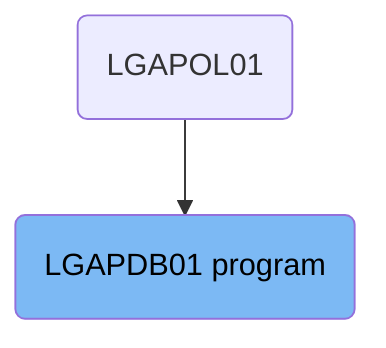

Here is a high level diagram of the program:

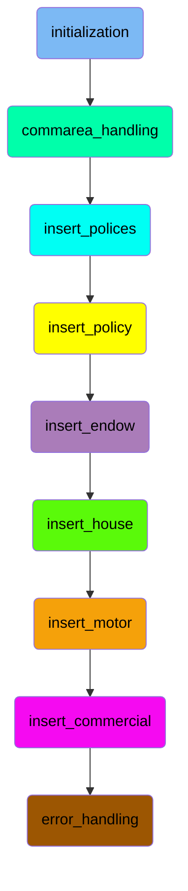

# initialization

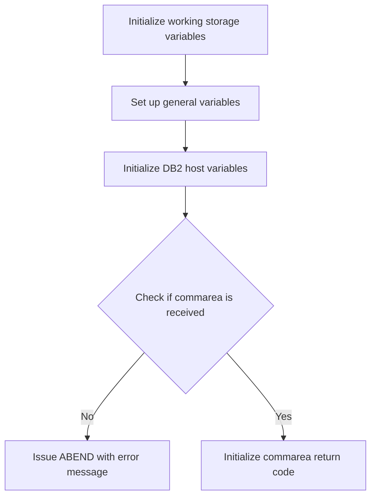

<SwmSnippet path="/base/src/lgapdb01.cbl" line="148">

---

## Initializing Working Storage Variables

First, the working storage variables are initialized to ensure that all necessary fields are set to their default values. This is crucial for maintaining data integrity throughout the transaction.

```cobol
      * initialize working storage variables
           INITIALIZE WS-HEADER.
```

---

</SwmSnippet>

<SwmSnippet path="/base/src/lgapdb01.cbl" line="151">

---

## Setting Up General Variables

Next, the transaction ID, terminal ID, task number, and communication area length are set up using the values from the CICS environment. These variables are essential for tracking the transaction and terminal details.

```cobol
           MOVE EIBTRNID TO WS-TRANSID.
           MOVE EIBTRMID TO WS-TERMID.
           MOVE EIBTASKN TO WS-TASKNUM.
           MOVE EIBCALEN TO WS-CALEN.
```

---

</SwmSnippet>

<SwmSnippet path="/base/src/lgapdb01.cbl" line="158">

---

## Initializing <SwmToken path="base/src/lgapdb01.cbl" pos="158:3:3" line-data="           INITIALIZE DB2-IN-INTEGERS.">`DB2`</SwmToken> Host Variables

Then, the <SwmToken path="base/src/lgapdb01.cbl" pos="158:3:3" line-data="           INITIALIZE DB2-IN-INTEGERS.">`DB2`</SwmToken> host variables are initialized to prepare for database operations. This step ensures that the variables used for database interactions are set to their default states.

```cobol
           INITIALIZE DB2-IN-INTEGERS.
           INITIALIZE DB2-OUT-INTEGERS.
```

---

</SwmSnippet>

<SwmSnippet path="/base/src/lgapdb01.cbl" line="165">

---

## Checking Communication Area

Moving to the next step, the code checks if the communication area length (<SwmToken path="base/src/lgapdb01.cbl" pos="165:3:3" line-data="           IF EIBCALEN IS EQUAL TO ZERO">`EIBCALEN`</SwmToken>) is zero. If no communication area is received, an error message is set, and an ABEND is issued to terminate the transaction with a specific error code.

```cobol
           IF EIBCALEN IS EQUAL TO ZERO
               MOVE ' NO COMMAREA RECEIVED' TO EM-VARIABLE
               PERFORM WRITE-ERROR-MESSAGE
               EXEC CICS ABEND ABCODE('LGCA') NODUMP END-EXEC
           END-IF
```

---

</SwmSnippet>

<SwmSnippet path="/base/src/lgapdb01.cbl" line="172">

---

## Initializing Commarea Return Code

Finally, the communication area return code is initialized to '00', indicating a successful operation. The address of the communication area is also set for further processing.

```cobol
           MOVE '00' TO CA-RETURN-CODE
           SET WS-ADDR-DFHCOMMAREA TO ADDRESS OF DFHCOMMAREA.
```

---

</SwmSnippet>

# commarea_handling

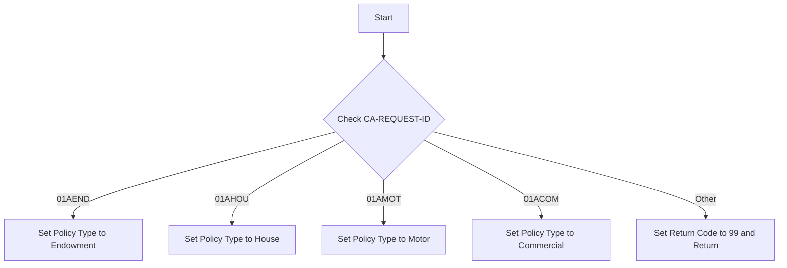

<SwmSnippet path="/base/src/lgapdb01.cbl" line="186">

---

## Handling Endowment Policy

First, we check if the <SwmToken path="base/src/lgapdb01.cbl" pos="223:3:7" line-data="           EVALUATE CA-REQUEST-ID">`CA-REQUEST-ID`</SwmToken> is <SwmToken path="base/src/lgapdb01.cbl" pos="186:4:4" line-data="             WHEN &#39;01AEND&#39;">`01AEND`</SwmToken>. If it is, we add the full endowment length to the required length and set the policy type to 'E' for endowment.

```cobol
             WHEN '01AEND'
               ADD WS-FULL-ENDOW-LEN TO WS-REQUIRED-CA-LEN
               MOVE 'E' TO DB2-POLICYTYPE
```

---

</SwmSnippet>

<SwmSnippet path="/base/src/lgapdb01.cbl" line="190">

---

## Handling House Policy

Next, we check if the <SwmToken path="base/src/lgapdb01.cbl" pos="223:3:7" line-data="           EVALUATE CA-REQUEST-ID">`CA-REQUEST-ID`</SwmToken> is <SwmToken path="base/src/lgapdb01.cbl" pos="190:4:4" line-data="             WHEN &#39;01AHOU&#39;">`01AHOU`</SwmToken>. If it is, we add the full house length to the required length and set the policy type to 'H' for house.

```cobol
             WHEN '01AHOU'
               ADD WS-FULL-HOUSE-LEN TO WS-REQUIRED-CA-LEN
               MOVE 'H' TO DB2-POLICYTYPE
```

---

</SwmSnippet>

<SwmSnippet path="/base/src/lgapdb01.cbl" line="194">

---

## Handling Motor Policy

Then, we check if the <SwmToken path="base/src/lgapdb01.cbl" pos="223:3:7" line-data="           EVALUATE CA-REQUEST-ID">`CA-REQUEST-ID`</SwmToken> is <SwmToken path="base/src/lgapdb01.cbl" pos="194:4:4" line-data="             WHEN &#39;01AMOT&#39;">`01AMOT`</SwmToken>. If it is, we add the full motor length to the required length and set the policy type to 'M' for motor.

```cobol
             WHEN '01AMOT'
               ADD WS-FULL-MOTOR-LEN TO WS-REQUIRED-CA-LEN
               MOVE 'M' TO DB2-POLICYTYPE
```

---

</SwmSnippet>

<SwmSnippet path="/base/src/lgapdb01.cbl" line="198">

---

## Handling Commercial Policy

Moving to the next step, we check if the <SwmToken path="base/src/lgapdb01.cbl" pos="223:3:7" line-data="           EVALUATE CA-REQUEST-ID">`CA-REQUEST-ID`</SwmToken> is <SwmToken path="base/src/lgapdb01.cbl" pos="198:4:4" line-data="             WHEN &#39;01ACOM&#39;">`01ACOM`</SwmToken>. If it is, we add the full commercial length to the required length and set the policy type to 'C' for commercial.

```cobol
             WHEN '01ACOM'
               ADD WS-FULL-COMM-LEN TO WS-REQUIRED-CA-LEN
               MOVE 'C' TO DB2-POLICYTYPE
```

---

</SwmSnippet>

<SwmSnippet path="/base/src/lgapdb01.cbl" line="202">

---

## Handling Unrecognized Requests

Finally, if the <SwmToken path="base/src/lgapdb01.cbl" pos="223:3:7" line-data="           EVALUATE CA-REQUEST-ID">`CA-REQUEST-ID`</SwmToken> does not match any of the recognized types, we set the return code to '99' indicating an unrecognized request and return.

```cobol
             WHEN OTHER
      *        Request is not recognised or supported
               MOVE '99' TO CA-RETURN-CODE
               EXEC CICS RETURN END-EXEC
```

---

</SwmSnippet>

## Interim Summary

So far, we saw the initialization process, including setting up working storage variables, general variables, <SwmToken path="base/src/lgapdb01.cbl" pos="158:3:3" line-data="           INITIALIZE DB2-IN-INTEGERS.">`DB2`</SwmToken> host variables, and handling the communication area. Now, we will focus on handling different policy types based on the <SwmToken path="base/src/lgapdb01.cbl" pos="223:3:7" line-data="           EVALUATE CA-REQUEST-ID">`CA-REQUEST-ID`</SwmToken>.

# insert_polices

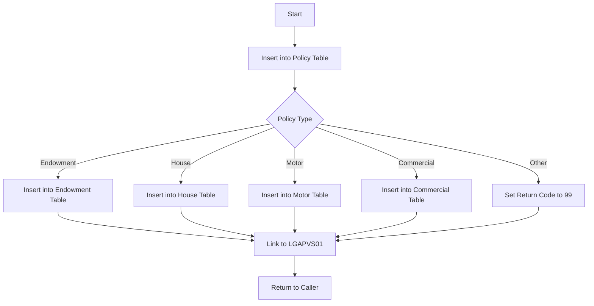

<SwmSnippet path="/base/src/lgapdb01.cbl" line="215">

---

## Performing the <SwmToken path="base/src/lgapdb01.cbl" pos="216:7:7" line-data="      *    Perform the INSERTs against appropriate tables              *">`INSERTs`</SwmToken> against appropriate tables

First, the <SwmToken path="base/src/lgapdb01.cbl" pos="219:3:5" line-data="           PERFORM INSERT-POLICY">`INSERT-POLICY`</SwmToken> procedure is called to insert a row into the policy table. This step ensures that the basic policy information is stored in the database.

```cobol
      *----------------------------------------------------------------*
      *    Perform the INSERTs against appropriate tables              *
      *----------------------------------------------------------------*
      *    Call procedure to Insert row in policy table
           PERFORM INSERT-POLICY

      *    Call appropriate routine to insert row to specific
      *    policy type table.
           EVALUATE CA-REQUEST-ID

             WHEN '01AEND'
               PERFORM INSERT-ENDOW

             WHEN '01AHOU'
               PERFORM INSERT-HOUSE

             WHEN '01AMOT'
               PERFORM INSERT-MOTOR

             WHEN '01ACOM'
               PERFORM INSERT-COMMERCIAL
```

---

</SwmSnippet>

<SwmSnippet path="/base/src/lgapdb01.cbl" line="223">

---

## Handling Different Policy Types

Next, the code evaluates the <SwmToken path="base/src/lgapdb01.cbl" pos="223:3:7" line-data="           EVALUATE CA-REQUEST-ID">`CA-REQUEST-ID`</SwmToken> to determine the specific type of policy. Depending on the policy type, it performs the corresponding insert operation into the appropriate table (e.g., endowment, house, motor, commercial). If the policy type is not recognized, it sets the return code to '99'.

```cobol
           EVALUATE CA-REQUEST-ID

             WHEN '01AEND'
               PERFORM INSERT-ENDOW

             WHEN '01AHOU'
               PERFORM INSERT-HOUSE

             WHEN '01AMOT'
               PERFORM INSERT-MOTOR

             WHEN '01ACOM'
               PERFORM INSERT-COMMERCIAL

             WHEN OTHER
      *        Request is not recognised or supported
               MOVE '99' TO CA-RETURN-CODE

           END-EVALUATE
```

---

</SwmSnippet>

<SwmSnippet path="/base/src/lgapdb01.cbl" line="243">

---

## Linking to <SwmToken path="base/src/lgapdb01.cbl" pos="243:9:9" line-data="             EXEC CICS Link Program(LGAPVS01)">`LGAPVS01`</SwmToken> Program

Then, the code links to the <SwmToken path="base/src/lgapdb01.cbl" pos="243:9:9" line-data="             EXEC CICS Link Program(LGAPVS01)">`LGAPVS01`</SwmToken> program, passing the communication area and its length. This step is crucial for further processing or validation of the inserted data.

More about <SwmToken path="base/src/lgapdb01.cbl" pos="243:9:9" line-data="             EXEC CICS Link Program(LGAPVS01)">`LGAPVS01`</SwmToken>: <SwmLink doc-title="Adding Policy Records (LGAPVS01)">[Adding Policy Records (LGAPVS01)](/.swm/adding-policy-records-lgapvs01.0wu1z4ci.sw.md)</SwmLink>

```cobol
             EXEC CICS Link Program(LGAPVS01)
                  Commarea(DFHCOMMAREA)
                LENGTH(32500)
             END-EXEC.
```

---

</SwmSnippet>

<SwmSnippet path="/base/src/lgapdb01.cbl" line="249">

---

## Returning to Caller

Finally, the code returns control to the caller, indicating the end of the mainline processing.

```cobol
      * Return to caller
           EXEC CICS RETURN END-EXEC.
```

---

</SwmSnippet>

# insert_policy

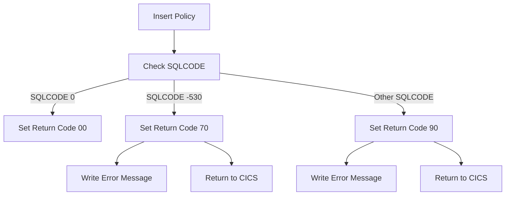

<SwmSnippet path="/base/src/lgapdb01.cbl" line="290">

---

## Handling SQLCODE conditions

Next, the code evaluates the <SwmToken path="base/src/lgapdb01.cbl" pos="290:3:3" line-data="           Evaluate SQLCODE">`SQLCODE`</SwmToken> to determine the outcome of the SQL INSERT operation. If <SwmToken path="base/src/lgapdb01.cbl" pos="290:3:3" line-data="           Evaluate SQLCODE">`SQLCODE`</SwmToken> is 0, it indicates a successful insertion, and the return code is set to '00'. If <SwmToken path="base/src/lgapdb01.cbl" pos="290:3:3" line-data="           Evaluate SQLCODE">`SQLCODE`</SwmToken> is -530, it indicates a foreign key constraint violation, and the return code is set to '70', followed by writing an error message and returning to CICS. For any other <SwmToken path="base/src/lgapdb01.cbl" pos="290:3:3" line-data="           Evaluate SQLCODE">`SQLCODE`</SwmToken>, the return code is set to '90', an error message is written, and the program returns to CICS.

```cobol
           Evaluate SQLCODE

             When 0
               MOVE '00' TO CA-RETURN-CODE

             When -530
               MOVE '70' TO CA-RETURN-CODE
               PERFORM WRITE-ERROR-MESSAGE
               EXEC CICS RETURN END-EXEC

             When Other
               MOVE '90' TO CA-RETURN-CODE
               PERFORM WRITE-ERROR-MESSAGE
               EXEC CICS RETURN END-EXEC

           END-Evaluate.
```

---

</SwmSnippet>

<SwmSnippet path="/base/src/lgapdb01.cbl" line="307">

---

## Retrieving Assigned Policy Number

Then, the code retrieves the value of the assigned policy number using the <SwmToken path="base/src/lgapdb01.cbl" pos="309:12:14" line-data="             SET :DB2-POLICYNUM-INT = IDENTITY_VAL_LOCAL()">`IDENTITY_VAL_LOCAL()`</SwmToken> function. This value is moved to <SwmToken path="base/src/lgapdb01.cbl" pos="311:11:15" line-data="           MOVE DB2-POLICYNUM-INT TO CA-POLICY-NUM">`CA-POLICY-NUM`</SwmToken> and also saved in the error message field <SwmToken path="base/src/lgapdb01.cbl" pos="313:11:13" line-data="           MOVE CA-POLICY-NUM TO EM-POLNUM">`EM-POLNUM`</SwmToken> in case it is required later.

```cobol
      *    get value of assigned policy number
           EXEC SQL
             SET :DB2-POLICYNUM-INT = IDENTITY_VAL_LOCAL()
           END-EXEC
           MOVE DB2-POLICYNUM-INT TO CA-POLICY-NUM
      *    and save in error msg field incase required
           MOVE CA-POLICY-NUM TO EM-POLNUM

```

---

</SwmSnippet>

<SwmSnippet path="/base/src/lgapdb01.cbl" line="315">

---

## Retrieving Assigned Timestamp

Finally, the code retrieves the value of the assigned timestamp for the newly inserted policy. This is done by selecting the <SwmToken path="base/src/lgapdb01.cbl" pos="317:3:3" line-data="             SELECT LASTCHANGED">`LASTCHANGED`</SwmToken> field from the <SwmToken path="base/src/lgapdb01.cbl" pos="319:3:3" line-data="               FROM POLICY">`POLICY`</SwmToken> table where the <SwmToken path="base/src/lgapdb01.cbl" pos="320:3:3" line-data="               WHERE POLICYNUMBER = :DB2-POLICYNUM-INT">`POLICYNUMBER`</SwmToken> matches the newly assigned policy number. The retrieved timestamp is stored in <SwmToken path="base/src/lgapdb01.cbl" pos="318:4:6" line-data="               INTO :CA-LASTCHANGED">`CA-LASTCHANGED`</SwmToken>.

```cobol
      *    get value of assigned Timestamp
           EXEC SQL
             SELECT LASTCHANGED
               INTO :CA-LASTCHANGED
               FROM POLICY
               WHERE POLICYNUMBER = :DB2-POLICYNUM-INT
           END-EXEC.
```

---

</SwmSnippet>

# insert_endow

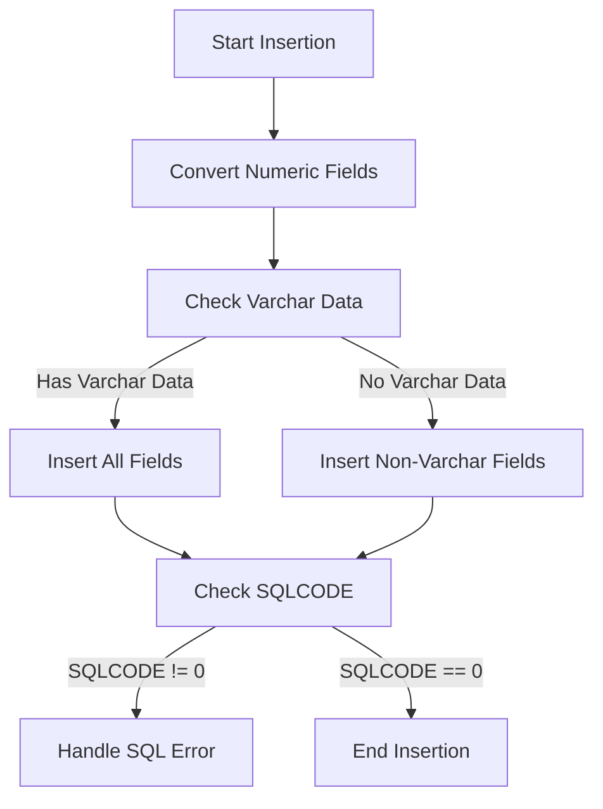

<SwmSnippet path="/base/src/lgapdb01.cbl" line="324">

---

## Handling the insertion of endowment data

First, the numeric fields <SwmToken path="base/src/lgapdb01.cbl" pos="330:3:7" line-data="           MOVE CA-E-TERM        TO DB2-E-TERM-SINT">`CA-E-TERM`</SwmToken> and <SwmToken path="base/src/lgapdb01.cbl" pos="331:3:9" line-data="           MOVE CA-E-SUM-ASSURED TO DB2-E-SUMASSURED-INT">`CA-E-SUM-ASSURED`</SwmToken> are converted to integer format to ensure they are in the correct format for the database insertion.

```cobol
      *================================================================*
      * Issue INSERT on endowment table using values passed in commarea*
      *================================================================*
       INSERT-ENDOW.

      *    Move numeric fields to integer format
           MOVE CA-E-TERM        TO DB2-E-TERM-SINT
           MOVE CA-E-SUM-ASSURED TO DB2-E-SUMASSURED-INT

           MOVE ' INSERT ENDOW ' TO EM-SQLREQ
      *----------------------------------------------------------------*
      *    There are 2 versions of INSERT...                           *
      *      one which updates all fields including Varchar            *
      *      one which updates all fields Except Varchar               *
      *----------------------------------------------------------------*
           SUBTRACT WS-REQUIRED-CA-LEN FROM EIBCALEN
               GIVING WS-VARY-LEN

           IF WS-VARY-LEN IS GREATER THAN ZERO
      *       Commarea contains data for Varchar field
              MOVE CA-E-PADDING-DATA
```

---

</SwmSnippet>

<SwmSnippet path="/base/src/lgapdb01.cbl" line="339">

---

Next, the length of the variable-length data is calculated by subtracting <SwmToken path="base/src/lgapdb01.cbl" pos="339:3:9" line-data="           SUBTRACT WS-REQUIRED-CA-LEN FROM EIBCALEN">`WS-REQUIRED-CA-LEN`</SwmToken> from <SwmToken path="base/src/lgapdb01.cbl" pos="339:13:13" line-data="           SUBTRACT WS-REQUIRED-CA-LEN FROM EIBCALEN">`EIBCALEN`</SwmToken>, resulting in <SwmToken path="base/src/lgapdb01.cbl" pos="340:3:7" line-data="               GIVING WS-VARY-LEN">`WS-VARY-LEN`</SwmToken>. This determines if there is any varchar data to be inserted.

```cobol
           SUBTRACT WS-REQUIRED-CA-LEN FROM EIBCALEN
               GIVING WS-VARY-LEN

```

---

</SwmSnippet>

<SwmSnippet path="/base/src/lgapdb01.cbl" line="342">

---

If <SwmToken path="base/src/lgapdb01.cbl" pos="342:3:7" line-data="           IF WS-VARY-LEN IS GREATER THAN ZERO">`WS-VARY-LEN`</SwmToken> is greater than zero, indicating that there is varchar data, the varchar data from <SwmToken path="base/src/lgapdb01.cbl" pos="344:3:9" line-data="              MOVE CA-E-PADDING-DATA">`CA-E-PADDING-DATA`</SwmToken> is moved to <SwmToken path="base/src/lgapdb01.cbl" pos="345:3:7" line-data="                  TO WS-VARY-CHAR(1:WS-VARY-LEN)">`WS-VARY-CHAR`</SwmToken>. Then, an SQL INSERT statement is executed to insert all fields, including the varchar field, into the <SwmToken path="base/src/lgapdb01.cbl" pos="347:5:5" line-data="                INSERT INTO ENDOWMENT">`ENDOWMENT`</SwmToken> table.

```cobol
           IF WS-VARY-LEN IS GREATER THAN ZERO
      *       Commarea contains data for Varchar field
              MOVE CA-E-PADDING-DATA
                  TO WS-VARY-CHAR(1:WS-VARY-LEN)
              EXEC SQL
                INSERT INTO ENDOWMENT
                          ( POLICYNUMBER,
                            WITHPROFITS,
                            EQUITIES,
                            MANAGEDFUND,
                            FUNDNAME,
                            TERM,
                            SUMASSURED,
                            LIFEASSURED,
                            PADDINGDATA    )
                   VALUES ( :DB2-POLICYNUM-INT,
                            :CA-E-WITH-PROFITS,
                            :CA-E-EQUITIES,
                            :CA-E-MANAGED-FUND,
                            :CA-E-FUND-NAME,
                            :DB2-E-TERM-SINT,
```

---

</SwmSnippet>

<SwmSnippet path="/base/src/lgapdb01.cbl" line="367">

---

If there is no varchar data, an SQL INSERT statement is executed to insert all fields except the varchar field into the <SwmToken path="base/src/lgapdb01.cbl" pos="369:5:5" line-data="                INSERT INTO ENDOWMENT">`ENDOWMENT`</SwmToken> table.

```cobol
           ELSE
              EXEC SQL
                INSERT INTO ENDOWMENT
                          ( POLICYNUMBER,
                            WITHPROFITS,
                            EQUITIES,
                            MANAGEDFUND,
                            FUNDNAME,
                            TERM,
                            SUMASSURED,
                            LIFEASSURED    )
                   VALUES ( :DB2-POLICYNUM-INT,
                            :CA-E-WITH-PROFITS,
                            :CA-E-EQUITIES,
                            :CA-E-MANAGED-FUND,
                            :CA-E-FUND-NAME,
                            :DB2-E-TERM-SINT,
                            :DB2-E-SUMASSURED-INT,
                            :CA-E-LIFE-ASSURED )
              END-EXEC
```

---

</SwmSnippet>

<SwmSnippet path="/base/src/lgapdb01.cbl" line="389">

---

Finally, if the SQLCODE is not equal to zero, indicating an error, the return code <SwmToken path="base/src/lgapdb01.cbl" pos="390:9:13" line-data="             MOVE &#39;90&#39; TO CA-RETURN-CODE">`CA-RETURN-CODE`</SwmToken> is set to '90', an error message is written, and an ABEND is issued to back out the update to the policy table. The program then returns control to CICS.

```cobol
           IF SQLCODE NOT EQUAL 0
             MOVE '90' TO CA-RETURN-CODE
             PERFORM WRITE-ERROR-MESSAGE
      *      Issue Abend to cause backout of update to Policy table
             EXEC CICS ABEND ABCODE('LGSQ') NODUMP END-EXEC
             EXEC CICS RETURN END-EXEC
           END-IF.
```

---

</SwmSnippet>

# insert_house

This is the next section of the flow.

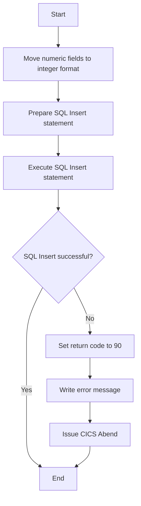

<SwmSnippet path="/base/src/lgapdb01.cbl" line="405">

---

## Moving numeric fields to integer format

First, we move the numeric fields from the communication area to integer format fields. This ensures that the data types match the database schema requirements for the <SwmToken path="base/src/lgapdb01.cbl" pos="219:3:3" line-data="           PERFORM INSERT-POLICY">`INSERT`</SwmToken> operation.

```cobol
           MOVE CA-H-VALUE       TO DB2-H-VALUE-INT
           MOVE CA-H-BEDROOMS    TO DB2-H-BEDROOMS-SINT
```

---

</SwmSnippet>

<SwmSnippet path="/base/src/lgapdb01.cbl" line="408">

---

## Preparing SQL Insert statement

Next, we prepare the SQL <SwmToken path="base/src/lgapdb01.cbl" pos="408:5:5" line-data="           MOVE &#39; INSERT HOUSE &#39; TO EM-SQLREQ">`INSERT`</SwmToken> statement by moving the SQL command into the <SwmToken path="base/src/lgapdb01.cbl" pos="408:13:15" line-data="           MOVE &#39; INSERT HOUSE &#39; TO EM-SQLREQ">`EM-SQLREQ`</SwmToken> variable. This sets up the command that will be executed to insert the house data into the database.

```cobol
           MOVE ' INSERT HOUSE ' TO EM-SQLREQ
```

---

</SwmSnippet>

<SwmSnippet path="/base/src/lgapdb01.cbl" line="409">

---

## Executing SQL Insert statement

Then, we execute the SQL <SwmToken path="base/src/lgapdb01.cbl" pos="410:1:1" line-data="             INSERT INTO HOUSE">`INSERT`</SwmToken> statement to add the house data into the <SwmToken path="base/src/lgapdb01.cbl" pos="410:5:5" line-data="             INSERT INTO HOUSE">`HOUSE`</SwmToken> table. The values are taken from the communication area and the integer format fields.

```cobol
           EXEC SQL
             INSERT INTO HOUSE
                       ( POLICYNUMBER,
                         PROPERTYTYPE,
                         BEDROOMS,
                         VALUE,
                         HOUSENAME,
                         HOUSENUMBER,
                         POSTCODE          )
                VALUES ( :DB2-POLICYNUM-INT,
                         :CA-H-PROPERTY-TYPE,
                         :DB2-H-BEDROOMS-SINT,
                         :DB2-H-VALUE-INT,
                         :CA-H-HOUSE-NAME,
                         :CA-H-HOUSE-NUMBER,
                         :CA-H-POSTCODE      )
           END-EXEC
```

---

</SwmSnippet>

<SwmSnippet path="/base/src/lgapdb01.cbl" line="389">

---

## Handling SQL Insert errors

If the SQL <SwmToken path="base/src/lgapdb01.cbl" pos="219:3:3" line-data="           PERFORM INSERT-POLICY">`INSERT`</SwmToken> operation fails (i.e., <SwmToken path="base/src/lgapdb01.cbl" pos="427:3:3" line-data="           IF SQLCODE NOT EQUAL 0">`SQLCODE`</SwmToken> is not equal to 0), we set the return code to '90', perform error handling by writing an error message, and issue a CICS <SwmToken path="base/src/lgapdb01.cbl" pos="431:5:5" line-data="             EXEC CICS ABEND ABCODE(&#39;LGSQ&#39;) NODUMP END-EXEC">`ABEND`</SwmToken> to back out the update to the <SwmToken path="base/src/lgapdb01.cbl" pos="430:19:19" line-data="      *      Issue Abend to cause backout of update to Policy table">`Policy`</SwmToken> table. This ensures data consistency and proper error reporting.

```cobol
           IF SQLCODE NOT EQUAL 0
             MOVE '90' TO CA-RETURN-CODE
             PERFORM WRITE-ERROR-MESSAGE
      *      Issue Abend to cause backout of update to Policy table
             EXEC CICS ABEND ABCODE('LGSQ') NODUMP END-EXEC
             EXEC CICS RETURN END-EXEC
           END-IF.
```

---

</SwmSnippet>

# insert_motor

This is the next section of the flow.

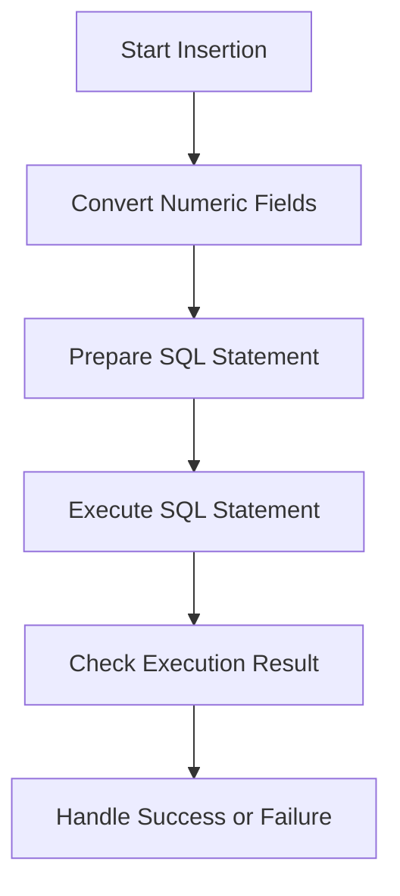

<SwmSnippet path="/base/src/lgapdb01.cbl" line="442">

---

## Converting Numeric Fields

First, we convert the numeric fields to integer format to ensure they are in the correct format for the database insertion. This is done by moving <SwmToken path="base/src/lgapdb01.cbl" pos="443:3:7" line-data="           MOVE CA-M-VALUE       TO DB2-M-VALUE-INT">`CA-M-VALUE`</SwmToken> to <SwmToken path="base/src/lgapdb01.cbl" pos="443:11:17" line-data="           MOVE CA-M-VALUE       TO DB2-M-VALUE-INT">`DB2-M-VALUE-INT`</SwmToken>.

```cobol
      *    Move numeric fields to integer format
           MOVE CA-M-VALUE       TO DB2-M-VALUE-INT
```

---

</SwmSnippet>

<SwmSnippet path="/base/src/lgapdb01.cbl" line="444">

---

## Preparing SQL Statement

Next, we prepare the SQL statement for inserting the motor policy data into the database. This involves setting up the necessary SQL command with the appropriate values.

```cobol
           MOVE CA-M-CC          TO DB2-M-CC-SINT
           MOVE CA-M-PREMIUM     TO DB2-M-PREMIUM-INT
```

---

</SwmSnippet>

<SwmSnippet path="/base/src/lgapdb01.cbl" line="446">

---

## Executing SQL Statement

Then, we execute the SQL statement to insert the data into the motor table. This step is crucial as it performs the actual insertion of the policy data into the database.

```cobol
           MOVE CA-M-ACCIDENTS   TO DB2-M-ACCIDENTS-INT

```

---

</SwmSnippet>

<SwmSnippet path="/base/src/lgapdb01.cbl" line="448">

---

## Checking Execution Result

After executing the SQL statement, we check the result to determine if the insertion was successful or if there were any errors. This helps in handling any issues that might arise during the insertion process.

```cobol
           MOVE ' INSERT MOTOR ' TO EM-SQLREQ
           EXEC SQL
```

---

</SwmSnippet>

<SwmSnippet path="/base/src/lgapdb01.cbl" line="450">

---

## Handling Success or Failure

Finally, based on the result of the SQL execution, we handle the success or failure of the insertion. This might involve logging the result, updating the user interface, or triggering other business logic.

```cobol
             INSERT INTO MOTOR
                       ( POLICYNUMBER,
```

---

</SwmSnippet>

# insert_commercial

This is the next section of the flow.

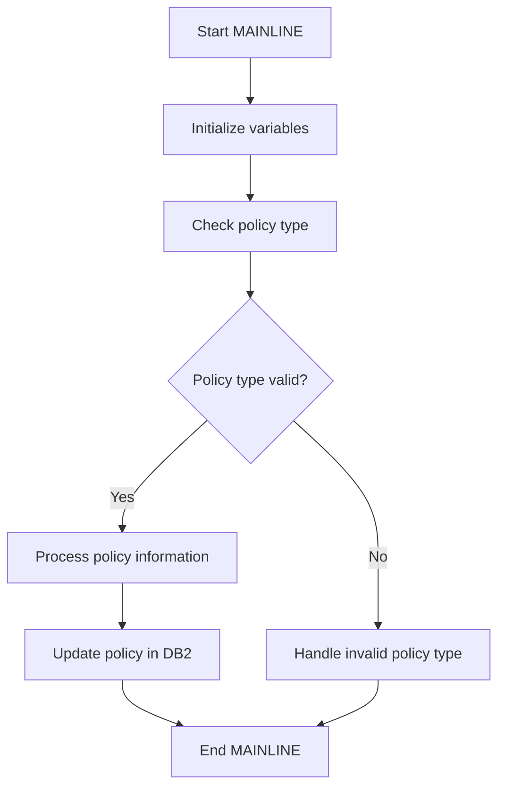

<SwmSnippet path="/base/src/lgapdb01.cbl" line="482">

---

## Initializing Variables

First, the MAINLINE function initializes necessary variables. This step sets up the environment for processing policy information by ensuring all required variables are ready for use.

```cobol

      *================================================================*
      * Issue INSERT on commercial table with values passed in commarea*
      *================================================================*
       INSERT-COMMERCIAL.

           MOVE CA-B-FirePeril       To DB2-B-FirePeril-Int
           MOVE CA-B-FirePremium     To DB2-B-FirePremium-Int
           MOVE CA-B-CrimePeril      To DB2-B-CrimePeril-Int
```

---

</SwmSnippet>

<SwmSnippet path="/base/src/lgapdb01.cbl" line="491">

---

## Checking Policy Type

Next, the function checks the type of policy being processed. This is crucial as different policy types may require different handling procedures. The check ensures that the policy type is valid and can be processed further.

```cobol
           MOVE CA-B-CrimePremium    To DB2-B-CrimePremium-Int
           MOVE CA-B-FloodPeril      To DB2-B-FloodPeril-Int
           MOVE CA-B-FloodPremium    To DB2-B-FloodPremium-Int
           MOVE CA-B-WeatherPeril    To DB2-B-WeatherPeril-Int
           MOVE CA-B-WeatherPremium  To DB2-B-WeatherPremium-Int
           MOVE CA-B-Status          To DB2-B-Status-Int

           MOVE ' INSERT COMMER' TO EM-SQLREQ
           EXEC SQL
             INSERT INTO COMMERCIAL
```

---

</SwmSnippet>

<SwmSnippet path="/base/src/lgapdb01.cbl" line="501">

---

## Processing Policy Information

Then, the function processes the policy information. This involves various operations such as validating the policy details, calculating premiums, and preparing the data for database operations. This step is essential for ensuring that the policy information is accurate and ready for storage.

```cobol
                       (
                         PolicyNumber,
                         RequestDate,
                         StartDate,
                         RenewalDate,
                         Address,
                         Zipcode,
                         LatitudeN,
                         LongitudeW,
                         Customer,
                         PropertyType,
                         FirePeril,
                         FirePremium,
                         CrimePeril,
                         CrimePremium,
                         FloodPeril,
                         FloodPremium,
                         WeatherPeril,
                         WeatherPremium,
                         Status,
```

---

</SwmSnippet>

<SwmSnippet path="/base/src/lgapdb01.cbl" line="521">

---

## Updating Policy in <SwmToken path="base/src/lgapdb01.cbl" pos="524:2:2" line-data="                         :DB2-POLICYNUM-INT,">`DB2`</SwmToken>

Moving to the next step, the function updates the policy information in the <SwmToken path="base/src/lgapdb01.cbl" pos="524:2:2" line-data="                         :DB2-POLICYNUM-INT,">`DB2`</SwmToken> database. This involves executing SQL statements to insert or update the policy records. Ensuring that the policy data is correctly stored in the database is critical for maintaining data integrity.

```cobol
                         RejectionReason
                                             )
                VALUES (
                         :DB2-POLICYNUM-INT,
                         :CA-LASTCHANGED,
                         :CA-ISSUE-DATE,
                         :CA-EXPIRY-DATE,
                         :CA-B-Address,
                         :CA-B-Postcode,
                         :CA-B-Latitude,
                         :CA-B-Longitude,
                         :CA-B-Customer,
                         :CA-B-PropType,
                         :DB2-B-FirePeril-Int,
                         :DB2-B-FirePremium-Int,
                         :DB2-B-CrimePeril-Int,
                         :DB2-B-CrimePremium-Int,
                         :DB2-B-FloodPeril-Int,
                         :DB2-B-FloodPremium-Int,
                         :DB2-B-WeatherPeril-Int,
```

---

</SwmSnippet>

<SwmSnippet path="/base/src/lgapdb01.cbl" line="541">

---

## Handling Invalid Policy Type

Finally, if the policy type is invalid, the function handles this scenario by logging an error or taking appropriate actions. This ensures that invalid policies do not disrupt the system and are properly managed.

```cobol
                         :DB2-B-WeatherPremium-Int,
                         :DB2-B-Status-Int,
                         :CA-B-RejectReason
                                             )
           END-EXEC

           IF SQLCODE NOT EQUAL 0
             MOVE '90' TO CA-RETURN-CODE
             PERFORM WRITE-ERROR-MESSAGE
      *      Issue Abend to cause backout of update to Policy table
             EXEC CICS ABEND ABCODE('LGSQ') NODUMP END-EXEC
             EXEC CICS RETURN END-EXEC
           END-IF.

           EXIT.

```

---

</SwmSnippet>

# error_handling

This is the next section of the flow.

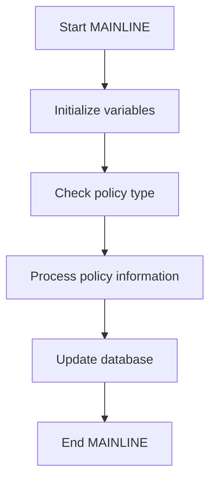

<SwmSnippet path="/base/src/lgapdb01.cbl" line="557">

---

## Processing policy information

First, the MAINLINE function initializes necessary variables and checks the type of policy being processed. Depending on the policy type, it processes the policy information accordingly. This involves updating the database with the new or modified policy details.

```cobol
      *================================================================*
      * Procedure to write error message to Queues                     *
      *   message will include Date, Time, Program Name, Customer      *
      *   Number, Policy Number and SQLCODE.                           *
      *================================================================*
       WRITE-ERROR-MESSAGE.
      * Save SQLCODE in message
           MOVE SQLCODE TO EM-SQLRC
      * Obtain and format current time and date
           EXEC CICS ASKTIME ABSTIME(ABS-TIME)
           END-EXEC
           EXEC CICS FORMATTIME ABSTIME(ABS-TIME)
                     MMDDYYYY(DATE1)
                     TIME(TIME1)
           END-EXEC
           MOVE DATE1 TO EM-DATE
           MOVE TIME1 TO EM-TIME
      * Write output message to TDQ
           EXEC CICS LINK PROGRAM('LGSTSQ')
                     COMMAREA(ERROR-MSG)
                     LENGTH(LENGTH OF ERROR-MSG)
```

---

</SwmSnippet>

<SwmSnippet path="/base/src/lgapdb01.cbl" line="560">

---

### Checking policy type

Next, the function checks the type of policy to determine the appropriate processing steps. This ensures that each policy type is handled correctly according to its specific requirements.

```cobol
      *   Number, Policy Number and SQLCODE.                           *
      *================================================================*
       WRITE-ERROR-MESSAGE.
      * Save SQLCODE in message
           MOVE SQLCODE TO EM-SQLRC
      * Obtain and format current time and date
           EXEC CICS ASKTIME ABSTIME(ABS-TIME)
           END-EXEC
           EXEC CICS FORMATTIME ABSTIME(ABS-TIME)
                     MMDDYYYY(DATE1)
                     TIME(TIME1)
```

---

</SwmSnippet>

<SwmSnippet path="/base/src/lgapdb01.cbl" line="580">

---

### Updating the database

Then, the function updates the database with the processed policy information. This step is crucial as it ensures that the policy details are accurately stored and can be retrieved for future reference.

```cobol
           IF EIBCALEN > 0 THEN
             IF EIBCALEN < 91 THEN
               MOVE DFHCOMMAREA(1:EIBCALEN) TO CA-DATA
               EXEC CICS LINK PROGRAM('LGSTSQ')
                         COMMAREA(CA-ERROR-MSG)
                         LENGTH(LENGTH OF CA-ERROR-MSG)
               END-EXEC
             ELSE
               MOVE DFHCOMMAREA(1:90) TO CA-DATA
               EXEC CICS LINK PROGRAM('LGSTSQ')
                         COMMAREA(CA-ERROR-MSG)
```

---

</SwmSnippet>

&nbsp;

*This is an auto-generated document by Swimm 🌊 and has not yet been verified by a human*

<SwmMeta version="3.0.0" repo-id="Z2l0aHViJTNBJTNBa3luZHJ5bC1jaWNzLWdlbmFwcCUzQSUzQVN3aW1tLURlbW8=" repo-name="kyndryl-cics-genapp"><sup>Powered by [Swimm](https://app.swimm.io/)</sup></SwmMeta>
