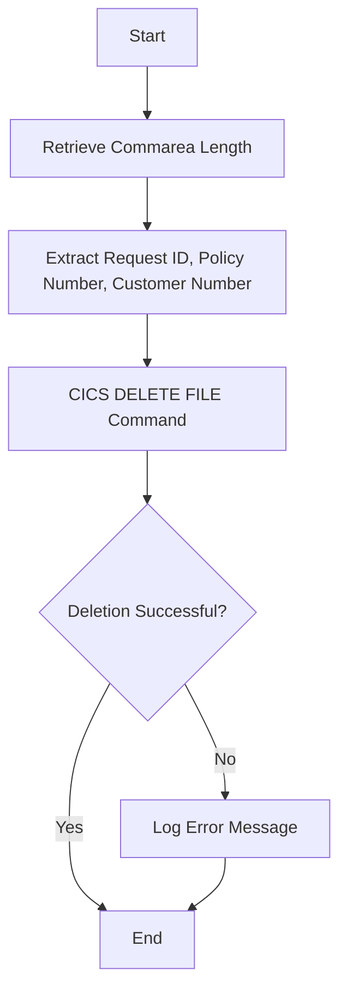

This document will cover the <SwmToken path="base/src/lgdpvs01.cbl" pos="11:6:6" line-data="       PROGRAM-ID. LGDPVS01.">`LGDPVS01`</SwmToken> program. We'll cover:

1. What the Program Does
2. Program Flow
3. Program Sections

## What the Program Does

The <SwmToken path="base/src/lgdpvs01.cbl" pos="11:6:6" line-data="       PROGRAM-ID. LGDPVS01.">`LGDPVS01`</SwmToken> program is designed to delete a policy record from a VSAM Key-Sequenced Data Set (KSDS). The program retrieves policy information from the communication area, constructs the key for the policy record, and then issues a CICS DELETE FILE command to remove the record. If the deletion is unsuccessful, it logs an error message and returns control to CICS.

## Program Flow

The program flow of <SwmToken path="base/src/lgdpvs01.cbl" pos="11:6:6" line-data="       PROGRAM-ID. LGDPVS01.">`LGDPVS01`</SwmToken> is as follows:

1. Retrieve the length of the communication area.
2. Extract the request ID, policy number, and customer number from the communication area.
3. Issue a CICS DELETE FILE command to delete the policy record from the VSAM KSDS.
4. If the deletion is unsuccessful, log an error message and return control to CICS.



<SwmSnippet path="/base/src/lgdpvs01.cbl" line="69">

---

## Program Sections

First, the program retrieves the length of the communication area and stores it in <SwmToken path="base/src/lgdpvs01.cbl" pos="75:7:11" line-data="           Move EIBCALEN To WS-Commarea-Len.">`WS-Commarea-Len`</SwmToken>.

```cobol
       PROCEDURE DIVISION.

      *---------------------------------------------------------------*
       MAINLINE SECTION.
      *
      *---------------------------------------------------------------*
           Move EIBCALEN To WS-Commarea-Len.
```

---

</SwmSnippet>

<SwmSnippet path="/base/src/lgdpvs01.cbl" line="77">

---

Now, the program extracts the request ID, policy number, and customer number from the communication area and stores them in <SwmToken path="base/src/lgdpvs01.cbl" pos="77:16:20" line-data="           Move CA-Request-ID(4:1) To WF-Request-ID">`WF-Request-ID`</SwmToken>, <SwmToken path="base/src/lgdpvs01.cbl" pos="78:11:15" line-data="           Move CA-Policy-Num      To WF-Policy-Num">`WF-Policy-Num`</SwmToken>, and <SwmToken path="base/src/lgdpvs01.cbl" pos="79:11:15" line-data="           Move CA-Customer-Num    To WF-Customer-Num">`WF-Customer-Num`</SwmToken> respectively.

```cobol
           Move CA-Request-ID(4:1) To WF-Request-ID
           Move CA-Policy-Num      To WF-Policy-Num
           Move CA-Customer-Num    To WF-Customer-Num
```

---

</SwmSnippet>

<SwmSnippet path="/base/src/lgdpvs01.cbl" line="81">

---

Then, the program issues a CICS DELETE FILE command to delete the policy record from the VSAM KSDS. If the deletion is unsuccessful, it moves the response codes to <SwmToken path="base/src/lgdpvs01.cbl" pos="84:3:5" line-data="                     RESP(WS-RESP)">`WS-RESP`</SwmToken> and <SwmToken path="base/src/lgdpvs01.cbl" pos="87:7:9" line-data="             Move EIBRESP2 To WS-RESP2">`WS-RESP2`</SwmToken>, sets the return code to '81', and performs the <SwmToken path="base/src/lgdpvs01.cbl" pos="89:3:7" line-data="             PERFORM WRITE-ERROR-MESSAGE">`WRITE-ERROR-MESSAGE`</SwmToken> section.

```cobol
           Exec CICS Delete File('KSDSPOLY')
                     Ridfld(WF-Policy-Key)
                     KeyLength(21)
                     RESP(WS-RESP)
           End-Exec.
           If WS-RESP Not = DFHRESP(NORMAL)
             Move EIBRESP2 To WS-RESP2
             MOVE '81' TO CA-RETURN-CODE
             PERFORM WRITE-ERROR-MESSAGE
             EXEC CICS RETURN END-EXEC
           End-If.
```

---

</SwmSnippet>

<SwmSnippet path="/base/src/lgdpvs01.cbl" line="99">

---

Going into the <SwmToken path="base/src/lgdpvs01.cbl" pos="99:1:5" line-data="       WRITE-ERROR-MESSAGE.">`WRITE-ERROR-MESSAGE`</SwmToken> section, the program logs the error message by retrieving the current date and time, populating the error message structure, and linking to the <SwmToken path="base/src/lgdpvs01.cbl" pos="113:10:10" line-data="           EXEC CICS LINK PROGRAM(&#39;LGSTSQ&#39;)">`LGSTSQ`</SwmToken> program to handle the error message.

```cobol
       WRITE-ERROR-MESSAGE.
           EXEC CICS ASKTIME ABSTIME(WS-ABSTIME)
           END-EXEC
           EXEC CICS FORMATTIME ABSTIME(WS-ABSTIME)
                     MMDDYYYY(WS-DATE)
                     TIME(WS-TIME)
           END-EXEC
      *
           MOVE WS-DATE TO EM-DATE
           MOVE WS-TIME TO EM-TIME
           Move CA-Customer-Num To EM-CUSNUM 
           Move CA-POLICY-NUM To EM-POLNUM 
           Move WS-RESP         To EM-RespRC
           Move WS-RESP2        To EM-Resp2RC
           EXEC CICS LINK PROGRAM('LGSTSQ')
                     COMMAREA(ERROR-MSG)
                     LENGTH(LENGTH OF ERROR-MSG)
           END-EXEC.
           IF EIBCALEN > 0 THEN
             IF EIBCALEN < 91 THEN
               MOVE DFHCOMMAREA(1:EIBCALEN) TO CA-DATA
```

---

</SwmSnippet>

&nbsp;

*This is an auto-generated document by Swimm 🌊 and has not yet been verified by a human*

<SwmMeta version="3.0.0" repo-id="Z2l0aHViJTNBJTNBa3luZHJ5bC1jaWNzLWdlbmFwcCUzQSUzQVN3aW1tLURlbW8=" repo-name="kyndryl-cics-genapp"><sup>Powered by [Swimm](/)</sup></SwmMeta>
