The <SwmToken path="base/src/lgipdb01.cbl" pos="13:6:6" line-data="       PROGRAM-ID. LGIPDB01.">`LGIPDB01`</SwmToken> program is responsible for retrieving and processing policy information from an IBM Db2 database. It is used in a flow starting from the <SwmToken path="/base/src/lgipol01.cbl" pos="13:6:6" line-data="       PROGRAM-ID. LGIPOL01.">`LGIPOL01`</SwmToken> program. The program initializes working storage and <SwmToken path="base/src/lgipdb01.cbl" pos="242:5:5" line-data="      * initialize DB2 host variables">`DB2`</SwmToken> host variables, sets up general variables, checks if the communication area is received, and processes various types of policies by retrieving corresponding information from the database.

The <SwmToken path="base/src/lgipdb01.cbl" pos="13:6:6" line-data="       PROGRAM-ID. LGIPDB01.">`LGIPDB01`</SwmToken> program starts by initializing necessary variables and setting up general transaction identifiers. It then checks if the communication area is received and processes different types of policies by retrieving information from the Db2 database. Depending on the policy type, it performs specific retrieval operations and moves the data into the communication area for further use. The program also handles errors and logs messages if any issues occur during the process.

# Where is this program used?

This program is used once, in a flow starting from <SwmToken path="/base/src/lgipol01.cbl" pos="13:6:6" line-data="       PROGRAM-ID. LGIPOL01.">`LGIPOL01`</SwmToken> as represented in the following diagram:

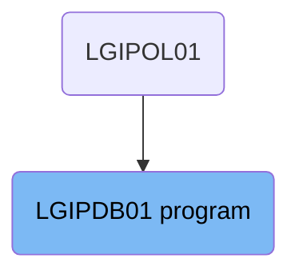

Here is a high level diagram of the program:

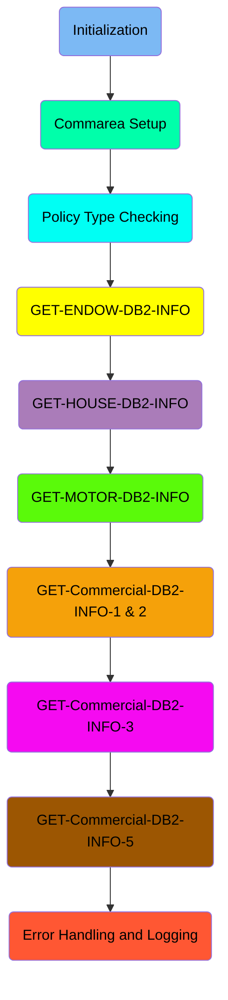

# Initialization

<SwmSnippet path="/base/src/lgipdb01.cbl" line="235">

---

## Initializing Working Storage Variables

First, we initialize the working storage variables by calling <SwmToken path="base/src/lgipdb01.cbl" pos="236:1:5" line-data="           INITIALIZE WS-HEADER.">`INITIALIZE WS-HEADER`</SwmToken>. This step ensures that all the necessary variables are reset and ready for the transaction processing.

```cobol
      * initialize working storage variables
           INITIALIZE WS-HEADER.
```

---

</SwmSnippet>

<SwmSnippet path="/base/src/lgipdb01.cbl" line="237">

---

## Setting Up General Variables

Next, we set up general variables by moving values from <SwmToken path="base/src/lgipdb01.cbl" pos="238:3:3" line-data="           MOVE EIBTRNID TO WS-TRANSID.">`EIBTRNID`</SwmToken>, <SwmToken path="base/src/lgipdb01.cbl" pos="239:3:3" line-data="           MOVE EIBTRMID TO WS-TERMID.">`EIBTRMID`</SwmToken>, and <SwmToken path="base/src/lgipdb01.cbl" pos="240:3:3" line-data="           MOVE EIBTASKN TO WS-TASKNUM.">`EIBTASKN`</SwmToken> to <SwmToken path="base/src/lgipdb01.cbl" pos="238:7:9" line-data="           MOVE EIBTRNID TO WS-TRANSID.">`WS-TRANSID`</SwmToken>, <SwmToken path="base/src/lgipdb01.cbl" pos="239:7:9" line-data="           MOVE EIBTRMID TO WS-TERMID.">`WS-TERMID`</SwmToken>, and <SwmToken path="base/src/lgipdb01.cbl" pos="240:7:9" line-data="           MOVE EIBTASKN TO WS-TASKNUM.">`WS-TASKNUM`</SwmToken> respectively. These variables hold important transaction, terminal, and task identifiers required for processing.

```cobol
      * set up general variable
           MOVE EIBTRNID TO WS-TRANSID.
           MOVE EIBTRMID TO WS-TERMID.
           MOVE EIBTASKN TO WS-TASKNUM.
```

---

</SwmSnippet>

<SwmSnippet path="/base/src/lgipdb01.cbl" line="242">

---

## Initializing <SwmToken path="base/src/lgipdb01.cbl" pos="242:5:5" line-data="      * initialize DB2 host variables">`DB2`</SwmToken> Host Variables

Then, we initialize the <SwmToken path="base/src/lgipdb01.cbl" pos="242:5:5" line-data="      * initialize DB2 host variables">`DB2`</SwmToken> host variables by calling <SwmToken path="base/src/lgipdb01.cbl" pos="243:1:7" line-data="           INITIALIZE DB2-IN-INTEGERS.">`INITIALIZE DB2-IN-INTEGERS`</SwmToken>, <SwmToken path="base/src/lgipdb01.cbl" pos="244:1:7" line-data="           INITIALIZE DB2-OUT-INTEGERS.">`INITIALIZE DB2-OUT-INTEGERS`</SwmToken>, and <SwmToken path="base/src/lgipdb01.cbl" pos="245:1:5" line-data="           INITIALIZE DB2-POLICY.">`INITIALIZE DB2-POLICY`</SwmToken>. This step prepares the <SwmToken path="base/src/lgipdb01.cbl" pos="242:5:5" line-data="      * initialize DB2 host variables">`DB2`</SwmToken> variables for database operations.

```cobol
      * initialize DB2 host variables
           INITIALIZE DB2-IN-INTEGERS.
           INITIALIZE DB2-OUT-INTEGERS.
           INITIALIZE DB2-POLICY.
```

---

</SwmSnippet>

# Commarea Setup

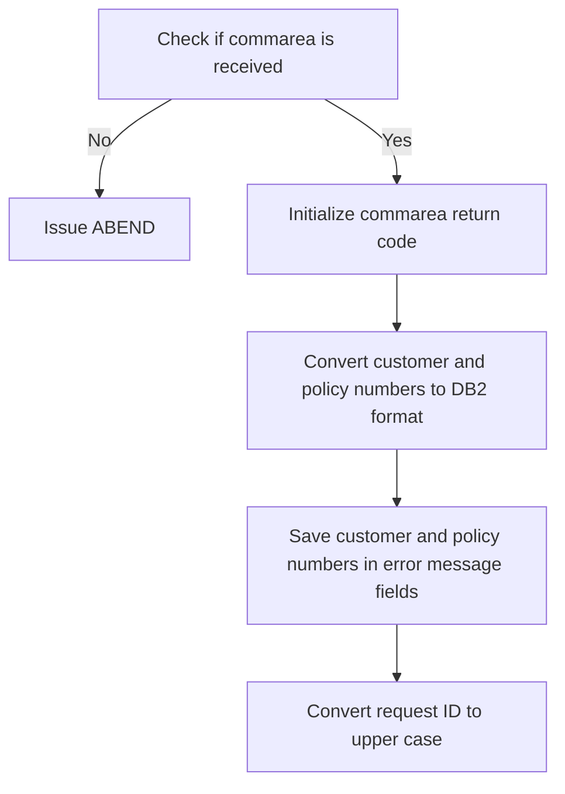

<SwmSnippet path="/base/src/lgipdb01.cbl" line="251">

---

## Checking if commarea is received

First, we check if the communication area (<SwmToken path="base/src/lgipdb01.cbl" pos="373:9:9" line-data="      *      Calculate size of commarea required to return all data">`commarea`</SwmToken>) is received by verifying if <SwmToken path="base/src/lgipdb01.cbl" pos="251:3:3" line-data="           IF EIBCALEN IS EQUAL TO ZERO">`EIBCALEN`</SwmToken> is zero. If no <SwmToken path="base/src/lgipdb01.cbl" pos="373:9:9" line-data="      *      Calculate size of commarea required to return all data">`commarea`</SwmToken> is received, an error message is written and an ABEND is issued with the code 'LGCA'. This ensures that the program does not proceed without the necessary communication area data.

```cobol
           IF EIBCALEN IS EQUAL TO ZERO
             MOVE ' NO COMMAREA RECEIVED' TO EM-VARIABLE
             PERFORM WRITE-ERROR-MESSAGE
             EXEC CICS ABEND ABCODE('LGCA') NODUMP END-EXEC
           END-IF
```

---

</SwmSnippet>

<SwmSnippet path="/base/src/lgipdb01.cbl" line="258">

---

## Initializing commarea return code

Next, we initialize the <SwmToken path="base/src/lgipdb01.cbl" pos="373:9:9" line-data="      *      Calculate size of commarea required to return all data">`commarea`</SwmToken> return code to zero by moving '00' to <SwmToken path="base/src/lgipdb01.cbl" pos="258:9:13" line-data="           MOVE &#39;00&#39; TO CA-RETURN-CODE">`CA-RETURN-CODE`</SwmToken>. We also move the length of the <SwmToken path="base/src/lgipdb01.cbl" pos="373:9:9" line-data="      *      Calculate size of commarea required to return all data">`commarea`</SwmToken> (<SwmToken path="base/src/lgipdb01.cbl" pos="259:3:3" line-data="           MOVE EIBCALEN TO WS-CALEN">`EIBCALEN`</SwmToken>) to <SwmToken path="base/src/lgipdb01.cbl" pos="259:7:9" line-data="           MOVE EIBCALEN TO WS-CALEN">`WS-CALEN`</SwmToken> and set the address of <SwmToken path="base/src/lgipdb01.cbl" pos="260:7:7" line-data="           SET WS-ADDR-DFHCOMMAREA TO ADDRESS OF DFHCOMMAREA">`DFHCOMMAREA`</SwmToken> to <SwmToken path="base/src/lgipdb01.cbl" pos="260:3:7" line-data="           SET WS-ADDR-DFHCOMMAREA TO ADDRESS OF DFHCOMMAREA">`WS-ADDR-DFHCOMMAREA`</SwmToken>. This prepares the necessary variables for further processing.

```cobol
           MOVE '00' TO CA-RETURN-CODE
           MOVE EIBCALEN TO WS-CALEN
           SET WS-ADDR-DFHCOMMAREA TO ADDRESS OF DFHCOMMAREA
```

---

</SwmSnippet>

<SwmSnippet path="/base/src/lgipdb01.cbl" line="263">

---

## Converting customer and policy numbers to <SwmToken path="base/src/lgipdb01.cbl" pos="263:11:11" line-data="           MOVE CA-CUSTOMER-NUM TO DB2-CUSTOMERNUM-INT">`DB2`</SwmToken> format

Then, we convert the customer and policy numbers from the <SwmToken path="base/src/lgipdb01.cbl" pos="373:9:9" line-data="      *      Calculate size of commarea required to return all data">`commarea`</SwmToken> to <SwmToken path="base/src/lgipdb01.cbl" pos="263:11:11" line-data="           MOVE CA-CUSTOMER-NUM TO DB2-CUSTOMERNUM-INT">`DB2`</SwmToken> integer format by moving <SwmToken path="base/src/lgipdb01.cbl" pos="263:3:7" line-data="           MOVE CA-CUSTOMER-NUM TO DB2-CUSTOMERNUM-INT">`CA-CUSTOMER-NUM`</SwmToken> to <SwmToken path="base/src/lgipdb01.cbl" pos="263:11:15" line-data="           MOVE CA-CUSTOMER-NUM TO DB2-CUSTOMERNUM-INT">`DB2-CUSTOMERNUM-INT`</SwmToken> and <SwmToken path="base/src/lgipdb01.cbl" pos="264:3:7" line-data="           MOVE CA-POLICY-NUM   TO DB2-POLICYNUM-INT">`CA-POLICY-NUM`</SwmToken> to <SwmToken path="base/src/lgipdb01.cbl" pos="264:11:15" line-data="           MOVE CA-POLICY-NUM   TO DB2-POLICYNUM-INT">`DB2-POLICYNUM-INT`</SwmToken>. These values are also saved in the error message fields (<SwmToken path="base/src/lgipdb01.cbl" pos="266:11:13" line-data="           MOVE CA-CUSTOMER-NUM TO EM-CUSNUM">`EM-CUSNUM`</SwmToken> and <SwmToken path="base/src/lgipdb01.cbl" pos="267:11:13" line-data="           MOVE CA-POLICY-NUM   TO EM-POLNUM">`EM-POLNUM`</SwmToken>) in case they are needed for error reporting.

```cobol
           MOVE CA-CUSTOMER-NUM TO DB2-CUSTOMERNUM-INT
           MOVE CA-POLICY-NUM   TO DB2-POLICYNUM-INT
      * and save in error msg field incase required
           MOVE CA-CUSTOMER-NUM TO EM-CUSNUM
           MOVE CA-POLICY-NUM   TO EM-POLNUM
```

---

</SwmSnippet>

<SwmSnippet path="/base/src/lgipdb01.cbl" line="275">

---

## Converting request ID to upper case

Finally, we convert the value passed in the <SwmToken path="base/src/lgipdb01.cbl" pos="274:13:15" line-data="      * Upper case value passed in Request Id field                    *">`Request Id`</SwmToken> field to upper case using the <SwmToken path="base/src/lgipdb01.cbl" pos="275:5:7" line-data="           MOVE FUNCTION UPPER-CASE(CA-REQUEST-ID) TO WS-REQUEST-ID">`UPPER-CASE`</SwmToken> function and move it to <SwmToken path="base/src/lgipdb01.cbl" pos="275:18:22" line-data="           MOVE FUNCTION UPPER-CASE(CA-REQUEST-ID) TO WS-REQUEST-ID">`WS-REQUEST-ID`</SwmToken>. This standardizes the request ID for further processing and ensures consistency.

```cobol
           MOVE FUNCTION UPPER-CASE(CA-REQUEST-ID) TO WS-REQUEST-ID
```

---

</SwmSnippet>

## Interim Summary

So far, we saw how to initialize working storage variables, set up general variables, and initialize <SwmToken path="base/src/lgipdb01.cbl" pos="242:5:5" line-data="      * initialize DB2 host variables">`DB2`</SwmToken> host variables. We also covered the steps to check if the commarea is received, initialize the commarea return code, and convert customer and policy numbers to <SwmToken path="base/src/lgipdb01.cbl" pos="242:5:5" line-data="      * initialize DB2 host variables">`DB2`</SwmToken> format. Now, we will focus on evaluating the policy types and retrieving the corresponding policy information from the Db2 database.

# Policy Type Checking

```mermaid
graph TD
  A{{"Is 01IHOU selected?"}} -->|Yes| B["Retrieve House Policy Info"]
  A -->|No| C{{"Is 01IMOT selected?"}}
  C -->|Yes| D["Retrieve Motor Policy Info"]
  C -->|No| E{{"Is 01ICOM selected?"}}
  E -->|No| F{{"Is 02ICOM selected?"}}
  F -->|No| G{{"Is 03ICOM selected?"}}
  G -->|No| H{{"Is 05ICOM selected?"}}
  H -->|No| I{{"Is 'OTHER' selected?"}}
  I -->|Yes| J["Set Return Code to '99'"]

%% Swimm:
%% graph TD
%%   A{{"Is <SwmToken path="base/src/lgipdb01.cbl" pos="283:4:4" line-data="             WHEN &#39;01IHOU&#39;">`01IHOU`</SwmToken> selected?"}} -->|Yes| B["Retrieve House Policy Info"]
%%   A -->|No| C{{"Is <SwmToken path="base/src/lgipdb01.cbl" pos="287:4:4" line-data="             WHEN &#39;01IMOT&#39;">`01IMOT`</SwmToken> selected?"}}
%%   C -->|Yes| D["Retrieve Motor Policy Info"]
%%   C -->|No| E{{"Is <SwmToken path="base/src/lgipdb01.cbl" pos="291:4:4" line-data="             WHEN &#39;01ICOM&#39;">`01ICOM`</SwmToken> selected?"}}
%%   E -->|No| F{{"Is <SwmToken path="base/src/lgipdb01.cbl" pos="295:4:4" line-data="             WHEN &#39;02ICOM&#39;">`02ICOM`</SwmToken> selected?"}}
%%   F -->|No| G{{"Is <SwmToken path="base/src/lgipdb01.cbl" pos="299:4:4" line-data="             WHEN &#39;03ICOM&#39;">`03ICOM`</SwmToken> selected?"}}
%%   G -->|No| H{{"Is <SwmToken path="base/src/lgipdb01.cbl" pos="303:4:4" line-data="             WHEN &#39;05ICOM&#39;">`05ICOM`</SwmToken> selected?"}}
%%   H -->|No| I{{"Is 'OTHER' selected?"}}
%%   I -->|Yes| J["Set Return Code to '99'"]
```

<SwmSnippet path="/base/src/lgipdb01.cbl" line="278">

---

## Evaluating Policy Types

First, the code evaluates the type of policy selected. Depending on the policy type, it initializes the corresponding <SwmToken path="base/src/lgipdb01.cbl" pos="280:3:3" line-data="               INITIALIZE DB2-ENDOWMENT">`DB2`</SwmToken> structure and performs the appropriate retrieval operation. For example, if <SwmToken path="base/src/lgipdb01.cbl" pos="283:4:4" line-data="             WHEN &#39;01IHOU&#39;">`01IHOU`</SwmToken> is selected, it initializes <SwmToken path="base/src/lgipdb01.cbl" pos="284:3:5" line-data="               INITIALIZE DB2-HOUSE">`DB2-HOUSE`</SwmToken> and performs <SwmToken path="base/src/lgipdb01.cbl" pos="285:3:9" line-data="               PERFORM GET-HOUSE-DB2-INFO">`GET-HOUSE-DB2-INFO`</SwmToken>.

```cobol

             WHEN '01IEND'
               INITIALIZE DB2-ENDOWMENT
               PERFORM GET-ENDOW-DB2-INFO

             WHEN '01IHOU'
               INITIALIZE DB2-HOUSE
               PERFORM GET-HOUSE-DB2-INFO

             WHEN '01IMOT'
               INITIALIZE DB2-MOTOR
               PERFORM GET-MOTOR-DB2-INFO

             WHEN '01ICOM'
               INITIALIZE DB2-COMMERCIAL
               PERFORM GET-COMMERCIAL-DB2-INFO-1

             WHEN '02ICOM'
               INITIALIZE DB2-COMMERCIAL
               PERFORM GET-COMMERCIAL-DB2-INFO-2

```

---

</SwmSnippet>

<SwmSnippet path="/base/src/lgipdb01.cbl" line="434">

---

### Retrieving House Policy Info

Next, if the <SwmToken path="base/src/lgipdb01.cbl" pos="283:4:4" line-data="             WHEN &#39;01IHOU&#39;">`01IHOU`</SwmToken> policy type is selected, the <SwmToken path="base/src/lgipdb01.cbl" pos="441:1:7" line-data="       GET-HOUSE-DB2-INFO.">`GET-HOUSE-DB2-INFO`</SwmToken> function is called. This function retrieves information from the HOUSE and POLICY tables in the Db2 database using a SQL join. It fetches details like issue date, expiry date, broker information, payment, property type, and value. The retrieved data is then processed and moved into the communication area for further use if it fits. Error codes are returned if necessary.

```cobol
      *================================================================*
      * Use Select on join of Policy and House tables to obtain        *
      * single row that matches customer and policy number requested.  *
      * NOTE: because we do not know length of varchar yet - we must   *
      *      put output of DB2 SELECT into working storage to avoid    *
      *      risk of overwriting CICS storage beyond commarea.         *
      *================================================================*
       GET-HOUSE-DB2-INFO.

           MOVE ' SELECT HOUSE ' TO EM-SQLREQ
           EXEC SQL
             SELECT  ISSUEDATE,
                     EXPIRYDATE,
                     LASTCHANGED,
                     BROKERID,
                     BROKERSREFERENCE,
                     PAYMENT,
                     PROPERTYTYPE,
                     BEDROOMS,
                     VALUE,
                     HOUSENAME,
```

---

</SwmSnippet>

<SwmSnippet path="/base/src/lgipdb01.cbl" line="525">

---

### Retrieving Motor Policy Info

Then, if the <SwmToken path="base/src/lgipdb01.cbl" pos="287:4:4" line-data="             WHEN &#39;01IMOT&#39;">`01IMOT`</SwmToken> policy type is selected, the <SwmToken path="base/src/lgipdb01.cbl" pos="529:1:7" line-data="       GET-MOTOR-DB2-INFO.">`GET-MOTOR-DB2-INFO`</SwmToken> function is called. This function retrieves information from the MOTOR and POLICY tables in the Db2 database using a SQL join. It fetches details like issue date, expiry date, broker information, payment, vehicle details, and premium. The retrieved data is then processed and moved into the communication area for further use if it fits. Error codes are returned if necessary.

```cobol
      *================================================================*
      * Use Select on join of Policy and Motor tables to obtain        *
      * single row that matches customer and policy number requested.  *
      *================================================================*
       GET-MOTOR-DB2-INFO.

           MOVE ' SELECT MOTOR ' TO EM-SQLREQ
           EXEC SQL
             SELECT  ISSUEDATE,
                     EXPIRYDATE,
                     LASTCHANGED,
                     BROKERID,
                     BROKERSREFERENCE,
                     PAYMENT,
                     MAKE,
                     MODEL,
                     VALUE,
                     REGNUMBER,
                     COLOUR,
                     CC,
                     YEAROFMANUFACTURE,
```

---

</SwmSnippet>

<SwmSnippet path="/base/src/lgipdb01.cbl" line="307">

---

### Handling Other Policy Types

Finally, if none of the specified policy types are selected, the code moves '99' to <SwmToken path="base/src/lgipdb01.cbl" pos="308:9:13" line-data="               MOVE &#39;99&#39; TO CA-RETURN-CODE">`CA-RETURN-CODE`</SwmToken>, indicating an unrecognized policy type.

```cobol
             WHEN OTHER
               MOVE '99' TO CA-RETURN-CODE

```

---

</SwmSnippet>

# <SwmToken path="base/src/lgipdb01.cbl" pos="281:3:9" line-data="               PERFORM GET-ENDOW-DB2-INFO">`GET-ENDOW-DB2-INFO`</SwmToken>

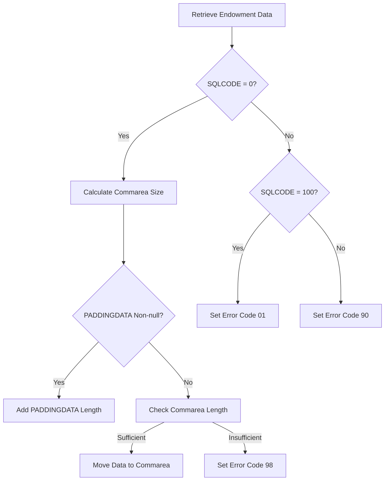

<SwmSnippet path="/base/src/lgipdb01.cbl" line="327">

---

## Retrieving Endowment Data

First, the <SwmToken path="base/src/lgipdb01.cbl" pos="327:1:7" line-data="       GET-ENDOW-DB2-INFO.">`GET-ENDOW-DB2-INFO`</SwmToken> section retrieves endowment policy data by executing a SQL SELECT statement that joins the POLICY and ENDOWMENT tables. This step ensures that the data for the specified customer and policy number is fetched from the database.

```cobol
       GET-ENDOW-DB2-INFO.

           MOVE ' SELECT ENDOW ' TO EM-SQLREQ
           EXEC SQL
             SELECT  ISSUEDATE,
                     EXPIRYDATE,
                     LASTCHANGED,
                     BROKERID,
                     BROKERSREFERENCE,
                     PAYMENT,
                     WITHPROFITS,
                     EQUITIES,
                     MANAGEDFUND,
                     FUNDNAME,
                     TERM,
                     SUMASSURED,
                     LIFEASSURED,
                     PADDINGDATA,
                     LENGTH(PADDINGDATA)
             INTO  :DB2-ISSUEDATE,
                   :DB2-EXPIRYDATE,
```

---

</SwmSnippet>

<SwmSnippet path="/base/src/lgipdb01.cbl" line="370">

---

## Handling SQLCODE

Next, the flow checks the <SwmToken path="base/src/lgipdb01.cbl" pos="370:3:3" line-data="           IF SQLCODE = 0">`SQLCODE`</SwmToken> to determine the outcome of the SQL SELECT statement. If <SwmToken path="base/src/lgipdb01.cbl" pos="370:3:3" line-data="           IF SQLCODE = 0">`SQLCODE`</SwmToken> is 0, it indicates a successful data retrieval, and the flow proceeds to calculate the required size of the communication area (commarea) to store the retrieved data. If <SwmToken path="base/src/lgipdb01.cbl" pos="370:3:3" line-data="           IF SQLCODE = 0">`SQLCODE`</SwmToken> is 100, it means no rows were found, and an error code '01' is set. For any other non-zero <SwmToken path="base/src/lgipdb01.cbl" pos="370:3:3" line-data="           IF SQLCODE = 0">`SQLCODE`</SwmToken>, an error code '90' is set, and an error message is written to the TD queue.

```cobol
           IF SQLCODE = 0
      *      Select was successful

      *      Calculate size of commarea required to return all data
             ADD WS-CA-HEADERTRAILER-LEN TO WS-REQUIRED-CA-LEN
             ADD WS-FULL-ENDOW-LEN       TO WS-REQUIRED-CA-LEN

      *----------------------------------------------------------------*
      *      Specific code to allow for length of VACHAR data
      *      check whether PADDINGDATA field is non-null
      *        and calculate length of endowment policy
      *        and position of free space in commarea after policy data
      *----------------------------------------------------------------*
             IF IND-E-PADDINGDATAL NOT EQUAL MINUS-ONE
               ADD DB2-E-PADDING-LEN TO WS-REQUIRED-CA-LEN
               ADD DB2-E-PADDING-LEN TO END-POLICY-POS
             END-IF

      *      if commarea received is not large enough ...
      *        set error return code and return to caller
             IF EIBCALEN IS LESS THAN WS-REQUIRED-CA-LEN
```

---

</SwmSnippet>

<SwmSnippet path="/base/src/lgipdb01.cbl" line="373">

---

### Calculating Commarea Size

Moving to the next step, the flow calculates the size of the commarea required to return all the retrieved data. It adds the lengths of various components, including the header, trailer, and endowment policy data. If the <SwmToken path="base/src/lgipdb01.cbl" pos="379:7:7" line-data="      *      check whether PADDINGDATA field is non-null">`PADDINGDATA`</SwmToken> field is <SwmToken path="base/src/lgipdb01.cbl" pos="379:13:15" line-data="      *      check whether PADDINGDATA field is non-null">`non-null`</SwmToken>, its length is also added to the commarea size.

```cobol
      *      Calculate size of commarea required to return all data
             ADD WS-CA-HEADERTRAILER-LEN TO WS-REQUIRED-CA-LEN
             ADD WS-FULL-ENDOW-LEN       TO WS-REQUIRED-CA-LEN

      *----------------------------------------------------------------*
      *      Specific code to allow for length of VACHAR data
      *      check whether PADDINGDATA field is non-null
      *        and calculate length of endowment policy
      *        and position of free space in commarea after policy data
      *----------------------------------------------------------------*
             IF IND-E-PADDINGDATAL NOT EQUAL MINUS-ONE
               ADD DB2-E-PADDING-LEN TO WS-REQUIRED-CA-LEN
               ADD DB2-E-PADDING-LEN TO END-POLICY-POS
             END-IF
```

---

</SwmSnippet>

<SwmSnippet path="/base/src/lgipdb01.cbl" line="388">

---

### Checking Commarea Length

Then, the flow checks if the received commarea length is sufficient to hold the required data. If the commarea is not large enough, an error code '98' is set, and the flow returns to the caller. If the length is sufficient, the data is moved to the commarea, ensuring that integer fields are converted to the required length numerics and null fields are not moved.

```cobol
      *      if commarea received is not large enough ...
      *        set error return code and return to caller
             IF EIBCALEN IS LESS THAN WS-REQUIRED-CA-LEN
               MOVE '98' TO CA-RETURN-CODE
               EXEC CICS RETURN END-EXEC
             ELSE
      *        Length is sufficent so move data to commarea
      *        Move Integer fields to required length numerics
      *        Don't move null fields
               IF IND-BROKERID NOT EQUAL MINUS-ONE
                 MOVE DB2-BROKERID-INT    TO DB2-BROKERID
               END-IF
               IF IND-PAYMENT NOT EQUAL MINUS-ONE
                 MOVE DB2-PAYMENT-INT TO DB2-PAYMENT
               END-IF
      *----------------------------------------------------------------*
               MOVE DB2-E-TERM-SINT       TO DB2-E-TERM
               MOVE DB2-E-SUMASSURED-INT  TO DB2-E-SUMASSURED

               MOVE DB2-POLICY-COMMON     TO CA-POLICY-COMMON
               MOVE DB2-ENDOW-FIXED
```

---

</SwmSnippet>

<SwmSnippet path="/base/src/lgipdb01.cbl" line="416">

---

### Marking End of Policy Data

Finally, the flow marks the end of the policy data by moving the string 'FINAL' to the appropriate position in the commarea, indicating the end of the data.

```cobol
      *      Mark the end of the policy data
             MOVE 'FINAL' TO CA-E-PADDING-DATA(END-POLICY-POS:5)
```

---

</SwmSnippet>

# <SwmToken path="base/src/lgipdb01.cbl" pos="285:3:9" line-data="               PERFORM GET-HOUSE-DB2-INFO">`GET-HOUSE-DB2-INFO`</SwmToken>

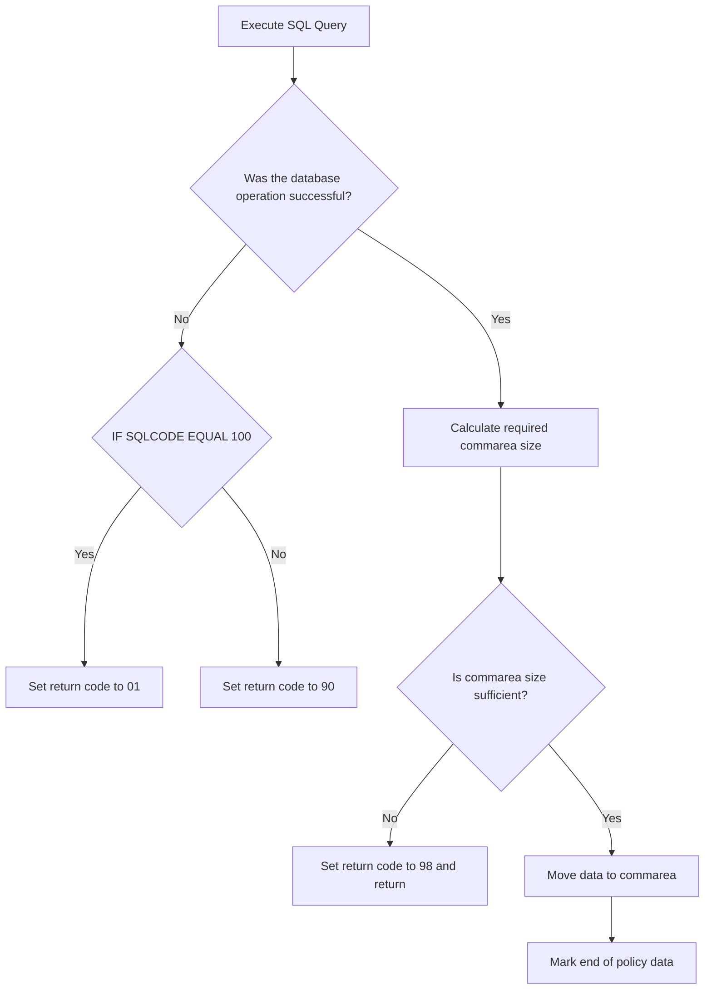

<SwmSnippet path="/base/src/lgipdb01.cbl" line="443">

---

## Executing the SQL Query

First, the SQL query is executed to retrieve policy and house information based on the provided customer and policy numbers. This step is crucial as it fetches the necessary data that will be processed and returned to the caller.

```cobol
           MOVE ' SELECT HOUSE ' TO EM-SQLREQ
           EXEC SQL
             SELECT  ISSUEDATE,
                     EXPIRYDATE,
                     LASTCHANGED,
                     BROKERID,
                     BROKERSREFERENCE,
                     PAYMENT,
                     PROPERTYTYPE,
                     BEDROOMS,
                     VALUE,
                     HOUSENAME,
                     HOUSENUMBER,
                     POSTCODE
             INTO  :DB2-ISSUEDATE,
                   :DB2-EXPIRYDATE,
                   :DB2-LASTCHANGED,
                   :DB2-BROKERID-INT INDICATOR :IND-BROKERID,
                   :DB2-BROKERSREF INDICATOR :IND-BROKERSREF,
                   :DB2-PAYMENT-INT INDICATOR :IND-PAYMENT,
                   :DB2-H-PROPERTYTYPE,
```

---

</SwmSnippet>

<SwmSnippet path="/base/src/lgipdb01.cbl" line="478">

---

## Handling Successful SQL Query

Next, if the SQL query is successful (<SwmToken path="base/src/lgipdb01.cbl" pos="478:3:7" line-data="           IF SQLCODE = 0">`SQLCODE = 0`</SwmToken>), the required size of the communication area (commarea) is calculated. If the commarea size is sufficient, the data is moved to the commarea, ensuring that integer fields are converted to the required length numerics and null fields are not moved. Finally, the end of the policy data is marked.

```cobol
           IF SQLCODE = 0
      *      Select was successful

      *      Calculate size of commarea required to return all data
             ADD WS-CA-HEADERTRAILER-LEN TO WS-REQUIRED-CA-LEN
             ADD WS-FULL-HOUSE-LEN       TO WS-REQUIRED-CA-LEN

      *      if commarea received is not large enough ...
      *        set error return code and return to caller
             IF EIBCALEN IS LESS THAN WS-REQUIRED-CA-LEN
               MOVE '98' TO CA-RETURN-CODE
               EXEC CICS RETURN END-EXEC
             ELSE
      *        Length is sufficent so move data to commarea
      *        Move Integer fields to required length numerics
      *        Don't move null fields
               IF IND-BROKERID NOT EQUAL MINUS-ONE
                 MOVE DB2-BROKERID-INT  TO DB2-BROKERID
               END-IF
               IF IND-PAYMENT NOT EQUAL MINUS-ONE
                 MOVE DB2-PAYMENT-INT TO DB2-PAYMENT
```

---

</SwmSnippet>

<SwmSnippet path="/base/src/lgipdb01.cbl" line="390">

---

## Handling Insufficient Commarea Size

If the commarea size is not sufficient, an error return code '98' is set, and the control is returned to the caller. This ensures that the caller is informed about the insufficient commarea size.

```cobol
             IF EIBCALEN IS LESS THAN WS-REQUIRED-CA-LEN
               MOVE '98' TO CA-RETURN-CODE
               EXEC CICS RETURN END-EXEC
```

---

</SwmSnippet>

<SwmSnippet path="/base/src/lgipdb01.cbl" line="419">

---

## Handling SQL Query Failure

If the SQL query fails (<SwmToken path="base/src/lgipdb01.cbl" pos="511:7:7" line-data="      *      Non-zero SQLCODE from first SQL FETCH statement">`SQLCODE`</SwmToken> is not 0), the code checks if <SwmToken path="base/src/lgipdb01.cbl" pos="511:7:7" line-data="      *      Non-zero SQLCODE from first SQL FETCH statement">`SQLCODE`</SwmToken> is 100, indicating no rows were found. In this case, an error return code '01' is set. For other non-zero <SwmToken path="base/src/lgipdb01.cbl" pos="511:7:7" line-data="      *      Non-zero SQLCODE from first SQL FETCH statement">`SQLCODE`</SwmToken> values, an error return code '90' is set, and an error message is written to the TD queue. This ensures that appropriate error handling is performed based on the type of SQL failure.

```cobol
           ELSE
      *      Non-zero SQLCODE from first SQL FETCH statement
             IF SQLCODE EQUAL 100
      *        No rows found - invalid customer / policy number
               MOVE '01' TO CA-RETURN-CODE
             ELSE
      *        something has gone wrong
               MOVE '90' TO CA-RETURN-CODE
      *        Write error message to TD QUEUE(CSMT)
               PERFORM WRITE-ERROR-MESSAGE
             END-IF
```

---

</SwmSnippet>

# <SwmToken path="base/src/lgipdb01.cbl" pos="289:3:9" line-data="               PERFORM GET-MOTOR-DB2-INFO">`GET-MOTOR-DB2-INFO`</SwmToken>

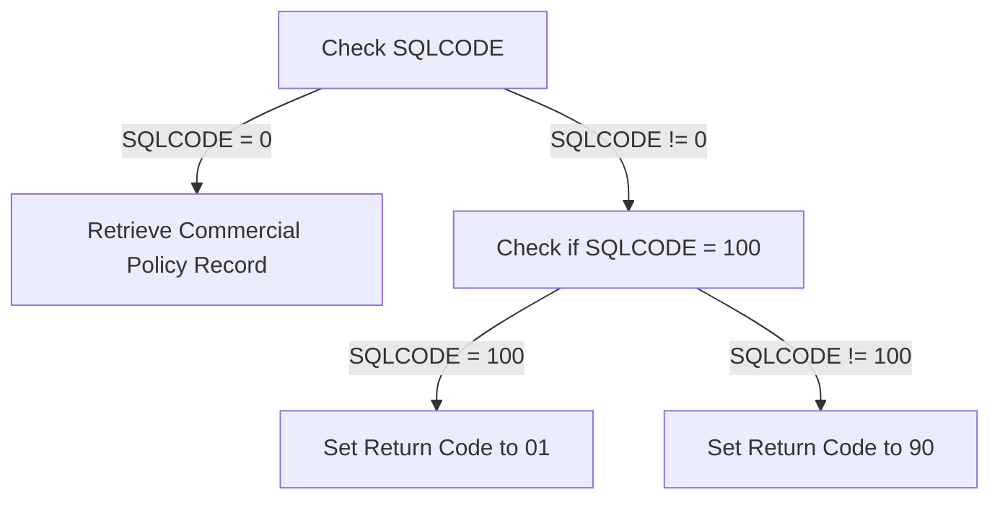

<SwmSnippet path="/base/src/lgipdb01.cbl" line="531">

---

## Handling SQLCODE conditions

First, the code checks if <SwmToken path="base/src/lgipdb01.cbl" pos="370:3:3" line-data="           IF SQLCODE = 0">`SQLCODE`</SwmToken> is 0, indicating a successful SQL operation. If not, it checks if <SwmToken path="base/src/lgipdb01.cbl" pos="370:3:3" line-data="           IF SQLCODE = 0">`SQLCODE`</SwmToken> equals 100, which means no rows were found, and sets the return code to '01'. If <SwmToken path="base/src/lgipdb01.cbl" pos="370:3:3" line-data="           IF SQLCODE = 0">`SQLCODE`</SwmToken> is neither 0 nor 100, it sets the return code to '90' and performs an error message write operation.

```cobol
           MOVE ' SELECT MOTOR ' TO EM-SQLREQ
           EXEC SQL
             SELECT  ISSUEDATE,
                     EXPIRYDATE,
                     LASTCHANGED,
                     BROKERID,
                     BROKERSREFERENCE,
                     PAYMENT,
                     MAKE,
                     MODEL,
                     VALUE,
                     REGNUMBER,
                     COLOUR,
                     CC,
                     YEAROFMANUFACTURE,
                     PREMIUM,
                     ACCIDENTS
             INTO  :DB2-ISSUEDATE,
                   :DB2-EXPIRYDATE,
                   :DB2-LASTCHANGED,
                   :DB2-BROKERID-INT INDICATOR :IND-BROKERID,
```

---

</SwmSnippet>

<SwmSnippet path="/base/src/lgipdb01.cbl" line="627">

---

## Retrieving commercial policy records

Next, the <SwmToken path="base/src/lgipdb01.cbl" pos="627:1:9" line-data="       GET-Commercial-DB2-INFO-1.">`GET-Commercial-DB2-INFO-1`</SwmToken> function retrieves a single commercial policy record that matches the given policy number from the Db2 database. If the retrieval is successful (<SwmToken path="base/src/lgipdb01.cbl" pos="370:3:7" line-data="           IF SQLCODE = 0">`SQLCODE = 0`</SwmToken>), it calculates the size of the communication area required to return all data. If the communication area is not large enough, it sets an error return code and returns to the caller. Otherwise, it moves the retrieved data into the appropriate fields and marks the end of the policy data.

```cobol
       GET-Commercial-DB2-INFO-1.

           MOVE ' SELECT Commercial ' TO EM-SQLREQ

           EXEC SQL
             SELECT
                   RequestDate,
                   StartDate,
                   RenewalDate,
                   Address,
                   Zipcode,
                   LatitudeN,
                   LongitudeW,
                   Customer,
                   PropertyType,
                   FirePeril,
                   FirePremium,
                   CrimePeril,
                   CrimePremium,
                   FloodPeril,
                   FloodPremium,
```

---

</SwmSnippet>

# <SwmToken path="base/src/lgipdb01.cbl" pos="627:1:9" line-data="       GET-Commercial-DB2-INFO-1.">`GET-Commercial-DB2-INFO-1`</SwmToken> & 2

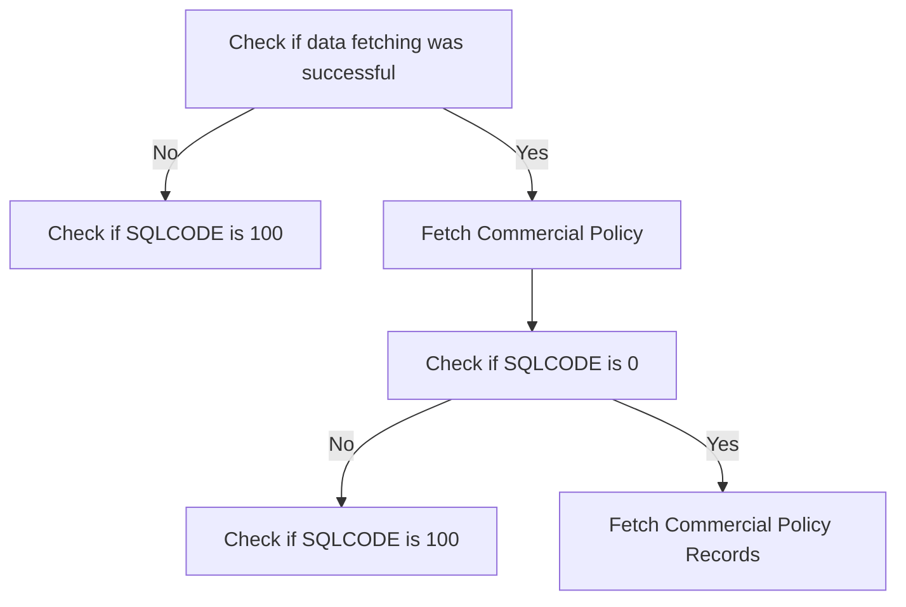

<SwmSnippet path="/base/src/lgipdb01.cbl" line="628">

---

## Checking Data Fetch Success

First, we check if the data fetching operation was successful. This is determined by evaluating the SQLCODE returned from the database operation. If the SQLCODE is not zero, it indicates an error or no data found.

```cobol

           MOVE ' SELECT Commercial ' TO EM-SQLREQ

```

---

</SwmSnippet>

<SwmSnippet path="/base/src/lgipdb01.cbl" line="631">

---

## Handling No Data Found

If the SQLCODE equals 100, it means no rows were found, indicating an invalid customer or policy number. In this case, we set the return code to '01' to signify this condition.

```cobol
           EXEC SQL
             SELECT
                   RequestDate,
```

---

</SwmSnippet>

<SwmSnippet path="/base/src/lgipdb01.cbl" line="95">

---

## Fetching Commercial Policy

If the initial data fetch was successful, we proceed to fetch the commercial policy information. This involves executing a SQL SELECT statement to retrieve the relevant policy data from the database.

```cobol
                   StartDate,
                   RenewalDate,
                   Address,
```

---

</SwmSnippet>

<SwmSnippet path="/base/src/lgipdb01.cbl" line="98">

---

## Processing Fetched Data

Next, we check if the SQLCODE is zero, indicating a successful fetch. If successful, we calculate the size of the communication area required to return all the fetched data and ensure it is large enough to hold the data.

```cobol
                   Zipcode,
                   LatitudeN,
                   LongitudeW,
```

---

</SwmSnippet>

<SwmSnippet path="/base/src/lgipdb01.cbl" line="101">

---

## Handling Insufficient Commarea Size

If the communication area is not large enough, we set an error return code '98' and return to the caller. This ensures that the caller is aware of the insufficient space to hold the fetched data.

```cobol
                   Customer,
                   PropertyType,
                   FirePeril,
```

---

</SwmSnippet>

<SwmSnippet path="/base/src/lgipdb01.cbl" line="104">

---

## Moving Data to Commarea

If the communication area is sufficient, we move the fetched data into the communication area. This includes moving various policy details such as customer number, fire peril, fire premium, crime peril, crime premium, and other relevant data.

```cobol
                   FirePremium,
                   CrimePeril,
                   CrimePremium,
```

---

</SwmSnippet>

<SwmSnippet path="/base/src/lgipdb01.cbl" line="107">

---

## Marking End of Policy Data

Finally, we mark the end of the policy data by setting a 'FINAL' indicator in the communication area. This helps in identifying the end of the data when it is processed by the caller.

```cobol
                   FloodPeril,
                   FloodPremium,
                   WeatherPeril,
```

---

</SwmSnippet>

<SwmSnippet path="/base/src/lgipdb01.cbl" line="110">

---

## Handling Errors

If there is a non-zero SQLCODE from the first SQL FETCH statement, we handle the error by setting appropriate return codes. If the SQLCODE is 100, it indicates no rows found, and we set the return code to '01'. For other errors, we set the return code to '90' and write an error message to the TD QUEUE.

```cobol
                   WeatherPremium,
                   Status,
                   RejectionReason
```

---

</SwmSnippet>

# <SwmToken path="base/src/lgipdb01.cbl" pos="835:1:9" line-data="       GET-Commercial-DB2-INFO-3.">`GET-Commercial-DB2-INFO-3`</SwmToken>

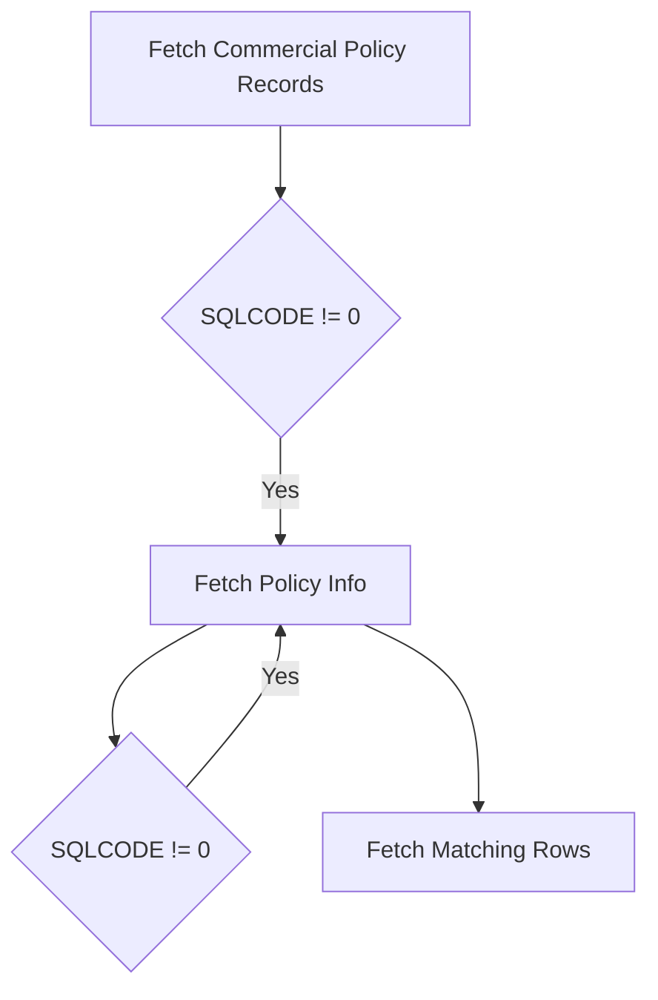

<SwmSnippet path="/base/src/lgipdb01.cbl" line="835">

---

## Fetching Commercial Policy Records

First, the <SwmToken path="base/src/lgipdb01.cbl" pos="835:1:9" line-data="       GET-Commercial-DB2-INFO-3.">`GET-Commercial-DB2-INFO-3`</SwmToken> section initializes the SQL request and opens a cursor to fetch matching customer policy records from the commercial table. If the SQLCODE is not equal to 0, it moves '89' to <SwmToken path="base/src/lgipdb01.cbl" pos="844:9:13" line-data="             MOVE &#39;89&#39; TO CA-RETURN-CODE">`CA-RETURN-CODE`</SwmToken>, performs error handling, and ends the program. Otherwise, it proceeds to fetch policy information.

```cobol
       GET-Commercial-DB2-INFO-3.

           MOVE ' SELECT Commercial ' TO EM-SQLREQ
           Move 0 To ICOM-Record-Count

           EXEC SQL
             OPEN Cust_Cursor
           END-EXEC.
           IF SQLCODE NOT EQUAL 0
             MOVE '89' TO CA-RETURN-CODE
             PERFORM WRITE-ERROR-MESSAGE
             PERFORM END-PROGRAM
           END-IF.

           Perform GET-Commercial-DB2-INFO-3-Cur
                     With Test after Until SQLCODE > 0

           EXEC SQL
             Close Cust_Cursor
           END-EXEC.
           IF SQLCODE NOT EQUAL 0
```

---

</SwmSnippet>

<SwmSnippet path="/base/src/lgipdb01.cbl" line="863">

---

## Fetching Policy Info

Next, the <SwmToken path="base/src/lgipdb01.cbl" pos="863:1:11" line-data="       GET-Commercial-DB2-INFO-3-Cur.">`GET-Commercial-DB2-INFO-3-Cur`</SwmToken> section fetches policy-related information from the Db2 database using a cursor. It maps the fetched values to corresponding variables and handles error checking and count validation. If the SQLCODE is 0, it moves the fetched data to the appropriate variables and increments the record count. If the record count exceeds 20, it sets the SQLCODE to 17 to stop further fetching.

```cobol
       GET-Commercial-DB2-INFO-3-Cur.

           EXEC SQL
             Fetch Cust_Cursor
             INTO
                   :DB2-CUSTOMERNUM-INT,
                   :DB2-POLICYNUM-INT,
                   :DB2-LASTCHANGED,
                   :DB2-ISSUEDATE,
                   :DB2-EXPIRYDATE,
                   :DB2-B-Address,
                   :DB2-B-Postcode,
                   :DB2-B-Latitude,
                   :DB2-B-Longitude,
                   :DB2-B-Customer,
                   :DB2-B-PropType,
                   :DB2-B-FirePeril-Int,
                   :DB2-B-FirePremium-Int,
                   :DB2-B-CrimePeril-Int,
                   :DB2-B-CrimePremium-Int,
                   :DB2-B-FloodPeril-Int,
```

---

</SwmSnippet>

# <SwmToken path="base/src/lgipdb01.cbl" pos="919:1:9" line-data="       GET-Commercial-DB2-INFO-5.">`GET-Commercial-DB2-INFO-5`</SwmToken>

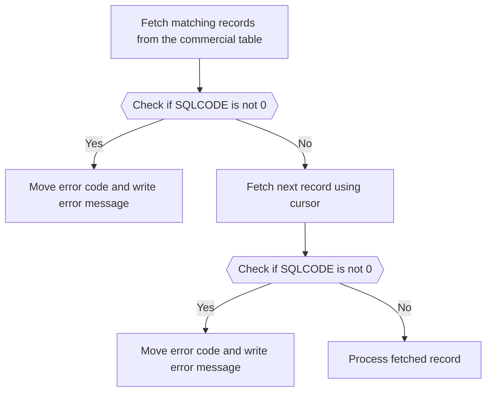

<SwmSnippet path="/base/src/lgipdb01.cbl" line="919">

---

## Fetching matching records from the commercial table

First, we initiate the process by moving the SQL query to <SwmToken path="base/src/lgipdb01.cbl" pos="921:13:15" line-data="           MOVE &#39; SELECT Commercial &#39; TO EM-SQLREQ">`EM-SQLREQ`</SwmToken> and opening the cursor <SwmToken path="base/src/lgipdb01.cbl" pos="924:3:3" line-data="             OPEN Zip_Cursor">`Zip_Cursor`</SwmToken>. If the <SwmToken path="base/src/lgipdb01.cbl" pos="926:3:3" line-data="           IF SQLCODE NOT EQUAL 0">`SQLCODE`</SwmToken> is not equal to 0, it indicates an error, and we move the error code '89' to <SwmToken path="base/src/lgipdb01.cbl" pos="927:9:13" line-data="             MOVE &#39;89&#39; TO CA-RETURN-CODE">`CA-RETURN-CODE`</SwmToken>, write the error message, and end the program.

```cobol
       GET-Commercial-DB2-INFO-5.

           MOVE ' SELECT Commercial ' TO EM-SQLREQ

           EXEC SQL
             OPEN Zip_Cursor
           END-EXEC.
           IF SQLCODE NOT EQUAL 0
             MOVE '89' TO CA-RETURN-CODE
             PERFORM WRITE-ERROR-MESSAGE
             PERFORM END-PROGRAM
           END-IF.
```

---

</SwmSnippet>

<SwmSnippet path="/base/src/lgipdb01.cbl" line="932">

---

## Fetching records using cursor

Next, we perform the <SwmToken path="base/src/lgipdb01.cbl" pos="932:3:13" line-data="           Perform GET-Commercial-DB2-INFO-5-Cur">`GET-Commercial-DB2-INFO-5-Cur`</SwmToken> paragraph repeatedly until <SwmToken path="base/src/lgipdb01.cbl" pos="933:9:9" line-data="                     With Test after Until SQLCODE &gt; 0">`SQLCODE`</SwmToken> is greater than 0. After closing the cursor, if the <SwmToken path="base/src/lgipdb01.cbl" pos="933:9:9" line-data="                     With Test after Until SQLCODE &gt; 0">`SQLCODE`</SwmToken> is not equal to 0, we move the error code '88' to <SwmToken path="base/src/lgipdb01.cbl" pos="939:9:13" line-data="             MOVE &#39;88&#39; TO CA-RETURN-CODE">`CA-RETURN-CODE`</SwmToken>, write the error message, and end the program.

```cobol
           Perform GET-Commercial-DB2-INFO-5-Cur
                     With Test after Until SQLCODE > 0

           EXEC SQL
             Close Zip_Cursor
           END-EXEC.
           IF SQLCODE NOT EQUAL 0
             MOVE '88' TO CA-RETURN-CODE
             PERFORM WRITE-ERROR-MESSAGE
             PERFORM END-PROGRAM
           END-IF.
```

---

</SwmSnippet>

<SwmSnippet path="/base/src/lgipdb01.cbl" line="946">

---

## Processing fetched records

Then, in the <SwmToken path="base/src/lgipdb01.cbl" pos="946:1:11" line-data="       GET-Commercial-DB2-INFO-5-Cur.">`GET-Commercial-DB2-INFO-5-Cur`</SwmToken> paragraph, we fetch the next record from the cursor into various fields. If the <SwmToken path="base/src/lgipdb01.cbl" pos="370:3:3" line-data="           IF SQLCODE = 0">`SQLCODE`</SwmToken> is 0, indicating a successful fetch, we move the fetched data into corresponding application variables for further processing.

```cobol
       GET-Commercial-DB2-INFO-5-Cur.
           EXEC SQL
             Fetch Zip_Cursor
             INTO
                   :DB2-CUSTOMERNUM-INT,
                   :DB2-POLICYNUM-INT,
                   :DB2-LASTCHANGED,
                   :DB2-ISSUEDATE,
                   :DB2-EXPIRYDATE,
                   :DB2-B-Address,
                   :DB2-B-Postcode,
                   :DB2-B-Latitude,
                   :DB2-B-Longitude,
                   :DB2-B-Customer,
                   :DB2-B-PropType,
                   :DB2-B-FirePeril-Int,
                   :DB2-B-FirePremium-Int,
                   :DB2-B-CrimePeril-Int,
                   :DB2-B-CrimePremium-Int,
                   :DB2-B-FloodPeril-Int,
                   :DB2-B-FloodPremium-Int,
```

---

</SwmSnippet>

# Error Handling and Logging

This is the next section of the flow.

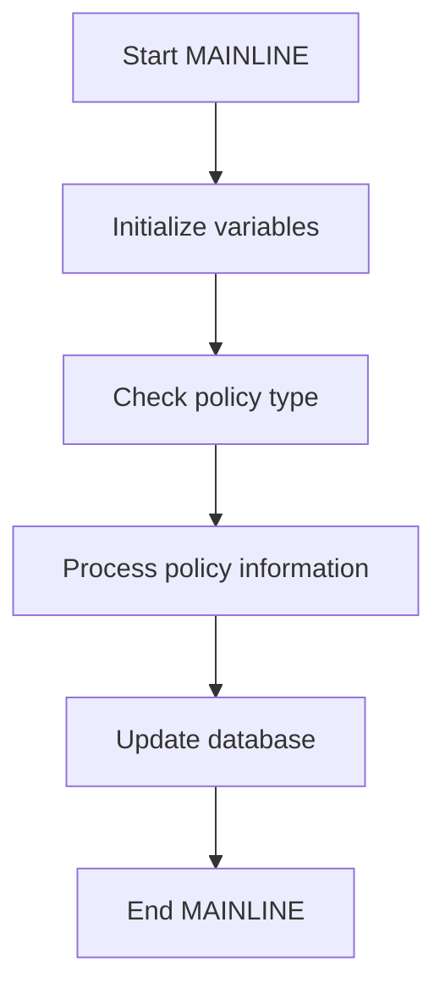

<SwmSnippet path="/base/src/lgipdb01.cbl" line="994">

---

## Processing policy information

First, the MAINLINE function initializes necessary variables and checks the type of policy being processed. Depending on the policy type, it processes the policy information accordingly. This involves updating the database with the new or modified policy details.

```cobol
      *   message will include Date, Time, Program Name, Customer      *
      *   Number, Policy Number and SQLCODE.                           *
      *================================================================*
       WRITE-ERROR-MESSAGE.
      * Save SQLCODE in message
           MOVE SQLCODE TO EM-SQLRC
      * Obtain and format current time and date
           EXEC CICS ASKTIME ABSTIME(ABS-TIME)
           END-EXEC
           EXEC CICS FORMATTIME ABSTIME(ABS-TIME)
                     MMDDYYYY(DATE1)
                     TIME(TIME1)
           END-EXEC
           MOVE DATE1 TO EM-DATE
           MOVE TIME1 TO EM-TIME
      * Write output message to TDQ
           EXEC CICS LINK PROGRAM('LGSTSQ')
                     COMMAREA(ERROR-MSG)
                     LENGTH(LENGTH OF ERROR-MSG)
           END-EXEC.
      * Write 90 bytes or as much as we have of commarea to TDQ
```

---

</SwmSnippet>

&nbsp;

*This is an auto-generated document by Swimm 🌊 and has not yet been verified by a human*

<SwmMeta version="3.0.0" repo-id="Z2l0aHViJTNBJTNBa3luZHJ5bC1jaWNzLWdlbmFwcCUzQSUzQVN3aW1tLURlbW8=" repo-name="kyndryl-cics-genapp"><sup>Powered by [Swimm](https://app.swimm.io/)</sup></SwmMeta>
