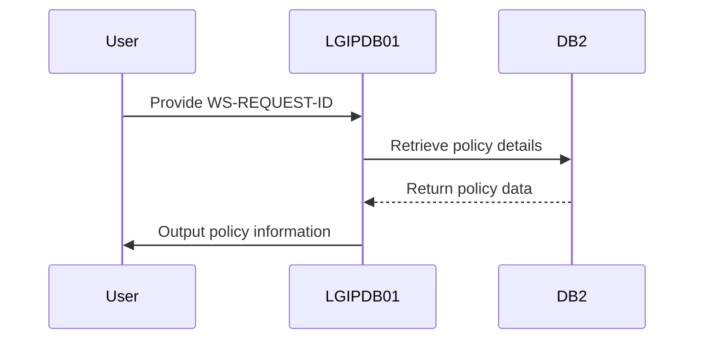
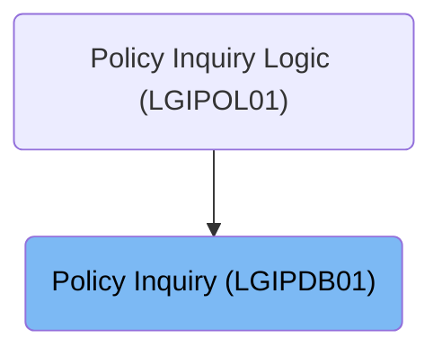
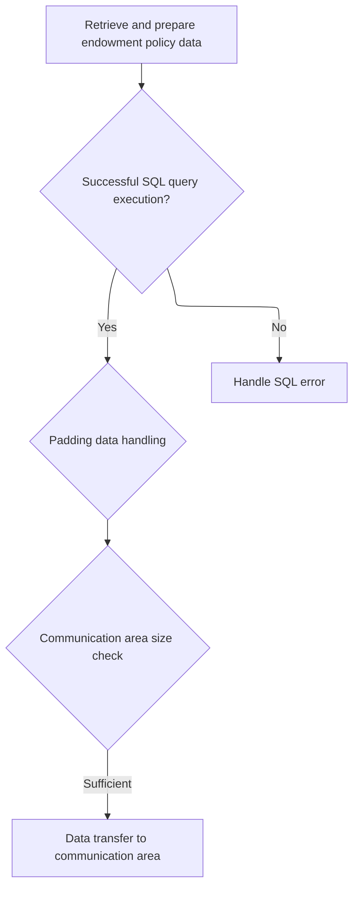
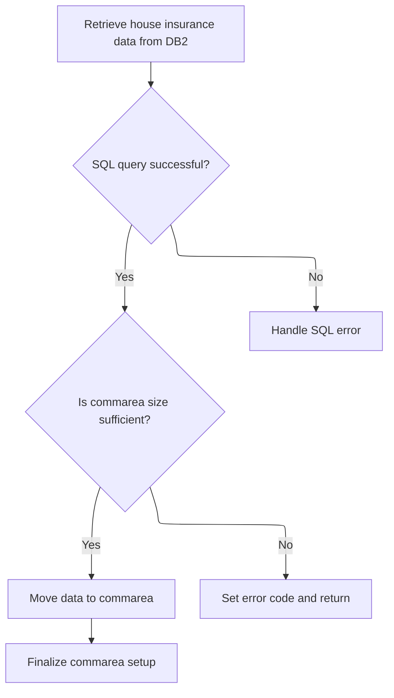

The <SwmToken path="base/src/lgipdb01.cbl" pos="13:6:6" line-data="       PROGRAM-ID. LGIPDB01.">`LGIPDB01`</SwmToken> program is designed to inquire about insurance policies, providing full details for endowment, house, motor, and commercial policies. It evaluates the policy type using <SwmToken path="base/src/lgipdb01.cbl" pos="277:3:7" line-data="           EVALUATE WS-REQUEST-ID">`WS-REQUEST-ID`</SwmToken> and retrieves the corresponding policy details from <SwmToken path="base/src/lgipdb01.cbl" pos="280:3:3" line-data="               INITIALIZE DB2-ENDOWMENT">`DB2`</SwmToken>.

For example, if the input <SwmToken path="base/src/lgipdb01.cbl" pos="277:3:7" line-data="           EVALUATE WS-REQUEST-ID">`WS-REQUEST-ID`</SwmToken> is <SwmToken path="base/src/lgipdb01.cbl" pos="279:4:4" line-data="             WHEN &#39;01IEND&#39;">`01IEND`</SwmToken>, the program retrieves endowment policy details such as issue date, expiry date, and payment information, and outputs them in the commarea.

The main steps are:

- Evaluate policy type using <SwmToken path="base/src/lgipdb01.cbl" pos="277:3:7" line-data="           EVALUATE WS-REQUEST-ID">`WS-REQUEST-ID`</SwmToken>
- Retrieve policy details from <SwmToken path="base/src/lgipdb01.cbl" pos="280:3:3" line-data="               INITIALIZE DB2-ENDOWMENT">`DB2`</SwmToken> based on type
- Check SQL query execution success
- Calculate required commarea size
- Transfer data to commarea if size is sufficient
- Handle SQL errors if any
- Mark end of data block in commarea



## Dependencies

### Program

- LGSTSQ (<SwmPath>[base/src/lgstsq.cbl](base/src/lgstsq.cbl)</SwmPath>) - <SwmLink doc-title="Message Queue Handler (LGSTSQ)">[Message Queue Handler (LGSTSQ)](/.swm/message-queue-handler-lgstsq.e7y8uelv.sw.md)</SwmLink>

### Copybooks

- SQLCA
- LGPOLICY (<SwmPath>[base/src/lgpolicy.cpy](base/src/lgpolicy.cpy)</SwmPath>)
- LGCMAREA (<SwmPath>[base/src/lgcmarea.cpy](base/src/lgcmarea.cpy)</SwmPath>)

# Where is this program used?

This program is used once, as represented in the following diagram:



# Policy Type Handling

```mermaid
%%{init: {"flowchart": {"defaultRenderer": "elk"}} }%%
flowchart TD
    node1[Start processing insurance request] --> node3{Evaluate WS-REQUEST-ID}
    click node1 openCode "base/src/lgipdb01.cbl:230:277"
    node3 -->|01IEND| node2[Retrieve endowment policy details]
    click node3 openCode "base/src/lgipdb01.cbl:277:310"
    click node2 openCode "base/src/lgipdb01.cbl:327:327"
    node3 -->|01IHOU| node4[Retrieve house insurance policy data]
    click node4 openCode "base/src/lgipdb01.cbl:441:441"
    node3 -->|01IMOT| node6[Retrieve motor insurance policy details]
    click node6 openCode "base/src/lgipdb01.cbl:529:529"
    node3 -->|Other| node5[Assign default return code]
    click node5 openCode "base/src/lgipdb01.cbl:277:310"
    node2 & node4 & node6 & node5 --> node7[End program]
    click node7 openCode "base/src/lgipdb01.cbl:312:313"


subgraph node2 [GET-ENDOW-DB2-INFO]
  sgmain_1_node1[Retrieve and prepare endowment policy data] --> sgmain_1_node2{Successful SQL query execution?}
  click sgmain_1_node1 openCode "base/src/lgipdb01.cbl:327:368"
  sgmain_1_node2 -->|Yes| sgmain_1_node3{Padding data handling}
  click sgmain_1_node2 openCode "base/src/lgipdb01.cbl:370:371"
  sgmain_1_node3 --> sgmain_1_node4{Communication area size check}
  click sgmain_1_node3 openCode "base/src/lgipdb01.cbl:383:386"
  sgmain_1_node4 -->|Sufficient| sgmain_1_node5[Data transfer to communication area]
  click sgmain_1_node4 openCode "base/src/lgipdb01.cbl:390:392"
  click sgmain_1_node5 openCode "base/src/lgipdb01.cbl:397:413"
  sgmain_1_node2 -->|No| sgmain_1_node6[Handle SQL error]
  click sgmain_1_node6 openCode "base/src/lgipdb01.cbl:420:423"
end

%% Swimm:
%% %%{init: {"flowchart": {"defaultRenderer": "elk"}} }%%
%% flowchart TD
%%     node1[Start processing insurance request] --> node3{Evaluate <SwmToken path="base/src/lgipdb01.cbl" pos="277:3:7" line-data="           EVALUATE WS-REQUEST-ID">`WS-REQUEST-ID`</SwmToken>}
%%     click node1 openCode "<SwmPath>[base/src/lgipdb01.cbl](base/src/lgipdb01.cbl)</SwmPath>:230:277"
%%     node3 -->|<SwmToken path="base/src/lgipdb01.cbl" pos="279:4:4" line-data="             WHEN &#39;01IEND&#39;">`01IEND`</SwmToken>| node2[Retrieve endowment policy details]
%%     click node3 openCode "<SwmPath>[base/src/lgipdb01.cbl](base/src/lgipdb01.cbl)</SwmPath>:277:310"
%%     click node2 openCode "<SwmPath>[base/src/lgipdb01.cbl](base/src/lgipdb01.cbl)</SwmPath>:327:327"
%%     node3 -->|<SwmToken path="base/src/lgipdb01.cbl" pos="283:4:4" line-data="             WHEN &#39;01IHOU&#39;">`01IHOU`</SwmToken>| node4[Retrieve house insurance policy data]
%%     click node4 openCode "<SwmPath>[base/src/lgipdb01.cbl](base/src/lgipdb01.cbl)</SwmPath>:441:441"
%%     node3 -->|<SwmToken path="base/src/lgipdb01.cbl" pos="287:4:4" line-data="             WHEN &#39;01IMOT&#39;">`01IMOT`</SwmToken>| node6[Retrieve motor insurance policy details]
%%     click node6 openCode "<SwmPath>[base/src/lgipdb01.cbl](base/src/lgipdb01.cbl)</SwmPath>:529:529"
%%     node3 -->|Other| node5[Assign default return code]
%%     click node5 openCode "<SwmPath>[base/src/lgipdb01.cbl](base/src/lgipdb01.cbl)</SwmPath>:277:310"
%%     node2 & node4 & node6 & node5 --> node7[End program]
%%     click node7 openCode "<SwmPath>[base/src/lgipdb01.cbl](base/src/lgipdb01.cbl)</SwmPath>:312:313"
%% 
%% 
%% subgraph node2 [<SwmToken path="base/src/lgipdb01.cbl" pos="281:3:9" line-data="               PERFORM GET-ENDOW-DB2-INFO">`GET-ENDOW-DB2-INFO`</SwmToken>]
%%   sgmain_1_node1[Retrieve and prepare endowment policy data] --> sgmain_1_node2{Successful SQL query execution?}
%%   click sgmain_1_node1 openCode "<SwmPath>[base/src/lgipdb01.cbl](base/src/lgipdb01.cbl)</SwmPath>:327:368"
%%   sgmain_1_node2 -->|Yes| sgmain_1_node3{Padding data handling}
%%   click sgmain_1_node2 openCode "<SwmPath>[base/src/lgipdb01.cbl](base/src/lgipdb01.cbl)</SwmPath>:370:371"
%%   sgmain_1_node3 --> sgmain_1_node4{Communication area size check}
%%   click sgmain_1_node3 openCode "<SwmPath>[base/src/lgipdb01.cbl](base/src/lgipdb01.cbl)</SwmPath>:383:386"
%%   sgmain_1_node4 -->|Sufficient| sgmain_1_node5[Data transfer to communication area]
%%   click sgmain_1_node4 openCode "<SwmPath>[base/src/lgipdb01.cbl](base/src/lgipdb01.cbl)</SwmPath>:390:392"
%%   click sgmain_1_node5 openCode "<SwmPath>[base/src/lgipdb01.cbl](base/src/lgipdb01.cbl)</SwmPath>:397:413"
%%   sgmain_1_node2 -->|No| sgmain_1_node6[Handle SQL error]
%%   click sgmain_1_node6 openCode "<SwmPath>[base/src/lgipdb01.cbl](base/src/lgipdb01.cbl)</SwmPath>:420:423"
%% end
```



<SwmSnippet path="/base/src/lgipdb01.cbl" line="277">

---

In <SwmToken path="base/src/lgipdb01.cbl" pos="230:1:1" line-data="       MAINLINE SECTION.">`MAINLINE`</SwmToken>, we start by checking the policy type using <SwmToken path="base/src/lgipdb01.cbl" pos="277:3:7" line-data="           EVALUATE WS-REQUEST-ID">`WS-REQUEST-ID`</SwmToken>. This tells us which <SwmToken path="base/src/lgipdb01.cbl" pos="280:3:3" line-data="               INITIALIZE DB2-ENDOWMENT">`DB2`</SwmToken> info retrieval function to call, like <SwmToken path="base/src/lgipdb01.cbl" pos="281:3:9" line-data="               PERFORM GET-ENDOW-DB2-INFO">`GET-ENDOW-DB2-INFO`</SwmToken> for endowment policies.

```cobol
           EVALUATE WS-REQUEST-ID

             WHEN '01IEND'
               INITIALIZE DB2-ENDOWMENT
               PERFORM GET-ENDOW-DB2-INFO

             WHEN '01IHOU'
               INITIALIZE DB2-HOUSE
               PERFORM GET-HOUSE-DB2-INFO

             WHEN '01IMOT'
               INITIALIZE DB2-MOTOR
               PERFORM GET-MOTOR-DB2-INFO

             WHEN '01ICOM'
               INITIALIZE DB2-COMMERCIAL
               PERFORM GET-COMMERCIAL-DB2-INFO-1

             WHEN '02ICOM'
               INITIALIZE DB2-COMMERCIAL
               PERFORM GET-COMMERCIAL-DB2-INFO-2

             WHEN '03ICOM'
               INITIALIZE DB2-COMMERCIAL
               PERFORM GET-COMMERCIAL-DB2-INFO-3

             WHEN '05ICOM'
               INITIALIZE DB2-COMMERCIAL
               PERFORM GET-COMMERCIAL-DB2-INFO-5

             WHEN OTHER
               MOVE '99' TO CA-RETURN-CODE

           END-EVALUATE.
```

---

</SwmSnippet>

## Endowment Policy Retrieval



<SwmSnippet path="/base/src/lgipdb01.cbl" line="327">

---

In <SwmToken path="base/src/lgipdb01.cbl" pos="327:1:7" line-data="       GET-ENDOW-DB2-INFO.">`GET-ENDOW-DB2-INFO`</SwmToken>, we run a SQL query to grab all the key fields for an endowment policy from <SwmToken path="base/src/lgipdb01.cbl" pos="327:5:5" line-data="       GET-ENDOW-DB2-INFO.">`DB2`</SwmToken>, like dates and payment info.

```cobol
       GET-ENDOW-DB2-INFO.

           MOVE ' SELECT ENDOW ' TO EM-SQLREQ
           EXEC SQL
             SELECT  ISSUEDATE,
                     EXPIRYDATE,
                     LASTCHANGED,
                     BROKERID,
                     BROKERSREFERENCE,
                     PAYMENT,
                     WITHPROFITS,
                     EQUITIES,
                     MANAGEDFUND,
                     FUNDNAME,
                     TERM,
                     SUMASSURED,
                     LIFEASSURED,
                     PADDINGDATA,
                     LENGTH(PADDINGDATA)
             INTO  :DB2-ISSUEDATE,
                   :DB2-EXPIRYDATE,
                   :DB2-LASTCHANGED,
                   :DB2-BROKERID-INT INDICATOR :IND-BROKERID,
                   :DB2-BROKERSREF INDICATOR :IND-BROKERSREF,
                   :DB2-PAYMENT-INT INDICATOR :IND-PAYMENT,
                   :DB2-E-WITHPROFITS,
                   :DB2-E-EQUITIES,
                   :DB2-E-MANAGEDFUND,
                   :DB2-E-FUNDNAME,
                   :DB2-E-TERM-SINT,
                   :DB2-E-SUMASSURED-INT,
                   :DB2-E-LIFEASSURED,
                   :DB2-E-PADDINGDATA INDICATOR :IND-E-PADDINGDATA,
                   :DB2-E-PADDING-LEN INDICATOR :IND-E-PADDINGDATAL
             FROM  POLICY,ENDOWMENT
             WHERE ( POLICY.POLICYNUMBER =
                        ENDOWMENT.POLICYNUMBER   AND
                     POLICY.CUSTOMERNUMBER =
                        :DB2-CUSTOMERNUM-INT             AND
                     POLICY.POLICYNUMBER =
                        :DB2-POLICYNUM-INT               )
           END-EXEC
```

---

</SwmSnippet>

<SwmSnippet path="/base/src/lgipdb01.cbl" line="370">

---

After the SQL query in <SwmToken path="base/src/lgipdb01.cbl" pos="281:3:9" line-data="               PERFORM GET-ENDOW-DB2-INFO">`GET-ENDOW-DB2-INFO`</SwmToken>, we check the SQLCODE to see if it was successful. Then, we calculate the commarea size needed to hold all the data, including any variable-length fields, to make sure everything fits during the transfer.

```cobol
           IF SQLCODE = 0
      *      Select was successful

      *      Calculate size of commarea required to return all data
             ADD WS-CA-HEADERTRAILER-LEN TO WS-REQUIRED-CA-LEN
             ADD WS-FULL-ENDOW-LEN       TO WS-REQUIRED-CA-LEN

      *----------------------------------------------------------------*
      *      Specific code to allow for length of VACHAR data
      *      check whether PADDINGDATA field is non-null
      *        and calculate length of endowment policy
      *        and position of free space in commarea after policy data
      *----------------------------------------------------------------*
             IF IND-E-PADDINGDATAL NOT EQUAL MINUS-ONE
               ADD DB2-E-PADDING-LEN TO WS-REQUIRED-CA-LEN
               ADD DB2-E-PADDING-LEN TO END-POLICY-POS
             END-IF
```

---

</SwmSnippet>

<SwmSnippet path="/base/src/lgipdb01.cbl" line="390">

---

We use indicator variables to move only <SwmToken path="base/src/lgipdb01.cbl" pos="379:13:15" line-data="      *      check whether PADDINGDATA field is non-null">`non-null`</SwmToken> data from <SwmToken path="base/src/lgipdb01.cbl" pos="398:3:3" line-data="                 MOVE DB2-BROKERID-INT    TO DB2-BROKERID">`DB2`</SwmToken> to COBOL fields.

```cobol
             IF EIBCALEN IS LESS THAN WS-REQUIRED-CA-LEN
               MOVE '98' TO CA-RETURN-CODE
               EXEC CICS RETURN END-EXEC
             ELSE
      *        Length is sufficent so move data to commarea
      *        Move Integer fields to required length numerics
      *        Don't move null fields
               IF IND-BROKERID NOT EQUAL MINUS-ONE
                 MOVE DB2-BROKERID-INT    TO DB2-BROKERID
               END-IF
```

---

</SwmSnippet>

<SwmSnippet path="/base/src/lgipdb01.cbl" line="400">

---

We specifically check if the payment field is not null before moving it

```cobol
               IF IND-PAYMENT NOT EQUAL MINUS-ONE
                 MOVE DB2-PAYMENT-INT TO DB2-PAYMENT
               END-IF
```

---

</SwmSnippet>

<SwmSnippet path="/base/src/lgipdb01.cbl" line="404">

---

We directly move term and sum assured fields as they're essential and assumed <SwmToken path="base/src/lgipdb01.cbl" pos="379:13:15" line-data="      *      check whether PADDINGDATA field is non-null">`non-null`</SwmToken>.

```cobol
               MOVE DB2-E-TERM-SINT       TO DB2-E-TERM
               MOVE DB2-E-SUMASSURED-INT  TO DB2-E-SUMASSURED

               MOVE DB2-POLICY-COMMON     TO CA-POLICY-COMMON
               MOVE DB2-ENDOW-FIXED
                   TO CA-ENDOWMENT(1:WS-ENDOW-LEN)
               IF IND-E-PADDINGDATA NOT EQUAL MINUS-ONE
                 MOVE DB2-E-PADDINGDATA TO
                     CA-E-PADDING-DATA(1:DB2-E-PADDING-LEN)
               END-IF
```

---

</SwmSnippet>

<SwmSnippet path="/base/src/lgipdb01.cbl" line="417">

---

We mark 'FINAL' at the end of the policy data in the commarea to signal the end of the data block, which helps the receiving system process the data correctly.

```cobol
             MOVE 'FINAL' TO CA-E-PADDING-DATA(END-POLICY-POS:5)

           ELSE
      *      Non-zero SQLCODE from first SQL FETCH statement
             IF SQLCODE EQUAL 100
      *        No rows found - invalid customer / policy number
               MOVE '01' TO CA-RETURN-CODE
```

---

</SwmSnippet>

<SwmSnippet path="/base/src/lgipdb01.cbl" line="430">

---

<SwmToken path="base/src/lgipdb01.cbl" pos="281:3:9" line-data="               PERFORM GET-ENDOW-DB2-INFO">`GET-ENDOW-DB2-INFO`</SwmToken> returns the commarea filled with policy data if successful, or an error code if something went wrong.

```cobol

           END-IF.
           EXIT.
```

---

</SwmSnippet>

## House Policy Processing

```mermaid
%%{init: {"flowchart": {"defaultRenderer": "elk"}} }%%
flowchart TD
    node1{Evaluate WS-REQUEST-ID}
    click node1 openCode "base/src/lgipdb01.cbl:277:310"
    node1 -->|01IEND| node2[Initialize DB2-ENDOWMENT and perform GET-ENDOW-DB2-INFO]
    node1 -->|01IHOU| node3[Initialize DB2-HOUSE and perform GET-HOUSE-DB2-INFO]
    node1 -->|01IMOT| node4[Initialize DB2-MOTOR and perform GET-MOTOR-DB2-INFO]
    node1 -->|01ICOM| node5[Initialize DB2-COMMERCIAL and perform GET-COMMERCIAL-DB2-INFO-1]
    node1 -->|02ICOM| node6[Initialize DB2-COMMERCIAL and perform GET-COMMERCIAL-DB2-INFO-2]
    node1 -->|03ICOM| node7[Initialize DB2-COMMERCIAL and perform GET-COMMERCIAL-DB2-INFO-3]
    node1 -->|05ICOM| node8[Initialize DB2-COMMERCIAL and perform GET-COMMERCIAL-DB2-INFO-5]
    node1 -->|OTHER| node9[Move '99' to CA-RETURN-CODE]

%% Swimm:
%% %%{init: {"flowchart": {"defaultRenderer": "elk"}} }%%
%% flowchart TD
%%     node1{Evaluate <SwmToken path="base/src/lgipdb01.cbl" pos="277:3:7" line-data="           EVALUATE WS-REQUEST-ID">`WS-REQUEST-ID`</SwmToken>}
%%     click node1 openCode "<SwmPath>[base/src/lgipdb01.cbl](base/src/lgipdb01.cbl)</SwmPath>:277:310"
%%     node1 -->|<SwmToken path="base/src/lgipdb01.cbl" pos="279:4:4" line-data="             WHEN &#39;01IEND&#39;">`01IEND`</SwmToken>| node2[Initialize <SwmToken path="base/src/lgipdb01.cbl" pos="280:3:5" line-data="               INITIALIZE DB2-ENDOWMENT">`DB2-ENDOWMENT`</SwmToken> and perform <SwmToken path="base/src/lgipdb01.cbl" pos="281:3:9" line-data="               PERFORM GET-ENDOW-DB2-INFO">`GET-ENDOW-DB2-INFO`</SwmToken>]
%%     node1 -->|<SwmToken path="base/src/lgipdb01.cbl" pos="283:4:4" line-data="             WHEN &#39;01IHOU&#39;">`01IHOU`</SwmToken>| node3[Initialize <SwmToken path="base/src/lgipdb01.cbl" pos="284:3:5" line-data="               INITIALIZE DB2-HOUSE">`DB2-HOUSE`</SwmToken> and perform <SwmToken path="base/src/lgipdb01.cbl" pos="285:3:9" line-data="               PERFORM GET-HOUSE-DB2-INFO">`GET-HOUSE-DB2-INFO`</SwmToken>]
%%     node1 -->|<SwmToken path="base/src/lgipdb01.cbl" pos="287:4:4" line-data="             WHEN &#39;01IMOT&#39;">`01IMOT`</SwmToken>| node4[Initialize <SwmToken path="base/src/lgipdb01.cbl" pos="288:3:5" line-data="               INITIALIZE DB2-MOTOR">`DB2-MOTOR`</SwmToken> and perform <SwmToken path="base/src/lgipdb01.cbl" pos="289:3:9" line-data="               PERFORM GET-MOTOR-DB2-INFO">`GET-MOTOR-DB2-INFO`</SwmToken>]
%%     node1 -->|<SwmToken path="base/src/lgipdb01.cbl" pos="291:4:4" line-data="             WHEN &#39;01ICOM&#39;">`01ICOM`</SwmToken>| node5[Initialize <SwmToken path="base/src/lgipdb01.cbl" pos="292:3:5" line-data="               INITIALIZE DB2-COMMERCIAL">`DB2-COMMERCIAL`</SwmToken> and perform <SwmToken path="base/src/lgipdb01.cbl" pos="293:3:11" line-data="               PERFORM GET-COMMERCIAL-DB2-INFO-1">`GET-COMMERCIAL-DB2-INFO-1`</SwmToken>]
%%     node1 -->|<SwmToken path="base/src/lgipdb01.cbl" pos="295:4:4" line-data="             WHEN &#39;02ICOM&#39;">`02ICOM`</SwmToken>| node6[Initialize <SwmToken path="base/src/lgipdb01.cbl" pos="292:3:5" line-data="               INITIALIZE DB2-COMMERCIAL">`DB2-COMMERCIAL`</SwmToken> and perform <SwmToken path="base/src/lgipdb01.cbl" pos="297:3:11" line-data="               PERFORM GET-COMMERCIAL-DB2-INFO-2">`GET-COMMERCIAL-DB2-INFO-2`</SwmToken>]
%%     node1 -->|<SwmToken path="base/src/lgipdb01.cbl" pos="299:4:4" line-data="             WHEN &#39;03ICOM&#39;">`03ICOM`</SwmToken>| node7[Initialize <SwmToken path="base/src/lgipdb01.cbl" pos="292:3:5" line-data="               INITIALIZE DB2-COMMERCIAL">`DB2-COMMERCIAL`</SwmToken> and perform <SwmToken path="base/src/lgipdb01.cbl" pos="301:3:11" line-data="               PERFORM GET-COMMERCIAL-DB2-INFO-3">`GET-COMMERCIAL-DB2-INFO-3`</SwmToken>]
%%     node1 -->|<SwmToken path="base/src/lgipdb01.cbl" pos="303:4:4" line-data="             WHEN &#39;05ICOM&#39;">`05ICOM`</SwmToken>| node8[Initialize <SwmToken path="base/src/lgipdb01.cbl" pos="292:3:5" line-data="               INITIALIZE DB2-COMMERCIAL">`DB2-COMMERCIAL`</SwmToken> and perform <SwmToken path="base/src/lgipdb01.cbl" pos="305:3:11" line-data="               PERFORM GET-COMMERCIAL-DB2-INFO-5">`GET-COMMERCIAL-DB2-INFO-5`</SwmToken>]
%%     node1 -->|OTHER| node9[Move '99' to <SwmToken path="base/src/lgipdb01.cbl" pos="308:9:13" line-data="               MOVE &#39;99&#39; TO CA-RETURN-CODE">`CA-RETURN-CODE`</SwmToken>]
```



<SwmSnippet path="/base/src/lgipdb01.cbl" line="277">

---

After returning from <SwmToken path="base/src/lgipdb01.cbl" pos="281:3:9" line-data="               PERFORM GET-ENDOW-DB2-INFO">`GET-ENDOW-DB2-INFO`</SwmToken>, <SwmToken path="base/src/lgipdb01.cbl" pos="230:1:1" line-data="       MAINLINE SECTION.">`MAINLINE`</SwmToken> checks the next policy type using <SwmToken path="base/src/lgipdb01.cbl" pos="277:3:7" line-data="           EVALUATE WS-REQUEST-ID">`WS-REQUEST-ID`</SwmToken>. If it's a house policy (<SwmToken path="base/src/lgipdb01.cbl" pos="283:4:4" line-data="             WHEN &#39;01IHOU&#39;">`01IHOU`</SwmToken>), we initialize <SwmToken path="base/src/lgipdb01.cbl" pos="284:3:5" line-data="               INITIALIZE DB2-HOUSE">`DB2-HOUSE`</SwmToken> and call <SwmToken path="base/src/lgipdb01.cbl" pos="285:3:9" line-data="               PERFORM GET-HOUSE-DB2-INFO">`GET-HOUSE-DB2-INFO`</SwmToken> to fetch the necessary details.

```cobol
           EVALUATE WS-REQUEST-ID

             WHEN '01IEND'
               INITIALIZE DB2-ENDOWMENT
               PERFORM GET-ENDOW-DB2-INFO

             WHEN '01IHOU'
               INITIALIZE DB2-HOUSE
               PERFORM GET-HOUSE-DB2-INFO

             WHEN '01IMOT'
               INITIALIZE DB2-MOTOR
               PERFORM GET-MOTOR-DB2-INFO

             WHEN '01ICOM'
               INITIALIZE DB2-COMMERCIAL
               PERFORM GET-COMMERCIAL-DB2-INFO-1

             WHEN '02ICOM'
               INITIALIZE DB2-COMMERCIAL
               PERFORM GET-COMMERCIAL-DB2-INFO-2

             WHEN '03ICOM'
               INITIALIZE DB2-COMMERCIAL
               PERFORM GET-COMMERCIAL-DB2-INFO-3

             WHEN '05ICOM'
               INITIALIZE DB2-COMMERCIAL
               PERFORM GET-COMMERCIAL-DB2-INFO-5

             WHEN OTHER
               MOVE '99' TO CA-RETURN-CODE

           END-EVALUATE.
```

---

</SwmSnippet>

## House Policy Retrieval



<SwmSnippet path="/base/src/lgipdb01.cbl" line="441">

---

In <SwmToken path="base/src/lgipdb01.cbl" pos="441:1:7" line-data="       GET-HOUSE-DB2-INFO.">`GET-HOUSE-DB2-INFO`</SwmToken>, we run a SQL query to get key house policy fields from <SwmToken path="base/src/lgipdb01.cbl" pos="441:5:5" line-data="       GET-HOUSE-DB2-INFO.">`DB2`</SwmToken>.

```cobol
       GET-HOUSE-DB2-INFO.

           MOVE ' SELECT HOUSE ' TO EM-SQLREQ
           EXEC SQL
             SELECT  ISSUEDATE,
                     EXPIRYDATE,
                     LASTCHANGED,
                     BROKERID,
                     BROKERSREFERENCE,
                     PAYMENT,
                     PROPERTYTYPE,
                     BEDROOMS,
                     VALUE,
                     HOUSENAME,
                     HOUSENUMBER,
                     POSTCODE
             INTO  :DB2-ISSUEDATE,
                   :DB2-EXPIRYDATE,
                   :DB2-LASTCHANGED,
                   :DB2-BROKERID-INT INDICATOR :IND-BROKERID,
                   :DB2-BROKERSREF INDICATOR :IND-BROKERSREF,
                   :DB2-PAYMENT-INT INDICATOR :IND-PAYMENT,
                   :DB2-H-PROPERTYTYPE,
                   :DB2-H-BEDROOMS-SINT,
                   :DB2-H-VALUE-INT,
                   :DB2-H-HOUSENAME,
                   :DB2-H-HOUSENUMBER,
                   :DB2-H-POSTCODE
             FROM  POLICY,HOUSE
             WHERE ( POLICY.POLICYNUMBER =
                        HOUSE.POLICYNUMBER   AND
                     POLICY.CUSTOMERNUMBER =
                        :DB2-CUSTOMERNUM-INT             AND
                     POLICY.POLICYNUMBER =
                        :DB2-POLICYNUM-INT               )
           END-EXEC
```

---

</SwmSnippet>

<SwmSnippet path="/base/src/lgipdb01.cbl" line="478">

---

We calculate commarea size for house data and move it if there's enough space, skipping nulls.

```cobol
           IF SQLCODE = 0
      *      Select was successful

      *      Calculate size of commarea required to return all data
             ADD WS-CA-HEADERTRAILER-LEN TO WS-REQUIRED-CA-LEN
             ADD WS-FULL-HOUSE-LEN       TO WS-REQUIRED-CA-LEN

      *      if commarea received is not large enough ...
      *        set error return code and return to caller
             IF EIBCALEN IS LESS THAN WS-REQUIRED-CA-LEN
               MOVE '98' TO CA-RETURN-CODE
               EXEC CICS RETURN END-EXEC
             ELSE
      *        Length is sufficent so move data to commarea
      *        Move Integer fields to required length numerics
      *        Don't move null fields
               IF IND-BROKERID NOT EQUAL MINUS-ONE
                 MOVE DB2-BROKERID-INT  TO DB2-BROKERID
               END-IF
```

---

</SwmSnippet>

<SwmSnippet path="/base/src/lgipdb01.cbl" line="497">

---

We specifically check if the payment field is not null before moving it

```cobol
               IF IND-PAYMENT NOT EQUAL MINUS-ONE
                 MOVE DB2-PAYMENT-INT TO DB2-PAYMENT
               END-IF
```

---

</SwmSnippet>

<SwmSnippet path="/base/src/lgipdb01.cbl" line="500">

---

We directly move bedrooms and value fields as they're essential and assumed <SwmToken path="base/src/lgipdb01.cbl" pos="379:13:15" line-data="      *      check whether PADDINGDATA field is non-null">`non-null`</SwmToken>.

```cobol
               MOVE DB2-H-BEDROOMS-SINT TO DB2-H-BEDROOMS
               MOVE DB2-H-VALUE-INT     TO DB2-H-VALUE

               MOVE DB2-POLICY-COMMON   TO CA-POLICY-COMMON
               MOVE DB2-HOUSE           TO CA-HOUSE(1:WS-HOUSE-LEN)
             END-IF
```

---

</SwmSnippet>

<SwmSnippet path="/base/src/lgipdb01.cbl" line="508">

---

If no house data is found, we set the return code to '01' to indicate an invalid customer or policy number, letting the caller know about the issue.

```cobol
             MOVE 'FINAL' TO CA-H-FILLER(1:5)

           ELSE
      *      Non-zero SQLCODE from first SQL FETCH statement
             IF SQLCODE EQUAL 100
      *        No rows found - invalid customer / policy number
               MOVE '01' TO CA-RETURN-CODE
```

---

</SwmSnippet>

<SwmSnippet path="/base/src/lgipdb01.cbl" line="521">

---

<SwmToken path="base/src/lgipdb01.cbl" pos="285:3:9" line-data="               PERFORM GET-HOUSE-DB2-INFO">`GET-HOUSE-DB2-INFO`</SwmToken> returns the commarea filled with house policy data if successful, or an error code if something went wrong.

```cobol

           END-IF.
           EXIT.
```

---

</SwmSnippet>

## Motor Policy Processing


<SwmSnippet path="/base/src/lgipdb01.cbl" line="277">

---

After returning from <SwmToken path="base/src/lgipdb01.cbl" pos="285:3:9" line-data="               PERFORM GET-HOUSE-DB2-INFO">`GET-HOUSE-DB2-INFO`</SwmToken>, <SwmToken path="base/src/lgipdb01.cbl" pos="230:1:1" line-data="       MAINLINE SECTION.">`MAINLINE`</SwmToken> checks the next policy type using <SwmToken path="base/src/lgipdb01.cbl" pos="277:3:7" line-data="           EVALUATE WS-REQUEST-ID">`WS-REQUEST-ID`</SwmToken>. If it's a motor policy (<SwmToken path="base/src/lgipdb01.cbl" pos="287:4:4" line-data="             WHEN &#39;01IMOT&#39;">`01IMOT`</SwmToken>), we initialize <SwmToken path="base/src/lgipdb01.cbl" pos="288:3:5" line-data="               INITIALIZE DB2-MOTOR">`DB2-MOTOR`</SwmToken> and call <SwmToken path="base/src/lgipdb01.cbl" pos="289:3:9" line-data="               PERFORM GET-MOTOR-DB2-INFO">`GET-MOTOR-DB2-INFO`</SwmToken> to fetch the necessary details.

```cobol
           EVALUATE WS-REQUEST-ID

             WHEN '01IEND'
               INITIALIZE DB2-ENDOWMENT
               PERFORM GET-ENDOW-DB2-INFO

             WHEN '01IHOU'
               INITIALIZE DB2-HOUSE
               PERFORM GET-HOUSE-DB2-INFO

             WHEN '01IMOT'
               INITIALIZE DB2-MOTOR
               PERFORM GET-MOTOR-DB2-INFO

             WHEN '01ICOM'
               INITIALIZE DB2-COMMERCIAL
               PERFORM GET-COMMERCIAL-DB2-INFO-1

             WHEN '02ICOM'
               INITIALIZE DB2-COMMERCIAL
               PERFORM GET-COMMERCIAL-DB2-INFO-2

             WHEN '03ICOM'
               INITIALIZE DB2-COMMERCIAL
               PERFORM GET-COMMERCIAL-DB2-INFO-3

             WHEN '05ICOM'
               INITIALIZE DB2-COMMERCIAL
               PERFORM GET-COMMERCIAL-DB2-INFO-5

             WHEN OTHER
               MOVE '99' TO CA-RETURN-CODE

           END-EVALUATE.
```

---

</SwmSnippet>

## Motor Policy Retrieval

<SwmSnippet path="/base/src/lgipdb01.cbl" line="529">

---

In <SwmToken path="base/src/lgipdb01.cbl" pos="529:1:7" line-data="       GET-MOTOR-DB2-INFO.">`GET-MOTOR-DB2-INFO`</SwmToken>, we run a SQL query to get key motor policy fields from <SwmToken path="base/src/lgipdb01.cbl" pos="529:5:5" line-data="       GET-MOTOR-DB2-INFO.">`DB2`</SwmToken>.

```cobol
       GET-MOTOR-DB2-INFO.

           MOVE ' SELECT MOTOR ' TO EM-SQLREQ
           EXEC SQL
             SELECT  ISSUEDATE,
                     EXPIRYDATE,
                     LASTCHANGED,
                     BROKERID,
                     BROKERSREFERENCE,
                     PAYMENT,
                     MAKE,
                     MODEL,
                     VALUE,
                     REGNUMBER,
                     COLOUR,
                     CC,
                     YEAROFMANUFACTURE,
                     PREMIUM,
                     ACCIDENTS
             INTO  :DB2-ISSUEDATE,
                   :DB2-EXPIRYDATE,
                   :DB2-LASTCHANGED,
                   :DB2-BROKERID-INT INDICATOR :IND-BROKERID,
                   :DB2-BROKERSREF INDICATOR :IND-BROKERSREF,
                   :DB2-PAYMENT-INT INDICATOR :IND-PAYMENT,
                   :DB2-M-MAKE,
                   :DB2-M-MODEL,
                   :DB2-M-VALUE-INT,
                   :DB2-M-REGNUMBER,
                   :DB2-M-COLOUR,
                   :DB2-M-CC-SINT,
                   :DB2-M-MANUFACTURED,
                   :DB2-M-PREMIUM-INT,
                   :DB2-M-ACCIDENTS-INT
             FROM  POLICY,MOTOR
             WHERE ( POLICY.POLICYNUMBER =
                        MOTOR.POLICYNUMBER   AND
                     POLICY.CUSTOMERNUMBER =
                        :DB2-CUSTOMERNUM-INT             AND
                     POLICY.POLICYNUMBER =
                        :DB2-POLICYNUM-INT               )
           END-EXEC
```

---

</SwmSnippet>

<SwmSnippet path="/base/src/lgipdb01.cbl" line="572">

---

After the SQL query in <SwmToken path="base/src/lgipdb01.cbl" pos="289:3:9" line-data="               PERFORM GET-MOTOR-DB2-INFO">`GET-MOTOR-DB2-INFO`</SwmToken>, we check the SQLCODE to see if it was successful. Then, we calculate the commarea size needed to hold all the data, including any variable-length fields, to make sure everything fits during the transfer.

```cobol
           IF SQLCODE = 0
      *      Select was successful

      *      Calculate size of commarea required to return all data
             ADD WS-CA-HEADERTRAILER-LEN TO WS-REQUIRED-CA-LEN
             ADD WS-FULL-MOTOR-LEN       TO WS-REQUIRED-CA-LEN

      *      if commarea received is not large enough ...
      *        set error return code and return to caller
             IF EIBCALEN IS LESS THAN WS-REQUIRED-CA-LEN
               MOVE '98' TO CA-RETURN-CODE
               EXEC CICS RETURN END-EXEC
             ELSE
      *        Length is sufficent so move data to commarea
      *        Move Integer fields to required length numerics
      *        Don't move null fields
               IF IND-BROKERID NOT EQUAL MINUS-ONE
                 MOVE DB2-BROKERID-INT TO DB2-BROKERID
               END-IF
```

---

</SwmSnippet>

<SwmSnippet path="/base/src/lgipdb01.cbl" line="591">

---

We specifically check if the payment field is not null before moving it

```cobol
               IF IND-PAYMENT NOT EQUAL MINUS-ONE
                 MOVE DB2-PAYMENT-INT    TO DB2-PAYMENT
               END-IF
```

---

</SwmSnippet>

<SwmSnippet path="/base/src/lgipdb01.cbl" line="594">

---

We directly move CC, value, and premium fields as they're essential and assumed <SwmToken path="base/src/lgipdb01.cbl" pos="379:13:15" line-data="      *      check whether PADDINGDATA field is non-null">`non-null`</SwmToken>.

```cobol
               MOVE DB2-M-CC-SINT      TO DB2-M-CC
               MOVE DB2-M-VALUE-INT    TO DB2-M-VALUE
               MOVE DB2-M-PREMIUM-INT  TO DB2-M-PREMIUM
               MOVE DB2-M-ACCIDENTS-INT TO DB2-M-ACCIDENTS
               MOVE DB2-M-PREMIUM-INT  TO CA-M-PREMIUM
               MOVE DB2-M-ACCIDENTS-INT TO CA-M-ACCIDENTS

               MOVE DB2-POLICY-COMMON  TO CA-POLICY-COMMON
               MOVE DB2-MOTOR          TO CA-MOTOR(1:WS-MOTOR-LEN)
             END-IF
```

---

</SwmSnippet>

<SwmSnippet path="/base/src/lgipdb01.cbl" line="606">

---

We mark 'FINAL' at the end of the policy data in the commarea to signal the end of the data block, which helps the receiving system process the data correctly.

```cobol
             MOVE 'FINAL' TO CA-M-FILLER(1:5)

           ELSE
      *      Non-zero SQLCODE from first SQL FETCH statement
             IF SQLCODE EQUAL 100
      *        No rows found - invalid customer / policy number
               MOVE '01' TO CA-RETURN-CODE
```

---

</SwmSnippet>

<SwmSnippet path="/base/src/lgipdb01.cbl" line="619">

---

<SwmToken path="base/src/lgipdb01.cbl" pos="289:3:9" line-data="               PERFORM GET-MOTOR-DB2-INFO">`GET-MOTOR-DB2-INFO`</SwmToken> returns the commarea filled with motor policy data if successful, or an error code if something went wrong.

```cobol

           END-IF.
           EXIT.
```

---

</SwmSnippet>

## Program Termination

<SwmSnippet path="/base/src/lgipdb01.cbl" line="312">

---

<SwmToken path="base/src/lgipdb01.cbl" pos="312:1:3" line-data="       End-Program.">`End-Program`</SwmToken> marks the termination of the COBOL program. The 'EXEC CICS RETURN <SwmToken path="base/src/lgipdb01.cbl" pos="313:7:9" line-data="           EXEC CICS RETURN END-EXEC.">`END-EXEC`</SwmToken>' statement is used to return control back to CICS, signaling that the program has finished executing.

```cobol
       End-Program.
           EXEC CICS RETURN END-EXEC.
```

---

</SwmSnippet>

&nbsp;

*This is an auto-generated document by Swimm 🌊 and has not yet been verified by a human*

<SwmMeta version="3.0.0" repo-id="Z2l0aHViJTNBJTNBa3luZHJ5bC1jaWNzLWdlbmFwcCUzQSUzQVN3aW1tLURlbW8=" repo-name="kyndryl-cics-genapp"><sup>Powered by [Swimm](/)</sup></SwmMeta>
