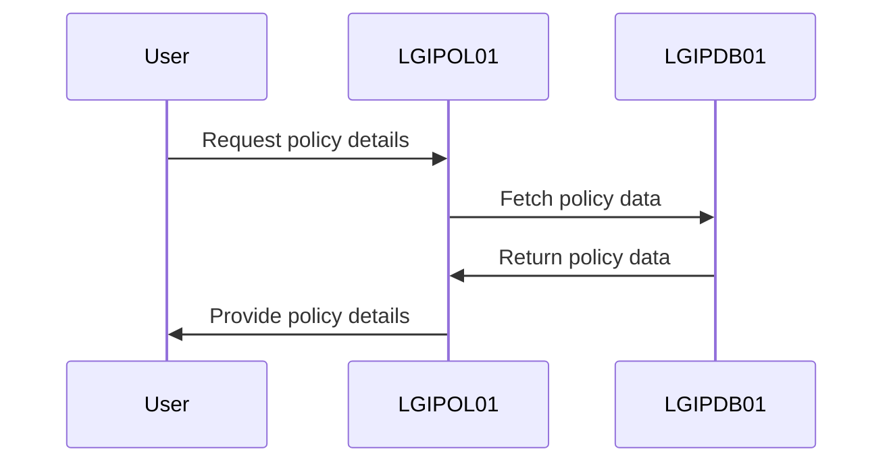

The document describes the process of inquiring about insurance policies using the <SwmToken path="base/src/lgipol01.cbl" pos="13:6:6" line-data="       PROGRAM-ID. LGIPOL01.">`LGIPOL01`</SwmToken> program. This program is responsible for obtaining full details of individual policies, such as endowment, house, or motor insurance.

For example, if a user requests details for a motor policy, the program retrieves and returns the complete policy information.

The main steps are:

- Initialize transaction details
- Check for communication area
- Call <SwmToken path="base/src/lgipol01.cbl" pos="91:9:9" line-data="           EXEC CICS LINK Program(LGIPDB01)">`LGIPDB01`</SwmToken> to fetch policy data
- Return control to CICS



## Dependencies

### Programs

- <SwmToken path="base/src/lgipol01.cbl" pos="91:9:9" line-data="           EXEC CICS LINK Program(LGIPDB01)">`LGIPDB01`</SwmToken> (<SwmPath>[base/src/lgipdb01.cbl](base/src/lgipdb01.cbl)</SwmPath>) - <SwmLink doc-title="Policy Inquiry (LGIPDB01)">[Policy Inquiry (LGIPDB01)](/.swm/policy-inquiry-lgipdb01.183np482.sw.md)</SwmLink>
- LGSTSQ (<SwmPath>[base/src/lgstsq.cbl](base/src/lgstsq.cbl)</SwmPath>) - <SwmLink doc-title="Message Queue Handler (LGSTSQ)">[Message Queue Handler (LGSTSQ)](/.swm/message-queue-handler-lgstsq.e7y8uelv.sw.md)</SwmLink>

### Copybooks

- SQLCA
- LGPOLICY (<SwmPath>[base/src/lgpolicy.cpy](base/src/lgpolicy.cpy)</SwmPath>)
- LGCMAREA (<SwmPath>[base/src/lgcmarea.cpy](base/src/lgcmarea.cpy)</SwmPath>)

# Where is this program used?

This program is used multiple times in the codebase as represented in the following diagram:

```mermaid
graph TD
  7h34r("Commercial Policy Menu (LGTESTP4)") --> 5ij9d("Policy Inquiry Logic (LGIPOL01)"):::currentEntity
click 7h34r openCode "base/src/lgtestp4.cbl:1"
w11jd("Motor Policy Menu (LGTESTP1)") --> 5ij9d("Policy Inquiry Logic (LGIPOL01)"):::currentEntity
click w11jd openCode "base/src/lgtestp1.cbl:1"
9mxrb("House Policy Transactions Menu (LGTESTP3)") --> 5ij9d("Policy Inquiry Logic (LGIPOL01)"):::currentEntity
click 9mxrb openCode "base/src/lgtestp3.cbl:1"
tzsho("Endowment Policy Transactions (LGTESTP2)") --> 5ij9d("Policy Inquiry Logic (LGIPOL01)"):::currentEntity
click tzsho openCode "base/src/lgtestp2.cbl:1"
  
  
click 5ij9d openCode "base/src/lgipol01.cbl:1"
    classDef currentEntity color:#000000,fill:#7CB9F4

%% Swimm:
%% graph TD
%%   7h34r("Commercial Policy Menu (LGTESTP4)") --> 5ij9d("Policy Inquiry Logic (<SwmToken path="base/src/lgipol01.cbl" pos="13:6:6" line-data="       PROGRAM-ID. LGIPOL01.">`LGIPOL01`</SwmToken>)"):::currentEntity
%% click 7h34r openCode "<SwmPath>[base/src/lgtestp4.cbl](base/src/lgtestp4.cbl)</SwmPath>:1"
%% w11jd("Motor Policy Menu (LGTESTP1)") --> 5ij9d("Policy Inquiry Logic (<SwmToken path="base/src/lgipol01.cbl" pos="13:6:6" line-data="       PROGRAM-ID. LGIPOL01.">`LGIPOL01`</SwmToken>)"):::currentEntity
%% click w11jd openCode "<SwmPath>[base/src/lgtestp1.cbl](base/src/lgtestp1.cbl)</SwmPath>:1"
%% 9mxrb("House Policy Transactions Menu (LGTESTP3)") --> 5ij9d("Policy Inquiry Logic (<SwmToken path="base/src/lgipol01.cbl" pos="13:6:6" line-data="       PROGRAM-ID. LGIPOL01.">`LGIPOL01`</SwmToken>)"):::currentEntity
%% click 9mxrb openCode "<SwmPath>[base/src/lgtestp3.cbl](base/src/lgtestp3.cbl)</SwmPath>:1"
%% tzsho("Endowment Policy Transactions (LGTESTP2)") --> 5ij9d("Policy Inquiry Logic (<SwmToken path="base/src/lgipol01.cbl" pos="13:6:6" line-data="       PROGRAM-ID. LGIPOL01.">`LGIPOL01`</SwmToken>)"):::currentEntity
%% click tzsho openCode "<SwmPath>[base/src/lgtestp2.cbl](base/src/lgtestp2.cbl)</SwmPath>:1"
%%   
%%   
%% click 5ij9d openCode "<SwmPath>[base/src/lgipol01.cbl](base/src/lgipol01.cbl)</SwmPath>:1"
%%     classDef currentEntity color:#000000,fill:#7CB9F4
```



# Initializing Transaction Details

<SwmSnippet path="/base/src/lgipol01.cbl" line="70">

---

In <SwmToken path="base/src/lgipol01.cbl" pos="70:1:1" line-data="       MAINLINE SECTION.">`MAINLINE`</SwmToken>, we kick off by setting up transaction details and checking for the communication area. Missing it leads to an ABEND.

```cobol
       MAINLINE SECTION.
      *
           INITIALIZE WS-HEADER.
      *
           MOVE EIBTRNID TO WS-TRANSID.
           MOVE EIBTRMID TO WS-TERMID.
           MOVE EIBTASKN TO WS-TASKNUM.
      *
      * If NO commarea received issue an ABEND
```

---

</SwmSnippet>

<SwmSnippet path="/base/src/lgipol01.cbl" line="86">

---

In <SwmToken path="base/src/lgipol01.cbl" pos="70:1:1" line-data="       MAINLINE SECTION.">`MAINLINE`</SwmToken>, after setting up the communication area, we call <SwmToken path="base/src/lgipol01.cbl" pos="91:9:9" line-data="           EXEC CICS LINK Program(LGIPDB01)">`LGIPDB01`</SwmToken> to fetch detailed insurance policy data from the DB2 database. Once the data is retrieved, we return control to CICS, marking the end of the transaction.

```cobol
           MOVE '00' TO CA-RETURN-CODE
           MOVE EIBCALEN TO WS-CALEN.
           SET WS-ADDR-DFHCOMMAREA TO ADDRESS OF DFHCOMMAREA.
      *

           EXEC CICS LINK Program(LGIPDB01)
               Commarea(DFHCOMMAREA)
               Length(32500)
           END-EXEC.

           EXEC CICS RETURN END-EXEC.
```

---

</SwmSnippet>

&nbsp;

*This is an auto-generated document by Swimm 🌊 and has not yet been verified by a human*

<SwmMeta version="3.0.0" repo-id="Z2l0aHViJTNBJTNBa3luZHJ5bC1jaWNzLWdlbmFwcCUzQSUzQVN3aW1tLURlbW8=" repo-name="kyndryl-cics-genapp"><sup>Powered by [Swimm](/)</sup></SwmMeta>
