This document will cover the <SwmToken path="base/src/lgipol01.cbl" pos="13:6:6" line-data="       PROGRAM-ID. LGIPOL01.">`LGIPOL01`</SwmToken> program. We'll cover:

1. What the Program Does
2. Program Flow
3. Program Sections

## What the Program Does

The <SwmToken path="base/src/lgipol01.cbl" pos="13:6:6" line-data="       PROGRAM-ID. LGIPOL01.">`LGIPOL01`</SwmToken> program is designed to inquire about policy details in an insurance application. It processes requests to obtain full details of an individual policy, which can be of types Endowment, House, or Motor. The program initializes necessary variables, checks for the presence of a communication area (COMMAREA), and then calls another program, <SwmToken path="base/src/lgipol01.cbl" pos="53:3:3" line-data="       01 LGIPDB01                     PIC x(8) Value &#39;LGIPDB01&#39;.">`LGIPDB01`</SwmToken>, to retrieve the policy details.

## Program Flow

The program flow of <SwmToken path="base/src/lgipol01.cbl" pos="13:6:6" line-data="       PROGRAM-ID. LGIPOL01.">`LGIPOL01`</SwmToken> is as follows:

1. Initialize working storage variables.
2. Move transaction, terminal, and task information to working storage.
3. Check if the COMMAREA is received; if not, write an error message and abend the transaction.
4. Initialize the COMMAREA return code to zero.
5. Move the length of the COMMAREA to working storage.
6. Set the address of the COMMAREA.
7. Call the <SwmToken path="base/src/lgipol01.cbl" pos="53:3:3" line-data="       01 LGIPDB01                     PIC x(8) Value &#39;LGIPDB01&#39;.">`LGIPDB01`</SwmToken> program to retrieve policy details.
8. Return control to CICS.

```mermaid
graph TD
  A[Start] --> B[Initialize Variables]
  B --> C[Move Transaction Info]
  C --> D{COMMAREA Received?}
  D -->|No| E[Write Error Message]
  E --> F[Abend Transaction]
  D -->|Yes| G[Initialize COMMAREA Return Code]
  G --> H[Move COMMAREA Length]
  H --> I[Set COMMAREA Address]
  I --> J[Call LGIPDB01 Program]
  J --> K[Return to CICS]

%% Swimm:
%% graph TD
%%   A[Start] --> B[Initialize Variables]
%%   B --> C[Move Transaction Info]
%%   C --> D{COMMAREA Received?}
%%   D -->|No| E[Write Error Message]
%%   E --> F[Abend Transaction]
%%   D -->|Yes| G[Initialize COMMAREA Return Code]
%%   G --> H[Move COMMAREA Length]
%%   H --> I[Set COMMAREA Address]
%%   I --> J[Call <SwmToken path="base/src/lgipol01.cbl" pos="53:3:3" line-data="       01 LGIPDB01                     PIC x(8) Value &#39;LGIPDB01&#39;.">`LGIPDB01`</SwmToken> Program]
%%   J --> K[Return to CICS]
```



<SwmSnippet path="/base/src/lgipol01.cbl" line="70">

---

### MAINLINE SECTION

First, the MAINLINE SECTION initializes the working storage variables and moves transaction, terminal, and task information to working storage. It then checks if the COMMAREA is received. If not, it writes an error message and abends the transaction. If the COMMAREA is received, it initializes the COMMAREA return code to zero, moves the length of the COMMAREA to working storage, and sets the address of the COMMAREA. Finally, it calls the <SwmToken path="base/src/lgipol01.cbl" pos="53:3:3" line-data="       01 LGIPDB01                     PIC x(8) Value &#39;LGIPDB01&#39;.">`LGIPDB01`</SwmToken> program to retrieve policy details and returns control to CICS.

```cobol
       MAINLINE SECTION.
      *
           INITIALIZE WS-HEADER.
      *
           MOVE EIBTRNID TO WS-TRANSID.
           MOVE EIBTRMID TO WS-TERMID.
           MOVE EIBTASKN TO WS-TASKNUM.
      *
      * If NO commarea received issue an ABEND
           IF EIBCALEN IS EQUAL TO ZERO
               MOVE ' NO COMMAREA RECEIVED' TO EM-VARIABLE
               PERFORM WRITE-ERROR-MESSAGE
               EXEC CICS ABEND ABCODE('LGCA') NODUMP END-EXEC
           END-IF

      * initialize commarea return code to zero
           MOVE '00' TO CA-RETURN-CODE
           MOVE EIBCALEN TO WS-CALEN.
           SET WS-ADDR-DFHCOMMAREA TO ADDRESS OF DFHCOMMAREA.
      *

```

---

</SwmSnippet>

<SwmSnippet path="/base/src/lgipol01.cbl" line="107">

---

### <SwmToken path="base/src/lgipol01.cbl" pos="107:1:5" line-data="       WRITE-ERROR-MESSAGE.">`WRITE-ERROR-MESSAGE`</SwmToken>

Next, the <SwmToken path="base/src/lgipol01.cbl" pos="107:1:5" line-data="       WRITE-ERROR-MESSAGE.">`WRITE-ERROR-MESSAGE`</SwmToken> section is responsible for writing error messages to queues. It obtains and formats the current time and date, moves these values to the error message structure, and calls the LGSTSQ program to write the error message to a Transient Data Queue (TDQ). If the COMMAREA length is greater than zero, it writes up to 90 bytes of the COMMAREA to the TDQ.

```cobol
       WRITE-ERROR-MESSAGE.
      * Save SQLCODE in message
      * Obtain and format current time and date
           EXEC CICS ASKTIME ABSTIME(ABS-TIME)
           END-EXEC
           EXEC CICS FORMATTIME ABSTIME(ABS-TIME)
                     MMDDYYYY(DATE1)
                     TIME(TIME1)
           END-EXEC
           MOVE DATE1 TO EM-DATE
           MOVE TIME1 TO EM-TIME
      * Write output message to TDQ
           EXEC CICS LINK PROGRAM('LGSTSQ')
                     COMMAREA(ERROR-MSG)
                     LENGTH(LENGTH OF ERROR-MSG)
           END-EXEC.
      * Write 90 bytes or as much as we have of commarea to TDQ
           IF EIBCALEN > 0 THEN
             IF EIBCALEN < 91 THEN
               MOVE DFHCOMMAREA(1:EIBCALEN) TO CA-DATA
               EXEC CICS LINK PROGRAM('LGSTSQ')
```

---

</SwmSnippet>

&nbsp;

*This is an auto-generated document by Swimm 🌊 and has not yet been verified by a human*

<SwmMeta version="3.0.0" repo-id="Z2l0aHViJTNBJTNBa3luZHJ5bC1jaWNzLWdlbmFwcCUzQSUzQVN3aW1tLURlbW8=" repo-name="kyndryl-cics-genapp"><sup>Powered by [Swimm](/)</sup></SwmMeta>
