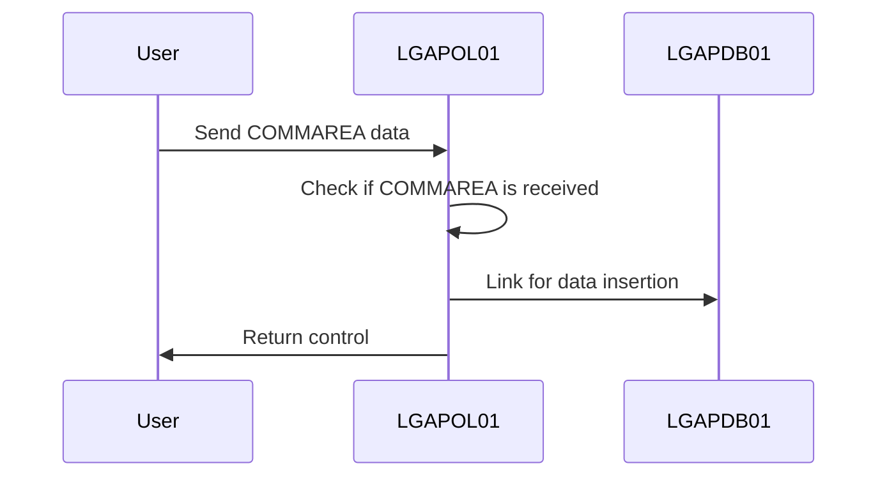
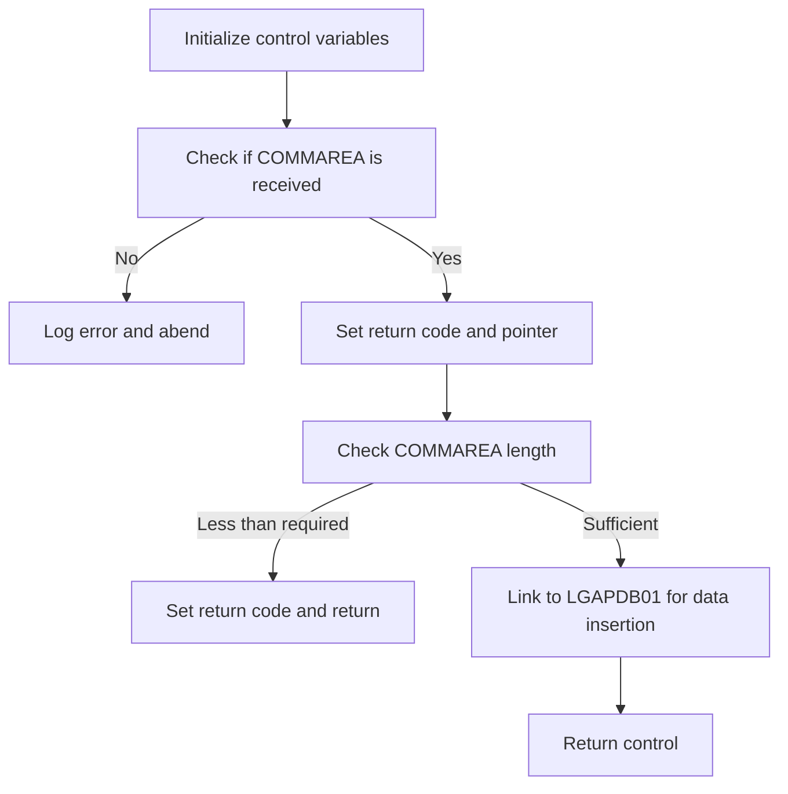

This document explains the flow of handling CICS transactions for policy operations (<SwmToken path="base/src/lgapol01.cbl" pos="2:6:6" line-data="       PROGRAM-ID. LGAPOL01.">`LGAPOL01`</SwmToken>). Within our insurance application, this program processes COMMAREA data to perform policy-related transactions. The program is responsible for handling the core operations that involve policy data insertion.

For example, if the COMMAREA data is received correctly, the program processes it and links to <SwmToken path="base/src/lgapol01.cbl" pos="103:9:9" line-data="           EXEC CICS Link Program(LGAPDB01)">`LGAPDB01`</SwmToken> for data insertion, then returns control.

The main steps are:

- Check if COMMAREA is received
- Link to <SwmToken path="base/src/lgapol01.cbl" pos="103:9:9" line-data="           EXEC CICS Link Program(LGAPDB01)">`LGAPDB01`</SwmToken> for data insertion



# Where is this program used?

This program is used multiple times in the codebase as represented in the following diagram:

```mermaid
graph TD
  z0qt2("Commercial Policy Operations (LGTESTP4)") --> kkmzv("Policy Operations Handler (LGAPOL01)"):::currentEntity
click z0qt2 openCode "base/src/lgtestp4.cbl:1"
lhfzc("Motor Policy Menu (LGTESTP1)") --> kkmzv("Policy Operations Handler (LGAPOL01)"):::currentEntity
click lhfzc openCode "base/src/lgtestp1.cbl:1"
7x9o1("House Policy Menu (LGTESTP3)") --> kkmzv("Policy Operations Handler (LGAPOL01)"):::currentEntity
click 7x9o1 openCode "base/src/lgtestp3.cbl:1"
7os6s("Endowment Policy Menu (LGTESTP2)") --> kkmzv("Policy Operations Handler (LGAPOL01)"):::currentEntity
click 7os6s openCode "base/src/lgtestp2.cbl:1"
  
  
click kkmzv openCode "base/src/lgapol01.cbl:1"
    classDef currentEntity color:#000000,fill:#7CB9F4

%% Swimm:
%% graph TD
%%   z0qt2("Commercial Policy Operations (LGTESTP4)") --> kkmzv("Policy Operations Handler (<SwmToken path="base/src/lgapol01.cbl" pos="2:6:6" line-data="       PROGRAM-ID. LGAPOL01.">`LGAPOL01`</SwmToken>)"):::currentEntity
%% click z0qt2 openCode "<SwmPath>[base/src/lgtestp4.cbl](base/src/lgtestp4.cbl)</SwmPath>:1"
%% lhfzc("Motor Policy Menu (LGTESTP1)") --> kkmzv("Policy Operations Handler (<SwmToken path="base/src/lgapol01.cbl" pos="2:6:6" line-data="       PROGRAM-ID. LGAPOL01.">`LGAPOL01`</SwmToken>)"):::currentEntity
%% click lhfzc openCode "<SwmPath>[base/src/lgtestp1.cbl](base/src/lgtestp1.cbl)</SwmPath>:1"
%% 7x9o1("House Policy Menu (LGTESTP3)") --> kkmzv("Policy Operations Handler (<SwmToken path="base/src/lgapol01.cbl" pos="2:6:6" line-data="       PROGRAM-ID. LGAPOL01.">`LGAPOL01`</SwmToken>)"):::currentEntity
%% click 7x9o1 openCode "<SwmPath>[base/src/lgtestp3.cbl](base/src/lgtestp3.cbl)</SwmPath>:1"
%% 7os6s("Endowment Policy Menu (LGTESTP2)") --> kkmzv("Policy Operations Handler (<SwmToken path="base/src/lgapol01.cbl" pos="2:6:6" line-data="       PROGRAM-ID. LGAPOL01.">`LGAPOL01`</SwmToken>)"):::currentEntity
%% click 7os6s openCode "<SwmPath>[base/src/lgtestp2.cbl](base/src/lgtestp2.cbl)</SwmPath>:1"
%%   
%%   
%% click kkmzv openCode "<SwmPath>[base/src/lgapol01.cbl](base/src/lgapol01.cbl)</SwmPath>:1"
%%     classDef currentEntity color:#000000,fill:#7CB9F4
```



# Handle CICS transaction (<SwmToken path="base/src/lgapol01.cbl" pos="68:1:3" line-data="       P100-MAIN SECTION.">`P100-MAIN`</SwmToken>)

Lets' zoom into the program flow:



<SwmSnippet path="/base/src/lgapol01.cbl" line="68">

---

### Initializing control variables

Going into the initialization step, the code sets up control variables by assigning the transaction ID, terminal ID, task number, and COMMAREA length to their respective fields. This ensures that the necessary control information is available for subsequent operations.

```cobol
       P100-MAIN SECTION.

      *----------------------------------------------------------------*
      * Common code                                                    *
      *----------------------------------------------------------------*
           INITIALIZE W1-CONTROL.
           MOVE EIBTRNID TO W1-TID.
           MOVE EIBTRMID TO W1-TRM.
           MOVE EIBTASKN TO W1-TSK.
           MOVE EIBCALEN TO W1-LEN.
```

---

</SwmSnippet>

<SwmSnippet path="/base/src/lgapol01.cbl" line="83">

---

### Checking for COMMAREA

Next, the code checks if the COMMAREA length is zero. If no COMMAREA is received, it logs an error message indicating the absence of COMMAREA and abends the transaction to prevent further processing.

```cobol
           IF EIBCALEN IS EQUAL TO ZERO
               MOVE ' NO COMMAREA RECEIVED' TO W3-DETAIL
               PERFORM P999-ERROR
               EXEC CICS ABEND ABCODE('LGCA') NODUMP END-EXEC
           END-IF
```

---

</SwmSnippet>

<SwmSnippet path="/base/src/lgapol01.cbl" line="89">

---

### Setting return code and pointer

Then, the code sets the return code to indicate successful processing and assigns the address of the COMMAREA to a pointer. It checks if the COMMAREA length is less than the required length, and if so, it sets an error return code and returns control to prevent further processing.

```cobol
           MOVE '00' TO CA-RETURN-CODE
           SET W1-PTR TO ADDRESS OF DFHCOMMAREA.

           ADD W4-HDR-LEN TO W4-REQ-LEN


           IF EIBCALEN IS LESS THAN W4-REQ-LEN
             MOVE '98' TO CA-RETURN-CODE
             EXEC CICS RETURN END-EXEC
           END-IF
```

---

</SwmSnippet>

<SwmSnippet path="/base/src/lgapol01.cbl" line="103">

---

### Linking to <SwmToken path="base/src/lgapol01.cbl" pos="103:9:9" line-data="           EXEC CICS Link Program(LGAPDB01)">`LGAPDB01`</SwmToken> for data insertion

Finally, the code links to the <SwmToken path="base/src/lgapol01.cbl" pos="103:9:9" line-data="           EXEC CICS Link Program(LGAPDB01)">`LGAPDB01`</SwmToken> program to perform the necessary data insertion operations for the policy-related transactions. After completing the data insertion, it returns control to the calling program.

More about <SwmToken path="base/src/lgapol01.cbl" pos="103:9:9" line-data="           EXEC CICS Link Program(LGAPDB01)">`LGAPDB01`</SwmToken>: <SwmLink doc-title="Managing Insurance Policies (LGAPDB01)">[Managing Insurance Policies (LGAPDB01)](/.swm/managing-insurance-policies-lgapdb01.s3y1ppwe.sw.md)</SwmLink>

```cobol
           EXEC CICS Link Program(LGAPDB01)
                Commarea(DFHCOMMAREA)
                LENGTH(32500)
           END-EXEC.

           EXEC CICS RETURN END-EXEC.
```

---

</SwmSnippet>

&nbsp;

*This is an auto-generated document by Swimm 🌊 and has not yet been verified by a human*

<SwmMeta version="3.0.0" repo-id="Z2l0aHViJTNBJTNBa3luZHJ5bC1jaWNzLWdlbmFwcCUzQSUzQVN3aW1tLURlbW8=" repo-name="kyndryl-cics-genapp"><sup>Powered by [Swimm](/)</sup></SwmMeta>
