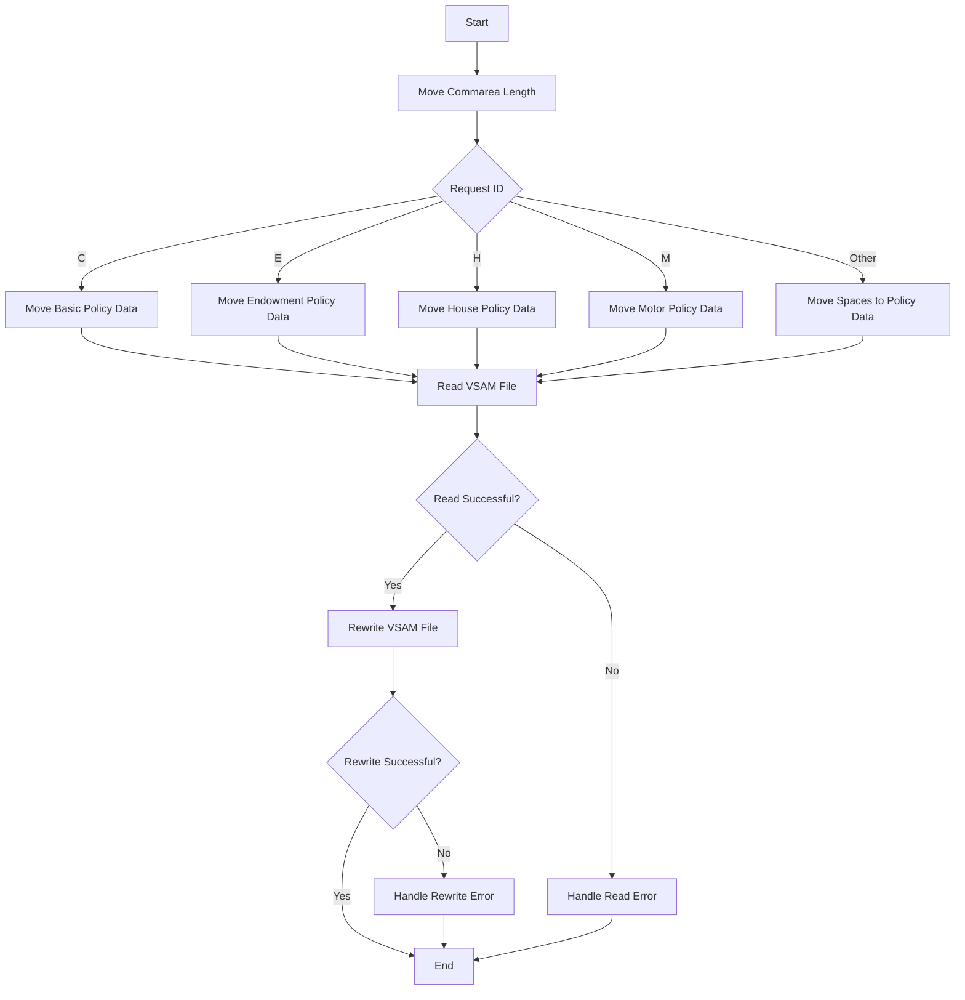

The <SwmToken path="base/src/lgupvs01.cbl" pos="11:6:6" line-data="       PROGRAM-ID. LGUPVS01.">`LGUPVS01`</SwmToken> program is a COBOL application designed to update policy records in a VSAM KSDS file. This document will cover the following aspects of the <SwmToken path="base/src/lgupvs01.cbl" pos="11:6:6" line-data="       PROGRAM-ID. LGUPVS01.">`LGUPVS01`</SwmToken> program:

1. What the Program Does
2. Program Flow
3. Program Sections

## What the Program Does

The <SwmToken path="base/src/lgupvs01.cbl" pos="11:6:6" line-data="       PROGRAM-ID. LGUPVS01.">`LGUPVS01`</SwmToken> program updates policy records in a VSAM KSDS file. It reads the policy information from the communication area, processes it based on the request ID, and then updates the VSAM file with the new policy information. The program handles different types of policy data, including basic, endowment, house, and motor policies.

## Program Flow

The program flow of <SwmToken path="base/src/lgupvs01.cbl" pos="11:6:6" line-data="       PROGRAM-ID. LGUPVS01.">`LGUPVS01`</SwmToken> involves several key steps:

1. Move the length of the communication area to a working storage variable.
2. Move policy information from the communication area to working storage variables based on the request ID.
3. Read the existing policy record from the VSAM file.
4. Update the policy record with the new information.
5. Rewrite the updated policy record back to the VSAM file.
6. Handle any errors that occur during the read or rewrite operations.



<SwmSnippet path="/base/src/lgupvs01.cbl" line="97">

---

### MAINLINE SECTION

First, the program moves the length of the communication area to a working storage variable and then moves policy information from the communication area to working storage variables based on the request ID.

```cobol
       MAINLINE SECTION.
      *
      *---------------------------------------------------------------*
           Move EIBCALEN To WS-Commarea-Len.
      *---------------------------------------------------------------*
           Move CA-Request-ID(4:1) To WF-Request-ID
           Move CA-Policy-Num      To WF-Policy-Num
           Move CA-Customer-Num    To WF-Customer-Num

           Evaluate WF-Request-ID

             When 'C'
               Move CA-B-Postcode  To WF-B-Postcode
               Move CA-B-Status    To WF-B-Status
               Move CA-B-Customer  To WF-B-Customer

             When 'E'
               Move CA-E-WITH-PROFITS To  WF-E-WITH-PROFITS
               Move CA-E-EQUITIES     To  WF-E-EQUITIES
               Move CA-E-MANAGED-FUND To  WF-E-MANAGED-FUND
               Move CA-E-FUND-NAME    To  WF-E-FUND-NAME
```

---

</SwmSnippet>

<SwmSnippet path="/base/src/lgupvs01.cbl" line="139">

---

### READ VSAM FILE

Now, the program reads the existing policy record from the VSAM file. If the read operation is not successful, it handles the error by performing the <SwmToken path="base/src/lgupvs01.cbl" pos="150:3:7" line-data="             PERFORM WRITE-ERROR-MESSAGE">`WRITE-ERROR-MESSAGE`</SwmToken> section and then abends the program.

```cobol
           Exec CICS Read File('KSDSPOLY')
                     Into(WS-FileIn)
                     Length(WS-Commarea-Len)
                     Ridfld(WF-Policy-Key)
                     KeyLength(21)
                     RESP(WS-RESP)
                     Update
           End-Exec.
           If WS-RESP Not = DFHRESP(NORMAL)
             Move EIBRESP2 To WS-RESP2
             MOVE '81' TO CA-RETURN-CODE
             PERFORM WRITE-ERROR-MESSAGE
             EXEC CICS ABEND ABCODE('LGV3') NODUMP END-EXEC
             EXEC CICS RETURN END-EXEC
           End-If.
```

---

</SwmSnippet>

<SwmSnippet path="/base/src/lgupvs01.cbl" line="155">

---

### REWRITE VSAM FILE

Then, the program rewrites the updated policy record back to the VSAM file. If the rewrite operation is not successful, it handles the error by performing the <SwmToken path="base/src/lgupvs01.cbl" pos="163:3:7" line-data="             PERFORM WRITE-ERROR-MESSAGE">`WRITE-ERROR-MESSAGE`</SwmToken> section and then abends the program.

```cobol
           Exec CICS ReWrite File('KSDSPOLY')
                     From(WF-Policy-Info)
                     Length(WS-Commarea-LenF)
                     RESP(WS-RESP)
           End-Exec.
           If WS-RESP Not = DFHRESP(NORMAL)
             Move EIBRESP2 To WS-RESP2
             MOVE '82' TO CA-RETURN-CODE
             PERFORM WRITE-ERROR-MESSAGE
             EXEC CICS ABEND ABCODE('LGV4') NODUMP END-EXEC
             EXEC CICS RETURN END-EXEC
           End-If.
```

---

</SwmSnippet>

<SwmSnippet path="/base/src/lgupvs01.cbl" line="174">

---

### <SwmToken path="base/src/lgupvs01.cbl" pos="174:1:5" line-data="       WRITE-ERROR-MESSAGE.">`WRITE-ERROR-MESSAGE`</SwmToken>

Going into the <SwmToken path="base/src/lgupvs01.cbl" pos="174:1:5" line-data="       WRITE-ERROR-MESSAGE.">`WRITE-ERROR-MESSAGE`</SwmToken> section, the program formats the current date and time, moves the error information to the error message structure, and then links to another program (LGSTSQ) to handle the error message.

```cobol
       WRITE-ERROR-MESSAGE.
           EXEC CICS ASKTIME ABSTIME(WS-ABSTIME)
           END-EXEC
           EXEC CICS FORMATTIME ABSTIME(WS-ABSTIME)
                     MMDDYYYY(WS-DATE)
                     TIME(WS-TIME)
           END-EXEC
      *
           MOVE WS-DATE TO EM-DATE
           MOVE WS-TIME TO EM-TIME
           Move CA-Customer-Num To EM-Cusnum
           Move WS-RESP         To EM-RespRC
           Move WS-RESP2        To EM-Resp2RC
           EXEC CICS LINK PROGRAM('LGSTSQ')
                     COMMAREA(ERROR-MSG)
                     LENGTH(LENGTH OF ERROR-MSG)
           END-EXEC.
           IF EIBCALEN > 0 THEN
             IF EIBCALEN < 91 THEN
               MOVE DFHCOMMAREA(1:EIBCALEN) TO CA-DATA
               EXEC CICS LINK PROGRAM('LGSTSQ')
```

---

</SwmSnippet>

&nbsp;

*This is an auto-generated document by Swimm 🌊 and has not yet been verified by a human*

<SwmMeta version="3.0.0" repo-id="Z2l0aHViJTNBJTNBa3luZHJ5bC1jaWNzLWdlbmFwcCUzQSUzQVN3aW1tLURlbW8=" repo-name="kyndryl-cics-genapp"><sup>Powered by [Swimm](/)</sup></SwmMeta>
