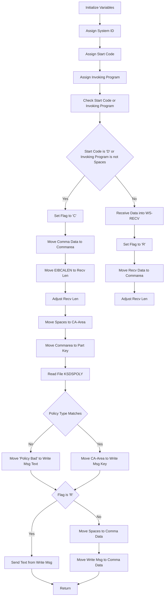

The <SwmToken path="base/src/lgipvs01.cbl" pos="13:6:6" line-data="       PROGRAM-ID. LGIPVS01.">`LGIPVS01`</SwmToken> program processes insurance policy requests in the IBM CICS Transaction Server for z/OS. It initializes variables, assigns system identifiers, and handles data reception and validation. The program reads policy information from the database and sends appropriate responses based on the policy type and request validity.

The flow starts by initializing variables and assigning system identifiers. It then checks the start code or invoking program to determine how to handle the data. The program reads the policy information from the database and validates the policy type. Based on the validation, it either sends a response or adjusts the data for further processing.

Lets' zoom into the flow:



<SwmSnippet path="/base/src/lgipvs01.cbl" line="75">

---

## Initialize Variables

First, we initialize the variable <SwmToken path="base/src/lgipvs01.cbl" pos="77:7:9" line-data="           MOVE SPACES TO WS-RECV.">`WS-RECV`</SwmToken> to spaces. This ensures that any previous data is cleared before we start processing the new request.

```cobol
       MAINLINE SECTION.
      *
           MOVE SPACES TO WS-RECV.
```

---

</SwmSnippet>

<SwmSnippet path="/base/src/lgipvs01.cbl" line="79">

---

## Assign System ID

Next, we assign the system ID to <SwmToken path="base/src/lgipvs01.cbl" pos="79:9:11" line-data="           EXEC CICS ASSIGN SYSID(WS-SYSID)">`WS-SYSID`</SwmToken> using the CICS ASSIGN command. This helps in identifying the system where the transaction is running.

```cobol
           EXEC CICS ASSIGN SYSID(WS-SYSID)
                RESP(WS-RESP)
           END-EXEC.
```

---

</SwmSnippet>

<SwmSnippet path="/base/src/lgipvs01.cbl" line="83">

---

## Assign Start Code

Then, we assign the start code to <SwmToken path="base/src/lgipvs01.cbl" pos="83:9:11" line-data="           EXEC CICS ASSIGN STARTCODE(WS-STARTCODE)">`WS-STARTCODE`</SwmToken>. The start code indicates how the transaction was initiated.

```cobol
           EXEC CICS ASSIGN STARTCODE(WS-STARTCODE)
                RESP(WS-RESP)
           END-EXEC.
```

---

</SwmSnippet>

<SwmSnippet path="/base/src/lgipvs01.cbl" line="87">

---

## Assign Invoking Program

We also assign the invoking program to <SwmToken path="base/src/lgipvs01.cbl" pos="87:9:11" line-data="           EXEC CICS ASSIGN Invokingprog(WS-Invokeprog)">`WS-Invokeprog`</SwmToken>. This helps in identifying if the transaction was invoked by another program.

```cobol
           EXEC CICS ASSIGN Invokingprog(WS-Invokeprog)
                RESP(WS-RESP)
           END-EXEC.
```

---

</SwmSnippet>

<SwmSnippet path="/base/src/lgipvs01.cbl" line="90">

---

## Check Start Code or Invoking Program

We check if the start code is 'D' or if the invoking program is not spaces. If either condition is true, we set the flag to 'C', move comma data to the commarea, and adjust the receive length. Otherwise, we receive data into <SwmToken path="base/src/lgipvs01.cbl" pos="94:7:9" line-data="              MOVE EIBCALEN    TO WS-RECV-LEN">`WS-RECV`</SwmToken>, set the flag to 'R', move the received data to the commarea, and adjust the receive length.

```cobol
           IF WS-STARTCODE(1:1) = 'D' or
              WS-Invokeprog Not = Spaces
              MOVE 'C' To WS-FLAG
              MOVE COMMA-DATA  TO WS-COMMAREA
              MOVE EIBCALEN    TO WS-RECV-LEN
              MOVE 11          TO WS-RECV-LEN
              SUBTRACT 1 FROM WS-RECV-LEN
           ELSE
              EXEC CICS RECEIVE INTO(WS-RECV)
                  LENGTH(WS-RECV-LEN)
                  RESP(WS-RESP)
              END-EXEC
              MOVE 'R' To WS-FLAG
              MOVE WS-RECV-DATA  TO WS-COMMAREA
              SUBTRACT 6 FROM WS-RECV-LEN
           END-IF.
```

---

</SwmSnippet>

<SwmSnippet path="/base/src/lgipvs01.cbl" line="107">

---

## Move Commarea to Part Key

We move the commarea data to the part key. This helps in identifying the specific part of the policy that we need to process.

```cobol
           Move Spaces                      To CA-Area
           Move WS-Commarea(1:1)            To Part-Key-Type
           Move WS-Commarea(2:WS-RECV-LEN)  To Part-Key-Num
```

---

</SwmSnippet>

<SwmSnippet path="/base/src/lgipvs01.cbl" line="111">

---

## Read File KSDSPOLY

We read the file 'KSDSPOLY' into <SwmToken path="base/src/lgipvs01.cbl" pos="112:3:5" line-data="                     Into(CA-AREA)">`CA-AREA`</SwmToken> using the part key. This retrieves the policy information from the database.

```cobol
           Exec CICS Read File('KSDSPOLY')
                     Into(CA-AREA)
                     Length(F64)
                     Ridfld(PART-KEY)
                     KeyLength(F11)
                     Generic
                     RESP(WS-RESP)
                     GTEQ
           End-Exec.
```

---

</SwmSnippet>

<SwmSnippet path="/base/src/lgipvs01.cbl" line="121">

---

## Check Policy Type

We check if the policy type matches the part key type and if the response is normal. If not, we move 'Policy Bad' to the write message text. Otherwise, we move the <SwmToken path="base/src/lgipvs01.cbl" pos="127:3:5" line-data="             Move CA-Area to WRITE-MSG-Key">`CA-Area`</SwmToken> to the write message key.

```cobol
           If CA-Policy-Type   Not = Part-Key-Type Or
              WS-RESP NOT          = DFHRESP(NORMAL)
             Move 'Policy Bad='   To Write-Msg-Text
             Move 13              To WRITE-Msg-CustNum
             Move 13              To WRITE-Msg-PolNum
           Else
             Move CA-Area to WRITE-MSG-Key
           End-If
```

---

</SwmSnippet>

<SwmSnippet path="/base/src/lgipvs01.cbl" line="130">

---

## Send or Move Write Message

If the flag is 'R', we send the text from the write message. Otherwise, we move spaces to comma data and move the write message to comma data.

```cobol
           If WS-FLAG = 'R' Then
             EXEC CICS SEND TEXT FROM(WRITE-MSG)
              WAIT
              ERASE
              LENGTH(80)
              FREEKB
             END-EXEC
           Else
             Move Spaces          To COMMA-Data
             Move Write-Msg-Text  To COMMA-Data-Text
             Move Write-Msg-Key   To COMMA-Data-Key
           End-If.
```

---

</SwmSnippet>

<SwmSnippet path="/base/src/lgipvs01.cbl" line="143">

---

## Return

Finally, we return from the transaction, completing the processing of the insurance policy request.

```cobol
           EXEC CICS RETURN
           END-EXEC.
```

---

</SwmSnippet>

&nbsp;

*This is an auto-generated document by Swimm 🌊 and has not yet been verified by a human*

<SwmMeta version="3.0.0" repo-id="Z2l0aHViJTNBJTNBa3luZHJ5bC1jaWNzLWdlbmFwcCUzQSUzQVN3aW1tLURlbW8=" repo-name="kyndryl-cics-genapp"><sup>Powered by [Swimm](/)</sup></SwmMeta>
