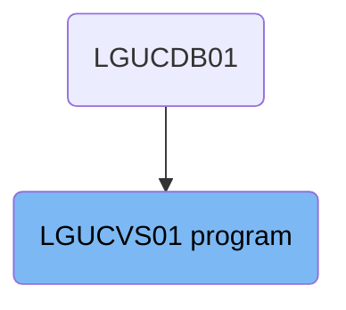
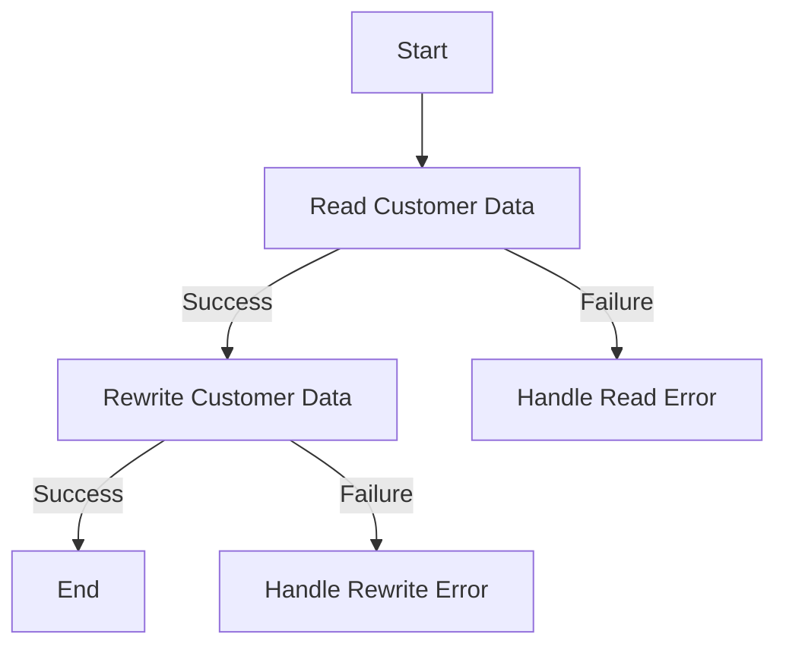

The <SwmToken path="base/src/lgucvs01.cbl" pos="11:6:6" line-data="       PROGRAM-ID. LGUCVS01.">`LGUCVS01`</SwmToken> program is responsible for reading and rewriting customer data in the system. This is achieved by first reading the customer data from the 'KSDSCUST' file into a working storage area, handling any read errors, and then attempting to rewrite the data back to the file, handling any rewrite errors.

The flow starts by reading customer data from the 'KSDSCUST' file. If the read is successful, the data is rewritten back to the file. If there are any errors during reading or rewriting, appropriate error handling routines are executed.

# Where is this program used?

This program is used once, in a flow starting from `LGUCDB01` as represented in the following diagram:



Lets' zoom into the flow:



<SwmSnippet path="/base/src/lgucvs01.cbl" line="170">

---

## Reading Customer Data

First, the program reads customer data from the file 'KSDSCUST' into <SwmToken path="base/src/lgucvs01.cbl" pos="24:3:7" line-data="       01  WS-Customer-Area          PIC X(1024) value Spaces.">`WS-Customer-Area`</SwmToken>. If the read operation is not successful, it moves the error response code to <SwmToken path="base/src/lgucvs01.cbl" pos="19:3:5" line-data="       01  WS-RESP2                  PIC S9(8) COMP.">`WS-RESP2`</SwmToken>, sets the return code to '81', performs the error message writing routine, and then abends the transaction with code <SwmToken path="base/src/lgucvs01.cbl" pos="81:10:10" line-data="             EXEC CICS ABEND ABCODE(&#39;LGV1&#39;) NODUMP END-EXEC">`LGV1`</SwmToken>.

```cobol

```

---

</SwmSnippet>

<SwmSnippet path="/base/src/lgucvs01.cbl" line="179">

---

## Rewriting Customer Data

Next, the program attempts to rewrite the customer data back to the file 'KSDSCUST'. If this operation fails, it moves the error response code to <SwmToken path="base/src/lgucvs01.cbl" pos="19:3:5" line-data="       01  WS-RESP2                  PIC S9(8) COMP.">`WS-RESP2`</SwmToken>, sets the return code to '82', performs the error message writing routine, and then abends the transaction with code <SwmToken path="base/src/lgucvs01.cbl" pos="94:10:10" line-data="             EXEC CICS ABEND ABCODE(&#39;LGV2&#39;) NODUMP END-EXEC">`LGV2`</SwmToken>.

```cobol

```

---

</SwmSnippet>

&nbsp;

*This is an auto-generated document by Swimm 🌊 and has not yet been verified by a human*

<SwmMeta version="3.0.0" repo-id="Z2l0aHViJTNBJTNBa3luZHJ5bC1jaWNzLWdlbmFwcCUzQSUzQVN3aW1tLURlbW8=" repo-name="kyndryl-cics-genapp"><sup>Powered by [Swimm](/)</sup></SwmMeta>
