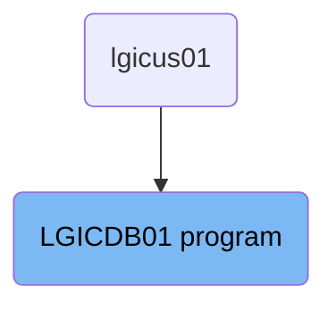
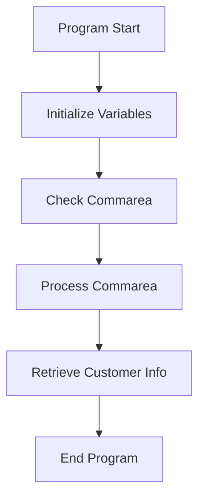

The <SwmToken path="base/src/lgicdb01.cbl" pos="12:6:6" line-data="       PROGRAM-ID. LGICDB01.">`LGICDB01`</SwmToken> program is responsible for retrieving customer information from a <SwmToken path="base/src/lgicdb01.cbl" pos="130:5:5" line-data="      * initialize DB2 host variables">`DB2`</SwmToken> database. It initializes necessary variables, checks and processes the communication area (commarea), and retrieves customer details using an SQL query.

The flow starts with initializing variables and setting up general variables like transaction ID, terminal ID, and task number. It then checks if the commarea is received and processes it to ensure it meets the minimum length requirement. The program converts the customer number to a <SwmToken path="base/src/lgicdb01.cbl" pos="130:5:5" line-data="      * initialize DB2 host variables">`DB2`</SwmToken> integer format and calls the <SwmToken path="base/src/lgicdb01.cbl" pos="154:3:7" line-data="           PERFORM GET-CUSTOMER-INFO.">`GET-CUSTOMER-INFO`</SwmToken> routine to retrieve customer details from the <SwmToken path="base/src/lgicdb01.cbl" pos="130:5:5" line-data="      * initialize DB2 host variables">`DB2`</SwmToken> database. Finally, the program returns control to the caller, marking the end of its execution.

# Where is this program used?

This program is used once, in a flow starting from `lgicus01` as represented in the following diagram:



Lets' zoom into the flow:



<SwmSnippet path="/base/src/lgicdb01.cbl" line="102">

---

## Initialize Variables

First, the program initializes working storage variables and sets up general variables like transaction ID, terminal ID, and task number. This ensures that all necessary variables are prepared for the subsequent operations.

```cobol
       MAINLINE SECTION.

      *----------------------------------------------------------------*
      * Common code                                                    *
      *----------------------------------------------------------------*
      * initialize working storage variables
           INITIALIZE WS-HEADER.
      * set up general variable
           MOVE EIBTRNID TO WS-TRANSID.
           MOVE EIBTRMID TO WS-TERMID.
           MOVE EIBTASKN TO WS-TASKNUM.
      *----------------------------------------------------------------*
```

---

</SwmSnippet>

<SwmSnippet path="/base/src/lgicdb01.cbl" line="116">

---

## Check Commarea

Next, the program checks if the communication area (commarea) is received. If no commarea is received, it issues an ABEND (abnormal end) with a specific code 'LGCA'. This step ensures that the program does not proceed without the necessary input data.

```cobol
      * Check commarea and obtain required details                     *
      *----------------------------------------------------------------*
      * If NO commarea received issue an ABEND
           IF EIBCALEN IS EQUAL TO ZERO
               MOVE ' NO COMMAREA RECEIVED' TO EM-VARIABLE
               PERFORM WRITE-ERROR-MESSAGE
               EXEC CICS ABEND ABCODE('LGCA') NODUMP END-EXEC
           END-IF
```

---

</SwmSnippet>

<SwmSnippet path="/base/src/lgicdb01.cbl" line="125">

---

## Process Commarea

Then, the program processes the incoming commarea. It checks if the commarea length meets the minimum requirement and converts the customer number to a <SwmToken path="base/src/lgicdb01.cbl" pos="130:5:5" line-data="      * initialize DB2 host variables">`DB2`</SwmToken> integer format. This step prepares the customer data for database operations.

```cobol
      * initialize commarea return code to zero
           MOVE '00' TO CA-RETURN-CODE
           MOVE EIBCALEN TO WS-CALEN.
           SET WS-ADDR-DFHCOMMAREA TO ADDRESS OF DFHCOMMAREA.

      * initialize DB2 host variables
           INITIALIZE DB2-IN-INTEGERS.

      *----------------------------------------------------------------*
      * Process incoming commarea                                      *
      *----------------------------------------------------------------*
      * check commarea length - meets minimum requirement
           MOVE WS-CUSTOMER-LEN        TO WS-REQUIRED-CA-LEN
           ADD WS-CA-HEADERTRAILER-LEN TO WS-REQUIRED-CA-LEN
      * if less set error return code and return to caller
           IF EIBCALEN IS LESS THAN WS-REQUIRED-CA-LEN
             MOVE '98' TO CA-RETURN-CODE
             EXEC CICS RETURN END-EXEC
           END-IF

      * Convert commarea customer number to DB2 integer format
```

---

</SwmSnippet>

<SwmSnippet path="/base/src/lgicdb01.cbl" line="150">

---

## Retrieve Customer Info

Moving to the next step, the program calls the <SwmToken path="base/src/lgicdb01.cbl" pos="154:3:7" line-data="           PERFORM GET-CUSTOMER-INFO.">`GET-CUSTOMER-INFO`</SwmToken> routine to issue an SQL query and obtain customer information from the <SwmToken path="base/src/lgicdb01.cbl" pos="151:9:9" line-data="      * Obtain details from DB2                                        *">`DB2`</SwmToken> database. This step is crucial for retrieving the necessary customer details.

```cobol
      *----------------------------------------------------------------*
      * Obtain details from DB2                                        *
      *----------------------------------------------------------------*
      *    Call routine to issue SQL to obtain info from DB2
           PERFORM GET-CUSTOMER-INFO.

```

---

</SwmSnippet>

<SwmSnippet path="/base/src/lgicdb01.cbl" line="157">

---

## End Program

Finally, the program reaches the <SwmToken path="base/src/lgicdb01.cbl" pos="159:1:3" line-data="       MAINLINE-END.">`MAINLINE-END`</SwmToken> section, where it returns control to the caller. This marks the end of the program's execution.

```cobol
      * END PROGRAM and return to caller                               *
      *----------------------------------------------------------------*
       MAINLINE-END.

           EXEC CICS RETURN END-EXEC.

       MAINLINE-EXIT.
           EXIT.
```

---

</SwmSnippet>

<SwmSnippet path="/base/src/lgicdb01.cbl" line="167">

---

### <SwmToken path="base/src/lgicdb01.cbl" pos="167:1:5" line-data="       GET-CUSTOMER-INFO.">`GET-CUSTOMER-INFO`</SwmToken>

The <SwmToken path="base/src/lgicdb01.cbl" pos="167:1:5" line-data="       GET-CUSTOMER-INFO.">`GET-CUSTOMER-INFO`</SwmToken> routine executes an SQL query to retrieve customer details such as first name, last name, date of birth, and contact information. It evaluates the SQLCODE to determine the success or failure of the query and sets the appropriate return code. If an error occurs, it performs the <SwmToken path="base/src/lgicdb01.cbl" pos="121:3:7" line-data="               PERFORM WRITE-ERROR-MESSAGE">`WRITE-ERROR-MESSAGE`</SwmToken> routine to log the error details.

```cobol
       GET-CUSTOMER-INFO.

           EXEC SQL
               SELECT FIRSTNAME,
                      LASTNAME,
                      DATEOFBIRTH,
                      HOUSENAME,
                      HOUSENUMBER,
                      POSTCODE,
                      PHONEMOBILE,
                      PHONEHOME,
                      EMAILADDRESS
               INTO  :CA-FIRST-NAME,
                     :CA-LAST-NAME,
                     :CA-DOB,
                     :CA-HOUSE-NAME,
                     :CA-HOUSE-NUM,
                     :CA-POSTCODE,
                     :CA-PHONE-MOBILE,
                     :CA-PHONE-HOME,
                     :CA-EMAIL-ADDRESS
```

---

</SwmSnippet>

&nbsp;

*This is an auto-generated document by Swimm 🌊 and has not yet been verified by a human*

<SwmMeta version="3.0.0" repo-id="Z2l0aHViJTNBJTNBa3luZHJ5bC1jaWNzLWdlbmFwcCUzQSUzQVN3aW1tLURlbW8=" repo-name="kyndryl-cics-genapp"><sup>Powered by [Swimm](/)</sup></SwmMeta>
