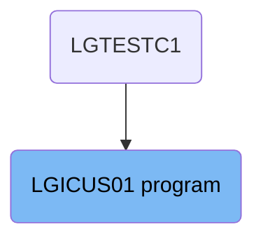
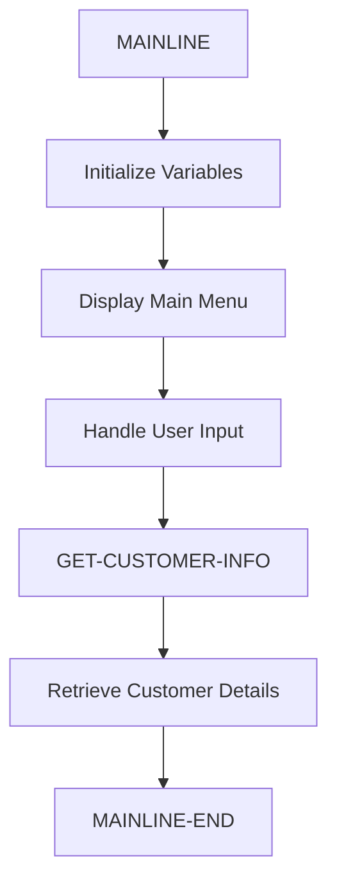

The <SwmToken path="base/src/lgicus01.cbl" pos="13:6:6" line-data="       PROGRAM-ID. LGICUS01.">`LGICUS01`</SwmToken> program is responsible for retrieving customer information in the system. It achieves this by initializing variables, displaying a main menu, handling user input, and retrieving customer details from the DB2 CUSTOMER table.

The <SwmToken path="base/src/lgicus01.cbl" pos="13:6:6" line-data="       PROGRAM-ID. LGICUS01.">`LGICUS01`</SwmToken> program starts by initializing necessary variables. It then displays a main menu to the user, allowing them to interact with the application. The program handles user input and retrieves customer details by calling another program, <SwmToken path="base/src/lgicus01.cbl" pos="52:3:3" line-data="       01 LGICDB01                  PIC X(8) Value &#39;LGICDB01&#39;.">`LGICDB01`</SwmToken>, which fetches the data from the DB2 CUSTOMER table. Finally, the program completes any remaining tasks before ending.

# Where is this program used?

This program is used once, in a flow starting from `LGTESTC1` as represented in the following diagram:



Lets' zoom into the flow:



<SwmSnippet path="/base/src/lgicus01.cbl" line="286">

---

## Initializing Variables

First, the program initializes several variables such as `SSMAPP3I`, `SSMAPP3O`, and `COMM-AREA`. This step ensures that all necessary data structures are set up correctly before proceeding with the main logic.

```cobol

```

---

</SwmSnippet>

<SwmSnippet path="/base/src/lgicus01.cbl" line="296">

---

## Display Main Menu

Next, the program displays the main menu to the user by sending the `SSMAPP3` map. This allows the user to interact with the application and make selections.

```cobol

```

---

</SwmSnippet>

<SwmSnippet path="/base/src/lgicus01.cbl" line="300">

---

## Handle User Input

Then, the program handles user input by setting up handlers for various conditions such as `CLEAR` and `PF3`. This ensures that the program can respond appropriately to different user actions.

```cobol

```

---

</SwmSnippet>

<SwmSnippet path="/base/src/lgicus01.cbl" line="308">

---

## Retrieving Customer Details

Moving to the <SwmToken path="base/src/lgicus01.cbl" pos="109:3:7" line-data="           PERFORM GET-CUSTOMER-INFO.">`GET-CUSTOMER-INFO`</SwmToken> section, the program retrieves customer details by calling the <SwmToken path="base/src/lgicus01.cbl" pos="52:3:3" line-data="       01 LGICDB01                  PIC X(8) Value &#39;LGICDB01&#39;.">`LGICDB01`</SwmToken> program. This step involves reading the customer number from the communication area and fetching the related details from the DB2 CUSTOMER table.

More about <SwmToken path="base/src/lgicus01.cbl" pos="52:3:3" line-data="       01 LGICDB01                  PIC X(8) Value &#39;LGICDB01&#39;.">`LGICDB01`</SwmToken>: <SwmLink doc-title="Handling Errors and Customer Data (LGICDB01)">[Handling Errors and Customer Data (LGICDB01)](/.swm/handling-errors-and-customer-data-lgicdb01.48861ybs.sw.md)</SwmLink>

```cobol

```

---

</SwmSnippet>

<SwmSnippet path="/base/src/lgicus01.cbl" line="316">

---

## Finalizing the Process

Finally, the <SwmToken path="base/src/lgicus01.cbl" pos="114:1:3" line-data="       MAINLINE-END.">`MAINLINE-END`</SwmToken> section handles the final operations such as providing section information and executing multiple tools in parallel. This ensures that all necessary tasks are completed before the program ends.

```cobol

```

---

</SwmSnippet>

&nbsp;

*This is an auto-generated document by Swimm 🌊 and has not yet been verified by a human*

<SwmMeta version="3.0.0" repo-id="Z2l0aHViJTNBJTNBa3luZHJ5bC1jaWNzLWdlbmFwcCUzQSUzQVN3aW1tLURlbW8=" repo-name="kyndryl-cics-genapp"><sup>Powered by [Swimm](/)</sup></SwmMeta>
