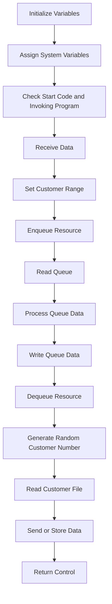

The <SwmToken path="base/src/lgicvs01.cbl" pos="17:6:6" line-data="       PROGRAM-ID. LGICVS01.">`LGICVS01`</SwmToken> program is responsible for managing customer data within the system. It achieves this by initializing variables, assigning system variables, checking start codes, receiving data, setting customer ranges, enqueuing and dequeuing resources, reading and processing queue data, writing queue data, generating random customer numbers, reading customer files, and finally sending or storing data before returning control.

The flow starts by initializing variables and assigning system variables to capture necessary information. It then checks the start code and invoking program to determine the next steps. Data is received and customer ranges are set. Resources are enqueued to ensure exclusive access, and queue data is read and processed. Based on certain flags, appropriate messages are written to the queue. A random customer number is generated, and the customer file is read using this number. Depending on a flag, data is either sent as a text message or stored in the communication area. Finally, control is returned to the calling program.

Lets' zoom into the flow:



<SwmSnippet path="/base/src/lgicvs01.cbl" line="93">

---

## Initialize Variables

First, we initialize the variable <SwmToken path="base/src/lgicvs01.cbl" pos="95:7:9" line-data="           MOVE SPACES TO WS-RECV.">`WS-RECV`</SwmToken> to spaces to ensure it starts with a clean state.

```cobol
       MAINLINE SECTION.
      *
           MOVE SPACES TO WS-RECV.
```

---

</SwmSnippet>

<SwmSnippet path="/base/src/lgicvs01.cbl" line="97">

---

## Assign System Variables

Next, we assign system variables such as <SwmToken path="base/src/lgicvs01.cbl" pos="97:7:7" line-data="           EXEC CICS ASSIGN SYSID(WS-SYSID)">`SYSID`</SwmToken>, <SwmToken path="base/src/lgicvs01.cbl" pos="101:7:7" line-data="           EXEC CICS ASSIGN STARTCODE(WS-STARTCODE)">`STARTCODE`</SwmToken>, and <SwmToken path="base/src/lgicvs01.cbl" pos="105:7:7" line-data="           EXEC CICS ASSIGN Invokingprog(WS-Invokeprog)">`Invokingprog`</SwmToken> to capture the system ID, start code, and invoking program respectively.

```cobol
           EXEC CICS ASSIGN SYSID(WS-SYSID)
                RESP(WS-RESP)
           END-EXEC.

           EXEC CICS ASSIGN STARTCODE(WS-STARTCODE)
                RESP(WS-RESP)
           END-EXEC.

           EXEC CICS ASSIGN Invokingprog(WS-Invokeprog)
                RESP(WS-RESP)
           END-EXEC.
```

---

</SwmSnippet>

<SwmSnippet path="/base/src/lgicvs01.cbl" line="108">

---

## Check Start Code and Invoking Program

Then, we check if the start code is 'D' or if the invoking program is not empty. If either condition is true, we set the flag <SwmToken path="base/src/lgicvs01.cbl" pos="110:9:11" line-data="              MOVE &#39;C&#39; To WS-FLAG">`WS-FLAG`</SwmToken> to 'C' and move the communication area data to <SwmToken path="base/src/lgicvs01.cbl" pos="111:9:11" line-data="              MOVE COMMA-DATA  TO WS-COMMAREA">`WS-COMMAREA`</SwmToken>. Otherwise, we receive data into <SwmToken path="base/src/lgicvs01.cbl" pos="112:7:9" line-data="              MOVE EIBCALEN    TO WS-RECV-LEN">`WS-RECV`</SwmToken> and set the flag to 'R'.

```cobol
           IF WS-STARTCODE(1:1) = 'D' or
              WS-Invokeprog Not = Spaces
              MOVE 'C' To WS-FLAG
              MOVE COMMA-DATA  TO WS-COMMAREA
              MOVE EIBCALEN    TO WS-RECV-LEN
           ELSE
              EXEC CICS RECEIVE INTO(WS-RECV)
                  LENGTH(WS-RECV-LEN)
                  RESP(WS-RESP)
              END-EXEC
              MOVE 'R' To WS-FLAG
              MOVE WS-RECV-DATA  TO WS-COMMAREA
              SUBTRACT 5 FROM WS-RECV-LEN
           END-IF.
```

---

</SwmSnippet>

<SwmSnippet path="/base/src/lgicvs01.cbl" line="123">

---

## Set Customer Range

We set the initial customer range by moving specific values to <SwmToken path="base/src/lgicvs01.cbl" pos="123:7:11" line-data="           Move 0001000001 to WS-Cust-Low">`WS-Cust-Low`</SwmToken> and <SwmToken path="base/src/lgicvs01.cbl" pos="124:7:11" line-data="           Move 0001000001 to WS-Cust-High">`WS-Cust-High`</SwmToken>, and set flags <SwmToken path="base/src/lgicvs01.cbl" pos="125:9:13" line-data="           Move &#39;Y&#39;        to WS-FLAG-TSQE">`WS-FLAG-TSQE`</SwmToken>, <SwmToken path="base/src/lgicvs01.cbl" pos="126:9:13" line-data="           Move &#39;Y&#39;        to WS-FLAG-TSQH">`WS-FLAG-TSQH`</SwmToken>, and <SwmToken path="base/src/lgicvs01.cbl" pos="127:9:13" line-data="           Move &#39;Y&#39;        to WS-FLAG-TSQL">`WS-FLAG-TSQL`</SwmToken> to 'Y'.

```cobol
           Move 0001000001 to WS-Cust-Low
           Move 0001000001 to WS-Cust-High
           Move 'Y'        to WS-FLAG-TSQE
           Move 'Y'        to WS-FLAG-TSQH
           Move 'Y'        to WS-FLAG-TSQL
```

---

</SwmSnippet>

<SwmSnippet path="/base/src/lgicvs01.cbl" line="129">

---

## Enqueue Resource

We enqueue the resource <SwmToken path="base/src/lgicvs01.cbl" pos="129:9:11" line-data="           EXEC CICS ENQ Resource(STSQ-NAME)">`STSQ-NAME`</SwmToken> to ensure exclusive access to the temporary storage queue.

```cobol
           EXEC CICS ENQ Resource(STSQ-NAME)
                         Length(Length Of STSQ-NAME)
           END-EXEC.
```

---

</SwmSnippet>

<SwmSnippet path="/base/src/lgicvs01.cbl" line="132">

---

## Read Queue

We read the first item from the temporary storage queue <SwmToken path="base/src/lgicvs01.cbl" pos="132:11:13" line-data="           Exec CICS ReadQ TS Queue(STSQ-NAME)">`STSQ-NAME`</SwmToken> into <SwmToken path="base/src/lgicvs01.cbl" pos="133:3:5" line-data="                     Into(READ-MSG)">`READ-MSG`</SwmToken>.

```cobol
           Exec CICS ReadQ TS Queue(STSQ-NAME)
                     Into(READ-MSG)
                     Resp(WS-RESP)
                     Item(1)
           End-Exec.
```

---

</SwmSnippet>

<SwmSnippet path="/base/src/lgicvs01.cbl" line="137">

---

## Process Queue Data

If the response is normal, we process the queue data by checking for specific messages ('LOW CUSTOMER' and 'HIGH CUSTOMER') and updating the customer range accordingly.

```cobol
           If WS-RESP = DFHRESP(NORMAL)
              Move Space to WS-FLAG-TSQE
              Perform With Test after Until WS-RESP > 0
                 Exec CICS ReadQ TS Queue(STSQ-NAME)
                     Into(READ-MSG)
                     Resp(WS-RESP)
                     Next
                 End-Exec
                 If WS-RESP = DFHRESP(NORMAL) And
                      Read-Msg-Msg(1:12) = 'LOW CUSTOMER'
                      Move READ-CUST-LOW to WS-Cust-Low
                      Move Space to WS-FLAG-TSQL
                 End-If
                 If WS-RESP = DFHRESP(NORMAL) And
                      Read-Msg-Msg(1:13) = 'HIGH CUSTOMER'
                      Move READ-CUST-HIGH to WS-Cust-High
                      Move Space to WS-FLAG-TSQH
                 End-If
              End-Perform
```

---

</SwmSnippet>

<SwmSnippet path="/base/src/lgicvs01.cbl" line="162">

---

## Write Queue Data

Based on the flags <SwmToken path="base/src/lgicvs01.cbl" pos="162:3:7" line-data="           If WS-FLAG-TSQE = &#39;Y&#39;">`WS-FLAG-TSQE`</SwmToken>, <SwmToken path="base/src/lgicvs01.cbl" pos="171:3:7" line-data="           If WS-FLAG-TSQL = &#39;Y&#39;">`WS-FLAG-TSQL`</SwmToken>, and <SwmToken path="base/src/lgicvs01.cbl" pos="180:3:7" line-data="           If WS-FLAG-TSQH = &#39;Y&#39;">`WS-FLAG-TSQH`</SwmToken>, we write the appropriate messages to the temporary storage queue.

```cobol
           If WS-FLAG-TSQE = 'Y'
             EXEC CICS WRITEQ TS QUEUE(STSQ-NAME)
                       FROM(WRITE-MSG-E)
                       RESP(WS-RESP)
                       NOSUSPEND
                       LENGTH(20)
             END-EXEC
           End-If.
      *
           If WS-FLAG-TSQL = 'Y'
             EXEC CICS WRITEQ TS QUEUE(STSQ-NAME)
                       FROM(WRITE-MSG-L)
                       RESP(WS-RESP)
                       NOSUSPEND
                       LENGTH(23)
             END-EXEC
           End-If.
      *
           If WS-FLAG-TSQH = 'Y'
             EXEC CICS WRITEQ TS QUEUE(STSQ-NAME)
                       FROM(WRITE-MSG-H)
```

---

</SwmSnippet>

<SwmSnippet path="/base/src/lgicvs01.cbl" line="189">

---

## Dequeue Resource

We dequeue the resource <SwmToken path="base/src/lgicvs01.cbl" pos="189:9:11" line-data="           EXEC CICS DEQ Resource(STSQ-NAME)">`STSQ-NAME`</SwmToken> to release the exclusive access to the temporary storage queue.

```cobol
           EXEC CICS DEQ Resource(STSQ-NAME)
                         Length(Length Of STSQ-NAME)
           END-EXEC.
```

---

</SwmSnippet>

<SwmSnippet path="/base/src/lgicvs01.cbl" line="193">

---

## Generate Random Customer Number

We generate a random customer number within the specified range and move it to <SwmToken path="base/src/lgicvs01.cbl" pos="197:11:15" line-data="           Move WS-Random-Number to WRITE-MSG-HIGH">`WRITE-MSG-HIGH`</SwmToken>.

```cobol
           Compute WS-Random-Number = Function Integer((
                     Function Random(EIBTASKN) *
                       (ws-cust-high - ws-cust-low)) +
                          WS-Cust-Low)
           Move WS-Random-Number to WRITE-MSG-HIGH
```

---

</SwmSnippet>

<SwmSnippet path="/base/src/lgicvs01.cbl" line="199">

---

## Read Customer File

We read the customer file <SwmToken path="base/src/lgicvs01.cbl" pos="199:10:10" line-data="           Exec CICS Read File(&#39;KSDSCUST&#39;)">`KSDSCUST`</SwmToken> using the random customer number as the key. If the response is normal, we move the customer number to <SwmToken path="base/src/lgicvs01.cbl" pos="202:3:7" line-data="                     Ridfld(WRITE-MSG-HIGH)">`WRITE-MSG-HIGH`</SwmToken>.

```cobol
           Exec CICS Read File('KSDSCUST')
                     Into(CA-AREA)
                     Length(F82)
                     Ridfld(WRITE-MSG-HIGH)
                     KeyLength(F10)
                     RESP(WS-RESP)
                     GTEQ
           End-Exec.
           If WS-RESP = DFHRESP(NORMAL)
             Move CA-Customer-Num to WRITE-MSG-HIGH
           End-if.
```

---

</SwmSnippet>

<SwmSnippet path="/base/src/lgicvs01.cbl" line="211">

---

## Send or Store Data

If the flag <SwmToken path="base/src/lgicvs01.cbl" pos="211:3:5" line-data="           If WS-FLAG = &#39;R&#39; Then">`WS-FLAG`</SwmToken> is 'R', we send the data as a text message. Otherwise, we store the data in the communication area.

```cobol
           If WS-FLAG = 'R' Then
             EXEC CICS SEND TEXT FROM(WRITE-MSG-H)
              WAIT
              ERASE
              LENGTH(24)
              FREEKB
             END-EXEC
           Else
             Move Spaces To COMMA-Data
             Move Write-Msg-H    To COMMA-Data-H
             Move Write-Msg-High To COMMA-Data-High
           End-If.
```

---

</SwmSnippet>

<SwmSnippet path="/base/src/lgicvs01.cbl" line="224">

---

## Return Control

Finally, we return control to the calling program.

```cobol
           EXEC CICS RETURN
           END-EXEC.
```

---

</SwmSnippet>

&nbsp;

*This is an auto-generated document by Swimm 🌊 and has not yet been verified by a human*

<SwmMeta version="3.0.0" repo-id="Z2l0aHViJTNBJTNBa3luZHJ5bC1jaWNzLWdlbmFwcCUzQSUzQVN3aW1tLURlbW8=" repo-name="kyndryl-cics-genapp"><sup>Powered by [Swimm](/)</sup></SwmMeta>
