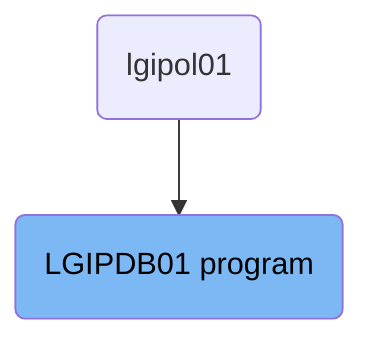
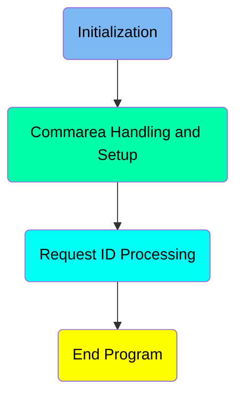
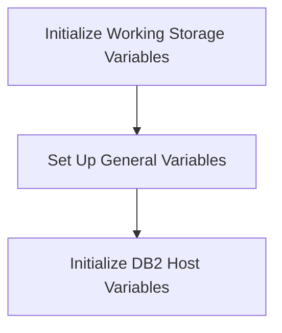
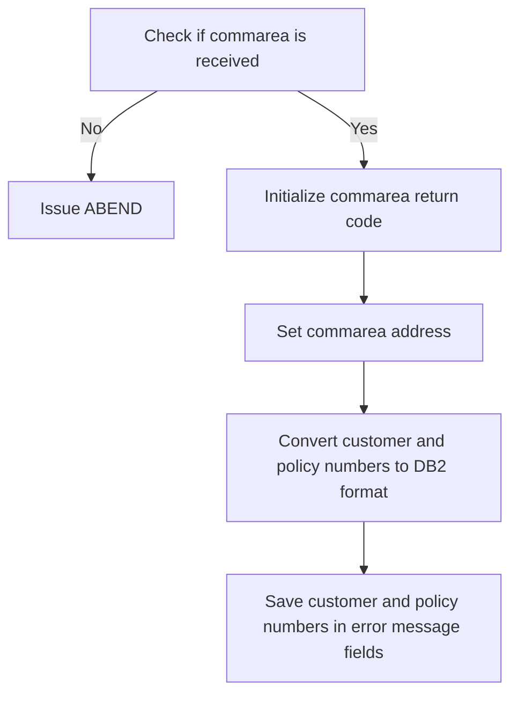
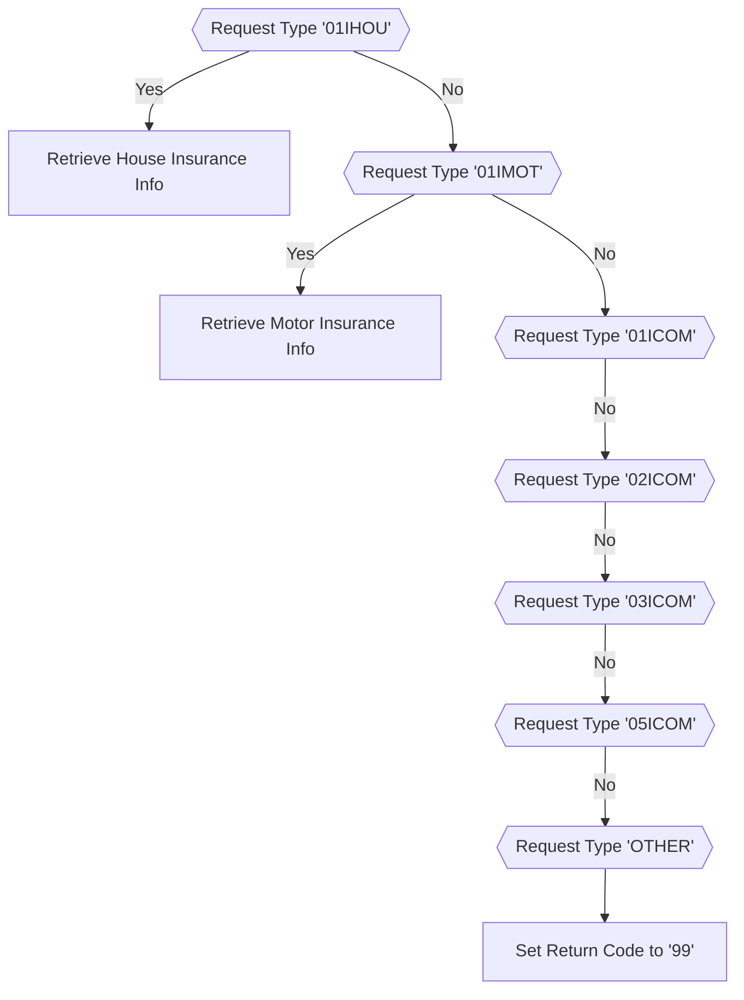
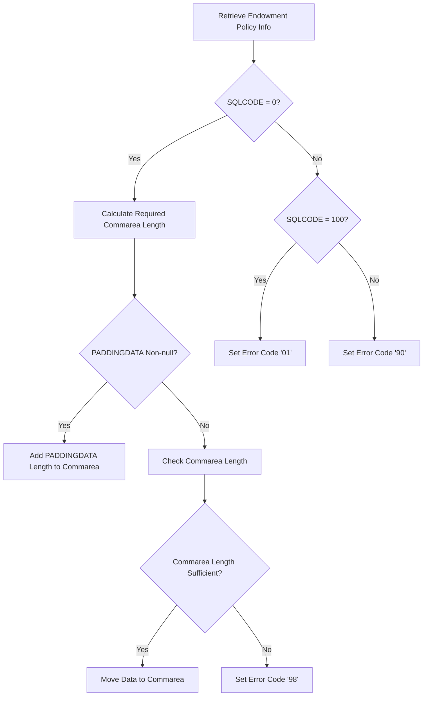

The <SwmToken path="base/src/lgipdb01.cbl" pos="13:6:6" line-data="       PROGRAM-ID. LGIPDB01.">`LGIPDB01`</SwmToken> program is responsible for handling various insurance policy information requests in the system. It is used once in a flow starting from the `lgipol01` program. The program initializes necessary variables, processes communication areas, and retrieves insurance information from the IBM Db2 database based on the request type.

The <SwmToken path="base/src/lgipdb01.cbl" pos="13:6:6" line-data="       PROGRAM-ID. LGIPDB01.">`LGIPDB01`</SwmToken> program starts by initializing working storage and <SwmToken path="base/src/lgipdb01.cbl" pos="242:5:5" line-data="      * initialize DB2 host variables">`DB2`</SwmToken> host variables. It then checks if the communication area is received and sets up the necessary addresses and formats. Depending on the request type, it retrieves the corresponding insurance information from the database. If the request type is not recognized, it sets an error return code.

# Where is this program used?

This program is used once, in a flow starting from `lgipol01` as represented in the following diagram:



Here is a high level diagram of the program:



# Initialization



<SwmSnippet path="/base/src/lgipdb01.cbl" line="235">

---

## Initialize Working Storage Variables

First, the working storage variables are initialized. This step ensures that all necessary variables are set to their default values before any operations are performed.

```cobol
      * initialize working storage variables
           INITIALIZE WS-HEADER.
```

---

</SwmSnippet>

<SwmSnippet path="/base/src/lgipdb01.cbl" line="237">

---

## Set Up General Variables

Moving to the next step, general variables such as transaction ID, terminal ID, and task number are set up. These variables are essential for identifying the current transaction, terminal, and task in the system.

```cobol
      * set up general variable
           MOVE EIBTRNID TO WS-TRANSID.
           MOVE EIBTRMID TO WS-TERMID.
           MOVE EIBTASKN TO WS-TASKNUM.
```

---

</SwmSnippet>

<SwmSnippet path="/base/src/lgipdb01.cbl" line="242">

---

## Initialize <SwmToken path="base/src/lgipdb01.cbl" pos="242:5:5" line-data="      * initialize DB2 host variables">`DB2`</SwmToken> Host Variables

Then, the <SwmToken path="base/src/lgipdb01.cbl" pos="242:5:5" line-data="      * initialize DB2 host variables">`DB2`</SwmToken> host variables are initialized. This step prepares the variables that will be used to interact with the <SwmToken path="base/src/lgipdb01.cbl" pos="242:5:5" line-data="      * initialize DB2 host variables">`DB2`</SwmToken> database, ensuring they are ready for data operations.

```cobol
      * initialize DB2 host variables
           INITIALIZE DB2-IN-INTEGERS.
           INITIALIZE DB2-OUT-INTEGERS.
           INITIALIZE DB2-POLICY.
```

---

</SwmSnippet>

# Commarea Handling and Setup



<SwmSnippet path="/base/src/lgipdb01.cbl" line="251">

---

## Check if commarea is received

First, the code checks if the communication area (<SwmToken path="base/src/lgipdb01.cbl" pos="373:9:9" line-data="      *      Calculate size of commarea required to return all data">`commarea`</SwmToken>) is received by evaluating if <SwmToken path="base/src/lgipdb01.cbl" pos="251:3:3" line-data="           IF EIBCALEN IS EQUAL TO ZERO">`EIBCALEN`</SwmToken> is equal to zero. If no <SwmToken path="base/src/lgipdb01.cbl" pos="373:9:9" line-data="      *      Calculate size of commarea required to return all data">`commarea`</SwmToken> is received, it moves an error message to <SwmToken path="base/src/lgipdb01.cbl" pos="252:14:16" line-data="             MOVE &#39; NO COMMAREA RECEIVED&#39; TO EM-VARIABLE">`EM-VARIABLE`</SwmToken>, performs the <SwmToken path="base/src/lgipdb01.cbl" pos="253:3:7" line-data="             PERFORM WRITE-ERROR-MESSAGE">`WRITE-ERROR-MESSAGE`</SwmToken> routine, and issues an ABEND with code 'LGCA'. This ensures that the program does not proceed without the necessary communication data.

```cobol
           IF EIBCALEN IS EQUAL TO ZERO
             MOVE ' NO COMMAREA RECEIVED' TO EM-VARIABLE
             PERFORM WRITE-ERROR-MESSAGE
             EXEC CICS ABEND ABCODE('LGCA') NODUMP END-EXEC
           END-IF
```

---

</SwmSnippet>

<SwmSnippet path="/base/src/lgipdb01.cbl" line="258">

---

## Initialize commarea return code

Next, the code initializes the communication area return code by moving '00' to <SwmToken path="base/src/lgipdb01.cbl" pos="258:9:13" line-data="           MOVE &#39;00&#39; TO CA-RETURN-CODE">`CA-RETURN-CODE`</SwmToken>. This sets a default return code indicating successful initialization.

```cobol
           MOVE '00' TO CA-RETURN-CODE
```

---

</SwmSnippet>

<SwmSnippet path="/base/src/lgipdb01.cbl" line="259">

---

## Set commarea address

Then, the code moves the length of the communication area (<SwmToken path="base/src/lgipdb01.cbl" pos="259:3:3" line-data="           MOVE EIBCALEN TO WS-CALEN">`EIBCALEN`</SwmToken>) to <SwmToken path="base/src/lgipdb01.cbl" pos="259:7:9" line-data="           MOVE EIBCALEN TO WS-CALEN">`WS-CALEN`</SwmToken> and sets the address of <SwmToken path="base/src/lgipdb01.cbl" pos="260:7:7" line-data="           SET WS-ADDR-DFHCOMMAREA TO ADDRESS OF DFHCOMMAREA">`DFHCOMMAREA`</SwmToken> to <SwmToken path="base/src/lgipdb01.cbl" pos="260:3:7" line-data="           SET WS-ADDR-DFHCOMMAREA TO ADDRESS OF DFHCOMMAREA">`WS-ADDR-DFHCOMMAREA`</SwmToken>. This step ensures that the program has the correct address and length of the communication area for further processing.

```cobol
           MOVE EIBCALEN TO WS-CALEN
           SET WS-ADDR-DFHCOMMAREA TO ADDRESS OF DFHCOMMAREA
```

---

</SwmSnippet>

<SwmSnippet path="/base/src/lgipdb01.cbl" line="263">

---

## Convert customer and policy numbers to <SwmToken path="base/src/lgipdb01.cbl" pos="263:11:11" line-data="           MOVE CA-CUSTOMER-NUM TO DB2-CUSTOMERNUM-INT">`DB2`</SwmToken> format

Moving to the next step, the code converts the customer and policy numbers from the communication area (<SwmToken path="base/src/lgipdb01.cbl" pos="263:3:7" line-data="           MOVE CA-CUSTOMER-NUM TO DB2-CUSTOMERNUM-INT">`CA-CUSTOMER-NUM`</SwmToken> and <SwmToken path="base/src/lgipdb01.cbl" pos="264:3:7" line-data="           MOVE CA-POLICY-NUM   TO DB2-POLICYNUM-INT">`CA-POLICY-NUM`</SwmToken>) to <SwmToken path="base/src/lgipdb01.cbl" pos="263:11:11" line-data="           MOVE CA-CUSTOMER-NUM TO DB2-CUSTOMERNUM-INT">`DB2`</SwmToken> integer format (<SwmToken path="base/src/lgipdb01.cbl" pos="263:11:15" line-data="           MOVE CA-CUSTOMER-NUM TO DB2-CUSTOMERNUM-INT">`DB2-CUSTOMERNUM-INT`</SwmToken> and <SwmToken path="base/src/lgipdb01.cbl" pos="264:11:15" line-data="           MOVE CA-POLICY-NUM   TO DB2-POLICYNUM-INT">`DB2-POLICYNUM-INT`</SwmToken>). This conversion is necessary for database operations that require integer formats.

```cobol
           MOVE CA-CUSTOMER-NUM TO DB2-CUSTOMERNUM-INT
           MOVE CA-POLICY-NUM   TO DB2-POLICYNUM-INT
```

---

</SwmSnippet>

<SwmSnippet path="/base/src/lgipdb01.cbl" line="266">

---

## Save customer and policy numbers in error message fields

Finally, the code saves the customer and policy numbers from the communication area into the error message fields (<SwmToken path="base/src/lgipdb01.cbl" pos="266:11:13" line-data="           MOVE CA-CUSTOMER-NUM TO EM-CUSNUM">`EM-CUSNUM`</SwmToken> and <SwmToken path="base/src/lgipdb01.cbl" pos="267:11:13" line-data="           MOVE CA-POLICY-NUM   TO EM-POLNUM">`EM-POLNUM`</SwmToken>). This step ensures that these values are available in case an error message needs to be generated later in the program.

```cobol
           MOVE CA-CUSTOMER-NUM TO EM-CUSNUM
           MOVE CA-POLICY-NUM   TO EM-POLNUM
```

---

</SwmSnippet>

# Request ID Processing



<SwmSnippet path="/base/src/lgipdb01.cbl" line="283">

---

## Handling <SwmToken path="base/src/lgipdb01.cbl" pos="283:4:4" line-data="             WHEN &#39;01IHOU&#39;">`01IHOU`</SwmToken> Request Type

First, we check if the request type is <SwmToken path="base/src/lgipdb01.cbl" pos="283:4:4" line-data="             WHEN &#39;01IHOU&#39;">`01IHOU`</SwmToken>. If it is, we initialize the house insurance data structure and call the <SwmToken path="base/src/lgipdb01.cbl" pos="285:3:9" line-data="               PERFORM GET-HOUSE-DB2-INFO">`GET-HOUSE-DB2-INFO`</SwmToken> function to retrieve house insurance information from the database.

```cobol
             WHEN '01IHOU'
               INITIALIZE DB2-HOUSE
               PERFORM GET-HOUSE-DB2-INFO

```

---

</SwmSnippet>

<SwmSnippet path="/base/src/lgipdb01.cbl" line="287">

---

## Handling <SwmToken path="base/src/lgipdb01.cbl" pos="287:4:4" line-data="             WHEN &#39;01IMOT&#39;">`01IMOT`</SwmToken> Request Type

Next, we check if the request type is <SwmToken path="base/src/lgipdb01.cbl" pos="287:4:4" line-data="             WHEN &#39;01IMOT&#39;">`01IMOT`</SwmToken>. If it is, we initialize the motor insurance data structure and call the <SwmToken path="base/src/lgipdb01.cbl" pos="289:3:9" line-data="               PERFORM GET-MOTOR-DB2-INFO">`GET-MOTOR-DB2-INFO`</SwmToken> function to retrieve motor insurance information from the database.

```cobol
             WHEN '01IMOT'
               INITIALIZE DB2-MOTOR
               PERFORM GET-MOTOR-DB2-INFO

```

---

</SwmSnippet>

<SwmSnippet path="/base/src/lgipdb01.cbl" line="291">

---

## Handling <SwmToken path="base/src/lgipdb01.cbl" pos="291:4:4" line-data="             WHEN &#39;01ICOM&#39;">`01ICOM`</SwmToken> Request Type

Then, we check if the request type is <SwmToken path="base/src/lgipdb01.cbl" pos="291:4:4" line-data="             WHEN &#39;01ICOM&#39;">`01ICOM`</SwmToken>. If it is, we initialize the commercial insurance data structure and call the <SwmToken path="base/src/lgipdb01.cbl" pos="293:3:11" line-data="               PERFORM GET-COMMERCIAL-DB2-INFO-1">`GET-COMMERCIAL-DB2-INFO-1`</SwmToken> function to retrieve commercial insurance information from the database.

```cobol
             WHEN '01ICOM'
               INITIALIZE DB2-COMMERCIAL
               PERFORM GET-COMMERCIAL-DB2-INFO-1
```

---

</SwmSnippet>

<SwmSnippet path="/base/src/lgipdb01.cbl" line="295">

---

## Handling <SwmToken path="base/src/lgipdb01.cbl" pos="295:4:4" line-data="             WHEN &#39;02ICOM&#39;">`02ICOM`</SwmToken> Request Type

We then check if the request type is <SwmToken path="base/src/lgipdb01.cbl" pos="295:4:4" line-data="             WHEN &#39;02ICOM&#39;">`02ICOM`</SwmToken>. If it is, we initialize the commercial insurance data structure and call the <SwmToken path="base/src/lgipdb01.cbl" pos="297:3:11" line-data="               PERFORM GET-COMMERCIAL-DB2-INFO-2">`GET-COMMERCIAL-DB2-INFO-2`</SwmToken> function to retrieve commercial insurance information from the database.

```cobol
             WHEN '02ICOM'
               INITIALIZE DB2-COMMERCIAL
               PERFORM GET-COMMERCIAL-DB2-INFO-2
```

---

</SwmSnippet>

<SwmSnippet path="/base/src/lgipdb01.cbl" line="299">

---

## Handling <SwmToken path="base/src/lgipdb01.cbl" pos="299:4:4" line-data="             WHEN &#39;03ICOM&#39;">`03ICOM`</SwmToken> Request Type

Next, we check if the request type is <SwmToken path="base/src/lgipdb01.cbl" pos="299:4:4" line-data="             WHEN &#39;03ICOM&#39;">`03ICOM`</SwmToken>. If it is, we initialize the commercial insurance data structure and call the <SwmToken path="base/src/lgipdb01.cbl" pos="301:3:11" line-data="               PERFORM GET-COMMERCIAL-DB2-INFO-3">`GET-COMMERCIAL-DB2-INFO-3`</SwmToken> function to retrieve commercial insurance information from the database.

```cobol
             WHEN '03ICOM'
               INITIALIZE DB2-COMMERCIAL
               PERFORM GET-COMMERCIAL-DB2-INFO-3
```

---

</SwmSnippet>

<SwmSnippet path="/base/src/lgipdb01.cbl" line="303">

---

## Handling <SwmToken path="base/src/lgipdb01.cbl" pos="303:4:4" line-data="             WHEN &#39;05ICOM&#39;">`05ICOM`</SwmToken> Request Type

We then check if the request type is <SwmToken path="base/src/lgipdb01.cbl" pos="303:4:4" line-data="             WHEN &#39;05ICOM&#39;">`05ICOM`</SwmToken>. If it is, we initialize the commercial insurance data structure and call the <SwmToken path="base/src/lgipdb01.cbl" pos="305:3:11" line-data="               PERFORM GET-COMMERCIAL-DB2-INFO-5">`GET-COMMERCIAL-DB2-INFO-5`</SwmToken> function to retrieve commercial insurance information from the database.

```cobol
             WHEN '05ICOM'
               INITIALIZE DB2-COMMERCIAL
               PERFORM GET-COMMERCIAL-DB2-INFO-5
```

---

</SwmSnippet>

<SwmSnippet path="/base/src/lgipdb01.cbl" line="307">

---

## Handling Other Request Types

Finally, if the request type does not match any of the specified types, we set the return code to '99' indicating an unrecognized request type.

```cobol
             WHEN OTHER
               MOVE '99' TO CA-RETURN-CODE

```

---

</SwmSnippet>

<SwmSnippet path="/base/src/lgipdb01.cbl" line="441">

---

### Retrieving House Insurance Info

The <SwmToken path="base/src/lgipdb01.cbl" pos="441:1:7" line-data="       GET-HOUSE-DB2-INFO.">`GET-HOUSE-DB2-INFO`</SwmToken> function retrieves house insurance information from the database. It constructs an SQL query to select relevant fields from the POLICY and HOUSE tables, checks the SQL execution result, and processes the retrieved data accordingly.

```cobol
       GET-HOUSE-DB2-INFO.

           MOVE ' SELECT HOUSE ' TO EM-SQLREQ
           EXEC SQL
             SELECT  ISSUEDATE,
                     EXPIRYDATE,
                     LASTCHANGED,
                     BROKERID,
                     BROKERSREFERENCE,
                     PAYMENT,
                     PROPERTYTYPE,
                     BEDROOMS,
                     VALUE,
                     HOUSENAME,
                     HOUSENUMBER,
                     POSTCODE
             INTO  :DB2-ISSUEDATE,
                   :DB2-EXPIRYDATE,
                   :DB2-LASTCHANGED,
                   :DB2-BROKERID-INT INDICATOR :IND-BROKERID,
                   :DB2-BROKERSREF INDICATOR :IND-BROKERSREF,
```

---

</SwmSnippet>

<SwmSnippet path="/base/src/lgipdb01.cbl" line="529">

---

### Retrieving Motor Insurance Info

The <SwmToken path="base/src/lgipdb01.cbl" pos="529:1:7" line-data="       GET-MOTOR-DB2-INFO.">`GET-MOTOR-DB2-INFO`</SwmToken> function retrieves motor insurance information from the database. It constructs an SQL query to select relevant fields from the POLICY and MOTOR tables, checks the SQL execution result, and processes the retrieved data accordingly.

```cobol
       GET-MOTOR-DB2-INFO.

           MOVE ' SELECT MOTOR ' TO EM-SQLREQ
           EXEC SQL
             SELECT  ISSUEDATE,
                     EXPIRYDATE,
                     LASTCHANGED,
                     BROKERID,
                     BROKERSREFERENCE,
                     PAYMENT,
                     MAKE,
                     MODEL,
                     VALUE,
                     REGNUMBER,
                     COLOUR,
                     CC,
                     YEAROFMANUFACTURE,
                     PREMIUM,
                     ACCIDENTS
             INTO  :DB2-ISSUEDATE,
                   :DB2-EXPIRYDATE,
```

---

</SwmSnippet>

## Interim Summary

So far, we saw how the program initializes working storage variables, sets up general variables, and initializes <SwmToken path="base/src/lgipdb01.cbl" pos="242:5:5" line-data="      * initialize DB2 host variables">`DB2`</SwmToken> host variables. We also covered how the program handles and sets up the communication area (commarea). Now, we will focus on processing different request types and retrieving the corresponding insurance information from the database.

# End Program



<SwmSnippet path="/base/src/lgipdb01.cbl" line="327">

---

## Retrieving Endowment Policy Info

First, the code retrieves endowment policy information from the database by executing a SQL SELECT statement. This statement joins the POLICY and ENDOWMENT tables to obtain a single row that matches the customer and policy number requested.

```cobol
       GET-ENDOW-DB2-INFO.

           MOVE ' SELECT ENDOW ' TO EM-SQLREQ
           EXEC SQL
             SELECT  ISSUEDATE,
                     EXPIRYDATE,
                     LASTCHANGED,
                     BROKERID,
                     BROKERSREFERENCE,
                     PAYMENT,
                     WITHPROFITS,
                     EQUITIES,
                     MANAGEDFUND,
                     FUNDNAME,
                     TERM,
                     SUMASSURED,
                     LIFEASSURED,
                     PADDINGDATA,
                     LENGTH(PADDINGDATA)
             INTO  :DB2-ISSUEDATE,
                   :DB2-EXPIRYDATE,
```

---

</SwmSnippet>

<SwmSnippet path="/base/src/lgipdb01.cbl" line="370">

---

## Checking SQLCODE

Next, the code checks if the SQLCODE is 0, indicating that the SELECT statement was successful.

```cobol
           IF SQLCODE = 0
      *      Select was successful

```

---

</SwmSnippet>

<SwmSnippet path="/base/src/lgipdb01.cbl" line="373">

---

## Calculating Required Commarea Length

If the SQLCODE is 0, the code calculates the size of the commarea required to return all data by adding the lengths of various components.

```cobol
      *      Calculate size of commarea required to return all data
             ADD WS-CA-HEADERTRAILER-LEN TO WS-REQUIRED-CA-LEN
             ADD WS-FULL-ENDOW-LEN       TO WS-REQUIRED-CA-LEN

```

---

</SwmSnippet>

<SwmSnippet path="/base/src/lgipdb01.cbl" line="383">

---

## Handling PADDINGDATA

The code then checks if the PADDINGDATA field is <SwmToken path="base/src/lgipdb01.cbl" pos="379:13:15" line-data="      *      check whether PADDINGDATA field is non-null">`non-null`</SwmToken>. If it is, the length of the PADDINGDATA is added to the required commarea length and the position of free space in the commarea after policy data.

```cobol
             IF IND-E-PADDINGDATAL NOT EQUAL MINUS-ONE
               ADD DB2-E-PADDING-LEN TO WS-REQUIRED-CA-LEN
               ADD DB2-E-PADDING-LEN TO END-POLICY-POS
             END-IF
```

---

</SwmSnippet>

<SwmSnippet path="/base/src/lgipdb01.cbl" line="388">

---

## Checking Commarea Length

The code checks if the received commarea length is less than the required length. If it is, an error return code '98' is set and the program returns to the caller.

```cobol
      *      if commarea received is not large enough ...
      *        set error return code and return to caller
             IF EIBCALEN IS LESS THAN WS-REQUIRED-CA-LEN
               MOVE '98' TO CA-RETURN-CODE
               EXEC CICS RETURN END-EXEC
```

---

</SwmSnippet>

<SwmSnippet path="/base/src/lgipdb01.cbl" line="394">

---

## Moving Data to Commarea

If the commarea length is sufficient, the code moves the data to the commarea, ensuring that integer fields are moved to the required length numerics and null fields are not moved.

```cobol
      *        Length is sufficent so move data to commarea
      *        Move Integer fields to required length numerics
      *        Don't move null fields
               IF IND-BROKERID NOT EQUAL MINUS-ONE
                 MOVE DB2-BROKERID-INT    TO DB2-BROKERID
               END-IF
               IF IND-PAYMENT NOT EQUAL MINUS-ONE
                 MOVE DB2-PAYMENT-INT TO DB2-PAYMENT
               END-IF
      *----------------------------------------------------------------*
               MOVE DB2-E-TERM-SINT       TO DB2-E-TERM
               MOVE DB2-E-SUMASSURED-INT  TO DB2-E-SUMASSURED

               MOVE DB2-POLICY-COMMON     TO CA-POLICY-COMMON
               MOVE DB2-ENDOW-FIXED
                   TO CA-ENDOWMENT(1:WS-ENDOW-LEN)
               IF IND-E-PADDINGDATA NOT EQUAL MINUS-ONE
                 MOVE DB2-E-PADDINGDATA TO
                     CA-E-PADDING-DATA(1:DB2-E-PADDING-LEN)
               END-IF
             END-IF
```

---

</SwmSnippet>

<SwmSnippet path="/base/src/lgipdb01.cbl" line="416">

---

## Marking End of Policy Data

The code marks the end of the policy data by moving 'FINAL' to the end of the PADDINGDATA field.

```cobol
      *      Mark the end of the policy data
             MOVE 'FINAL' TO CA-E-PADDING-DATA(END-POLICY-POS:5)

```

---

</SwmSnippet>

<SwmSnippet path="/base/src/lgipdb01.cbl" line="420">

---

## Handling <SwmToken path="base/src/lgipdb01.cbl" pos="420:3:5" line-data="      *      Non-zero SQLCODE from first SQL FETCH statement">`Non-zero`</SwmToken> SQLCODE

If the SQLCODE is not 0, the code checks if the SQLCODE is 100, indicating no rows were found. If so, an error return code '01' is set. Otherwise, an error return code '90' is set and an error message is written to the TD <SwmToken path="base/src/lgipdb01.cbl" pos="427:13:15" line-data="      *        Write error message to TD QUEUE(CSMT)">`QUEUE(CSMT`</SwmToken>).

```cobol
      *      Non-zero SQLCODE from first SQL FETCH statement
             IF SQLCODE EQUAL 100
      *        No rows found - invalid customer / policy number
               MOVE '01' TO CA-RETURN-CODE
             ELSE
      *        something has gone wrong
               MOVE '90' TO CA-RETURN-CODE
      *        Write error message to TD QUEUE(CSMT)
               PERFORM WRITE-ERROR-MESSAGE
             END-IF
```

---

</SwmSnippet>

&nbsp;

*This is an auto-generated document by Swimm 🌊 and has not yet been verified by a human*

<SwmMeta version="3.0.0" repo-id="Z2l0aHViJTNBJTNBa3luZHJ5bC1jaWNzLWdlbmFwcCUzQSUzQVN3aW1tLURlbW8=" repo-name="kyndryl-cics-genapp"><sup>Powered by [Swimm](/)</sup></SwmMeta>
