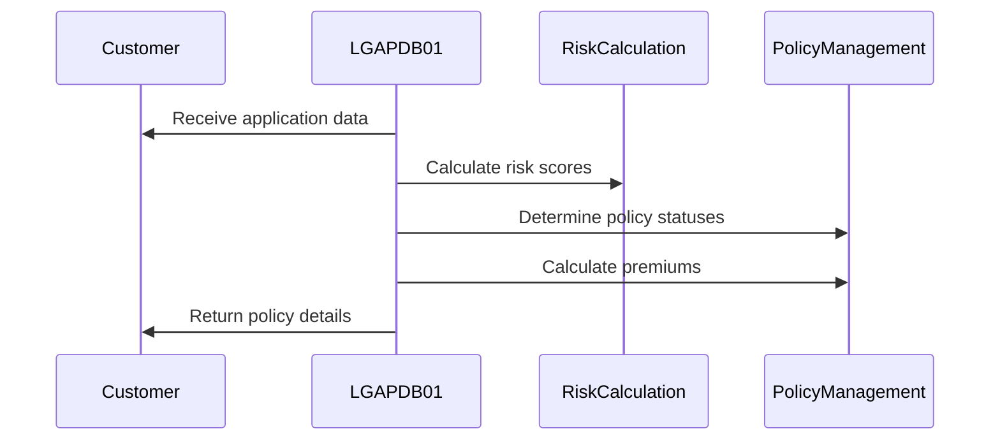
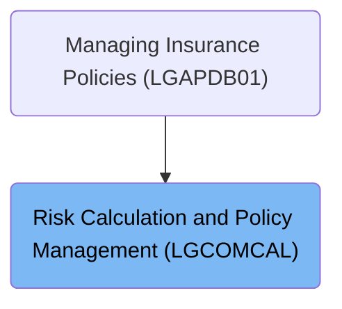
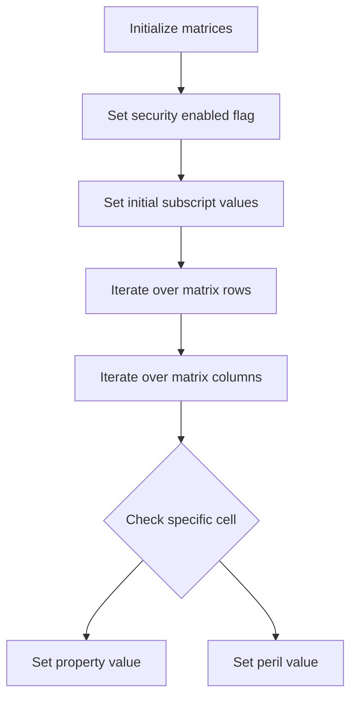
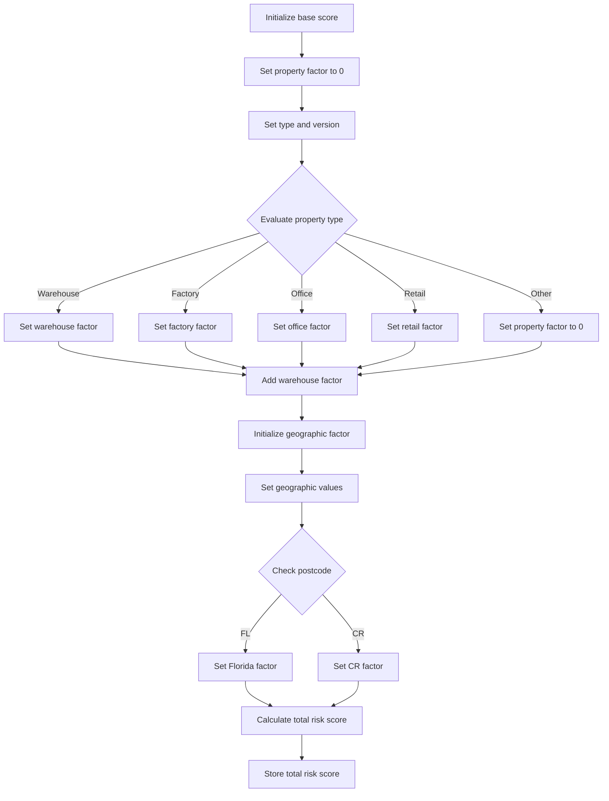
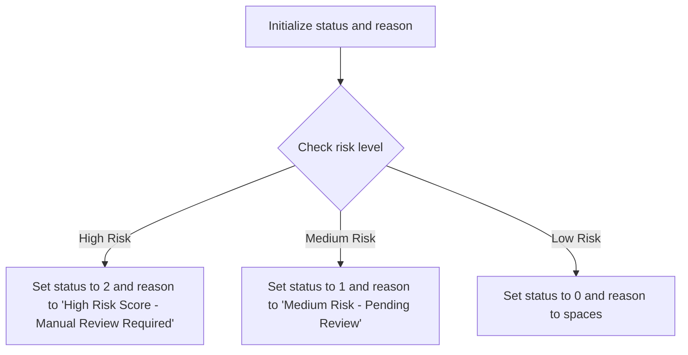

This document explains the flow of managing insurance policies (LGAPDB01). The program handles risk calculation and policy management within our insurance application system. It processes customer data to determine risk scores, policy statuses, and calculates premiums based on various factors.

For example, if a customer applies for a new policy, the program evaluates their risk score, determines the policy status, and calculates the premium amount.

The main steps are:

- Initialize processing data and set up security validation
- Calculate risk scores
- Determine policy statuses
- Calculate premiums
- Release resources and conclude the process



# Where is this program used?

This program is used once, as represented in the following diagram:



# Application processing (MAINLINE)

<SwmSnippet path="/base/src/lgcomcal.cbl" line="206">

---

### MAINLINE Section

The MAINLINE section orchestrates the overall flow of the insurance application processing. It starts by initializing processing data and setting up security validation. Next, it handles the core tasks such as calculating risk scores, determining policy statuses, and calculating premiums based on various factors. Finally, it ensures that all resources are properly released and the process is concluded smoothly.

```cobol
       MAINLINE SECTION.
           
           PERFORM INITIALIZE-PROCESSING.
           PERFORM PROCESS-BUSINESS-LOGIC.
           PERFORM CLEANUP-AND-EXIT.
```

---

</SwmSnippet>

# Initialize processing and security (<SwmToken path="base/src/lgcomcal.cbl" pos="208:3:5" line-data="           PERFORM INITIALIZE-PROCESSING.">`INITIALIZE-PROCESSING`</SwmToken>)

<SwmSnippet path="/base/src/lgcomcal.cbl" line="217">

---

Going into the <SwmToken path="base/src/lgcomcal.cbl" pos="217:1:3" line-data="       INITIALIZE-PROCESSING.">`INITIALIZE-PROCESSING`</SwmToken> function, it starts by initializing the transaction header and storing transaction-specific details such as transaction ID, terminal ID, and task number. This ensures that all subsequent processes have the necessary context for the current transaction. Next, it sets up matrices which are essential for the risk calculations and enables a security flag.

```cobol
       INITIALIZE-PROCESSING.
           INITIALIZE WS-HEADER.
           MOVE EIBTRNID TO WS-TRANSID.
           MOVE EIBTRMID TO WS-TERMID.
           MOVE EIBTASKN TO WS-TASKNUM.
           
           PERFORM INITIALIZE-MATRICES.
```

---

</SwmSnippet>

<SwmSnippet path="/base/src/lgcomcal.cbl" line="225">

---

Next, the function initializes the risk calculation workspace, preparing it for the upcoming risk assessment tasks. It then performs security validation, ensuring that all security-related flags and index values are correctly set before proceeding. This step is crucial for maintaining the integrity and security of the transaction processing.

```cobol
           INITIALIZE WS-RISK-CALC.
           
           PERFORM INIT-SECURITY-VALIDATION.
           
           EXIT.
```

---

</SwmSnippet>

# Initialize Matrices (<SwmToken path="base/src/lgcomcal.cbl" pos="223:3:5" line-data="           PERFORM INITIALIZE-MATRICES.">`INITIALIZE-MATRICES`</SwmToken>)

Lets' zoom into the program flow:



<SwmSnippet path="/base/src/lgcomcal.cbl" line="233">

---

### Initializing matrices

Going into the <SwmToken path="base/src/lgcomcal.cbl" pos="233:1:3" line-data="       INITIALIZE-MATRICES.">`INITIALIZE-MATRICES`</SwmToken> function, the first step is to enable security features for the subsequent operations. Next, the initial subscript values are set to start the matrix initialization process.

```cobol
       INITIALIZE-MATRICES.
           MOVE 'Y' TO WS-SEC-ENABLED.
           MOVE 1 TO WS-SUB-1.
           
           PERFORM VARYING WS-SUB-1 FROM 1 BY 1 
             UNTIL WS-SUB-1 > 5
               MOVE 0 TO WS-SUB-2
               PERFORM VARYING WS-SUB-2 FROM 1 BY 1 
                 UNTIL WS-SUB-2 > 6
                   IF WS-SUB-1 = 3 AND WS-SUB-2 = 2
                      MOVE 1 TO WS-RM-PROP
                   END-IF
```

---

</SwmSnippet>

<SwmSnippet path="/base/src/lgcomcal.cbl" line="233">

---

### Iterating over matrix rows and columns

Now, the function iterates over the matrix rows and columns. For each cell in the matrix, it checks specific conditions to set property and peril values. If the row is 3 and the column is 2, it sets the property value to 1.

```cobol
       INITIALIZE-MATRICES.
           MOVE 'Y' TO WS-SEC-ENABLED.
           MOVE 1 TO WS-SUB-1.
           
           PERFORM VARYING WS-SUB-1 FROM 1 BY 1 
             UNTIL WS-SUB-1 > 5
               MOVE 0 TO WS-SUB-2
               PERFORM VARYING WS-SUB-2 FROM 1 BY 1 
                 UNTIL WS-SUB-2 > 6
                   IF WS-SUB-1 = 3 AND WS-SUB-2 = 2
                      MOVE 1 TO WS-RM-PROP
                   END-IF
```

---

</SwmSnippet>

<SwmSnippet path="/base/src/lgcomcal.cbl" line="245">

---

### Setting peril value

Next, if the row is 2 and the column is 3, the function sets the peril value to 3. This ensures that the matrix is correctly initialized with the necessary values for further insurance calculations.

```cobol
                   IF WS-SUB-1 = 2 AND WS-SUB-2 = 3
                      MOVE 3 TO WS-RM-PERIL
                   END-IF
```

---

</SwmSnippet>

<SwmSnippet path="/base/src/lgcomcal.cbl" line="248">

---

### Completing the initialization

Then, the function completes the iteration over the matrix and exits. This marks the end of the matrix initialization process, ensuring that all necessary values are set for subsequent operations.

```cobol
               END-PERFORM
           END-PERFORM.
           
           EXIT.
```

---

</SwmSnippet>

# Initialize Security Validation (<SwmToken path="base/src/lgcomcal.cbl" pos="227:3:7" line-data="           PERFORM INIT-SECURITY-VALIDATION.">`INIT-SECURITY-VALIDATION`</SwmToken>)

<SwmSnippet path="/base/src/lgcomcal.cbl" line="255">

---

### Initializing Security Validation

The <SwmToken path="base/src/lgcomcal.cbl" pos="255:1:5" line-data="       INIT-SECURITY-VALIDATION.">`INIT-SECURITY-VALIDATION`</SwmToken> function sets up initial security validation flags and indexes. It sets the security check flags to indicate that the security checks are initially considered successful. It then assigns specific values to the security index variables, which are likely used in subsequent security validation processes.

```cobol
       INIT-SECURITY-VALIDATION.
           MOVE 'Y' TO WS-SEC-CHECK-OK.
           MOVE 'Y' TO WS-T24-CHECK.
           
           MOVE 1 TO WS-SEC-IDX-1.
           MOVE 2 TO WS-SEC-IDX-2.
           MOVE 4 TO WS-SEC-IDX-4.
           MOVE 3 TO WS-SEC-IDX-3.
           
           EXIT.
```

---

</SwmSnippet>

# Handle Insurance Application (<SwmToken path="base/src/lgcomcal.cbl" pos="209:3:7" line-data="           PERFORM PROCESS-BUSINESS-LOGIC.">`PROCESS-BUSINESS-LOGIC`</SwmToken>)

<SwmSnippet path="/base/src/lgcomcal.cbl" line="268">

---

### Processing Business Logic

Going into the <SwmToken path="base/src/lgcomcal.cbl" pos="268:1:5" line-data="       PROCESS-BUSINESS-LOGIC.">`PROCESS-BUSINESS-LOGIC`</SwmToken> function, it first processes the risk score for an insurance application by preparing several intermediate values based on property type and geographic factors, performing calculations, and then computing the total risk score. Next, it determines the insurance policy status by comparing the risk assessment score to predefined thresholds and assigns status and reason accordingly. Finally, it calculates insurance premiums based on various factors and performs complex premium calculations.

```cobol
       PROCESS-BUSINESS-LOGIC.
           PERFORM PROCESS-RISK-SCORE.
           PERFORM DETERMINE-POLICY-STATUS.
           PERFORM CALCULATE-PREMIUMS.
           
           EXIT.
```

---

</SwmSnippet>

# Process Risk Score (<SwmToken path="base/src/lgcomcal.cbl" pos="269:3:7" line-data="           PERFORM PROCESS-RISK-SCORE.">`PROCESS-RISK-SCORE`</SwmToken>)

Lets' zoom into the program flow:



<SwmSnippet path="/base/src/lgcomcal.cbl" line="277">

---

### Initializing base score and setting property factor

Going into the <SwmToken path="base/src/lgcomcal.cbl" pos="277:1:5" line-data="       PROCESS-RISK-SCORE.">`PROCESS-RISK-SCORE`</SwmToken> function, the initial steps involve setting up the base score and property factor. The base score is calculated by dividing the base value by 2 and then multiplying it back by 2 to get the base value. The property factor is initially set to 0. Additionally, the type is set to 'COMMERCIAL' and the version to <SwmToken path="base/src/lgcomcal.cbl" pos="285:4:8" line-data="           MOVE &#39;1.0.5&#39; TO RMS-VERSION">`1.0.5`</SwmToken>.

```cobol
       PROCESS-RISK-SCORE.
           MOVE WS-TM-BASE TO WS-TEMP-SCORE.
           DIVIDE 2 INTO WS-TEMP-SCORE GIVING WS-SUB-1.
           MULTIPLY 2 BY WS-SUB-1 GIVING WS-RC-BASE-VAL.
           
           MOVE 0 TO WS-RC-PROP-FACT.
           
           MOVE 'COMMERCIAL' TO RMS-TYPE
           MOVE '1.0.5' TO RMS-VERSION
```

---

</SwmSnippet>

<SwmSnippet path="/base/src/lgcomcal.cbl" line="287">

---

### Evaluating property type

Next, the function evaluates the property type to determine the appropriate property factor. Depending on whether the property type is 'WAREHOUSE', 'FACTORY', 'OFFICE', or 'RETAIL', the corresponding property factor value is moved and added to the property factor. If the property type is none of these, the property factor is set to 0.

```cobol
           EVALUATE CA-XPROPTYPE
               WHEN 'WAREHOUSE'
                   MOVE RMS-PF-W-VAL TO RMS-PF-WAREHOUSE
                   COMPUTE WS-TEMP-CALC = RMS-PF-WAREHOUSE
                   ADD WS-TEMP-CALC TO WS-RC-PROP-FACT
               WHEN 'FACTORY'
                   MOVE RMS-PF-F-VAL TO RMS-PF-FACTORY
                   COMPUTE WS-TEMP-CALC = RMS-PF-FACTORY
                   ADD WS-TEMP-CALC TO WS-RC-PROP-FACT
               WHEN 'OFFICE'
                   MOVE RMS-PF-O-VAL TO RMS-PF-OFFICE
                   COMPUTE WS-TEMP-CALC = RMS-PF-OFFICE
                   ADD WS-TEMP-CALC TO WS-RC-PROP-FACT
               WHEN 'RETAIL'
                   MOVE RMS-PF-R-VAL TO RMS-PF-RETAIL
                   COMPUTE WS-TEMP-CALC = RMS-PF-RETAIL
                   ADD WS-TEMP-CALC TO WS-RC-PROP-FACT
               WHEN OTHER
                   MOVE 0 TO WS-RC-PROP-FACT
           END-EVALUATE.
```

---

</SwmSnippet>

<SwmSnippet path="/base/src/lgcomcal.cbl" line="308">

---

### Setting geographic factor

Moving to the geographic factor, the function initializes it to 0 and sets the geographic values for 'FL' and 'CR'. It then checks the first two characters of the postcode to determine if it matches 'FL' or 'CR' and sets the geographic factor accordingly.

```cobol
           MOVE 0 TO WS-RC-GEO-FACT.
           
           MOVE RMS-GF-FL-VAL TO RMS-GF-FL
           MOVE RMS-GF-CR-VAL TO RMS-GF-CR
           
           IF CA-XPOSTCODE(1:2) = 'FL'
              MOVE RMS-GF-FL TO WS-RC-GEO-FACT
           ELSE
              IF CA-XPOSTCODE(1:2) = 'CR'
                 MOVE RMS-GF-CR TO WS-RC-GEO-FACT
              END-IF
```

---

</SwmSnippet>

<SwmSnippet path="/base/src/lgcomcal.cbl" line="319">

---

### Calculating and storing total risk score

Then, the function calculates the total risk score by summing the base value, property factor, and geographic factor. This total risk score is then stored in the risk score variable.

```cobol
           END-IF.
           
           COMPUTE WS-RC-TOTAL = 
              WS-RC-BASE-VAL + WS-RC-PROP-FACT + WS-RC-GEO-FACT.
              
           MOVE WS-RC-TOTAL TO WS-SA-RISK.
           
           EXIT.
```

---

</SwmSnippet>

# Determine Insurance Policy Status (<SwmToken path="base/src/lgcomcal.cbl" pos="270:3:7" line-data="           PERFORM DETERMINE-POLICY-STATUS.">`DETERMINE-POLICY-STATUS`</SwmToken>)

Lets' zoom into the program flow:



<SwmSnippet path="/base/src/lgcomcal.cbl" line="330">

---

### Initializing status and reason

Going into the <SwmToken path="base/src/lgcomcal.cbl" pos="330:1:5" line-data="       DETERMINE-POLICY-STATUS.">`DETERMINE-POLICY-STATUS`</SwmToken> function, the initial step is to set the status to 0 and clear the reason field. This prepares the function to evaluate the policy's risk level without any pre-existing values.

```cobol
       DETERMINE-POLICY-STATUS.
           MOVE 0 TO WS-RC-STATUS.
           MOVE SPACES TO WS-RC-REASON.
           
           MOVE RMS-TH-L1-VAL TO RMS-TH-LEVEL-1
           MOVE RMS-TH-L2-VAL TO RMS-TH-LEVEL-2
```

---

</SwmSnippet>

<SwmSnippet path="/base/src/lgcomcal.cbl" line="337">

---

### Evaluating high risk level

Next, the function checks if the risk score exceeds the highest threshold. If it does, the status is set to 2, and the reason is updated to 'High Risk Score - Manual Review Required'. This indicates that the policy requires a manual review due to its high risk.

```cobol
           IF WS-SA-RISK > RMS-TH-LEVEL-2
              MOVE 2 TO WS-RC-STATUS
              MOVE 'High Risk Score - Manual Review Required' 
                TO WS-RC-REASON
              MOVE WS-SA-RISK TO CID-FINAL-SCORE
              MOVE WS-RC-STATUS TO CID-STATUS
              MOVE WS-RC-REASON TO CID-REASON
```

---

</SwmSnippet>

<SwmSnippet path="/base/src/lgcomcal.cbl" line="344">

---

### Evaluating medium risk level

Then, if the risk score is above the medium threshold but not the highest, the status is set to 1, and the reason is updated to 'Medium Risk - Pending Review'. This means the policy is flagged for review but is not as urgent as a high-risk policy.

```cobol
           ELSE
              IF WS-SA-RISK > RMS-TH-LEVEL-1
                 MOVE 1 TO WS-RC-STATUS
                 MOVE 'Medium Risk - Pending Review'
                   TO WS-RC-REASON
                 MOVE WS-SA-RISK TO CID-FINAL-SCORE
                 MOVE WS-RC-STATUS TO CID-STATUS
                 MOVE WS-RC-REASON TO CID-REASON
```

---

</SwmSnippet>

<SwmSnippet path="/base/src/lgcomcal.cbl" line="352">

---

### Evaluating low risk level

Finally, if the risk score does not exceed any thresholds, the status remains 0, and the reason is cleared. This indicates that the policy is considered low risk and does not require any immediate review.

```cobol
              ELSE
                 MOVE 0 TO WS-RC-STATUS
                 MOVE SPACES TO WS-RC-REASON
                 MOVE WS-SA-RISK TO CID-FINAL-SCORE
                 MOVE WS-RC-STATUS TO CID-STATUS
                 MOVE SPACES TO CID-REASON
              END-IF
           END-IF.
           
           EXIT.
```

---

</SwmSnippet>

&nbsp;

*This is an auto-generated document by Swimm 🌊 and has not yet been verified by a human*

<SwmMeta version="3.0.0" repo-id="Z2l0aHViJTNBJTNBa3luZHJ5bC1jaWNzLWdlbmFwcCUzQSUzQVN3aW1tLURlbW8=" repo-name="kyndryl-cics-genapp"><sup>Powered by [Swimm](https://app.swimm.io/)</sup></SwmMeta>
