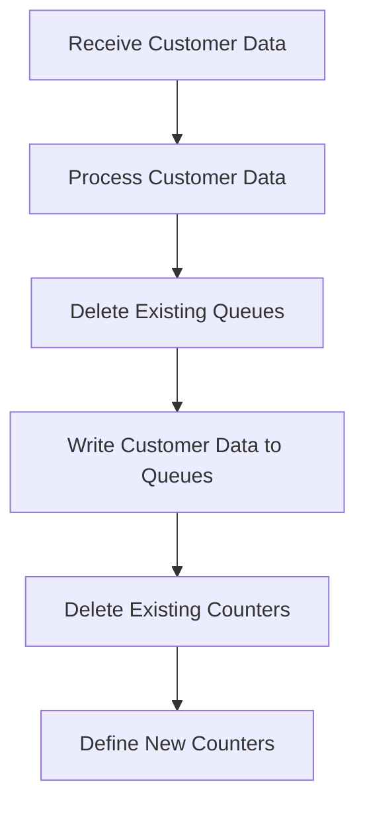

The LGSETUP program is responsible for setting up customer data and counters in the system. This is achieved by receiving and processing customer data, deleting existing queues, writing customer data to queues, and deleting and defining counters. The program ID for this process is LGSETUP.

The LGSETUP program first receives customer data and processes it. It then deletes any existing temporary storage queues to ensure no old data is present. After that, it writes the processed customer data to a specific queue. Finally, it deletes and defines a series of counters to reset and initialize them for tracking customer records.

Lets' zoom into the flow:



<SwmSnippet path="/base/src/lgsetup.cbl" line="128">

---

## Receiving and Processing Customer Data

First, the program receives customer data using the <SwmToken path="base/src/lgsetup.cbl" pos="128:1:5" line-data="           EXEC CICS RECEIVE INTO(WS-RECV)">`EXEC CICS RECEIVE`</SwmToken> command. If the length of the received data (<SwmToken path="base/src/lgsetup.cbl" pos="129:3:7" line-data="               LENGTH(WS-RECV-LEN)">`WS-RECV-LEN`</SwmToken>) is greater than 5, it subtracts 5 from the length and moves the relevant portion of the data to <SwmToken path="base/src/lgsetup.cbl" pos="134:20:20" line-data="             Move WS-RECV-DATA(1:WS-RECV-LEN)  To LastCustNum">`LastCustNum`</SwmToken>.

```cobol
           EXEC CICS RECEIVE INTO(WS-RECV)
               LENGTH(WS-RECV-LEN)
               RESP(WS-RESP)
           END-EXEC
           If WS-RECV-LEN > 5
             Subtract 5 From WS-RECV-LEN
             Move WS-RECV-DATA(1:WS-RECV-LEN)  To LastCustNum
           End-if
```

---

</SwmSnippet>

<SwmSnippet path="/base/src/lgsetup.cbl" line="138">

---

## Deleting Existing Queues

Next, the program deletes existing temporary storage queues (<SwmToken path="base/src/lgsetup.cbl" pos="138:11:13" line-data="           Exec CICS DeleteQ TS Queue(STSQ-ERRS)">`STSQ-ERRS`</SwmToken>, <SwmToken path="base/src/lgsetup.cbl" pos="142:11:13" line-data="           Exec CICS DeleteQ TS Queue(STSQ-STRT)">`STSQ-STRT`</SwmToken>, <SwmToken path="base/src/lgsetup.cbl" pos="146:11:13" line-data="           Exec CICS DeleteQ TS Queue(STSQ-STAT)">`STSQ-STAT`</SwmToken>, <SwmToken path="base/src/lgsetup.cbl" pos="150:11:13" line-data="           Exec CICS DeleteQ TS Queue(STSQ-NAME)">`STSQ-NAME`</SwmToken>) using the <SwmToken path="base/src/lgsetup.cbl" pos="128:1:1" line-data="           EXEC CICS RECEIVE INTO(WS-RECV)">`EXEC`</SwmToken>` `<SwmToken path="base/src/lgsetup.cbl" pos="138:3:3" line-data="           Exec CICS DeleteQ TS Queue(STSQ-ERRS)">`CICS`</SwmToken>` `<SwmToken path="base/src/lgsetup.cbl" pos="138:5:5" line-data="           Exec CICS DeleteQ TS Queue(STSQ-ERRS)">`DeleteQ`</SwmToken>` `<SwmToken path="base/src/lgsetup.cbl" pos="138:7:7" line-data="           Exec CICS DeleteQ TS Queue(STSQ-ERRS)">`TS`</SwmToken>` `<SwmToken path="base/src/lgsetup.cbl" pos="138:9:9" line-data="           Exec CICS DeleteQ TS Queue(STSQ-ERRS)">`Queue`</SwmToken> command to ensure no old data is present.

```cobol
           Exec CICS DeleteQ TS Queue(STSQ-ERRS)
                     Resp(WS-RESP)
           End-Exec.
      **************************************************
           Exec CICS DeleteQ TS Queue(STSQ-STRT)
                     Resp(WS-RESP)
           End-Exec.
      **************************************************
           Exec CICS DeleteQ TS Queue(STSQ-STAT)
                     Resp(WS-RESP)
           End-Exec.
      **************************************************
           Exec CICS DeleteQ TS Queue(STSQ-NAME)
                     Resp(WS-RESP)
           End-Exec.
```

---

</SwmSnippet>

<SwmSnippet path="/base/src/lgsetup.cbl" line="154">

---

## Writing Customer Data to Queues

Then, the program writes the processed customer data to the <SwmToken path="base/src/lgsetup.cbl" pos="157:11:13" line-data="             EXEC CICS WRITEQ TS QUEUE(STSQ-NAME)">`STSQ-NAME`</SwmToken> queue using the <SwmToken path="base/src/lgsetup.cbl" pos="157:1:9" line-data="             EXEC CICS WRITEQ TS QUEUE(STSQ-NAME)">`EXEC CICS WRITEQ TS QUEUE`</SwmToken> command. It writes three different messages (<SwmToken path="base/src/lgsetup.cbl" pos="158:3:7" line-data="                       FROM(WRITE-MSG-E)">`WRITE-MSG-E`</SwmToken>, <SwmToken path="base/src/lgsetup.cbl" pos="165:3:7" line-data="                       FROM(WRITE-MSG-L)">`WRITE-MSG-L`</SwmToken>, <SwmToken path="base/src/lgsetup.cbl" pos="172:3:7" line-data="                       FROM(WRITE-MSG-H)">`WRITE-MSG-H`</SwmToken>) to the queue.

```cobol
           Move FrstCustNum  to WRITE-MSG-LOW
           Move LastCustNum  to WRITE-MSG-HIGH

             EXEC CICS WRITEQ TS QUEUE(STSQ-NAME)
                       FROM(WRITE-MSG-E)
                       RESP(WS-RESP)
                       NOSUSPEND
                       LENGTH(20)
             END-EXEC

             EXEC CICS WRITEQ TS QUEUE(STSQ-NAME)
                       FROM(WRITE-MSG-L)
                       RESP(WS-RESP)
                       NOSUSPEND
                       LENGTH(23)
             END-EXEC

             EXEC CICS WRITEQ TS QUEUE(STSQ-NAME)
                       FROM(WRITE-MSG-H)
                       RESP(WS-RESP)
                       NOSUSPEND
```

---

</SwmSnippet>

<SwmSnippet path="/base/src/lgsetup.cbl" line="179">

---

## Deleting and Defining Counters

Finally, the program deletes and defines a series of counters (<SwmToken path="base/src/lgsetup.cbl" pos="179:9:9" line-data="           Exec CICS Delete Counter(GENAcount)">`GENAcount`</SwmToken>, <SwmToken path="base/src/lgsetup.cbl" pos="189:9:9" line-data="           Exec CICS Delete Counter(GENACNT100)">`GENACNT100`</SwmToken>, <SwmToken path="base/src/lgsetup.cbl" pos="198:9:9" line-data="           Exec CICS Delete Counter(GENACNT199)">`GENACNT199`</SwmToken>, etc.) using the <SwmToken path="base/src/lgsetup.cbl" pos="128:1:1" line-data="           EXEC CICS RECEIVE INTO(WS-RECV)">`EXEC`</SwmToken>` `<SwmToken path="base/src/lgsetup.cbl" pos="179:3:3" line-data="           Exec CICS Delete Counter(GENAcount)">`CICS`</SwmToken>` `<SwmToken path="base/src/lgsetup.cbl" pos="179:5:5" line-data="           Exec CICS Delete Counter(GENAcount)">`Delete`</SwmToken>` `<SwmToken path="base/src/lgsetup.cbl" pos="179:7:7" line-data="           Exec CICS Delete Counter(GENAcount)">`Counter`</SwmToken> and <SwmToken path="base/src/lgsetup.cbl" pos="128:1:1" line-data="           EXEC CICS RECEIVE INTO(WS-RECV)">`EXEC`</SwmToken>` `<SwmToken path="base/src/lgsetup.cbl" pos="179:3:3" line-data="           Exec CICS Delete Counter(GENAcount)">`CICS`</SwmToken>` `<SwmToken path="base/src/lgsetup.cbl" pos="183:5:5" line-data="           Exec CICS Define Counter(GENAcount)">`Define`</SwmToken>` `<SwmToken path="base/src/lgsetup.cbl" pos="179:7:7" line-data="           Exec CICS Delete Counter(GENAcount)">`Counter`</SwmToken> commands. This ensures that the counters are reset and initialized with appropriate values for tracking customer records.

```cobol
           Exec CICS Delete Counter(GENAcount)
                            Pool(GENApool)
                            Resp(WS-RESP)
           End-Exec.
           Exec CICS Define Counter(GENAcount)
                            Pool(GENApool)
                            Value(LastCustNum)
                            Resp(WS-RESP)
           End-Exec.
      *
           Exec CICS Delete Counter(GENACNT100)
                            Pool(GENApool)
                            Resp(WS-RESP)
           End-Exec.
           Exec CICS Define Counter(GENACNT100)
                            Pool(GENApool)
                            Value(0)
                            Resp(WS-RESP)
           End-Exec.
           Exec CICS Delete Counter(GENACNT199)
                            Pool(GENApool)
```

---

</SwmSnippet>

&nbsp;

*This is an auto-generated document by Swimm 🌊 and has not yet been verified by a human*

<SwmMeta version="3.0.0" repo-id="Z2l0aHViJTNBJTNBa3luZHJ5bC1jaWNzLWdlbmFwcCUzQSUzQVN3aW1tLURlbW8=" repo-name="kyndryl-cics-genapp"><sup>Powered by [Swimm](/)</sup></SwmMeta>
