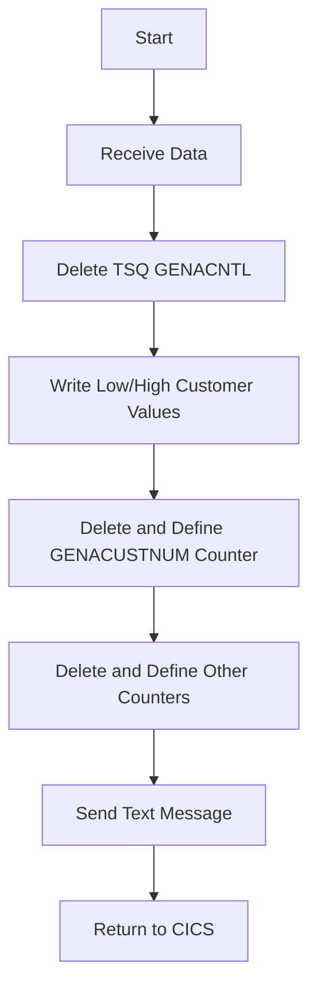

This document will cover the LGSETUP program defined in <SwmPath>[base/src/lgsetup.cbl](base/src/lgsetup.cbl)</SwmPath>. We'll cover:

1. What the Program Does
2. Program Flow
3. Program Sections

## What the Program Does

The LGSETUP program is designed to delete an existing Temporary Storage Queue (TSQ) named GENACNTL and create new low and high customer values to match a restored <SwmToken path="base/src/lgsetup.cbl" pos="6:7:7" line-data="      *  to match DB2 restored database                                *">`DB2`</SwmToken> database. Additionally, it recreates a named counter GENACUSTNUM for the next available customer number.

## Program Flow

The program starts by receiving data into working storage. It then deletes several TSQs and writes new customer low and high values to the GENACNTL TSQ. Following this, it deletes and defines a series of counters, including GENACUSTNUM and other counters with specific names. Finally, it sends a text message and returns control to CICS.



<SwmSnippet path="/base/src/lgsetup.cbl" line="126">

---

## Program Sections

First, the program receives data into the working storage section. If the length of the received data is greater than 5, it adjusts the length and moves the data to the <SwmToken path="base/src/lgsetup.cbl" pos="134:20:20" line-data="             Move WS-RECV-DATA(1:WS-RECV-LEN)  To LastCustNum">`LastCustNum`</SwmToken> variable.

```cobol
       MAINLINE SECTION.
      *
           EXEC CICS RECEIVE INTO(WS-RECV)
               LENGTH(WS-RECV-LEN)
               RESP(WS-RESP)
           END-EXEC
           If WS-RECV-LEN > 5
             Subtract 5 From WS-RECV-LEN
             Move WS-RECV-DATA(1:WS-RECV-LEN)  To LastCustNum
           End-if
```

---

</SwmSnippet>

<SwmSnippet path="/base/src/lgsetup.cbl" line="138">

---

Next, the program deletes several TSQs: <SwmToken path="base/src/lgsetup.cbl" pos="138:11:13" line-data="           Exec CICS DeleteQ TS Queue(STSQ-ERRS)">`STSQ-ERRS`</SwmToken>, <SwmToken path="base/src/lgsetup.cbl" pos="142:11:13" line-data="           Exec CICS DeleteQ TS Queue(STSQ-STRT)">`STSQ-STRT`</SwmToken>, <SwmToken path="base/src/lgsetup.cbl" pos="146:11:13" line-data="           Exec CICS DeleteQ TS Queue(STSQ-STAT)">`STSQ-STAT`</SwmToken>, and <SwmToken path="base/src/lgsetup.cbl" pos="150:11:13" line-data="           Exec CICS DeleteQ TS Queue(STSQ-NAME)">`STSQ-NAME`</SwmToken>. This ensures that any previous data in these queues is removed.

```cobol
           Exec CICS DeleteQ TS Queue(STSQ-ERRS)
                     Resp(WS-RESP)
           End-Exec.
      **************************************************
           Exec CICS DeleteQ TS Queue(STSQ-STRT)
                     Resp(WS-RESP)
           End-Exec.
      **************************************************
           Exec CICS DeleteQ TS Queue(STSQ-STAT)
                     Resp(WS-RESP)
           End-Exec.
      **************************************************
           Exec CICS DeleteQ TS Queue(STSQ-NAME)
                     Resp(WS-RESP)
           End-Exec.
```

---

</SwmSnippet>

<SwmSnippet path="/base/src/lgsetup.cbl" line="154">

---

Then, the program writes the new low and high customer values to the GENACNTL TSQ. This involves moving the values to the appropriate fields and executing CICS WRITEQ commands.

```cobol
           Move FrstCustNum  to WRITE-MSG-LOW
           Move LastCustNum  to WRITE-MSG-HIGH

             EXEC CICS WRITEQ TS QUEUE(STSQ-NAME)
                       FROM(WRITE-MSG-E)
                       RESP(WS-RESP)
                       NOSUSPEND
                       LENGTH(20)
             END-EXEC

             EXEC CICS WRITEQ TS QUEUE(STSQ-NAME)
                       FROM(WRITE-MSG-L)
                       RESP(WS-RESP)
                       NOSUSPEND
                       LENGTH(23)
             END-EXEC

             EXEC CICS WRITEQ TS QUEUE(STSQ-NAME)
                       FROM(WRITE-MSG-H)
                       RESP(WS-RESP)
                       NOSUSPEND
```

---

</SwmSnippet>

<SwmSnippet path="/base/src/lgsetup.cbl" line="179">

---

Going into the next section, the program deletes and defines the GENACUSTNUM counter. This counter is set to the value of <SwmToken path="base/src/lgsetup.cbl" pos="185:3:3" line-data="                            Value(LastCustNum)">`LastCustNum`</SwmToken>.

```cobol
           Exec CICS Delete Counter(GENAcount)
                            Pool(GENApool)
                            Resp(WS-RESP)
           End-Exec.
           Exec CICS Define Counter(GENAcount)
                            Pool(GENApool)
                            Value(LastCustNum)
                            Resp(WS-RESP)
           End-Exec.
```

---

</SwmSnippet>

<SwmSnippet path="/base/src/lgsetup.cbl" line="189">

---

Then, the program deletes and defines a series of counters <SwmToken path="base/src/lgsetup.cbl" pos="189:8:9" line-data="           Exec CICS Delete Counter(GENACNT100)">`(GENACNT100`</SwmToken> to <SwmToken path="base/src/lgsetup.cbl" pos="70:3:3" line-data="       01  GENACNT699                PIC X(16) Value &#39;GENA01UMOT99&#39;.">`GENACNT699`</SwmToken>). Each counter is set to a value of 0.

```cobol
           Exec CICS Delete Counter(GENACNT100)
                            Pool(GENApool)
                            Resp(WS-RESP)
           End-Exec.
           Exec CICS Define Counter(GENACNT100)
                            Pool(GENApool)
                            Value(0)
                            Resp(WS-RESP)
           End-Exec.
           Exec CICS Delete Counter(GENACNT199)
                            Pool(GENApool)
                            Resp(WS-RESP)
           End-Exec.
           Exec CICS Define Counter(GENACNT199)
                            Pool(GENApool)
                            Value(0)
                            Resp(WS-RESP)
           End-Exec.
           Exec CICS Delete Counter(GENACNT200)
                            Pool(GENApool)
                            Resp(WS-RESP)
```

---

</SwmSnippet>

<SwmSnippet path="/base/src/lgsetup.cbl" line="299">

---

Next, the program continues to delete and define additional counters <SwmToken path="base/src/lgsetup.cbl" pos="299:8:9" line-data="           Exec CICS Delete Counter(GENACNT700)">`(GENACNT700`</SwmToken> to <SwmToken path="base/src/lgsetup.cbl" pos="94:3:3" line-data="       01  GENACNTI99                PIC X(16) Value &#39;GENA01UCUS99&#39;.">`GENACNTI99`</SwmToken>), all set to a value of 0.

```cobol
           Exec CICS Delete Counter(GENACNT700)
                            Pool(GENApool)
                            Resp(WS-RESP)
           End-Exec.
           Exec CICS Define Counter(GENACNT700)
                            Pool(GENApool)
                            Value(0)
                            Resp(WS-RESP)
           End-Exec.
           Exec CICS Delete Counter(GENACNT799)
                            Pool(GENApool)
                            Resp(WS-RESP)
           End-Exec.
           Exec CICS Define Counter(GENACNT799)
                            Pool(GENApool)
                            Value(0)
                            Resp(WS-RESP)
           End-Exec.
           Exec CICS Delete Counter(GENACNT800)
                            Pool(GENApool)
                            Resp(WS-RESP)
```

---

</SwmSnippet>

<SwmSnippet path="/base/src/lgsetup.cbl" line="520">

---

Finally, the program sends a text message indicating the end of the transaction and returns control to CICS.

```cobol
             EXEC CICS SEND TEXT FROM(WRITE-MSG-H)
              WAIT
              ERASE
              LENGTH(24)
              FREEKB
             END-EXEC
```

---

</SwmSnippet>

&nbsp;

*This is an auto-generated document by Swimm 🌊 and has not yet been verified by a human*

<SwmMeta version="3.0.0" repo-id="Z2l0aHViJTNBJTNBa3luZHJ5bC1jaWNzLWdlbmFwcCUzQSUzQVN3aW1tLURlbW8=" repo-name="kyndryl-cics-genapp"><sup>Powered by [Swimm](/)</sup></SwmMeta>
