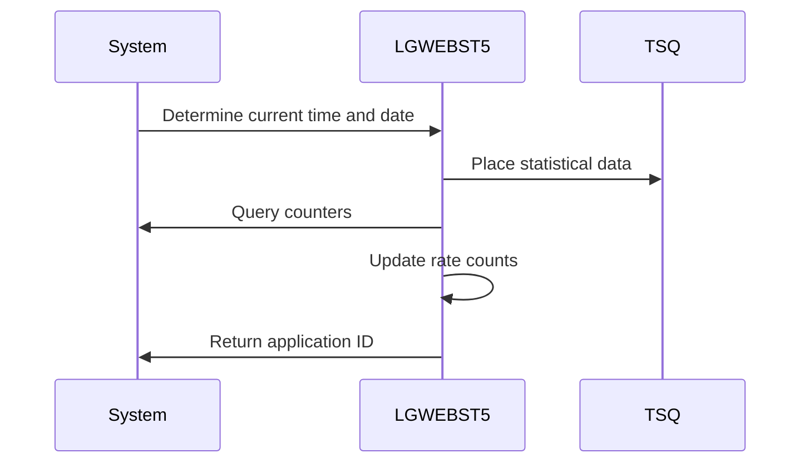
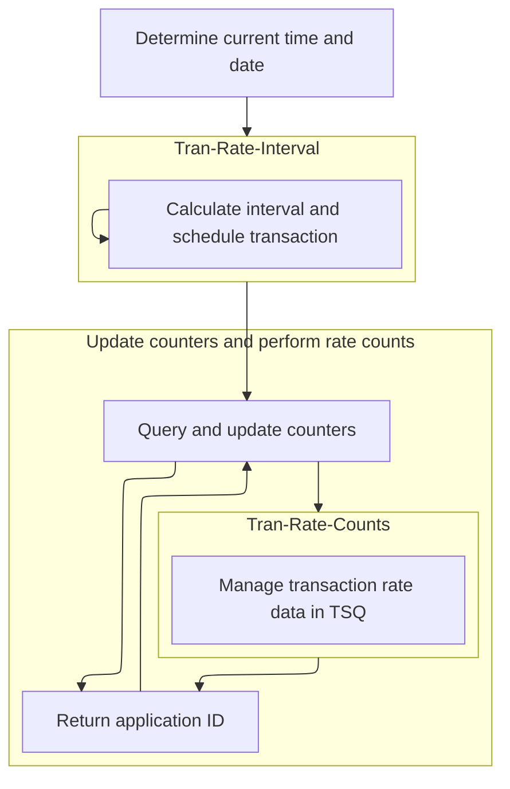

This document describes the <SwmToken path="base/src/lgwebst5.cbl" pos="11:6:6" line-data="       PROGRAM-ID. LGWEBST5">`LGWEBST5`</SwmToken> program, which is used for transaction monitoring in the Business Monitor system. The program obtains values from counters and places statistical data in a shared temporary storage queue (TSQ), refreshing every 60 seconds. For example, the program reads the current time, queries transaction counters, updates rate counts, and stores the updated statistics in a temporary storage queue.

The main steps are:

- Determine current time and date
- Place statistical data in TSQ
- Query and update counters
- Perform rate count updates
- Return application ID



## Dependencies

# Initiating Transaction Monitoring



<SwmSnippet path="/base/src/lgwebst5.cbl" line="260">

---

In MAINLINE, we kick off by setting the time context and immediately call <SwmToken path="base/src/lgwebst5.cbl" pos="266:3:7" line-data="           Perform Tran-Rate-Interval">`Tran-Rate-Interval`</SwmToken> to store transaction statistics for monitoring.

```cobol
           EXEC CICS ASKTIME ABSTIME(WS-ABSTIME)
           END-EXEC
           EXEC CICS FORMATTIME ABSTIME(WS-ABSTIME)
                     MMDDYYYY(WS-DATE)
                     TIME(WS-TIME)
           END-EXEC
           Perform Tran-Rate-Interval

           Exec CICS Query Counter(GENAcount)
                            Pool(GENApool)
                            Value(CountVal)
                            Resp(WS-RESP)
           End-Exec.
```

---

</SwmSnippet>

## Handling Temporary Storage Queues

<SwmSnippet path="/base/src/lgwebst5.cbl" line="715">

---

In <SwmToken path="base/src/lgwebst5.cbl" pos="715:1:5" line-data="       Tran-Rate-Interval.">`Tran-Rate-Interval`</SwmToken>, we dynamically create the TSQ name and read transaction data from it.

```cobol
       Tran-Rate-Interval.

           String TSQpre,
                  '000V' Delimited By Spaces
                  Into WS-TSQname
           Exec Cics ReadQ TS Queue(WS-TSQname)
                     Into(WS-OLDV)
                     Item(1)
                     Length(Length of WS-OLDV)
                     Resp(WS-RESP)
           End-Exec.
```

---

</SwmSnippet>

<SwmSnippet path="/base/src/lgwebst5.cbl" line="729">

---

We delete the TSQ to keep transaction data fresh.

```cobol
           Exec Cics DeleteQ TS Queue(WS-TSQNAME)
                     Resp(WS-RESP)
           End-Exec.
```

---

</SwmSnippet>

<SwmSnippet path="/base/src/lgwebst5.cbl" line="733">

---

We write <SwmToken path="base/src/lgwebst5.cbl" pos="733:9:11" line-data="           Move WS-TIME   To WS-HHMMSS">`WS-HHMMSS`</SwmToken> to the TSQ to store the current time, which is key for tracking transaction intervals.

```cobol
           Move WS-TIME   To WS-HHMMSS
           Exec Cics WRITEQ TS Queue(WS-TSQNAME)
                     FROM(WS-HHMMSS)
                     Length(Length of WS-HHMMSS)
                     Resp(WS-RESP)
           End-Exec.
```

---

</SwmSnippet>

<SwmSnippet path="/base/src/lgwebst5.cbl" line="739">

---

We convert the current and old times to seconds to calculate the interval

```cobol
           Move WS-HH     To HHVal
           Move WS-MM     To MMVal
           Move WS-SS     To SSVal
           Compute NCountVal = (HHVal * 3600) +
                               (MMVal * 60)   +
                                SSVal
           Move WS-OLDVHH To HHVal
           Move WS-OLDVMM To MMVal
           Move WS-OLDVSS To SSVal
           Compute OCountVal = (HHVal * 3600) +
                               (MMVal * 60)   +
                                SSVal
           Compute ICountVal = NCountVal - OCountVal
           move ICountVal To WS-NEWV
           String TSQpre,
                  '000V' Delimited By Spaces
                  Into WS-TSQname
```

---

</SwmSnippet>

<SwmSnippet path="/base/src/lgwebst5.cbl" line="756">

---

We write the interval to the TSQ and schedule 'SSST' to keep transaction monitoring consistent and timely.

```cobol
           Exec Cics WRITEQ TS Queue(WS-TSQNAME)
                     FROM(WS-NEWV)
                     Length(Length of WS-NEWV)
                     Resp(WS-RESP)
           End-Exec.
           Exec Cics Start Transid('SSST')
                     After
                     Minutes(1)
                     Resp(WS-RESP)
           End-Exec.

           Exit.
```

---

</SwmSnippet>

## Updating Transaction Statistics

<SwmSnippet path="/base/src/lgwebst5.cbl" line="273">

---

Back in MAINLINE, after returning from <SwmToken path="base/src/lgwebst5.cbl" pos="266:3:7" line-data="           Perform Tran-Rate-Interval">`Tran-Rate-Interval`</SwmToken>, we manipulate strings to form queue names and call <SwmToken path="base/src/lgwebst5.cbl" pos="279:3:7" line-data="           Perform Tran-Rate-Counts">`Tran-Rate-Counts`</SwmToken> to update transaction rates.

```cobol
           Move CountVal  To GENAcount-V
           Move GENAcount-V  To S3
           String TSQpre,
                  'X05V' Delimited By Spaces
                  Into WS-TSQname
           Move S3           To NRateVal
           Perform Tran-Rate-Counts
```

---

</SwmSnippet>

## Processing Rate Values

<SwmSnippet path="/base/src/lgwebst5.cbl" line="769">

---

We process rate values by updating the TSQ.

```cobol
       Tran-Rate-Counts.

           Exec Cics ReadQ TS Queue(WS-TSQname)
                     Into(WS-TSQdata)
                     Item(1)
                     Length(Length of WS-TSQdata)
                     Resp(WS-RESP)
           End-Exec.
```

---

</SwmSnippet>

<SwmSnippet path="/base/src/lgwebst5.cbl" line="777">

---

We move the old rate value to prepare for comparison, then delete the TSQ to clear outdated data.

```cobol
           Move WS-TSQdata  To ORateVal
           Exec Cics DeleteQ TS Queue(WS-TSQname)
                     Resp(WS-RESP)
           End-Exec.
```

---

</SwmSnippet>

<SwmSnippet path="/base/src/lgwebst5.cbl" line="782">

---

We write the new rate value to the TSQ to update it with current data for monitoring.

```cobol
           Move NRateVal  To WS-TSQdata
           Exec Cics WRITEQ TS Queue(WS-TSQname)
                     FROM(WS-TSQdata)
                     Length(Length of WS-TSQdata)
                     Resp(WS-RESP)
           End-Exec.
```

---

</SwmSnippet>

<SwmSnippet path="/base/src/lgwebst5.cbl" line="788">

---

We write the old rate value back to the TSQ to set up for difference calculations.

```cobol
           Move ORateVal   To WS-TSQdata
           Exec Cics WRITEQ TS Queue(WS-TSQname)
                     FROM(WS-TSQdata)
                     Length(Length of WS-TSQdata)
                     Resp(WS-RESP)
           End-Exec.
```

---

</SwmSnippet>

<SwmSnippet path="/base/src/lgwebst5.cbl" line="794">

---

We calculate the rate difference and write it to the TSQ for monitoring insights.

```cobol
           Compute DRateVal = NRateVal - ORateVal
           Move DRateVal   To WS-TSQdata
           Exec Cics WRITEQ TS Queue(WS-TSQname)
                     FROM(WS-TSQdata)
                     Length(Length of WS-TSQdata)
                     Resp(WS-RESP)
           End-Exec.

           Exit.
```

---

</SwmSnippet>

## Finalizing Transaction Updates

<SwmSnippet path="/base/src/lgwebst5.cbl" line="281">

---

Back in MAINLINE, after returning from <SwmToken path="base/src/lgwebst5.cbl" pos="279:3:7" line-data="           Perform Tran-Rate-Counts">`Tran-Rate-Counts`</SwmToken>, we query counters and call <SwmToken path="base/src/lgwebst5.cbl" pos="279:3:7" line-data="           Perform Tran-Rate-Counts">`Tran-Rate-Counts`</SwmToken> again to update transaction statistics.

```cobol
           Exec CICS Query Counter(GENACNT100)
                            Pool(GENApool)
                            Value(CountVal)
                            Resp(WS-RESP)
           End-Exec.
```

---

</SwmSnippet>

<SwmSnippet path="/base/src/lgwebst5.cbl" line="286">

---

We move counter values to update internal statistics for monitoring.

```cobol
           Move CountVal  To CountSuccess
           Move CountVal  To CountInq
           Move CountVal  To GENACNT100-V
           Move GENACNT100-V To S3
           String TSQpre,
                  '100V' Delimited By Spaces
                  Into WS-TSQname
           Move S3           To NRateVal
           Perform Tran-Rate-Counts

           Exec CICS Query Counter(GENACNT199)
                            Pool(GENApool)
                            Value(CountVal)
                            Resp(WS-RESP)
           End-Exec.
```

---

</SwmSnippet>

<SwmSnippet path="/base/src/lgwebst5.cbl" line="301">

---

Querying <SwmToken path="base/src/lgwebst5.cbl" pos="302:7:7" line-data="           Move CountVal  To GENACNT199-V">`GENACNT199`</SwmToken> gives us error counts for monitoring transaction issues.

```cobol
           Move CountVal  To CountErrors
           Move CountVal  To GENACNT199-V
           Move GENACNT199-V To S4
           Exec CICS Query Counter(GENACNT200)
                            Pool(GENApool)
                            Value(CountVal)
                            Resp(WS-RESP)
           End-Exec.
```

---

</SwmSnippet>

<SwmSnippet path="/base/src/lgwebst5.cbl" line="309">

---

Computing <SwmToken path="base/src/lgwebst5.cbl" pos="309:3:3" line-data="           Compute CountSuccess = CountSuccess + CountVal">`CountSuccess`</SwmToken> updates success stats for monitoring performance.

```cobol
           Compute CountSuccess = CountSuccess + CountVal
           Move CountVal  To CountAdd
           Move CountVal  To GENACNT200-V
           Move GENACNT200-V To S5
           String TSQpre,
                  '200V' Delimited By Spaces
                  Into WS-TSQname
           Move S5           To NRateVal
           Perform Tran-Rate-Counts
           Exec CICS Query Counter(GENACNT299)
                            Pool(GENApool)
                            Value(CountVal)
                            Resp(WS-RESP)
           End-Exec.
```

---

</SwmSnippet>

<SwmSnippet path="/base/src/lgwebst5.cbl" line="323">

---

Querying <SwmToken path="base/src/lgwebst5.cbl" pos="324:7:7" line-data="           Move CountVal  To GENACNT299-V">`GENACNT299`</SwmToken> gives us error counts for monitoring transaction issues.

```cobol
           Compute CountErrors  = CountErrors + CountVal
           Move CountVal  To GENACNT299-V
           Move GENACNT299-V To S6
      *
           Exec CICS Query Counter(GENACNT300)
                            Pool(GENApool)
                            Value(CountVal)
                            Resp(WS-RESP)
           End-Exec.
```

---

</SwmSnippet>

<SwmSnippet path="/base/src/lgwebst5.cbl" line="332">

---

Computing <SwmToken path="base/src/lgwebst5.cbl" pos="332:3:3" line-data="           Compute CountSuccess = CountSuccess + CountVal">`CountSuccess`</SwmToken> updates success stats for monitoring performance.

```cobol
           Compute CountSuccess = CountSuccess + CountVal
           Move CountVal  To GENACNT300-V
           Compute CountInq = CountInq + CountVal
           Move GENACNT300-V To S7
           String TSQpre,
                  '300V' Delimited By Spaces
                  Into WS-TSQname
           Move S7           To NRateVal
           Perform Tran-Rate-Counts
           Exec CICS Query Counter(GENACNT399)
                            Pool(GENApool)
                            Value(CountVal)
                            Resp(WS-RESP)
           End-Exec.
```

---

</SwmSnippet>

<SwmSnippet path="/base/src/lgwebst5.cbl" line="346">

---

Querying <SwmToken path="base/src/lgwebst5.cbl" pos="347:7:7" line-data="           Move CountVal  To GENACNT399-V">`GENACNT399`</SwmToken> gives us error counts for monitoring transaction issues.

```cobol
           Compute CountErrors  = CountErrors + CountVal
           Move CountVal  To GENACNT399-V
           Move GENACNT399-V To S8
           Exec CICS Query Counter(GENACNT400)
                            Pool(GENApool)
                            Value(CountVal)
                            Resp(WS-RESP)
           End-Exec.
```

---

</SwmSnippet>

<SwmSnippet path="/base/src/lgwebst5.cbl" line="354">

---

Computing <SwmToken path="base/src/lgwebst5.cbl" pos="354:3:3" line-data="           Compute CountSuccess = CountSuccess + CountVal">`CountSuccess`</SwmToken> updates success stats for monitoring performance.

```cobol
           Compute CountSuccess = CountSuccess + CountVal
           Move CountVal  To GENACNT400-V
           Compute CountAdd = CountAdd + CountVal
           Move GENACNT400-V To S9
           String TSQpre,
                  '400V' Delimited By Spaces
                  Into WS-TSQname
           Move S9           To NRateVal
           Perform Tran-Rate-Counts
           Exec CICS Query Counter(GENACNT499)
                            Pool(GENApool)
                            Value(CountVal)
                            Resp(WS-RESP)
           End-Exec.
```

---

</SwmSnippet>

<SwmSnippet path="/base/src/lgwebst5.cbl" line="368">

---

Querying <SwmToken path="base/src/lgwebst5.cbl" pos="369:7:7" line-data="           Move CountVal  To GENACNT499-V">`GENACNT499`</SwmToken> gives us error counts for monitoring transaction issues.

```cobol
           Compute CountErrors  = CountErrors + CountVal
           Move CountVal  To GENACNT499-V
           Move GENACNT499-V To S10
           Exec CICS Query Counter(GENACNT500)
                            Pool(GENApool)
                            Value(CountVal)
                            Resp(WS-RESP)
           End-Exec.
```

---

</SwmSnippet>

<SwmSnippet path="/base/src/lgwebst5.cbl" line="376">

---

Computing <SwmToken path="base/src/lgwebst5.cbl" pos="376:3:3" line-data="           Compute CountSuccess = CountSuccess + CountVal">`CountSuccess`</SwmToken> updates success stats for monitoring performance.

```cobol
           Compute CountSuccess = CountSuccess + CountVal
           Move CountVal  To GENACNT500-V
           Move CountVal  To CountDel
           Move GENACNT500-V To S11
           String TSQpre,
                  '500V' Delimited By Spaces
                  Into WS-TSQname
           Move S11          To NRateVal
           Perform Tran-Rate-Counts
           Exec CICS Query Counter(GENACNT599)
                            Pool(GENApool)
                            Value(CountVal)
                            Resp(WS-RESP)
           End-Exec.
```

---

</SwmSnippet>

<SwmSnippet path="/base/src/lgwebst5.cbl" line="390">

---

Querying <SwmToken path="base/src/lgwebst5.cbl" pos="391:7:7" line-data="           Move CountVal  To GENACNT599-V">`GENACNT599`</SwmToken> gives us error counts for monitoring transaction issues.

```cobol
           Compute CountErrors  = CountErrors + CountVal
           Move CountVal  To GENACNT599-V
           Move GENACNT599-V To S12
           Exec CICS Query Counter(GENACNT600)
                            Pool(GENApool)
                            Value(CountVal)
                            Resp(WS-RESP)
           End-Exec.
```

---

</SwmSnippet>

<SwmSnippet path="/base/src/lgwebst5.cbl" line="398">

---

Computing <SwmToken path="base/src/lgwebst5.cbl" pos="398:3:3" line-data="           Compute CountSuccess = CountSuccess + CountVal">`CountSuccess`</SwmToken> updates success stats for monitoring performance.

```cobol
           Compute CountSuccess = CountSuccess + CountVal
           Move CountVal  To GENACNT600-V
           Move CountVal  To CountUpd
           Move GENACNT600-V To S13
           String TSQpre,
                  '600V' Delimited By Spaces
                  Into WS-TSQname
           Move S13          To NRateVal
           Perform Tran-Rate-Counts
           Exec CICS Query Counter(GENACNT699)
                            Pool(GENApool)
                            Value(CountVal)
                            Resp(WS-RESP)
           End-Exec.
```

---

</SwmSnippet>

<SwmSnippet path="/base/src/lgwebst5.cbl" line="412">

---

Querying <SwmToken path="base/src/lgwebst5.cbl" pos="413:7:7" line-data="           Move CountVal  To GENACNT699-V">`GENACNT699`</SwmToken> gives us error counts for monitoring transaction issues.

```cobol
           Compute CountErrors  = CountErrors + CountVal
           Move CountVal  To GENACNT699-V
           Move GENACNT699-V To S14
      *
           Exec CICS Query Counter(GENACNT700)
                            Pool(GENApool)
                            Value(CountVal)
                            Resp(WS-RESP)
           End-Exec.
```

---

</SwmSnippet>

<SwmSnippet path="/base/src/lgwebst5.cbl" line="421">

---

Computing <SwmToken path="base/src/lgwebst5.cbl" pos="421:3:3" line-data="           Compute CountSuccess = CountSuccess + CountVal">`CountSuccess`</SwmToken> updates success stats for monitoring performance.

```cobol
           Compute CountSuccess = CountSuccess + CountVal
           Move CountVal  To GENACNT700-V
           Compute CountInq = CountInq + CountVal
           Move GENACNT700-V To S15
           String TSQpre,
                  '700V' Delimited By Spaces
                  Into WS-TSQname
           Move S15          To NRateVal
           Perform Tran-Rate-Counts
           Exec CICS Query Counter(GENACNT799)
                            Pool(GENApool)
                            Value(CountVal)
                            Resp(WS-RESP)
           End-Exec.
```

---

</SwmSnippet>

<SwmSnippet path="/base/src/lgwebst5.cbl" line="435">

---

Querying <SwmToken path="base/src/lgwebst5.cbl" pos="436:7:7" line-data="           Move CountVal  To GENACNT799-V">`GENACNT799`</SwmToken> gives us error counts for monitoring transaction issues.

```cobol
           Compute CountErrors  = CountErrors + CountVal
           Move CountVal  To GENACNT799-V
           Move GENACNT799-V To S16
           Exec CICS Query Counter(GENACNT800)
                            Pool(GENApool)
                            Value(CountVal)
                            Resp(WS-RESP)
           End-Exec.
```

---

</SwmSnippet>

<SwmSnippet path="/base/src/lgwebst5.cbl" line="443">

---

Computing <SwmToken path="base/src/lgwebst5.cbl" pos="443:3:3" line-data="           Compute CountSuccess = CountSuccess + CountVal">`CountSuccess`</SwmToken> updates success stats for monitoring performance.

```cobol
           Compute CountSuccess = CountSuccess + CountVal
           Move CountVal  To GENACNT800-V
           Compute CountAdd = CountAdd + CountVal
           Move GENACNT800-V To S17
           String TSQpre,
                  '800V' Delimited By Spaces
                  Into WS-TSQname
           Move S17          To NRateVal
           Perform Tran-Rate-Counts
           Exec CICS Query Counter(GENACNT899)
                            Pool(GENApool)
                            Value(CountVal)
                            Resp(WS-RESP)
           End-Exec.
```

---

</SwmSnippet>

<SwmSnippet path="/base/src/lgwebst5.cbl" line="457">

---

Querying <SwmToken path="base/src/lgwebst5.cbl" pos="458:7:7" line-data="           Move CountVal  To GENACNT899-V">`GENACNT899`</SwmToken> gives us error counts for monitoring transaction issues.

```cobol
           Compute CountErrors  = CountErrors + CountVal
           Move CountVal  To GENACNT899-V
           Move GENACNT899-V To S18
           Exec CICS Query Counter(GENACNT900)
                            Pool(GENApool)
                            Value(CountVal)
                            Resp(WS-RESP)
           End-Exec.
```

---

</SwmSnippet>

<SwmSnippet path="/base/src/lgwebst5.cbl" line="465">

---

Computing <SwmToken path="base/src/lgwebst5.cbl" pos="465:3:3" line-data="           Compute CountSuccess = CountSuccess + CountVal">`CountSuccess`</SwmToken> updates success stats for monitoring performance.

```cobol
           Compute CountSuccess = CountSuccess + CountVal
           Move CountVal  To GENACNT900-V
           Compute CountDel = CountDel + CountVal
           Move GENACNT900-V To S19
           String TSQpre,
                  '900V' Delimited By Spaces
                  Into WS-TSQname
           Move S19          To NRateVal
           Perform Tran-Rate-Counts
           Exec CICS Query Counter(GENACNT999)
                            Pool(GENApool)
                            Value(CountVal)
                            Resp(WS-RESP)
           End-Exec.
```

---

</SwmSnippet>

<SwmSnippet path="/base/src/lgwebst5.cbl" line="479">

---

Querying <SwmToken path="base/src/lgwebst5.cbl" pos="480:7:7" line-data="           Move CountVal  To GENACNT999-V">`GENACNT999`</SwmToken> gives us error counts for monitoring transaction issues.

```cobol
           Compute CountErrors  = CountErrors + CountVal
           Move CountVal  To GENACNT999-V
           Move GENACNT999-V To S20
           Exec CICS Query Counter(GENACNTA00)
                            Pool(GENApool)
                            Value(CountVal)
                            Resp(WS-RESP)
           End-Exec.
```

---

</SwmSnippet>

<SwmSnippet path="/base/src/lgwebst5.cbl" line="487">

---

Computing <SwmToken path="base/src/lgwebst5.cbl" pos="487:3:3" line-data="           Compute CountSuccess = CountSuccess + CountVal">`CountSuccess`</SwmToken> updates success stats for monitoring performance.

```cobol
           Compute CountSuccess = CountSuccess + CountVal
           Move CountVal  To GENACNTA00-V
           Compute CountUpd = CountUpd + CountVal
           Move GENACNTA00-V To S21
           String TSQpre,
                  'A00V' Delimited By Spaces
                  Into WS-TSQname
           Move S21          To NRateVal
           Perform Tran-Rate-Counts
           Exec CICS Query Counter(GENACNTA99)
                            Pool(GENApool)
                            Value(CountVal)
                            Resp(WS-RESP)
           End-Exec.
```

---

</SwmSnippet>

<SwmSnippet path="/base/src/lgwebst5.cbl" line="501">

---

Querying <SwmToken path="base/src/lgwebst5.cbl" pos="502:7:7" line-data="           Move CountVal  To GENACNTA99-V">`GENACNTA99`</SwmToken> gives us error counts for monitoring transaction issues.

```cobol
           Compute CountErrors  = CountErrors + CountVal
           Move CountVal  To GENACNTA99-V
           Move GENACNTA99-V To S22
      *
           Exec CICS Query Counter(GENACNTB00)
                            Pool(GENApool)
                            Value(CountVal)
                            Resp(WS-RESP)
           End-Exec.
```

---

</SwmSnippet>

<SwmSnippet path="/base/src/lgwebst5.cbl" line="510">

---

Computing <SwmToken path="base/src/lgwebst5.cbl" pos="510:3:3" line-data="           Compute CountSuccess = CountSuccess + CountVal">`CountSuccess`</SwmToken> updates success stats for monitoring performance.

```cobol
           Compute CountSuccess = CountSuccess + CountVal
           Move CountVal  To GENACNTB00-V
           Compute CountInq = CountInq + CountVal
           Move GENACNTB00-V To S23
           String TSQpre,
                  'B00V' Delimited By Spaces
                  Into WS-TSQname
           Move S23          To NRateVal
           Perform Tran-Rate-Counts
           Exec CICS Query Counter(GENACNTB99)
                            Pool(GENApool)
                            Value(CountVal)
                            Resp(WS-RESP)
           End-Exec.
```

---

</SwmSnippet>

<SwmSnippet path="/base/src/lgwebst5.cbl" line="524">

---

Querying <SwmToken path="base/src/lgwebst5.cbl" pos="525:7:7" line-data="           Move CountVal  To GENACNTB99-V">`GENACNTB99`</SwmToken> gives us error counts for monitoring transaction issues.

```cobol
           Compute CountErrors  = CountErrors + CountVal
           Move CountVal  To GENACNTB99-V
           Move GENACNTB99-V To S24
           Exec CICS Query Counter(GENACNTC00)
                            Pool(GENApool)
                            Value(CountVal)
                            Resp(WS-RESP)
           End-Exec.
```

---

</SwmSnippet>

<SwmSnippet path="/base/src/lgwebst5.cbl" line="532">

---

Here we compute success and addition counts, then move values to specific variables for tracking. We manipulate strings to form queue names and call <SwmToken path="base/src/lgwebst5.cbl" pos="540:3:7" line-data="           Perform Tran-Rate-Counts">`Tran-Rate-Counts`</SwmToken> to update transaction statistics. We also query the <SwmToken path="base/src/lgwebst5.cbl" pos="541:9:9" line-data="           Exec CICS Query Counter(GENACNTC99)">`GENACNTC99`</SwmToken> counter to get the latest count value.

```cobol
           Compute CountSuccess = CountSuccess + CountVal
           Move CountVal  To GENACNTC00-V
           Compute CountAdd = CountAdd + CountVal
           Move GENACNTC00-V To S25
           String TSQpre,
                  'C00V' Delimited By Spaces
                  Into WS-TSQname
           Move S25          To NRateVal
           Perform Tran-Rate-Counts
           Exec CICS Query Counter(GENACNTC99)
                            Pool(GENApool)
                            Value(CountVal)
                            Resp(WS-RESP)
           End-Exec.
```

---

</SwmSnippet>

<SwmSnippet path="/base/src/lgwebst5.cbl" line="546">

---

We update the error count and query the next counter for the latest value.

```cobol
           Compute CountErrors  = CountErrors + CountVal
           Move CountVal  To GENACNTC99-V
           Move GENACNTC99-V To S26
           Exec CICS Query Counter(GENACNTD00)
                            Pool(GENApool)
                            Value(CountVal)
                            Resp(WS-RESP)
           End-Exec.
```

---

</SwmSnippet>

<SwmSnippet path="/base/src/lgwebst5.cbl" line="554">

---

Here we compute success and deletion counts, then move values to <SwmToken path="base/src/lgwebst5.cbl" pos="555:7:9" line-data="           Move CountVal  To GENACNTD00-V">`GENACNTD00-V`</SwmToken>. We manipulate strings to form queue names and call <SwmToken path="base/src/lgwebst5.cbl" pos="562:3:7" line-data="           Perform Tran-Rate-Counts">`Tran-Rate-Counts`</SwmToken> to update transaction statistics. We also query the <SwmToken path="base/src/lgwebst5.cbl" pos="563:9:9" line-data="           Exec CICS Query Counter(GENACNTD99)">`GENACNTD99`</SwmToken> counter for the latest count value.

```cobol
           Compute CountSuccess = CountSuccess + CountVal
           Move CountVal  To GENACNTD00-V
           Compute CountDel = CountDel + CountVal
           Move GENACNTD00-V To S27
           String TSQpre,
                  'D00V' Delimited By Spaces
                  Into WS-TSQname
           Move S27          To NRateVal
           Perform Tran-Rate-Counts
           Exec CICS Query Counter(GENACNTD99)
                            Pool(GENApool)
                            Value(CountVal)
                            Resp(WS-RESP)
           End-Exec.
```

---

</SwmSnippet>

<SwmSnippet path="/base/src/lgwebst5.cbl" line="568">

---

We update the error count and query the next counter for the latest value.

```cobol
           Compute CountErrors  = CountErrors + CountVal
           Move CountVal  To GENACNTD99-V
           Move GENACNTD99-V To S28
           Exec CICS Query Counter(GENACNTE00)
                            Pool(GENApool)
                            Value(CountVal)
                            Resp(WS-RESP)
           End-Exec.
```

---

</SwmSnippet>

<SwmSnippet path="/base/src/lgwebst5.cbl" line="576">

---

Here we compute success and update counts, then move values to <SwmToken path="base/src/lgwebst5.cbl" pos="577:7:9" line-data="           Move CountVal  To GENACNTE00-V">`GENACNTE00-V`</SwmToken>. We manipulate strings to form queue names and call <SwmToken path="base/src/lgwebst5.cbl" pos="584:3:7" line-data="           Perform Tran-Rate-Counts">`Tran-Rate-Counts`</SwmToken> to update transaction statistics. We also query the <SwmToken path="base/src/lgwebst5.cbl" pos="585:9:9" line-data="           Exec CICS Query Counter(GENACNTE99)">`GENACNTE99`</SwmToken> counter for the latest count value.

```cobol
           Compute CountSuccess = CountSuccess + CountVal
           Move CountVal  To GENACNTE00-V
           Compute CountUpd = CountUpd + CountVal
           Move GENACNTE00-V To S29
           String TSQpre,
                  'E00V' Delimited By Spaces
                  Into WS-TSQname
           Move S29          To NRateVal
           Perform Tran-Rate-Counts
           Exec CICS Query Counter(GENACNTE99)
                            Pool(GENApool)
                            Value(CountVal)
                            Resp(WS-RESP)
           End-Exec.
```

---

</SwmSnippet>

<SwmSnippet path="/base/src/lgwebst5.cbl" line="590">

---

We update the error count and query the next counter for the latest value.

```cobol
           Compute CountErrors  = CountErrors + CountVal
           Move CountVal  To GENACNTE99-V
           Move GENACNTE99-V To S30
      *
           Exec CICS Query Counter(GENACNTF00)
                            Pool(GENApool)
                            Value(CountVal)
                            Resp(WS-RESP)
           End-Exec.
```

---

</SwmSnippet>

<SwmSnippet path="/base/src/lgwebst5.cbl" line="599">

---

Here we compute success and inquiry counts, then move values to <SwmToken path="base/src/lgwebst5.cbl" pos="600:7:9" line-data="           Move CountVal  To GENACNTF00-V">`GENACNTF00-V`</SwmToken>. We manipulate strings to form queue names and call <SwmToken path="base/src/lgwebst5.cbl" pos="607:3:7" line-data="           Perform Tran-Rate-Counts">`Tran-Rate-Counts`</SwmToken> to update transaction statistics. We also query the <SwmToken path="base/src/lgwebst5.cbl" pos="608:9:9" line-data="           Exec CICS Query Counter(GENACNTF99)">`GENACNTF99`</SwmToken> counter for the latest count value.

```cobol
           Compute CountSuccess = CountSuccess + CountVal
           Move CountVal  To GENACNTF00-V
           Compute CountInq = CountInq + CountVal
           Move GENACNTF00-V To S31
           String TSQpre,
                  'F00V' Delimited By Spaces
                  Into WS-TSQname
           Move S31          To NRateVal
           Perform Tran-Rate-Counts
           Exec CICS Query Counter(GENACNTF99)
                            Pool(GENApool)
                            Value(CountVal)
                            Resp(WS-RESP)
           End-Exec.
```

---

</SwmSnippet>

<SwmSnippet path="/base/src/lgwebst5.cbl" line="613">

---

We update the error count and query the next counter for the latest value.

```cobol
           Compute CountErrors  = CountErrors + CountVal
           Move CountVal  To GENACNTF99-V
           Move GENACNTF99-V To S32
           Exec CICS Query Counter(GENACNTG00)
                            Pool(GENApool)
                            Value(CountVal)
                            Resp(WS-RESP)
           End-Exec.
```

---

</SwmSnippet>

<SwmSnippet path="/base/src/lgwebst5.cbl" line="621">

---

Here we compute success and addition counts, then move values to <SwmToken path="base/src/lgwebst5.cbl" pos="622:7:9" line-data="           Move CountVal  To GENACNTG00-V">`GENACNTG00-V`</SwmToken>. We manipulate strings to form queue names and call <SwmToken path="base/src/lgwebst5.cbl" pos="629:3:7" line-data="           Perform Tran-Rate-Counts">`Tran-Rate-Counts`</SwmToken> to update transaction statistics. We also query the <SwmToken path="base/src/lgwebst5.cbl" pos="630:9:9" line-data="           Exec CICS Query Counter(GENACNTG99)">`GENACNTG99`</SwmToken> counter for the latest count value.

```cobol
           Compute CountSuccess = CountSuccess + CountVal
           Move CountVal  To GENACNTG00-V
           Compute CountAdd = CountAdd + CountVal
           Move GENACNTG00-V To S33
           String TSQpre,
                  'G00V' Delimited By Spaces
                  Into WS-TSQname
           Move S33          To NRateVal
           Perform Tran-Rate-Counts
           Exec CICS Query Counter(GENACNTG99)
                            Pool(GENApool)
                            Value(CountVal)
                            Resp(WS-RESP)
           End-Exec.
```

---

</SwmSnippet>

<SwmSnippet path="/base/src/lgwebst5.cbl" line="635">

---

We update the error count and query the next counter for the latest value.

```cobol
           Compute CountErrors  = CountErrors + CountVal
           Move CountVal  To GENACNTG99-V
           Move GENACNTG99-V To S34
           Exec CICS Query Counter(GENACNTH00)
                            Pool(GENApool)
                            Value(CountVal)
                            Resp(WS-RESP)
           End-Exec.
```

---

</SwmSnippet>

<SwmSnippet path="/base/src/lgwebst5.cbl" line="643">

---

Here we compute success and deletion counts, then move values to <SwmToken path="base/src/lgwebst5.cbl" pos="644:7:9" line-data="           Move CountVal  To GENACNTH00-V">`GENACNTH00-V`</SwmToken>. We manipulate strings to form queue names and call <SwmToken path="base/src/lgwebst5.cbl" pos="651:3:7" line-data="           Perform Tran-Rate-Counts">`Tran-Rate-Counts`</SwmToken> to update transaction statistics. We also query the <SwmToken path="base/src/lgwebst5.cbl" pos="652:9:9" line-data="           Exec CICS Query Counter(GENACNTH99)">`GENACNTH99`</SwmToken> counter for the latest count value.

```cobol
           Compute CountSuccess = CountSuccess + CountVal
           Move CountVal  To GENACNTH00-V
           Compute CountDel = CountDel + CountVal
           Move GENACNTH00-V To S35
           String TSQpre,
                  'H00V' Delimited By Spaces
                  Into WS-TSQname
           Move S35          To NRateVal
           Perform Tran-Rate-Counts
           Exec CICS Query Counter(GENACNTH99)
                            Pool(GENApool)
                            Value(CountVal)
                            Resp(WS-RESP)
           End-Exec.
```

---

</SwmSnippet>

<SwmSnippet path="/base/src/lgwebst5.cbl" line="657">

---

We update the error count and query the next counter for the latest value, following a pattern to update transaction statistics.

```cobol
           Compute CountErrors  = CountErrors + CountVal
           Move CountVal  To GENACNTH99-V
           Move GENACNTH99-V To S36

      *
           Exec CICS Query Counter(GENACNTI99)
                            Pool(GENApool)
                            Value(CountVal)
                            Resp(WS-RESP)
           End-Exec.
```

---

</SwmSnippet>

<SwmSnippet path="/base/src/lgwebst5.cbl" line="667">

---

Here we move success and error counts to specific variables for final updates. We manipulate strings to form queue names with the <SwmToken path="base/src/lgwebst5.cbl" pos="675:2:2" line-data="                  &#39;X00V&#39; Delimited By Spaces">`X00V`</SwmToken> suffix, preparing for the last set of transaction updates.

```cobol
           Move CountVal  To GENACNTI99-V
           Move GENACNTI99-V To S37
      *
           Move CountSuccess To GENAsucces-V
           Move Counterrors  To GENAerrors-V
           Move GENAsucces-V To S38
           Move GENAerrors-V To S39
           String TSQpre,
                  'X00V' Delimited By Spaces
                  Into WS-TSQname
           Move S38          To NRateVal
```

---

</SwmSnippet>

<SwmSnippet path="/base/src/lgwebst5.cbl" line="678">

---

We finalize transaction updates by performing <SwmToken path="base/src/lgwebst5.cbl" pos="678:3:7" line-data="           Perform Tran-Rate-Counts">`Tran-Rate-Counts`</SwmToken>.

```cobol
           Perform Tran-Rate-Counts
```

---

</SwmSnippet>

<SwmSnippet path="/base/src/lgwebst5.cbl" line="680">

---

Here we manipulate strings to form a queue name with the <SwmToken path="base/src/lgwebst5.cbl" pos="681:2:2" line-data="                  &#39;X01V&#39; Delimited By Spaces">`X01V`</SwmToken> suffix, then move inquiry counts to prepare for <SwmToken path="base/src/lgwebst5.cbl" pos="684:3:7" line-data="           Perform Tran-Rate-Counts">`Tran-Rate-Counts`</SwmToken>, which updates the transaction statistics.

```cobol
           String TSQpre,
                  'X01V' Delimited By Spaces
                  Into WS-TSQname
           Move CountInq     To NRateVal
           Perform Tran-Rate-Counts
```

---

</SwmSnippet>

<SwmSnippet path="/base/src/lgwebst5.cbl" line="685">

---

Here we manipulate strings to form a queue name with the <SwmToken path="base/src/lgwebst5.cbl" pos="686:2:2" line-data="                  &#39;X02V&#39; Delimited By Spaces">`X02V`</SwmToken> suffix, then move addition counts to prepare for <SwmToken path="base/src/lgwebst5.cbl" pos="689:3:7" line-data="           Perform Tran-Rate-Counts">`Tran-Rate-Counts`</SwmToken>, which updates the transaction statistics.

```cobol
           String TSQpre,
                  'X02V' Delimited By Spaces
                  Into WS-TSQname
           Move CountAdd     To NRateVal
           Perform Tran-Rate-Counts
```

---

</SwmSnippet>

<SwmSnippet path="/base/src/lgwebst5.cbl" line="690">

---

Here we manipulate strings to form a queue name with the <SwmToken path="base/src/lgwebst5.cbl" pos="691:2:2" line-data="                  &#39;X03V&#39; Delimited By Spaces">`X03V`</SwmToken> suffix, then move update counts to prepare for <SwmToken path="base/src/lgwebst5.cbl" pos="694:3:7" line-data="           Perform Tran-Rate-Counts">`Tran-Rate-Counts`</SwmToken>, which updates the transaction statistics.

```cobol
           String TSQpre,
                  'X03V' Delimited By Spaces
                  Into WS-TSQname
           Move CountUpd     To NRateVal
           Perform Tran-Rate-Counts
```

---

</SwmSnippet>

<SwmSnippet path="/base/src/lgwebst5.cbl" line="695">

---

Here we manipulate strings to form a queue name with the <SwmToken path="base/src/lgwebst5.cbl" pos="696:2:2" line-data="                  &#39;X04V&#39; Delimited By Spaces">`X04V`</SwmToken> suffix, then move deletion counts to prepare for <SwmToken path="base/src/lgwebst5.cbl" pos="699:3:7" line-data="           Perform Tran-Rate-Counts">`Tran-Rate-Counts`</SwmToken>, which updates the transaction statistics. This follows the pattern of querying counters, updating counts, and forming queue names for each transaction type.

```cobol
           String TSQpre,
                  'X04V' Delimited By Spaces
                  Into WS-TSQname
           Move CountDel     To NRateVal
           Perform Tran-Rate-Counts
```

---

</SwmSnippet>

<SwmSnippet path="/base/src/lgwebst5.cbl" line="703">

---

We retrieve the application ID for context in transaction monitoring.

```cobol
           EXEC CICS ASSIGN APPLID(WS-APPLID)
           END-EXEC.
```

---

</SwmSnippet>

<SwmSnippet path="/base/src/lgwebst5.cbl" line="705">

---

We return the application ID for consistency in transaction monitoring.

```cobol
           Move WS-APPLID To S1.


           EXEC CICS RETURN
           END-EXEC.
```

---

</SwmSnippet>

&nbsp;

*This is an auto-generated document by Swimm 🌊 and has not yet been verified by a human*

<SwmMeta version="3.0.0" repo-id="Z2l0aHViJTNBJTNBa3luZHJ5bC1jaWNzLWdlbmFwcCUzQSUzQVN3aW1tLURlbW8=" repo-name="kyndryl-cics-genapp"><sup>Powered by [Swimm](/)</sup></SwmMeta>
