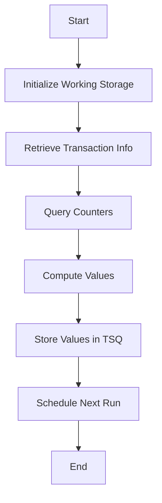

This document will cover the <SwmToken path="base/src/lgwebst5.cbl" pos="11:6:6" line-data="       PROGRAM-ID. LGWEBST5">`LGWEBST5`</SwmToken> program. We'll cover:

1. What the Program Does
2. Program Flow
3. Program Sections

## What the Program Does

The <SwmToken path="base/src/lgwebst5.cbl" pos="11:6:6" line-data="       PROGRAM-ID. LGWEBST5">`LGWEBST5`</SwmToken> program is designed to collect and store various statistics data for Business Monitor. It retrieves values from counters and places the statistics data into a shared temporary storage queue (TSQ). The program refreshes this data every 60 seconds.

## Program Flow

The program initializes various working-storage fields and retrieves transaction-related information. It then performs a series of operations to query counters, compute values, and store these values in a TSQ. The program also schedules itself to run again after 60 seconds.



<SwmSnippet path="/base/src/lgwebst5.cbl" line="247">

---

### MAINLINE SECTION

First, the MAINLINE SECTION initializes the working storage fields and retrieves transaction-related information. It then performs a series of operations to query counters, compute values, and store these values in a TSQ. Finally, it schedules the program to run again after 60 seconds.

```cobol
       PROCEDURE DIVISION.

      *---------------------------------------------------------------*
       MAINLINE SECTION.
      *
           INITIALIZE WS-HEADER.

           MOVE EIBTRNID TO WS-TRANSID.
           MOVE EIBTRMID TO WS-TERMID.
           MOVE EIBTASKN TO WS-TASKNUM.
           MOVE EIBCALEN TO WS-CALEN.
      ****************************************************************
           MOVE 'GENA'  To TSQpre
           EXEC CICS ASKTIME ABSTIME(WS-ABSTIME)
           END-EXEC
           EXEC CICS FORMATTIME ABSTIME(WS-ABSTIME)
                     MMDDYYYY(WS-DATE)
                     TIME(WS-TIME)
           END-EXEC
           Perform Tran-Rate-Interval

```

---

</SwmSnippet>

<SwmSnippet path="/base/src/lgwebst5.cbl" line="715">

---

### <SwmToken path="base/src/lgwebst5.cbl" pos="715:1:5" line-data="       Tran-Rate-Interval.">`Tran-Rate-Interval`</SwmToken>

Now, the <SwmToken path="base/src/lgwebst5.cbl" pos="715:1:5" line-data="       Tran-Rate-Interval.">`Tran-Rate-Interval`</SwmToken> section calculates the interval rate by reading the old value from the TSQ, computing the new value, and writing it back to the TSQ. It also schedules the program to run again after 60 seconds.

```cobol
       Tran-Rate-Interval.

           String TSQpre,
                  '000V' Delimited By Spaces
                  Into WS-TSQname
           Exec Cics ReadQ TS Queue(WS-TSQname)
                     Into(WS-OLDV)
                     Item(1)
                     Length(Length of WS-OLDV)
                     Resp(WS-RESP)
           End-Exec.
           If WS-RESP Not = DFHRESP(NORMAL)
            Move '120000' To WS-OLDV.

           Exec Cics DeleteQ TS Queue(WS-TSQNAME)
                     Resp(WS-RESP)
           End-Exec.

           Move WS-TIME   To WS-HHMMSS
           Exec Cics WRITEQ TS Queue(WS-TSQNAME)
                     FROM(WS-HHMMSS)
```

---

</SwmSnippet>

<SwmSnippet path="/base/src/lgwebst5.cbl" line="769">

---

### <SwmToken path="base/src/lgwebst5.cbl" pos="769:1:5" line-data="       Tran-Rate-Counts.">`Tran-Rate-Counts`</SwmToken>

Then, the <SwmToken path="base/src/lgwebst5.cbl" pos="769:1:5" line-data="       Tran-Rate-Counts.">`Tran-Rate-Counts`</SwmToken> section reads the current count value from the TSQ, computes the difference from the previous value, and writes both the new and difference values back to the TSQ.

```cobol
       Tran-Rate-Counts.

           Exec Cics ReadQ TS Queue(WS-TSQname)
                     Into(WS-TSQdata)
                     Item(1)
                     Length(Length of WS-TSQdata)
                     Resp(WS-RESP)
           End-Exec.
           Move WS-TSQdata  To ORateVal
           Exec Cics DeleteQ TS Queue(WS-TSQname)
                     Resp(WS-RESP)
           End-Exec.

           Move NRateVal  To WS-TSQdata
           Exec Cics WRITEQ TS Queue(WS-TSQname)
                     FROM(WS-TSQdata)
                     Length(Length of WS-TSQdata)
                     Resp(WS-RESP)
           End-Exec.
           Move ORateVal   To WS-TSQdata
           Exec Cics WRITEQ TS Queue(WS-TSQname)
```

---

</SwmSnippet>

&nbsp;

*This is an auto-generated document by Swimm 🌊 and has not yet been verified by a human*

<SwmMeta version="3.0.0" repo-id="Z2l0aHViJTNBJTNBa3luZHJ5bC1jaWNzLWdlbmFwcCUzQSUzQVN3aW1tLURlbW8=" repo-name="kyndryl-cics-genapp"><sup>Powered by [Swimm](/)</sup></SwmMeta>
