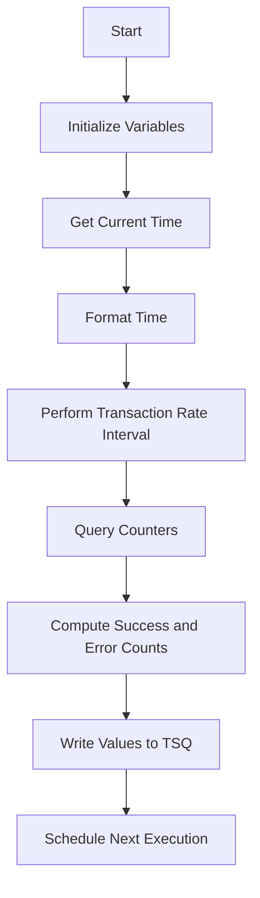

This document will cover the <SwmToken path="base/src/lgwebst5.cbl" pos="11:6:6" line-data="       PROGRAM-ID. LGWEBST5">`LGWEBST5`</SwmToken> program. We'll cover:

1. What the Program Does
2. Program Flow
3. Program Sections

## What the Program Does

The <SwmToken path="base/src/lgwebst5.cbl" pos="11:6:6" line-data="       PROGRAM-ID. LGWEBST5">`LGWEBST5`</SwmToken> program is designed to collect and store statistical data for Business Monitor. It obtains values from various counters and places the statistics data in a shared temporary storage queue (TSQ). The program refreshes every 60 seconds to ensure the data is up-to-date.

## Program Flow

The program flow of <SwmToken path="base/src/lgwebst5.cbl" pos="11:6:6" line-data="       PROGRAM-ID. LGWEBST5">`LGWEBST5`</SwmToken> involves several key steps:

1. Initialize the working storage variables and header.
2. Obtain the current time and format it.
3. Perform transaction rate interval calculations.
4. Query various counters and store their values.
5. Compute success and error counts.
6. Write the computed values to the TSQ.
7. Schedule the next execution of the program.



<SwmSnippet path="/base/src/lgwebst5.cbl" line="247">

---

### MAINLINE SECTION

First, the MAINLINE SECTION initializes the working storage variables and header. It then obtains the current time and formats it. The program performs transaction rate interval calculations and queries various counters to store their values. It computes success and error counts and writes the computed values to the TSQ. Finally, it schedules the next execution of the program.

```cobol
       PROCEDURE DIVISION.

      *---------------------------------------------------------------*
       MAINLINE SECTION.
      *
           INITIALIZE WS-HEADER.

           MOVE EIBTRNID TO WS-TRANSID.
           MOVE EIBTRMID TO WS-TERMID.
           MOVE EIBTASKN TO WS-TASKNUM.
           MOVE EIBCALEN TO WS-CALEN.
      ****************************************************************
           MOVE 'GENA'  To TSQpre
           EXEC CICS ASKTIME ABSTIME(WS-ABSTIME)
           END-EXEC
           EXEC CICS FORMATTIME ABSTIME(WS-ABSTIME)
                     MMDDYYYY(WS-DATE)
                     TIME(WS-TIME)
           END-EXEC
           Perform Tran-Rate-Interval

```

---

</SwmSnippet>

<SwmSnippet path="/base/src/lgwebst5.cbl" line="715">

---

### <SwmToken path="base/src/lgwebst5.cbl" pos="715:1:5" line-data="       Tran-Rate-Interval.">`Tran-Rate-Interval`</SwmToken>

Next, the <SwmToken path="base/src/lgwebst5.cbl" pos="715:1:5" line-data="       Tran-Rate-Interval.">`Tran-Rate-Interval`</SwmToken> section calculates the interval rate for transactions. It reads the old value from the TSQ, deletes the old value, and writes the new value to the TSQ. It then computes the interval count value and writes it to the TSQ. Finally, it schedules the next execution of the program after one minute.

```cobol
       Tran-Rate-Interval.

           String TSQpre,
                  '000V' Delimited By Spaces
                  Into WS-TSQname
           Exec Cics ReadQ TS Queue(WS-TSQname)
                     Into(WS-OLDV)
                     Item(1)
                     Length(Length of WS-OLDV)
                     Resp(WS-RESP)
           End-Exec.
           If WS-RESP Not = DFHRESP(NORMAL)
            Move '120000' To WS-OLDV.

           Exec Cics DeleteQ TS Queue(WS-TSQNAME)
                     Resp(WS-RESP)
           End-Exec.

           Move WS-TIME   To WS-HHMMSS
           Exec Cics WRITEQ TS Queue(WS-TSQNAME)
                     FROM(WS-HHMMSS)
```

---

</SwmSnippet>

<SwmSnippet path="/base/src/lgwebst5.cbl" line="769">

---

### <SwmToken path="base/src/lgwebst5.cbl" pos="769:1:5" line-data="       Tran-Rate-Counts.">`Tran-Rate-Counts`</SwmToken>

Then, the <SwmToken path="base/src/lgwebst5.cbl" pos="769:1:5" line-data="       Tran-Rate-Counts.">`Tran-Rate-Counts`</SwmToken> section reads the current value from the TSQ, deletes the old value, and writes the new value to the TSQ. It computes the difference rate value and writes it to the TSQ.

```cobol
       Tran-Rate-Counts.

           Exec Cics ReadQ TS Queue(WS-TSQname)
                     Into(WS-TSQdata)
                     Item(1)
                     Length(Length of WS-TSQdata)
                     Resp(WS-RESP)
           End-Exec.
           Move WS-TSQdata  To ORateVal
           Exec Cics DeleteQ TS Queue(WS-TSQname)
                     Resp(WS-RESP)
           End-Exec.

           Move NRateVal  To WS-TSQdata
           Exec Cics WRITEQ TS Queue(WS-TSQname)
                     FROM(WS-TSQdata)
                     Length(Length of WS-TSQdata)
                     Resp(WS-RESP)
           End-Exec.
           Move ORateVal   To WS-TSQdata
           Exec Cics WRITEQ TS Queue(WS-TSQname)
```

---

</SwmSnippet>

&nbsp;

*This is an auto-generated document by Swimm 🌊 and has not yet been verified by a human*

<SwmMeta version="3.0.0" repo-id="Z2l0aHViJTNBJTNBa3luZHJ5bC1jaWNzLWdlbmFwcCUzQSUzQVN3aW1tLURlbW8=" repo-name="kyndryl-cics-genapp"><sup>Powered by [Swimm](/)</sup></SwmMeta>
