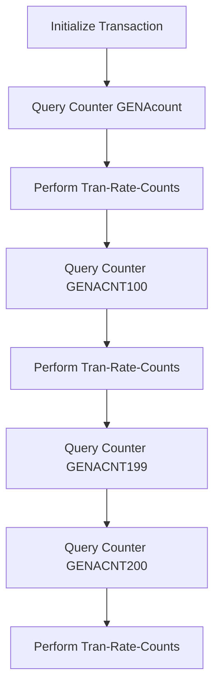

The <SwmToken path="base/src/lgwebst5.cbl" pos="11:6:6" line-data="       PROGRAM-ID. LGWEBST5">`LGWEBST5`</SwmToken> program is responsible for querying and updating various transaction counters in the CICS environment. This is achieved by initializing the transaction, querying specific counters, and performing updates to the transaction rate counts.

The flow starts with initializing the transaction by setting various fields. Then, it queries the <SwmToken path="base/src/lgwebst5.cbl" pos="268:9:9" line-data="           Exec CICS Query Counter(GENAcount)">`GENAcount`</SwmToken> counter to get the current transaction count. The <SwmToken path="base/src/lgwebst5.cbl" pos="279:3:7" line-data="           Perform Tran-Rate-Counts">`Tran-Rate-Counts`</SwmToken> paragraph is performed to update the transaction rate counts. This process is repeated for other counters like <SwmToken path="base/src/lgwebst5.cbl" pos="281:9:9" line-data="           Exec CICS Query Counter(GENACNT100)">`GENACNT100`</SwmToken>, <SwmToken path="base/src/lgwebst5.cbl" pos="296:9:9" line-data="           Exec CICS Query Counter(GENACNT199)">`GENACNT199`</SwmToken>, and <SwmToken path="base/src/lgwebst5.cbl" pos="304:9:9" line-data="           Exec CICS Query Counter(GENACNT200)">`GENACNT200`</SwmToken> to get counts of successful, error, and additional transactions, respectively, and update the transaction rate counts accordingly.

Lets' zoom into the flow:



<SwmSnippet path="/base/src/lgwebst5.cbl" line="252">

---

## Initializing Transaction

First, the transaction is initialized by setting various fields such as <SwmToken path="base/src/lgwebst5.cbl" pos="254:7:9" line-data="           MOVE EIBTRNID TO WS-TRANSID.">`WS-TRANSID`</SwmToken>, <SwmToken path="base/src/lgwebst5.cbl" pos="255:7:9" line-data="           MOVE EIBTRMID TO WS-TERMID.">`WS-TERMID`</SwmToken>, <SwmToken path="base/src/lgwebst5.cbl" pos="256:7:9" line-data="           MOVE EIBTASKN TO WS-TASKNUM.">`WS-TASKNUM`</SwmToken>, and <SwmToken path="base/src/lgwebst5.cbl" pos="257:7:9" line-data="           MOVE EIBCALEN TO WS-CALEN.">`WS-CALEN`</SwmToken> to their respective values from the CICS environment.

```cobol
           INITIALIZE WS-HEADER.

           MOVE EIBTRNID TO WS-TRANSID.
           MOVE EIBTRMID TO WS-TERMID.
           MOVE EIBTASKN TO WS-TASKNUM.
           MOVE EIBCALEN TO WS-CALEN.
```

---

</SwmSnippet>

<SwmSnippet path="/base/src/lgwebst5.cbl" line="268">

---

## Querying Counter <SwmToken path="base/src/lgwebst5.cbl" pos="268:9:9" line-data="           Exec CICS Query Counter(GENAcount)">`GENAcount`</SwmToken>

Next, the counter <SwmToken path="base/src/lgwebst5.cbl" pos="268:9:9" line-data="           Exec CICS Query Counter(GENAcount)">`GENAcount`</SwmToken> is queried from the CICS environment to get the current transaction count value. This value is then moved to <SwmToken path="base/src/lgwebst5.cbl" pos="273:7:9" line-data="           Move CountVal  To GENAcount-V">`GENAcount-V`</SwmToken> and <SwmToken path="base/src/lgwebst5.cbl" pos="82:3:3" line-data="          03  S3                      Pic X(9).">`S3`</SwmToken> for further processing.

```cobol
           Exec CICS Query Counter(GENAcount)
                            Pool(GENApool)
                            Value(CountVal)
                            Resp(WS-RESP)
           End-Exec.
```

---

</SwmSnippet>

<SwmSnippet path="/base/src/lgwebst5.cbl" line="279">

---

## Performing <SwmToken path="base/src/lgwebst5.cbl" pos="279:3:7" line-data="           Perform Tran-Rate-Counts">`Tran-Rate-Counts`</SwmToken>

Then, the <SwmToken path="base/src/lgwebst5.cbl" pos="279:3:7" line-data="           Perform Tran-Rate-Counts">`Tran-Rate-Counts`</SwmToken> paragraph is performed to update the transaction rate counts based on the queried counter values.

```cobol
           Perform Tran-Rate-Counts
```

---

</SwmSnippet>

<SwmSnippet path="/base/src/lgwebst5.cbl" line="281">

---

## Querying Counter <SwmToken path="base/src/lgwebst5.cbl" pos="281:9:9" line-data="           Exec CICS Query Counter(GENACNT100)">`GENACNT100`</SwmToken>

Moving to the next step, the counter <SwmToken path="base/src/lgwebst5.cbl" pos="281:9:9" line-data="           Exec CICS Query Counter(GENACNT100)">`GENACNT100`</SwmToken> is queried to get the count of successful transactions. This value is then moved to <SwmToken path="base/src/lgwebst5.cbl" pos="19:3:3" line-data="       01  CountSuccess               PIC S9(9) COMP.">`CountSuccess`</SwmToken>, <SwmToken path="base/src/lgwebst5.cbl" pos="21:3:3" line-data="       01  CountInq                   PIC S9(8) COMP.">`CountInq`</SwmToken>, and <SwmToken path="base/src/lgwebst5.cbl" pos="81:16:18" line-data="          03  Filler                  Pic X(14) Value &#39;&amp;GENACNT100-V=&#39;.">`GENACNT100-V`</SwmToken> for further processing.

```cobol
           Exec CICS Query Counter(GENACNT100)
                            Pool(GENApool)
                            Value(CountVal)
                            Resp(WS-RESP)
           End-Exec.
```

---

</SwmSnippet>

<SwmSnippet path="/base/src/lgwebst5.cbl" line="294">

---

## Performing <SwmToken path="base/src/lgwebst5.cbl" pos="294:3:7" line-data="           Perform Tran-Rate-Counts">`Tran-Rate-Counts`</SwmToken> Again

The <SwmToken path="base/src/lgwebst5.cbl" pos="294:3:7" line-data="           Perform Tran-Rate-Counts">`Tran-Rate-Counts`</SwmToken> paragraph is performed again to update the transaction rate counts based on the new counter values.

```cobol
           Perform Tran-Rate-Counts
```

---

</SwmSnippet>

<SwmSnippet path="/base/src/lgwebst5.cbl" line="296">

---

## Querying Counter <SwmToken path="base/src/lgwebst5.cbl" pos="296:9:9" line-data="           Exec CICS Query Counter(GENACNT199)">`GENACNT199`</SwmToken>

Next, the counter <SwmToken path="base/src/lgwebst5.cbl" pos="296:9:9" line-data="           Exec CICS Query Counter(GENACNT199)">`GENACNT199`</SwmToken> is queried to get the count of error transactions. This value is then moved to <SwmToken path="base/src/lgwebst5.cbl" pos="20:3:3" line-data="       01  CountErrors                PIC S9(8) COMP.">`CountErrors`</SwmToken> and <SwmToken path="base/src/lgwebst5.cbl" pos="83:16:18" line-data="          03  Filler                  Pic X(14) Value &#39;&amp;GENACNT199-V=&#39;.">`GENACNT199-V`</SwmToken> for further processing.

```cobol
           Exec CICS Query Counter(GENACNT199)
                            Pool(GENApool)
                            Value(CountVal)
                            Resp(WS-RESP)
           End-Exec.
```

---

</SwmSnippet>

<SwmSnippet path="/base/src/lgwebst5.cbl" line="304">

---

## Querying Counter <SwmToken path="base/src/lgwebst5.cbl" pos="304:9:9" line-data="           Exec CICS Query Counter(GENACNT200)">`GENACNT200`</SwmToken>

Finally, the counter <SwmToken path="base/src/lgwebst5.cbl" pos="304:9:9" line-data="           Exec CICS Query Counter(GENACNT200)">`GENACNT200`</SwmToken> is queried to get the count of additional transactions. This value is then added to <SwmToken path="base/src/lgwebst5.cbl" pos="19:3:3" line-data="       01  CountSuccess               PIC S9(9) COMP.">`CountSuccess`</SwmToken> and moved to <SwmToken path="base/src/lgwebst5.cbl" pos="22:3:3" line-data="       01  CountAdd                   PIC S9(8) COMP.">`CountAdd`</SwmToken> and <SwmToken path="base/src/lgwebst5.cbl" pos="85:16:18" line-data="          03  Filler                  Pic X(14) Value &#39;&amp;GENACNT200-V=&#39;.">`GENACNT200-V`</SwmToken> for further processing.

```cobol
           Exec CICS Query Counter(GENACNT200)
                            Pool(GENApool)
                            Value(CountVal)
                            Resp(WS-RESP)
           End-Exec.
```

---

</SwmSnippet>

<SwmSnippet path="/base/src/lgwebst5.cbl" line="317">

---

## Performing <SwmToken path="base/src/lgwebst5.cbl" pos="317:3:7" line-data="           Perform Tran-Rate-Counts">`Tran-Rate-Counts`</SwmToken> Once More

The <SwmToken path="base/src/lgwebst5.cbl" pos="317:3:7" line-data="           Perform Tran-Rate-Counts">`Tran-Rate-Counts`</SwmToken> paragraph is performed once more to update the transaction rate counts based on the latest counter values.

```cobol
           Perform Tran-Rate-Counts
```

---

</SwmSnippet>

&nbsp;

*This is an auto-generated document by Swimm 🌊 and has not yet been verified by a human*

<SwmMeta version="3.0.0" repo-id="Z2l0aHViJTNBJTNBa3luZHJ5bC1jaWNzLWdlbmFwcCUzQSUzQVN3aW1tLURlbW8=" repo-name="kyndryl-cics-genapp"><sup>Powered by [Swimm](/)</sup></SwmMeta>
