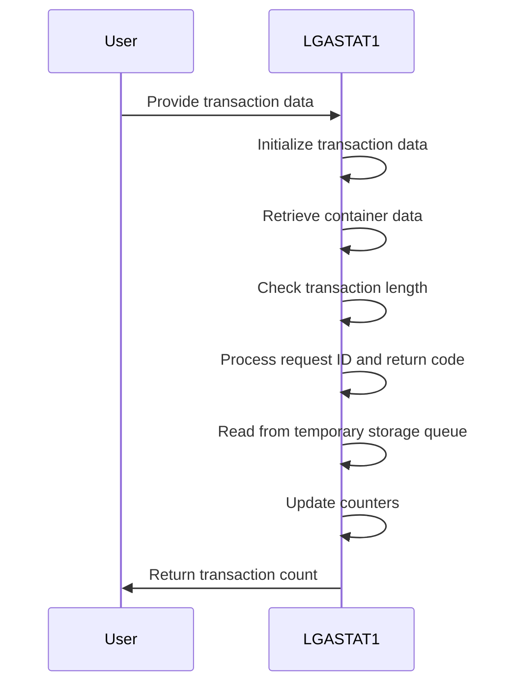
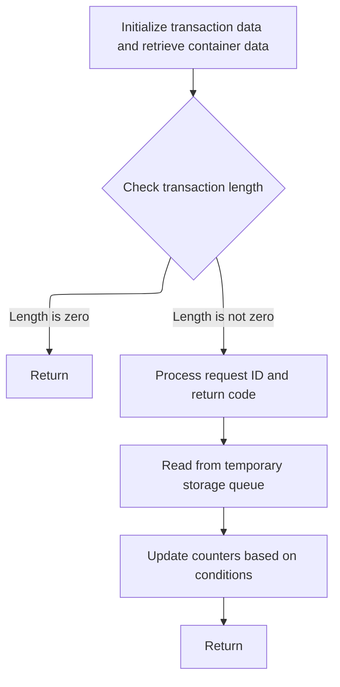

This document describes the transaction management flow in the <SwmToken path="base/src/lgastat1.cbl" pos="7:6:6" line-data="       PROGRAM-ID. LGASTAT1.">`LGASTAT1`</SwmToken> program. The program is responsible for processing transaction data and updating counters within the insurance application.

For example, if the transaction length is not zero, the program processes the request ID and updates counters, resulting in a transaction count being returned.

The main steps are:

- Initialize transaction data and retrieve container data
- Check transaction length
- Process request ID and return code
- Read from temporary storage queue
- Update counters based on conditions
- Return



## Dependencies

### Copybook

- LGCMAREA (<SwmPath>[base/src/lgcmarea.cpy](base/src/lgcmarea.cpy)</SwmPath>)

# Initiating Transaction Flow



<SwmSnippet path="/base/src/lgastat1.cbl" line="69">

---

In <SwmToken path="base/src/lgastat1.cbl" pos="69:1:1" line-data="       MAINLINE SECTION.">`MAINLINE`</SwmToken>, we start by setting up the transaction context with key identifiers.

```cobol
       MAINLINE SECTION.

      *
           INITIALIZE WS-HEADER.
      *
           MOVE EIBTRNID TO WS-TRANSID.
           MOVE EIBTRMID TO WS-TERMID.
           MOVE EIBTASKN TO WS-TASKNUM.
           MOVE EIBCALEN TO WS-CALEN.
```

---

</SwmSnippet>

<SwmSnippet path="/base/src/lgastat1.cbl" line="79">

---

Next, we fetch request data from <SwmToken path="base/src/lgastat1.cbl" pos="79:9:11" line-data="           Exec CICS Get Container(WS-CHANname1)">`WS-CHANname1`</SwmToken> into <SwmToken path="base/src/lgastat1.cbl" pos="80:3:7" line-data="                         Into(WS-Data-Req)">`WS-Data-Req`</SwmToken>.

```cobol
           Exec CICS Get Container(WS-CHANname1)
                         Into(WS-Data-Req)
                         Resp(WS-RESP)
           End-Exec.
```

---

</SwmSnippet>

<SwmSnippet path="/base/src/lgastat1.cbl" line="84">

---

Following the previous step, we use another CICS Get Container command to pull data from <SwmToken path="base/src/lgastat1.cbl" pos="84:9:11" line-data="           Exec CICS Get Container(WS-CHANname2)">`WS-CHANname2`</SwmToken> into <SwmToken path="base/src/lgastat1.cbl" pos="85:3:7" line-data="                         Into(WS-Data-RC)">`WS-Data-RC`</SwmToken>. This provides additional context or response data for the transaction.

```cobol
           Exec CICS Get Container(WS-CHANname2)
                         Into(WS-Data-RC)
                         Resp(WS-RESP)
           End-Exec.
```

---

</SwmSnippet>

<SwmSnippet path="/base/src/lgastat1.cbl" line="92">

---

We check EIBCALEN and either return or prepare data for further processing.

```cobol
           Else
             IF EIBCALEN IS EQUAL TO ZERO
                 EXEC CICS RETURN END-EXEC
             Else
               Move CA-REQUEST-ID  To GENAcounter
               Move CA-RETURN-CODE To GENAtype
             End-if
```

---

</SwmSnippet>

<SwmSnippet path="/base/src/lgastat1.cbl" line="99">

---

We read temporary data from <SwmToken path="base/src/lgastat1.cbl" pos="101:11:13" line-data="           Exec Cics ReadQ TS Queue(WS-Qname)">`WS-Qname`</SwmToken> into <SwmToken path="base/src/lgastat1.cbl" pos="102:3:5" line-data="                     Into(WS-Qarea)">`WS-Qarea`</SwmToken>.

```cobol
           End-if.
      *
           Exec Cics ReadQ TS Queue(WS-Qname)
                     Into(WS-Qarea)
                     Length(Length of WS-Qarea)
                     Resp(WS-RESP)
           End-Exec.
```

---

</SwmSnippet>

<SwmSnippet path="/base/src/lgastat1.cbl" line="122">

---

We standardize <SwmToken path="base/src/lgastat1.cbl" pos="122:3:3" line-data="           If GENAcounter = &#39;02ACUS&#39;">`GENAcounter`</SwmToken> from <SwmToken path="base/src/lgastat1.cbl" pos="122:8:8" line-data="           If GENAcounter = &#39;02ACUS&#39;">`02ACUS`</SwmToken> to <SwmToken path="base/src/lgastat1.cbl" pos="123:4:4" line-data="                                     Move &#39;01ACUS&#39; to GENAcounter.">`01ACUS`</SwmToken>.

```cobol
           If GENAcounter = '02ACUS'
                                     Move '01ACUS' to GENAcounter.
```

---

</SwmSnippet>

<SwmSnippet path="/base/src/lgastat1.cbl" line="124">

---

We ensure uniformity by transforming <SwmToken path="base/src/lgastat1.cbl" pos="124:3:3" line-data="           If GENAcounter = &#39;02ICOM&#39; or">`GENAcounter`</SwmToken> to <SwmToken path="base/src/lgastat1.cbl" pos="126:12:12" line-data="              GENAcounter = &#39;05ICOM&#39; Move &#39;01ICOM&#39; to GENAcounter.">`01ICOM`</SwmToken>.

```cobol
           If GENAcounter = '02ICOM' or
              GENAcounter = '03ICOM' or
              GENAcounter = '05ICOM' Move '01ICOM' to GENAcounter.
```

---

</SwmSnippet>

<SwmSnippet path="/base/src/lgastat1.cbl" line="127">

---

We set <SwmToken path="base/src/lgastat1.cbl" pos="127:3:3" line-data="           If GENAType Not = &#39;00&#39; Move &#39;99&#39; To GENAtype.">`GENAType`</SwmToken> to '99' for special conditions.

```cobol
           If GENAType Not = '00' Move '99' To GENAtype.
```

---

</SwmSnippet>

<SwmSnippet path="/base/src/lgastat1.cbl" line="129">

---

Finally, we use CICS Get Counter to fetch a transaction count into Trancount, providing a unique identifier for the transaction before returning.

```cobol
               Exec CICS Get Counter(GENAcount)
                             Pool(GENApool)
                             Value(Trancount)
                             Resp(WS-RESP)
               End-Exec

           EXEC CICS RETURN END-EXEC.
```

---

</SwmSnippet>

&nbsp;

*This is an auto-generated document by Swimm 🌊 and has not yet been verified by a human*

<SwmMeta version="3.0.0" repo-id="Z2l0aHViJTNBJTNBa3luZHJ5bC1jaWNzLWdlbmFwcCUzQSUzQVN3aW1tLURlbW8=" repo-name="kyndryl-cics-genapp"><sup>Powered by [Swimm](/)</sup></SwmMeta>
