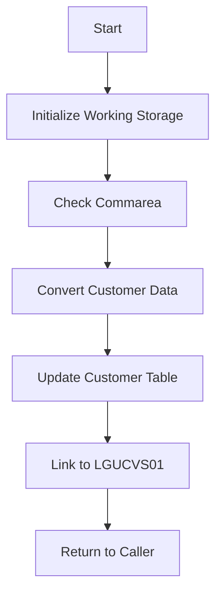

The <SwmToken path="base/src/lgucdb01.cbl" pos="10:6:6" line-data="       PROGRAM-ID. LGUCDB01.">`LGUCDB01`</SwmToken> program is a COBOL application designed to update customer details in a <SwmToken path="base/src/lgucdb01.cbl" pos="168:6:6" line-data="                     CUSTOMERNUMBER = :DB2-CUSTOMERNUM-INT">`DB2`</SwmToken> database. This document will cover the following aspects of the program:

1. What the Program Does
2. Program Flow
3. Program Sections

## What the Program Does

The <SwmToken path="base/src/lgucdb01.cbl" pos="10:6:6" line-data="       PROGRAM-ID. LGUCDB01.">`LGUCDB01`</SwmToken> program updates customer details in a <SwmToken path="base/src/lgucdb01.cbl" pos="168:6:6" line-data="                     CUSTOMERNUMBER = :DB2-CUSTOMERNUM-INT">`DB2`</SwmToken> database. It initializes working storage variables, checks the communication area (commarea), converts customer data to <SwmToken path="base/src/lgucdb01.cbl" pos="168:6:6" line-data="                     CUSTOMERNUMBER = :DB2-CUSTOMERNUM-INT">`DB2`</SwmToken> integer format, and performs an update on the customer table. If an error occurs during the update, it writes an error message to a queue.

## Program Flow

The program follows these high-level steps:

1. Initialize working storage variables.
2. Check the commarea and obtain required details.
3. Convert commarea customer data to <SwmToken path="base/src/lgucdb01.cbl" pos="168:6:6" line-data="                     CUSTOMERNUMBER = :DB2-CUSTOMERNUM-INT">`DB2`</SwmToken> integer format.
4. Perform the update on the customer table.
5. Link to another program <SwmToken path="base/src/lgucdb01.cbl" pos="136:8:9" line-data="           EXEC CICS LINK Program(LGUCVS01)">`(LGUCVS01`</SwmToken>) with the updated commarea.
6. Return to the caller.



<SwmSnippet path="/base/src/lgucdb01.cbl" line="101">

---

### MAINLINE SECTION

First, the MAINLINE SECTION initializes working storage variables, checks the commarea, converts customer data to <SwmToken path="base/src/lgucdb01.cbl" pos="168:6:6" line-data="                     CUSTOMERNUMBER = :DB2-CUSTOMERNUM-INT">`DB2`</SwmToken> integer format, performs the update on the customer table, and links to another program <SwmToken path="base/src/lgucdb01.cbl" pos="136:8:9" line-data="           EXEC CICS LINK Program(LGUCVS01)">`(LGUCVS01`</SwmToken>). Finally, it returns to the caller.

```cobol
       MAINLINE SECTION.

      *----------------------------------------------------------------*
      * Common code                                                    *
      *----------------------------------------------------------------*
      * initialize working storage variables
           INITIALIZE WS-HEADER.
      * set up general variable
           MOVE EIBTRNID TO WS-TRANSID.
           MOVE EIBTRMID TO WS-TERMID.
           MOVE EIBTASKN TO WS-TASKNUM.
           MOVE SPACES   TO WS-RETRY.
      *----------------------------------------------------------------*
      * Check commarea and obtain required details                     *
      *----------------------------------------------------------------*
      * If NO commarea received issue an ABEND
           IF EIBCALEN IS EQUAL TO ZERO
               MOVE ' NO COMMAREA RECEIVED' TO EM-VARIABLE
               PERFORM WRITE-ERROR-MESSAGE
               EXEC CICS ABEND ABCODE('LGCA') NODUMP END-EXEC
           END-IF
```

---

</SwmSnippet>

<SwmSnippet path="/base/src/lgucdb01.cbl" line="152">

---

### <SwmToken path="base/src/lgucdb01.cbl" pos="152:1:5" line-data="       UPDATE-CUSTOMER-INFO.">`UPDATE-CUSTOMER-INFO`</SwmToken>

Now, the <SwmToken path="base/src/lgucdb01.cbl" pos="152:1:5" line-data="       UPDATE-CUSTOMER-INFO.">`UPDATE-CUSTOMER-INFO`</SwmToken> section updates the customer table with the provided details. If the SQL update statement returns a non-zero SQLCODE, it sets the appropriate return code and writes an error message if necessary.

```cobol
       UPDATE-CUSTOMER-INFO.

           MOVE ' UPDATE CUST  ' TO EM-SQLREQ
             EXEC SQL
               UPDATE CUSTOMER
                 SET
                   FIRSTNAME     = :CA-FIRST-NAME,
                   LASTNAME      = :CA-LAST-NAME,
                   DATEOFBIRTH   = :CA-DOB,
                   HOUSENAME     = :CA-HOUSE-NAME,
                   HOUSENUMBER   = :CA-HOUSE-NUM,
                   POSTCODE      = :CA-POSTCODE,
                   PHONEMOBILE   = :CA-PHONE-MOBILE,
                   PHONEHOME     = :CA-PHONE-HOME,
                   EMAILADDRESS  = :CA-EMAIL-ADDRESS
                 WHERE
                     CUSTOMERNUMBER = :DB2-CUSTOMERNUM-INT
             END-EXEC

           IF SQLCODE NOT EQUAL 0
      *      Non-zero SQLCODE from UPDATE statement
```

---

</SwmSnippet>

<SwmSnippet path="/base/src/lgucdb01.cbl" line="189">

---

### <SwmToken path="base/src/lgucdb01.cbl" pos="189:1:5" line-data="       WRITE-ERROR-MESSAGE.">`WRITE-ERROR-MESSAGE`</SwmToken>

Then, the <SwmToken path="base/src/lgucdb01.cbl" pos="189:1:5" line-data="       WRITE-ERROR-MESSAGE.">`WRITE-ERROR-MESSAGE`</SwmToken> section writes an error message to the queue. It includes the date, time, program name, customer number, policy number, and SQLCODE in the message.

```cobol
       WRITE-ERROR-MESSAGE.
      * Save SQLCODE in message
           MOVE SQLCODE TO EM-SQLRC
      * Obtain and format current time and date
           EXEC CICS ASKTIME ABSTIME(WS-ABSTIME)
           END-EXEC
           EXEC CICS FORMATTIME ABSTIME(WS-ABSTIME)
                     MMDDYYYY(WS-DATE)
                     TIME(WS-TIME)
           END-EXEC
           MOVE WS-DATE TO EM-DATE
           MOVE WS-TIME TO EM-TIME
      * Write output message to TDQ
           EXEC CICS LINK PROGRAM('LGSTSQ')
                     COMMAREA(ERROR-MSG)
                     LENGTH(LENGTH OF ERROR-MSG)
           END-EXEC.
      * Write 90 bytes or as much as we have of commarea to TDQ
           IF EIBCALEN > 0 THEN
             IF EIBCALEN < 91 THEN
               MOVE DFHCOMMAREA(1:EIBCALEN) TO CA-DATA
```

---

</SwmSnippet>

&nbsp;

*This is an auto-generated document by Swimm 🌊 and has not yet been verified by a human*

<SwmMeta version="3.0.0" repo-id="Z2l0aHViJTNBJTNBa3luZHJ5bC1jaWNzLWdlbmFwcCUzQSUzQVN3aW1tLURlbW8=" repo-name="kyndryl-cics-genapp"><sup>Powered by [Swimm](/)</sup></SwmMeta>
