This document will cover the <SwmToken path="base/src/lgucdb01.cbl" pos="10:6:6" line-data="       PROGRAM-ID. LGUCDB01.">`LGUCDB01`</SwmToken> program. We'll cover:

1. What the Program Does
2. Program Flow
3. Program Sections

## What the Program Does

The <SwmToken path="base/src/lgucdb01.cbl" pos="10:6:6" line-data="       PROGRAM-ID. LGUCDB01.">`LGUCDB01`</SwmToken> program is designed to update customer details in a <SwmToken path="base/src/lgucdb01.cbl" pos="168:6:6" line-data="                     CUSTOMERNUMBER = :DB2-CUSTOMERNUM-INT">`DB2`</SwmToken> database. It initializes working storage variables, checks for the presence of a communication area (COMMAREA), converts customer data to <SwmToken path="base/src/lgucdb01.cbl" pos="168:6:6" line-data="                     CUSTOMERNUMBER = :DB2-CUSTOMERNUM-INT">`DB2`</SwmToken> integer format, updates the customer information in the database, and handles any errors that occur during the process.

## Program Flow

The program flow of <SwmToken path="base/src/lgucdb01.cbl" pos="10:6:6" line-data="       PROGRAM-ID. LGUCDB01.">`LGUCDB01`</SwmToken> is as follows:

1. Initialize working storage variables.
2. Check for the presence of a COMMAREA.
3. Convert customer data to <SwmToken path="base/src/lgucdb01.cbl" pos="168:6:6" line-data="                     CUSTOMERNUMBER = :DB2-CUSTOMERNUM-INT">`DB2`</SwmToken> integer format.
4. Update customer information in the <SwmToken path="base/src/lgucdb01.cbl" pos="168:6:6" line-data="                     CUSTOMERNUMBER = :DB2-CUSTOMERNUM-INT">`DB2`</SwmToken> database.
5. Handle any errors that occur during the update process.
6. Call the <SwmToken path="base/src/lgucdb01.cbl" pos="72:3:3" line-data="       77  LGUCVS01                    Pic X(8) Value &#39;LGUCVS01&#39;.">`LGUCVS01`</SwmToken> program to continue processing.
7. Return control to the caller.

```mermaid
graph TD
  A[Start] --> B[Initialize working storage variables]
  B --> C{COMMAREA present?}
  C -->|No| D[Issue ABEND]
  C -->|Yes| E[Convert customer data to DB2 integer format]
  E --> F[Update customer information in DB2 database]
  F --> G{SQLCODE = 0?}
  G -->|No| H[Handle error]
  G -->|Yes| I[Call LGUCVS01 program]
  I --> J[Return control to caller]

%% Swimm:
%% graph TD
%%   A[Start] --> B[Initialize working storage variables]
%%   B --> C{COMMAREA present?}
%%   C -->|No| D[Issue ABEND]
%%   C -->|Yes| E[Convert customer data to <SwmToken path="base/src/lgucdb01.cbl" pos="168:6:6" line-data="                     CUSTOMERNUMBER = :DB2-CUSTOMERNUM-INT">`DB2`</SwmToken> integer format]
%%   E --> F[Update customer information in <SwmToken path="base/src/lgucdb01.cbl" pos="168:6:6" line-data="                     CUSTOMERNUMBER = :DB2-CUSTOMERNUM-INT">`DB2`</SwmToken> database]
%%   F --> G{SQLCODE = 0?}
%%   G -->|No| H[Handle error]
%%   G -->|Yes| I[Call <SwmToken path="base/src/lgucdb01.cbl" pos="72:3:3" line-data="       77  LGUCVS01                    Pic X(8) Value &#39;LGUCVS01&#39;.">`LGUCVS01`</SwmToken> program]
%%   I --> J[Return control to caller]
```



<SwmSnippet path="/base/src/lgucdb01.cbl" line="98">

---

## Program Sections

First, the MAINLINE SECTION initializes working storage variables, checks for the presence of a COMMAREA, converts customer data to <SwmToken path="base/src/lgucdb01.cbl" pos="168:6:6" line-data="                     CUSTOMERNUMBER = :DB2-CUSTOMERNUM-INT">`DB2`</SwmToken> integer format, and calls the <SwmToken path="base/src/lgucdb01.cbl" pos="152:1:5" line-data="       UPDATE-CUSTOMER-INFO.">`UPDATE-CUSTOMER-INFO`</SwmToken> section to update the customer information in the <SwmToken path="base/src/lgucdb01.cbl" pos="168:6:6" line-data="                     CUSTOMERNUMBER = :DB2-CUSTOMERNUM-INT">`DB2`</SwmToken> database. Finally, it calls the <SwmToken path="base/src/lgucdb01.cbl" pos="72:3:3" line-data="       77  LGUCVS01                    Pic X(8) Value &#39;LGUCVS01&#39;.">`LGUCVS01`</SwmToken> program and returns control to the caller.

```cobol
       PROCEDURE DIVISION.

      *----------------------------------------------------------------*
       MAINLINE SECTION.

      *----------------------------------------------------------------*
      * Common code                                                    *
      *----------------------------------------------------------------*
      * initialize working storage variables
           INITIALIZE WS-HEADER.
      * set up general variable
           MOVE EIBTRNID TO WS-TRANSID.
           MOVE EIBTRMID TO WS-TERMID.
           MOVE EIBTASKN TO WS-TASKNUM.
           MOVE SPACES   TO WS-RETRY.
      *----------------------------------------------------------------*
      * Check commarea and obtain required details                     *
      *----------------------------------------------------------------*
      * If NO commarea received issue an ABEND
           IF EIBCALEN IS EQUAL TO ZERO
               MOVE ' NO COMMAREA RECEIVED' TO EM-VARIABLE
```

---

</SwmSnippet>

<SwmSnippet path="/base/src/lgucdb01.cbl" line="152">

---

Next, the <SwmToken path="base/src/lgucdb01.cbl" pos="152:1:5" line-data="       UPDATE-CUSTOMER-INFO.">`UPDATE-CUSTOMER-INFO`</SwmToken> section updates the customer information in the <SwmToken path="base/src/lgucdb01.cbl" pos="168:6:6" line-data="                     CUSTOMERNUMBER = :DB2-CUSTOMERNUM-INT">`DB2`</SwmToken> database. If the SQLCODE is not zero, it handles the error by setting the appropriate return code and calling the <SwmToken path="base/src/lgucdb01.cbl" pos="189:1:5" line-data="       WRITE-ERROR-MESSAGE.">`WRITE-ERROR-MESSAGE`</SwmToken> section.

```cobol
       UPDATE-CUSTOMER-INFO.

           MOVE ' UPDATE CUST  ' TO EM-SQLREQ
             EXEC SQL
               UPDATE CUSTOMER
                 SET
                   FIRSTNAME     = :CA-FIRST-NAME,
                   LASTNAME      = :CA-LAST-NAME,
                   DATEOFBIRTH   = :CA-DOB,
                   HOUSENAME     = :CA-HOUSE-NAME,
                   HOUSENUMBER   = :CA-HOUSE-NUM,
                   POSTCODE      = :CA-POSTCODE,
                   PHONEMOBILE   = :CA-PHONE-MOBILE,
                   PHONEHOME     = :CA-PHONE-HOME,
                   EMAILADDRESS  = :CA-EMAIL-ADDRESS
                 WHERE
                     CUSTOMERNUMBER = :DB2-CUSTOMERNUM-INT
             END-EXEC

           IF SQLCODE NOT EQUAL 0
      *      Non-zero SQLCODE from UPDATE statement
```

---

</SwmSnippet>

<SwmSnippet path="/base/src/lgucdb01.cbl" line="189">

---

Then, the <SwmToken path="base/src/lgucdb01.cbl" pos="189:1:5" line-data="       WRITE-ERROR-MESSAGE.">`WRITE-ERROR-MESSAGE`</SwmToken> section handles errors by saving the SQLCODE in the error message, obtaining and formatting the current time and date, and writing the error message to the TDQ. If a COMMAREA is present, it writes the COMMAREA data to the TDQ as well.

```cobol
       WRITE-ERROR-MESSAGE.
      * Save SQLCODE in message
           MOVE SQLCODE TO EM-SQLRC
      * Obtain and format current time and date
           EXEC CICS ASKTIME ABSTIME(WS-ABSTIME)
           END-EXEC
           EXEC CICS FORMATTIME ABSTIME(WS-ABSTIME)
                     MMDDYYYY(WS-DATE)
                     TIME(WS-TIME)
           END-EXEC
           MOVE WS-DATE TO EM-DATE
           MOVE WS-TIME TO EM-TIME
      * Write output message to TDQ
           EXEC CICS LINK PROGRAM('LGSTSQ')
                     COMMAREA(ERROR-MSG)
                     LENGTH(LENGTH OF ERROR-MSG)
           END-EXEC.
      * Write 90 bytes or as much as we have of commarea to TDQ
           IF EIBCALEN > 0 THEN
             IF EIBCALEN < 91 THEN
               MOVE DFHCOMMAREA(1:EIBCALEN) TO CA-DATA
```

---

</SwmSnippet>

&nbsp;

*This is an auto-generated document by Swimm 🌊 and has not yet been verified by a human*

<SwmMeta version="3.0.0" repo-id="Z2l0aHViJTNBJTNBa3luZHJ5bC1jaWNzLWdlbmFwcCUzQSUzQVN3aW1tLURlbW8=" repo-name="kyndryl-cics-genapp"><sup>Powered by [Swimm](/)</sup></SwmMeta>
