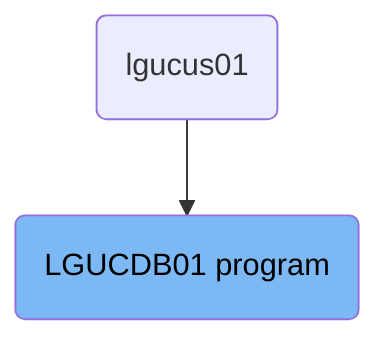
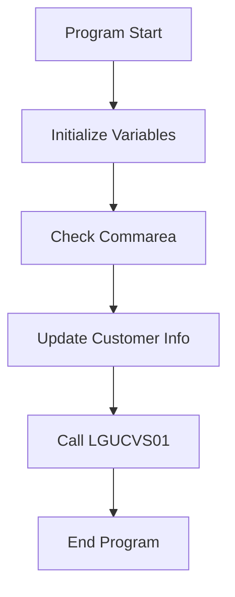

The <SwmToken path="base/src/lgucdb01.cbl" pos="10:6:6" line-data="       PROGRAM-ID. LGUCDB01.">`LGUCDB01`</SwmToken> program is responsible for updating customer information in the IBM Db2 database. This is achieved by initializing necessary variables, checking for the presence of the commarea, converting customer data, and calling another program (<SwmToken path="base/src/lgucdb01.cbl" pos="136:9:9" line-data="           EXEC CICS LINK Program(LGUCVS01)">`LGUCVS01`</SwmToken>) for further processing.

The flow starts with initializing variables needed for the transaction. It then checks if the commarea is received, and if not, it stops the program with an error. Next, it converts customer data from the commarea to a format suitable for the database and updates the customer information. Finally, it calls another program for additional processing and ends the program gracefully.

# Where is this program used?

This program is used once, in a flow starting from `lgucus01` as represented in the following diagram:



Lets' zoom into the flow:



<SwmSnippet path="/base/src/lgucdb01.cbl" line="106">

---

## Initialize Variables

First, the program initializes working storage variables. This includes setting up general variables like <SwmToken path="base/src/lgucdb01.cbl" pos="109:7:9" line-data="           MOVE EIBTRNID TO WS-TRANSID.">`WS-TRANSID`</SwmToken>, <SwmToken path="base/src/lgucdb01.cbl" pos="110:7:9" line-data="           MOVE EIBTRMID TO WS-TERMID.">`WS-TERMID`</SwmToken>, and <SwmToken path="base/src/lgucdb01.cbl" pos="111:7:9" line-data="           MOVE EIBTASKN TO WS-TASKNUM.">`WS-TASKNUM`</SwmToken> which are essential for tracking the transaction, terminal, and task number respectively.

```cobol
      * initialize working storage variables
           INITIALIZE WS-HEADER.
      * set up general variable
           MOVE EIBTRNID TO WS-TRANSID.
           MOVE EIBTRMID TO WS-TERMID.
           MOVE EIBTASKN TO WS-TASKNUM.
           MOVE SPACES   TO WS-RETRY.
```

---

</SwmSnippet>

<SwmSnippet path="/base/src/lgucdb01.cbl" line="116">

---

## Check Commarea

Next, the program checks if the <SwmToken path="base/src/lgucdb01.cbl" pos="116:7:7" line-data="      * If NO commarea received issue an ABEND">`commarea`</SwmToken> is received. If no <SwmToken path="base/src/lgucdb01.cbl" pos="116:7:7" line-data="      * If NO commarea received issue an ABEND">`commarea`</SwmToken> is received, it issues an ABEND (abnormal end) with the code 'LGCA' and writes an error message. This ensures that the program does not proceed without the necessary data.

```cobol
      * If NO commarea received issue an ABEND
           IF EIBCALEN IS EQUAL TO ZERO
               MOVE ' NO COMMAREA RECEIVED' TO EM-VARIABLE
               PERFORM WRITE-ERROR-MESSAGE
               EXEC CICS ABEND ABCODE('LGCA') NODUMP END-EXEC
           END-IF
```

---

</SwmSnippet>

<SwmSnippet path="/base/src/lgucdb01.cbl" line="128">

---

## Update Customer Info

Then, the program converts the customer number from the <SwmToken path="base/src/lgucdb01.cbl" pos="128:5:5" line-data="      * Convert commarea customer to DB2 integer format">`commarea`</SwmToken> to a <SwmToken path="base/src/lgucdb01.cbl" pos="128:11:11" line-data="      * Convert commarea customer to DB2 integer format">`DB2`</SwmToken> integer format and saves it in an error message field. It then calls the <SwmToken path="base/src/lgucdb01.cbl" pos="134:3:7" line-data="           PERFORM UPDATE-CUSTOMER-INFO.">`UPDATE-CUSTOMER-INFO`</SwmToken> paragraph to update the customer information in the database.

```cobol
      * Convert commarea customer to DB2 integer format
           MOVE CA-CUSTOMER-NUM TO DB2-CUSTOMERNUM-INT
      * and save in error msg field incase required
           MOVE CA-CUSTOMER-NUM TO EM-CUSNUM

      *    Call procedure to update required tables
           PERFORM UPDATE-CUSTOMER-INFO.
```

---

</SwmSnippet>

<SwmSnippet path="/base/src/lgucdb01.cbl" line="136">

---

## Call <SwmToken path="base/src/lgucdb01.cbl" pos="136:9:9" line-data="           EXEC CICS LINK Program(LGUCVS01)">`LGUCVS01`</SwmToken>

Moving to the next step, the program calls <SwmToken path="base/src/lgucdb01.cbl" pos="136:9:9" line-data="           EXEC CICS LINK Program(LGUCVS01)">`LGUCVS01`</SwmToken> using the <SwmToken path="base/src/lgucdb01.cbl" pos="116:7:7" line-data="      * If NO commarea received issue an ABEND">`commarea`</SwmToken>. This call updates the customer records.

More about LGUCVS01: <SwmLink doc-title="Updating Customer Records (LGUCVS01)">[Updating Customer Records (LGUCVS01)](/.swm/updating-customer-records-lgucvs01.g1etz950.sw.md)</SwmLink>

```cobol
           EXEC CICS LINK Program(LGUCVS01)
                Commarea(DFHCOMMAREA)
                LENGTH(225)
           END-EXEC.
```

---

</SwmSnippet>

<SwmSnippet path="/base/src/lgucdb01.cbl" line="142">

---

## End Program

Finally, the program returns control to the caller, marking the end of the <SwmToken path="base/src/lgucdb01.cbl" pos="101:1:1" line-data="       MAINLINE SECTION.">`MAINLINE`</SwmToken> section. This ensures that the program exits gracefully after completing its operations.

```cobol
       END-PROGRAM.
           EXEC CICS RETURN END-EXEC.
```

---

</SwmSnippet>

&nbsp;

*This is an auto-generated document by Swimm 🌊 and has not yet been verified by a human*

<SwmMeta version="3.0.0" repo-id="Z2l0aHViJTNBJTNBa3luZHJ5bC1jaWNzLWdlbmFwcCUzQSUzQVN3aW1tLURlbW8=" repo-name="kyndryl-cics-genapp"><sup>Powered by [Swimm](https://app.swimm.io/)</sup></SwmMeta>
