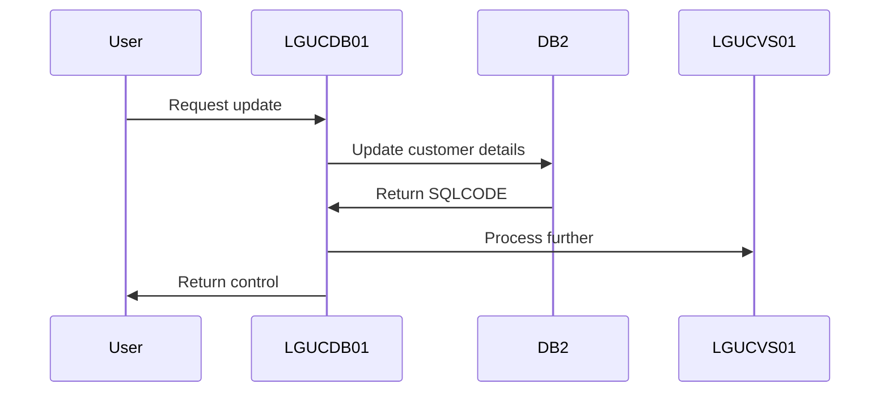
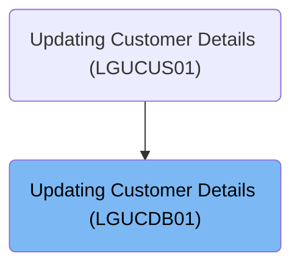

This document describes the process of updating customer details using the <SwmToken path="base/src/lgucdb01.cbl" pos="10:6:6" line-data="       PROGRAM-ID. LGUCDB01.">`LGUCDB01`</SwmToken> program. The program updates customer information in the <SwmToken path="base/src/lgucdb01.cbl" pos="168:6:6" line-data="                     CUSTOMERNUMBER = :DB2-CUSTOMERNUM-INT">`DB2`</SwmToken> database and ensures data consistency by processing further in a VSAM KSDS file.

The main steps are:

- Update customer details in the <SwmToken path="base/src/lgucdb01.cbl" pos="168:6:6" line-data="                     CUSTOMERNUMBER = :DB2-CUSTOMERNUM-INT">`DB2`</SwmToken> database
- Check SQLCODE for update success
- Call <SwmToken path="base/src/lgucdb01.cbl" pos="136:9:9" line-data="           EXEC CICS LINK Program(LGUCVS01)">`LGUCVS01`</SwmToken> for further processing
- Handle return codes based on SQLCODE
- Return control to CICS



## Dependencies

### Programs

- <SwmToken path="base/src/lgucdb01.cbl" pos="136:9:9" line-data="           EXEC CICS LINK Program(LGUCVS01)">`LGUCVS01`</SwmToken> (<SwmPath>[base/src/lgucvs01.cbl](base/src/lgucvs01.cbl)</SwmPath>) - <SwmLink doc-title="Updating Customer Records (LGUCVS01)">[Updating Customer Records (LGUCVS01)](/.swm/updating-customer-records-lgucvs01.tajsj7ju.sw.md)</SwmLink>
- LGSTSQ (<SwmPath>[base/src/lgstsq.cbl](base/src/lgstsq.cbl)</SwmPath>) - <SwmLink doc-title="Message Queue Handler (LGSTSQ)">[Message Queue Handler (LGSTSQ)](/.swm/message-queue-handler-lgstsq.e7y8uelv.sw.md)</SwmLink>

### Copybooks

- LGCMAREA (<SwmPath>[base/src/lgcmarea.cpy](base/src/lgcmarea.cpy)</SwmPath>)
- LGPOLICY (<SwmPath>[base/src/lgpolicy.cpy](base/src/lgpolicy.cpy)</SwmPath>)
- SQLCA

# Where is this program used?

This program is used once, as represented in the following diagram:



# Initiating Customer Update Process

<SwmSnippet path="/base/src/lgucdb01.cbl" line="134">

---

<SwmToken path="base/src/lgucdb01.cbl" pos="101:1:1" line-data="       MAINLINE SECTION.">`MAINLINE`</SwmToken> starts by updating customer info in the <SwmToken path="base/src/lgucdb01.cbl" pos="168:6:6" line-data="                     CUSTOMERNUMBER = :DB2-CUSTOMERNUM-INT">`DB2`</SwmToken> database and then calls <SwmToken path="base/src/lgucdb01.cbl" pos="136:9:9" line-data="           EXEC CICS LINK Program(LGUCVS01)">`LGUCVS01`</SwmToken> for further processing in a VSAM KSDS file.

```cobol
           PERFORM UPDATE-CUSTOMER-INFO.

           EXEC CICS LINK Program(LGUCVS01)
                Commarea(DFHCOMMAREA)
                LENGTH(225)
           END-EXEC.
```

---

</SwmSnippet>

## Executing Customer Data Update

<SwmSnippet path="/base/src/lgucdb01.cbl" line="152">

---

In <SwmToken path="base/src/lgucdb01.cbl" pos="152:1:5" line-data="       UPDATE-CUSTOMER-INFO.">`UPDATE-CUSTOMER-INFO`</SwmToken>, we update customer details in the database using an SQL statement.

```cobol
       UPDATE-CUSTOMER-INFO.

           MOVE ' UPDATE CUST  ' TO EM-SQLREQ
             EXEC SQL
               UPDATE CUSTOMER
                 SET
                   FIRSTNAME     = :CA-FIRST-NAME,
                   LASTNAME      = :CA-LAST-NAME,
                   DATEOFBIRTH   = :CA-DOB,
                   HOUSENAME     = :CA-HOUSE-NAME,
                   HOUSENUMBER   = :CA-HOUSE-NUM,
                   POSTCODE      = :CA-POSTCODE,
                   PHONEMOBILE   = :CA-PHONE-MOBILE,
                   PHONEHOME     = :CA-PHONE-HOME,
                   EMAILADDRESS  = :CA-EMAIL-ADDRESS
                 WHERE
                     CUSTOMERNUMBER = :DB2-CUSTOMERNUM-INT
             END-EXEC
```

---

</SwmSnippet>

<SwmSnippet path="/base/src/lgucdb01.cbl" line="171">

---

After the SQL UPDATE, we check SQLCODE to see if the update was successful. If SQLCODE is 100, it means no matching customer was found, so we set a return code of '01'. For other errors, we set '90' and handle the error accordingly.

```cobol
           IF SQLCODE NOT EQUAL 0
      *      Non-zero SQLCODE from UPDATE statement
             IF SQLCODE EQUAL 100
               MOVE '01' TO CA-RETURN-CODE
```

---

</SwmSnippet>

<SwmSnippet path="/base/src/lgucdb01.cbl" line="180">

---

After handling SQLCODE, we exit the <SwmToken path="base/src/lgucdb01.cbl" pos="134:3:7" line-data="           PERFORM UPDATE-CUSTOMER-INFO.">`UPDATE-CUSTOMER-INFO`</SwmToken> with a return code that indicates the result of the update operation: '01' for no match, '90' for errors, and zero for success.

```cobol
           END-IF.
           EXIT.
```

---

</SwmSnippet>

## Completing Program Execution

<SwmSnippet path="/base/src/lgucdb01.cbl" line="142">

---

<SwmToken path="base/src/lgucdb01.cbl" pos="142:1:3" line-data="       END-PROGRAM.">`END-PROGRAM`</SwmToken> ends the program, and control returns to CICS.

```cobol
       END-PROGRAM.
           EXEC CICS RETURN END-EXEC.
```

---

</SwmSnippet>

&nbsp;

*This is an auto-generated document by Swimm 🌊 and has not yet been verified by a human*

<SwmMeta version="3.0.0" repo-id="Z2l0aHViJTNBJTNBa3luZHJ5bC1jaWNzLWdlbmFwcCUzQSUzQVN3aW1tLURlbW8=" repo-name="kyndryl-cics-genapp"><sup>Powered by [Swimm](/)</sup></SwmMeta>
