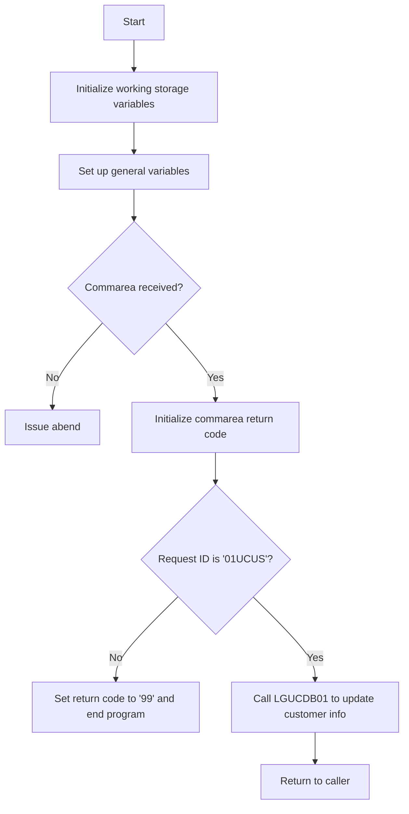

This doc will cover the <SwmToken path="base/src/lgucus01.cbl" pos="11:6:6" line-data="       PROGRAM-ID. LGUCUS01.">`LGUCUS01`</SwmToken> program. We'll cover:

1. What the Program Does
2. Program Flow
3. Program Sections

## What the Program Does

The <SwmToken path="base/src/lgucus01.cbl" pos="11:6:6" line-data="       PROGRAM-ID. LGUCUS01.">`LGUCUS01`</SwmToken> program is designed to update customer details. It initializes working storage variables, checks the communication area (commarea), and calls another program to update the required tables. If no commarea is received, it issues an abend (abnormal end). The program also includes a procedure to write error messages to queues.

## Program Flow

The program flow of <SwmToken path="base/src/lgucus01.cbl" pos="11:6:6" line-data="       PROGRAM-ID. LGUCUS01.">`LGUCUS01`</SwmToken> is as follows:

1. Initialize working storage variables.
2. Set up general variables.
3. Check if the commarea is received.
4. Initialize commarea return code to zero.
5. Check the request ID in the commarea.
6. Call the <SwmToken path="base/src/lgucus01.cbl" pos="128:9:9" line-data="           EXEC CICS LINK Program(LGUCDB01)">`LGUCDB01`</SwmToken> program to update customer information.
7. Return to the caller.



<SwmSnippet path="/base/src/lgucus01.cbl" line="83">

---

### MAINLINE SECTION

First, the MAINLINE SECTION initializes working storage variables and sets up general variables. It then checks if the commarea is received. If not, it issues an abend. If the commarea is received, it initializes the commarea return code to zero and checks the request ID. If the request ID is not <SwmToken path="base/src/lgucus01.cbl" pos="110:14:14" line-data="           If CA-REQUEST-ID NOT = &#39;01UCUS&#39;">`01UCUS`</SwmToken>, it sets the return code to '99' and ends the program. Otherwise, it calls the <SwmToken path="base/src/lgucus01.cbl" pos="126:1:5" line-data="       UPDATE-CUSTOMER-INFO.">`UPDATE-CUSTOMER-INFO`</SwmToken> section.

```cobol
       MAINLINE SECTION.

      *----------------------------------------------------------------*
      * Common code                                                    *
      *----------------------------------------------------------------*
      * initialize working storage variables
           INITIALIZE WS-HEADER.
      * set up general variable
           MOVE EIBTRNID TO WS-TRANSID.
           MOVE EIBTRMID TO WS-TERMID.
           MOVE EIBTASKN TO WS-TASKNUM.

      *----------------------------------------------------------------*
      * Check commarea and obtain required details                     *
      *----------------------------------------------------------------*
      * If NO commarea received issue an ABEND
           IF EIBCALEN IS EQUAL TO ZERO
               MOVE ' NO COMMAREA RECEIVED' TO EM-VARIABLE
               PERFORM WRITE-ERROR-MESSAGE
               EXEC CICS ABEND ABCODE('LGCA') NODUMP END-EXEC
           END-IF
```

---

</SwmSnippet>

<SwmSnippet path="/base/src/lgucus01.cbl" line="126">

---

### <SwmToken path="base/src/lgucus01.cbl" pos="126:1:5" line-data="       UPDATE-CUSTOMER-INFO.">`UPDATE-CUSTOMER-INFO`</SwmToken>

Next, the <SwmToken path="base/src/lgucus01.cbl" pos="126:1:5" line-data="       UPDATE-CUSTOMER-INFO.">`UPDATE-CUSTOMER-INFO`</SwmToken> section calls the <SwmToken path="base/src/lgucus01.cbl" pos="128:9:9" line-data="           EXEC CICS LINK Program(LGUCDB01)">`LGUCDB01`</SwmToken> program to update customer information. This is done using the <SwmToken path="base/src/lgucus01.cbl" pos="128:1:5" line-data="           EXEC CICS LINK Program(LGUCDB01)">`EXEC CICS LINK`</SwmToken> command, which passes the commarea to the <SwmToken path="base/src/lgucus01.cbl" pos="128:9:9" line-data="           EXEC CICS LINK Program(LGUCDB01)">`LGUCDB01`</SwmToken> program.

```cobol
       UPDATE-CUSTOMER-INFO.

           EXEC CICS LINK Program(LGUCDB01)
                Commarea(DFHCOMMAREA)
                LENGTH(32500)
           END-EXEC.

           EXIT.
```

---

</SwmSnippet>

<SwmSnippet path="/base/src/lgucus01.cbl" line="140">

---

### <SwmToken path="base/src/lgucus01.cbl" pos="140:1:5" line-data="       WRITE-ERROR-MESSAGE.">`WRITE-ERROR-MESSAGE`</SwmToken>

Then, the <SwmToken path="base/src/lgucus01.cbl" pos="140:1:5" line-data="       WRITE-ERROR-MESSAGE.">`WRITE-ERROR-MESSAGE`</SwmToken> section writes error messages to queues. It obtains and formats the current time and date, and writes the output message to a Transient Data Queue (TDQ) using the LGSTSQ program. If the commarea length is greater than zero, it writes up to 90 bytes of the commarea to the TDQ.

```cobol
       WRITE-ERROR-MESSAGE.
      * Save SQLCODE in message
      * Obtain and format current time and date
           EXEC CICS ASKTIME ABSTIME(WS-ABSTIME)
           END-EXEC
           EXEC CICS FORMATTIME ABSTIME(WS-ABSTIME)
                     MMDDYYYY(WS-DATE)
                     TIME(WS-TIME)
           END-EXEC
           MOVE WS-DATE TO EM-DATE
           MOVE WS-TIME TO EM-TIME
      * Write output message to TDQ
           EXEC CICS LINK PROGRAM('LGSTSQ')
                     COMMAREA(ERROR-MSG)
                     LENGTH(LENGTH OF ERROR-MSG)
           END-EXEC.
      * Write 90 bytes or as much as we have of commarea to TDQ
           IF EIBCALEN > 0 THEN
             IF EIBCALEN < 91 THEN
               MOVE DFHCOMMAREA(1:EIBCALEN) TO CA-DATA
               EXEC CICS LINK PROGRAM('LGSTSQ')
```

---

</SwmSnippet>

&nbsp;

*This is an auto-generated document by Swimm 🌊 and has not yet been verified by a human*

<SwmMeta version="3.0.0" repo-id="Z2l0aHViJTNBJTNBa3luZHJ5bC1jaWNzLWdlbmFwcCUzQSUzQVN3aW1tLURlbW8=" repo-name="kyndryl-cics-genapp"><sup>Powered by [Swimm](/)</sup></SwmMeta>
