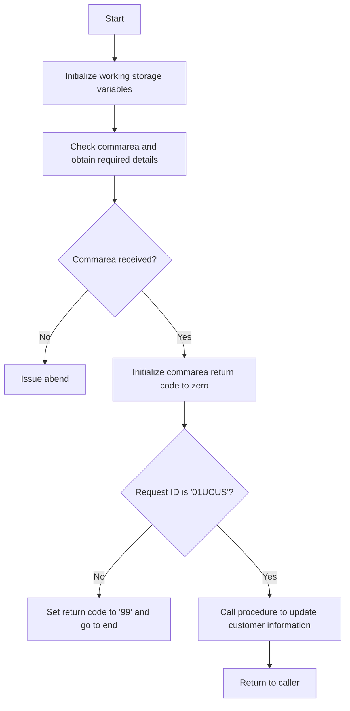

This document will cover the <SwmToken path="base/src/lgucus01.cbl" pos="11:6:6" line-data="       PROGRAM-ID. LGUCUS01.">`LGUCUS01`</SwmToken> program. We'll cover:

1. What the Program Does
2. Program Flow
3. Program Sections

## What the Program Does

The <SwmToken path="base/src/lgucus01.cbl" pos="11:6:6" line-data="       PROGRAM-ID. LGUCUS01.">`LGUCUS01`</SwmToken> program is designed to update customer details in the database. It initializes working storage variables, checks the communication area (commarea), and performs the necessary updates by calling another program, <SwmToken path="base/src/lgucus01.cbl" pos="128:9:9" line-data="           EXEC CICS LINK Program(LGUCDB01)">`LGUCDB01`</SwmToken>. If no commarea is received, it issues an abend (abnormal end). The program also includes a procedure to write error messages to queues.

## Program Flow

The program flow of <SwmToken path="base/src/lgucus01.cbl" pos="11:6:6" line-data="       PROGRAM-ID. LGUCUS01.">`LGUCUS01`</SwmToken> is as follows:

1. Initialize working storage variables.
2. Check the commarea and obtain required details.
3. If no commarea is received, issue an abend.
4. Initialize commarea return code to zero.
5. Check if the request ID is <SwmToken path="base/src/lgucus01.cbl" pos="110:14:14" line-data="           If CA-REQUEST-ID NOT = &#39;01UCUS&#39;">`01UCUS`</SwmToken>. If not, set the return code to '99' and go to the end of the program.
6. Call the procedure to update customer information by linking to the <SwmToken path="base/src/lgucus01.cbl" pos="128:9:9" line-data="           EXEC CICS LINK Program(LGUCDB01)">`LGUCDB01`</SwmToken> program.
7. Return to the caller.



<SwmSnippet path="/base/src/lgucus01.cbl" line="83">

---

### MAINLINE SECTION

First, the MAINLINE SECTION initializes working storage variables, sets up general variables, checks the commarea, and obtains required details. If no commarea is received, it issues an abend. It then initializes the commarea return code to zero and checks if the request ID is <SwmToken path="base/src/lgucus01.cbl" pos="110:14:14" line-data="           If CA-REQUEST-ID NOT = &#39;01UCUS&#39;">`01UCUS`</SwmToken>. If not, it sets the return code to '99' and goes to the end of the program. Finally, it calls the procedure to update customer information and returns to the caller.

```cobol
       MAINLINE SECTION.

      *----------------------------------------------------------------*
      * Common code                                                    *
      *----------------------------------------------------------------*
      * initialize working storage variables
           INITIALIZE WS-HEADER.
      * set up general variable
           MOVE EIBTRNID TO WS-TRANSID.
           MOVE EIBTRMID TO WS-TERMID.
           MOVE EIBTASKN TO WS-TASKNUM.

      *----------------------------------------------------------------*
      * Check commarea and obtain required details                     *
      *----------------------------------------------------------------*
      * If NO commarea received issue an ABEND
           IF EIBCALEN IS EQUAL TO ZERO
               MOVE ' NO COMMAREA RECEIVED' TO EM-VARIABLE
               PERFORM WRITE-ERROR-MESSAGE
               EXEC CICS ABEND ABCODE('LGCA') NODUMP END-EXEC
           END-IF
```

---

</SwmSnippet>

<SwmSnippet path="/base/src/lgucus01.cbl" line="126">

---

### <SwmToken path="base/src/lgucus01.cbl" pos="126:1:5" line-data="       UPDATE-CUSTOMER-INFO.">`UPDATE-CUSTOMER-INFO`</SwmToken>

Now, the <SwmToken path="base/src/lgucus01.cbl" pos="126:1:5" line-data="       UPDATE-CUSTOMER-INFO.">`UPDATE-CUSTOMER-INFO`</SwmToken> section links to the <SwmToken path="base/src/lgucus01.cbl" pos="128:9:9" line-data="           EXEC CICS LINK Program(LGUCDB01)">`LGUCDB01`</SwmToken> program, passing the commarea and its length. This section is responsible for updating the customer information in the database.

```cobol
       UPDATE-CUSTOMER-INFO.

           EXEC CICS LINK Program(LGUCDB01)
                Commarea(DFHCOMMAREA)
                LENGTH(32500)
           END-EXEC.

           EXIT.
```

---

</SwmSnippet>

<SwmSnippet path="/base/src/lgucus01.cbl" line="140">

---

### <SwmToken path="base/src/lgucus01.cbl" pos="140:1:5" line-data="       WRITE-ERROR-MESSAGE.">`WRITE-ERROR-MESSAGE`</SwmToken>

Then, the <SwmToken path="base/src/lgucus01.cbl" pos="140:1:5" line-data="       WRITE-ERROR-MESSAGE.">`WRITE-ERROR-MESSAGE`</SwmToken> section writes error messages to queues. It saves the SQLCODE in the message, obtains and formats the current time and date, and writes the output message to the TDQ. If the commarea length is greater than zero, it writes up to 90 bytes of the commarea to the TDQ.

```cobol
       WRITE-ERROR-MESSAGE.
      * Save SQLCODE in message
      * Obtain and format current time and date
           EXEC CICS ASKTIME ABSTIME(WS-ABSTIME)
           END-EXEC
           EXEC CICS FORMATTIME ABSTIME(WS-ABSTIME)
                     MMDDYYYY(WS-DATE)
                     TIME(WS-TIME)
           END-EXEC
           MOVE WS-DATE TO EM-DATE
           MOVE WS-TIME TO EM-TIME
      * Write output message to TDQ
           EXEC CICS LINK PROGRAM('LGSTSQ')
                     COMMAREA(ERROR-MSG)
                     LENGTH(LENGTH OF ERROR-MSG)
           END-EXEC.
      * Write 90 bytes or as much as we have of commarea to TDQ
           IF EIBCALEN > 0 THEN
             IF EIBCALEN < 91 THEN
               MOVE DFHCOMMAREA(1:EIBCALEN) TO CA-DATA
               EXEC CICS LINK PROGRAM('LGSTSQ')
```

---

</SwmSnippet>

&nbsp;

*This is an auto-generated document by Swimm 🌊 and has not yet been verified by a human*

<SwmMeta version="3.0.0" repo-id="Z2l0aHViJTNBJTNBa3luZHJ5bC1jaWNzLWdlbmFwcCUzQSUzQVN3aW1tLURlbW8=" repo-name="kyndryl-cics-genapp"><sup>Powered by [Swimm](/)</sup></SwmMeta>
