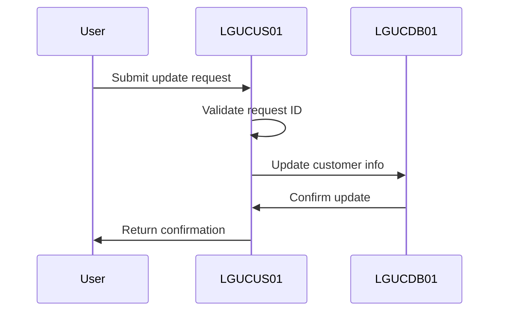
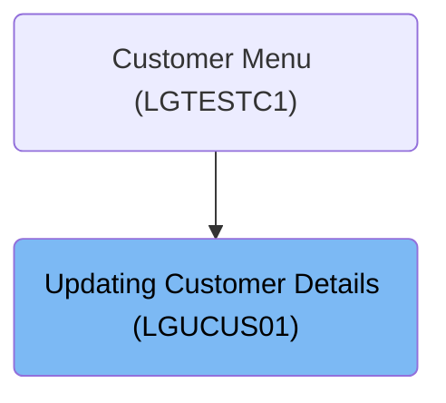

This document describes the process of updating customer details using the <SwmToken path="base/src/lgucus01.cbl" pos="11:6:6" line-data="       PROGRAM-ID. LGUCUS01.">`LGUCUS01`</SwmToken> program. The program validates the request ID and updates customer information by calling <SwmToken path="base/src/lgucus01.cbl" pos="128:9:9" line-data="           EXEC CICS LINK Program(LGUCDB01)">`LGUCDB01`</SwmToken> to handle the database update.

For example, if a customer requests to update their address, the program validates the request ID, updates the address in the database, and confirms the update.

The main steps are:

- Validate request ID <SwmToken path="base/src/lgucus01.cbl" pos="110:14:14" line-data="           If CA-REQUEST-ID NOT = &#39;01UCUS&#39;">`01UCUS`</SwmToken>
- Call procedure to update customer info
- Use 'EXEC CICS LINK' to call <SwmToken path="base/src/lgucus01.cbl" pos="128:9:9" line-data="           EXEC CICS LINK Program(LGUCDB01)">`LGUCDB01`</SwmToken> for database update



## Dependencies

### Programs

- <SwmToken path="base/src/lgucus01.cbl" pos="128:9:9" line-data="           EXEC CICS LINK Program(LGUCDB01)">`LGUCDB01`</SwmToken> (<SwmPath>[base/src/lgucdb01.cbl](base/src/lgucdb01.cbl)</SwmPath>) - <SwmLink doc-title="Updating Customer Details (LGUCDB01)">[Updating Customer Details (LGUCDB01)](/.swm/updating-customer-details-lgucdb01.p59nnsyv.sw.md)</SwmLink>
- LGUCVS01 (<SwmPath>[base/src/lgucvs01.cbl](base/src/lgucvs01.cbl)</SwmPath>) - <SwmLink doc-title="Updating Customer Records (LGUCVS01)">[Updating Customer Records (LGUCVS01)](/.swm/updating-customer-records-lgucvs01.tajsj7ju.sw.md)</SwmLink>
- LGSTSQ (<SwmPath>[base/src/lgstsq.cbl](base/src/lgstsq.cbl)</SwmPath>) - <SwmLink doc-title="Message Queue Handler (LGSTSQ)">[Message Queue Handler (LGSTSQ)](/.swm/message-queue-handler-lgstsq.e7y8uelv.sw.md)</SwmLink>

### Copybooks

- LGCMAREA (<SwmPath>[base/src/lgcmarea.cpy](base/src/lgcmarea.cpy)</SwmPath>)
- LGPOLICY (<SwmPath>[base/src/lgpolicy.cpy](base/src/lgpolicy.cpy)</SwmPath>)
- SQLCA

# Where is this program used?

This program is used once, as represented in the following diagram:



# Processing Customer Update Requests

<SwmSnippet path="/base/src/lgucus01.cbl" line="105">

---

In <SwmToken path="base/src/lgucus01.cbl" pos="83:1:1" line-data="       MAINLINE SECTION.">`MAINLINE`</SwmToken>, we validate the request ID to ensure it's <SwmToken path="base/src/lgucus01.cbl" pos="110:14:14" line-data="           If CA-REQUEST-ID NOT = &#39;01UCUS&#39;">`01UCUS`</SwmToken>. If invalid, we exit via <SwmToken path="base/src/lgucus01.cbl" pos="112:5:7" line-data="               GO TO END-PROGRAM">`END-PROGRAM`</SwmToken>. Otherwise, we proceed to update customer info.

```cobol
           MOVE '00' TO CA-RETURN-CODE
           MOVE '00' TO CA-NUM-POLICIES
           MOVE EIBCALEN TO WS-CALEN.
           SET WS-ADDR-DFHCOMMAREA TO ADDRESS OF DFHCOMMAREA.

           If CA-REQUEST-ID NOT = '01UCUS'
               MOVE '99' TO CA-RETURN-CODE
               GO TO END-PROGRAM
           END-IF.

      *    Call procedure to update required tables
           PERFORM UPDATE-CUSTOMER-INFO.
```

---

</SwmSnippet>

<SwmSnippet path="/base/src/lgucus01.cbl" line="119">

---

<SwmToken path="base/src/lgucus01.cbl" pos="119:1:3" line-data="       END-PROGRAM.">`END-PROGRAM`</SwmToken> ends the COBOL program and returns control to CICS for transaction management.

```cobol
       END-PROGRAM.
           EXEC CICS RETURN END-EXEC.
```

---

</SwmSnippet>

<SwmSnippet path="/base/src/lgucus01.cbl" line="105">

---

Back in <SwmToken path="base/src/lgucus01.cbl" pos="83:1:1" line-data="       MAINLINE SECTION.">`MAINLINE`</SwmToken>, after returning from <SwmToken path="base/src/lgucus01.cbl" pos="112:5:7" line-data="               GO TO END-PROGRAM">`END-PROGRAM`</SwmToken>, we proceed to the final logic. We call <SwmToken path="base/src/lgucus01.cbl" pos="116:3:7" line-data="           PERFORM UPDATE-CUSTOMER-INFO.">`UPDATE-CUSTOMER-INFO`</SwmToken> to perform the actual update operation on customer data, which is the main purpose of this program.

```cobol
           MOVE '00' TO CA-RETURN-CODE
           MOVE '00' TO CA-NUM-POLICIES
           MOVE EIBCALEN TO WS-CALEN.
           SET WS-ADDR-DFHCOMMAREA TO ADDRESS OF DFHCOMMAREA.

           If CA-REQUEST-ID NOT = '01UCUS'
               MOVE '99' TO CA-RETURN-CODE
               GO TO END-PROGRAM
           END-IF.

      *    Call procedure to update required tables
           PERFORM UPDATE-CUSTOMER-INFO.
```

---

</SwmSnippet>

<SwmSnippet path="/base/src/lgucus01.cbl" line="126">

---

<SwmToken path="base/src/lgucus01.cbl" pos="126:1:5" line-data="       UPDATE-CUSTOMER-INFO.">`UPDATE-CUSTOMER-INFO`</SwmToken> uses 'EXEC CICS LINK' to call <SwmToken path="base/src/lgucus01.cbl" pos="128:9:9" line-data="           EXEC CICS LINK Program(LGUCDB01)">`LGUCDB01`</SwmToken>, passing data via DFHCOMMAREA. This lets <SwmToken path="base/src/lgucus01.cbl" pos="128:9:9" line-data="           EXEC CICS LINK Program(LGUCDB01)">`LGUCDB01`</SwmToken> handle the database update, using its specialized logic.

```cobol
       UPDATE-CUSTOMER-INFO.

           EXEC CICS LINK Program(LGUCDB01)
                Commarea(DFHCOMMAREA)
                LENGTH(32500)
           END-EXEC.

           EXIT.
```

---

</SwmSnippet>

&nbsp;

*This is an auto-generated document by Swimm 🌊 and has not yet been verified by a human*

<SwmMeta version="3.0.0" repo-id="Z2l0aHViJTNBJTNBa3luZHJ5bC1jaWNzLWdlbmFwcCUzQSUzQVN3aW1tLURlbW8=" repo-name="kyndryl-cics-genapp"><sup>Powered by [Swimm](/)</sup></SwmMeta>
