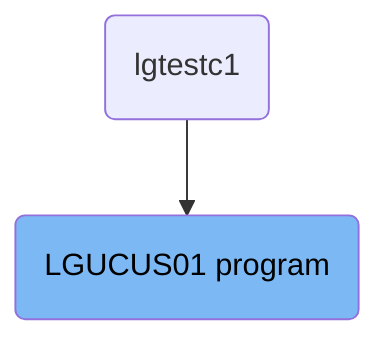

The <SwmToken path="base/src/lgucus01.cbl" pos="11:6:6" line-data="       PROGRAM-ID. LGUCUS01.">`LGUCUS01`</SwmToken> program is responsible for updating customer information in the system. It starts by initializing working storage variables, checks the communication area, validates the request ID, and then performs the update by calling the <SwmToken path="base/src/lgucus01.cbl" pos="66:3:3" line-data="       01 LGUCDB01                     PIC X(8) VALUE &#39;LGUCDB01&#39;.">`LGUCDB01`</SwmToken> program. Finally, it ends the program and returns control to the caller.

The <SwmToken path="base/src/lgucus01.cbl" pos="11:6:6" line-data="       PROGRAM-ID. LGUCUS01.">`LGUCUS01`</SwmToken> program initializes necessary variables, checks if the communication area is received, validates the request ID, updates customer information by calling another program, and then ends the program.

# Where is this program used?

This program is used once, in a flow starting from `lgtestc1` as represented in the following diagram:



Lets' zoom into the flow:

```mermaid
graph TD
  mainline("MAINLINE<br>Program Start"):::ab9b3e5e1
  mainline -..-> id-1{{"If CA-REQUEST-ID NOT = '01UCUS'"}}
  id-1 -->|Yes| endd-program("END-PROGRAM<br>Paragraph END-PROGRAM")
  id-1 -->|And then| update-customer-info("UPDATE-CUSTOMER-INFO<br>Paragraph UPDATE-CUSTOMER-INFO")
  endd-program --> update-customer-info("UPDATE-CUSTOMER-INFO<br>Paragraph UPDATE-CUSTOMER-INFO")
  update-customer-info --> endd-program("END-PROGRAM<br>Paragraph END-PROGRAM")
  update-customer-info --> id-2("LGUCDB01<br>Call to LGUCDB01")
  classDef ab9b3e5e1 color:#000000,fill:#7CB9F4

%% Swimm:
%% graph TD
%%   mainline("MAINLINE<br>Program Start"):::ab9b3e5e1
%%   mainline -..-> id-1{{"If <SwmToken path="base/src/lgucus01.cbl" pos="110:3:7" line-data="           If CA-REQUEST-ID NOT = &#39;01UCUS&#39;">`CA-REQUEST-ID`</SwmToken> NOT = '01UCUS'"}}
%%   id-1 -->|Yes| endd-program("END-PROGRAM<br>Paragraph END-PROGRAM")
%%   id-1 -->|And then| update-customer-info("UPDATE-CUSTOMER-INFO<br>Paragraph UPDATE-CUSTOMER-INFO")
%%   endd-program --> update-customer-info("UPDATE-CUSTOMER-INFO<br>Paragraph UPDATE-CUSTOMER-INFO")
%%   update-customer-info --> endd-program("END-PROGRAM<br>Paragraph END-PROGRAM")
%%   update-customer-info --> id-2("LGUCDB01<br>Call to LGUCDB01")
%%   classDef ab9b3e5e1 color:#000000,fill:#7CB9F4
```



<SwmSnippet path="/base/src/lgucus01.cbl" line="83">

---

## Initializing Working Storage Variables

First, the program initializes working storage variables. This includes setting up general variables such as <SwmToken path="base/src/lgucus01.cbl" pos="91:7:9" line-data="           MOVE EIBTRNID TO WS-TRANSID.">`WS-TRANSID`</SwmToken>, <SwmToken path="base/src/lgucus01.cbl" pos="92:7:9" line-data="           MOVE EIBTRMID TO WS-TERMID.">`WS-TERMID`</SwmToken>, and <SwmToken path="base/src/lgucus01.cbl" pos="93:7:9" line-data="           MOVE EIBTASKN TO WS-TASKNUM.">`WS-TASKNUM`</SwmToken> to store transaction ID, terminal ID, and task number respectively.

```cobol
       MAINLINE SECTION.

      *----------------------------------------------------------------*
      * Common code                                                    *
      *----------------------------------------------------------------*
      * initialize working storage variables
           INITIALIZE WS-HEADER.
      * set up general variable
           MOVE EIBTRNID TO WS-TRANSID.
           MOVE EIBTRMID TO WS-TERMID.
           MOVE EIBTASKN TO WS-TASKNUM.

```

---

</SwmSnippet>

<SwmSnippet path="/base/src/lgucus01.cbl" line="95">

---

## Checking Commarea and Obtaining Required Details

Next, the program checks if the communication area (commarea) is received. If not, it issues an ABEND (abnormal end) and writes an error message. It then initializes the commarea return code and other related variables.

```cobol
      *----------------------------------------------------------------*
      * Check commarea and obtain required details                     *
      *----------------------------------------------------------------*
      * If NO commarea received issue an ABEND
           IF EIBCALEN IS EQUAL TO ZERO
               MOVE ' NO COMMAREA RECEIVED' TO EM-VARIABLE
               PERFORM WRITE-ERROR-MESSAGE
               EXEC CICS ABEND ABCODE('LGCA') NODUMP END-EXEC
           END-IF
      * initialize commarea return code to zero
           MOVE '00' TO CA-RETURN-CODE
           MOVE '00' TO CA-NUM-POLICIES
           MOVE EIBCALEN TO WS-CALEN.
           SET WS-ADDR-DFHCOMMAREA TO ADDRESS OF DFHCOMMAREA.

```

---

</SwmSnippet>

<SwmSnippet path="/base/src/lgucus01.cbl" line="110">

---

## Validating Request ID

Moving to the next step, the program checks if the <SwmToken path="base/src/lgucus01.cbl" pos="110:3:7" line-data="           If CA-REQUEST-ID NOT = &#39;01UCUS&#39;">`CA-REQUEST-ID`</SwmToken> is not equal to <SwmToken path="base/src/lgucus01.cbl" pos="110:14:14" line-data="           If CA-REQUEST-ID NOT = &#39;01UCUS&#39;">`01UCUS`</SwmToken>. If this condition is met, it sets the return code to '99' and goes to the <SwmToken path="base/src/lgucus01.cbl" pos="112:5:7" line-data="               GO TO END-PROGRAM">`END-PROGRAM`</SwmToken> paragraph.

```cobol
           If CA-REQUEST-ID NOT = '01UCUS'
               MOVE '99' TO CA-RETURN-CODE
               GO TO END-PROGRAM
           END-IF.
```

---

</SwmSnippet>

<SwmSnippet path="/base/src/lgucus01.cbl" line="115">

---

## Updating Customer Information

Then, the program performs the <SwmToken path="base/src/lgucus01.cbl" pos="116:3:7" line-data="           PERFORM UPDATE-CUSTOMER-INFO.">`UPDATE-CUSTOMER-INFO`</SwmToken> paragraph, which calls the <SwmToken path="base/src/lgucus01.cbl" pos="66:3:3" line-data="       01 LGUCDB01                     PIC X(8) VALUE &#39;LGUCDB01&#39;.">`LGUCDB01`</SwmToken> program to update the required tables with the customer information.

More about <SwmToken path="base/src/lgucus01.cbl" pos="66:3:3" line-data="       01 LGUCDB01                     PIC X(8) VALUE &#39;LGUCDB01&#39;.">`LGUCDB01`</SwmToken>: <SwmLink doc-title="Updating Customer Details (LGUCDB01)">[Updating Customer Details (LGUCDB01)](/.swm/updating-customer-details-lgucdb01.iigxw6ku.sw.md)</SwmLink>

```cobol
      *    Call procedure to update required tables
           PERFORM UPDATE-CUSTOMER-INFO.

```

---

</SwmSnippet>

<SwmSnippet path="/base/src/lgucus01.cbl" line="118">

---

## Ending the Program

Finally, the program returns control to the caller by executing the <SwmToken path="base/src/lgucus01.cbl" pos="119:1:3" line-data="       END-PROGRAM.">`END-PROGRAM`</SwmToken> paragraph.

```cobol
      * Return to caller
       END-PROGRAM.
           EXEC CICS RETURN END-EXEC.
```

---

</SwmSnippet>

&nbsp;

*This is an auto-generated document by Swimm 🌊 and has not yet been verified by a human*

<SwmMeta version="3.0.0" repo-id="Z2l0aHViJTNBJTNBa3luZHJ5bC1jaWNzLWdlbmFwcCUzQSUzQVN3aW1tLURlbW8=" repo-name="kyndryl-cics-genapp"><sup>Powered by [Swimm](https://app.swimm.io/)</sup></SwmMeta>
