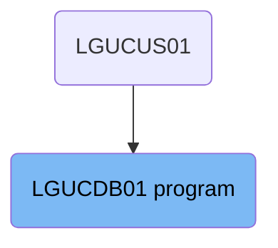
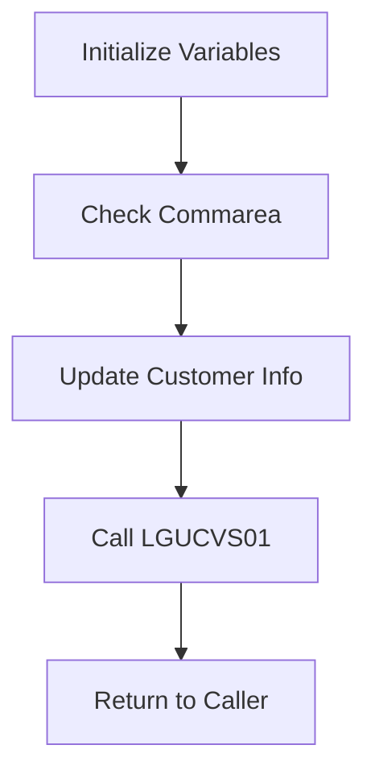

The <SwmToken path="base/src/lgucdb01.cbl" pos="10:6:6" line-data="       PROGRAM-ID. LGUCDB01.">`LGUCDB01`</SwmToken> program is responsible for updating customer information in the database. It is part of a flow that starts from the LGUCUS01 program. The program initializes variables, checks the communication area, updates customer information, calls another program <SwmToken path="base/src/lgucdb01.cbl" pos="136:8:9" line-data="           EXEC CICS LINK Program(LGUCVS01)">`(LGUCVS01`</SwmToken>) for further processing, and finally returns control to the caller.

The <SwmToken path="base/src/lgucdb01.cbl" pos="10:6:6" line-data="       PROGRAM-ID. LGUCDB01.">`LGUCDB01`</SwmToken> program starts by setting up necessary variables and checking if the required data is received. It then updates the customer information in the database. After updating, it calls another program to ensure the customer record is updated in all necessary data stores. Finally, it returns control to the caller, indicating the process is complete.

# Where is this program used?

This program is used once, in a flow starting from `LGUCUS01` as represented in the following diagram:



Lets' zoom into the flow:



<SwmSnippet path="/base/src/lgucdb01.cbl" line="106">

---

## Initialize Variables

First, the program initializes working storage variables to set up the environment for processing customer information. This includes setting transaction ID, terminal ID, task number, and retry flag.

```cobol
      * initialize working storage variables
           INITIALIZE WS-HEADER.
      * set up general variable
           MOVE EIBTRNID TO WS-TRANSID.
           MOVE EIBTRMID TO WS-TERMID.
           MOVE EIBTASKN TO WS-TASKNUM.
           MOVE SPACES   TO WS-RETRY.
```

---

</SwmSnippet>

<SwmSnippet path="/base/src/lgucdb01.cbl" line="117">

---

## Check Commarea

Next, the program checks if the communication area (commarea) is received. If no commarea is received, it logs an error message and abnormally terminates the transaction. This ensures that the necessary data is available for processing.

```cobol
           IF EIBCALEN IS EQUAL TO ZERO
               MOVE ' NO COMMAREA RECEIVED' TO EM-VARIABLE
               PERFORM WRITE-ERROR-MESSAGE
               EXEC CICS ABEND ABCODE('LGCA') NODUMP END-EXEC
           END-IF
```

---

</SwmSnippet>

<SwmSnippet path="/base/src/lgucdb01.cbl" line="152">

---

## Update Customer Info

Then, the program updates the customer information in the database. It performs an SQL update operation to modify the customer details based on the data received in the commarea. If the update fails, it logs an error message and sets the appropriate return code.

```cobol
       UPDATE-CUSTOMER-INFO.

           MOVE ' UPDATE CUST  ' TO EM-SQLREQ
             EXEC SQL
               UPDATE CUSTOMER
                 SET
                   FIRSTNAME     = :CA-FIRST-NAME,
                   LASTNAME      = :CA-LAST-NAME,
                   DATEOFBIRTH   = :CA-DOB,
                   HOUSENAME     = :CA-HOUSE-NAME,
                   HOUSENUMBER   = :CA-HOUSE-NUM,
                   POSTCODE      = :CA-POSTCODE,
                   PHONEMOBILE   = :CA-PHONE-MOBILE,
                   PHONEHOME     = :CA-PHONE-HOME,
                   EMAILADDRESS  = :CA-EMAIL-ADDRESS
                 WHERE
                     CUSTOMERNUMBER = :DB2-CUSTOMERNUM-INT
             END-EXEC

           IF SQLCODE NOT EQUAL 0
      *      Non-zero SQLCODE from UPDATE statement
```

---

</SwmSnippet>

<SwmSnippet path="/base/src/lgucdb01.cbl" line="136">

---

## Call <SwmToken path="base/src/lgucdb01.cbl" pos="136:9:9" line-data="           EXEC CICS LINK Program(LGUCVS01)">`LGUCVS01`</SwmToken>

After updating the customer information, the program calls the <SwmToken path="base/src/lgucdb01.cbl" pos="136:9:9" line-data="           EXEC CICS LINK Program(LGUCVS01)">`LGUCVS01`</SwmToken> program to further process the customer record in a VSAM KSDS file. This ensures that the customer record is updated in all necessary data stores.

More about <SwmToken path="base/src/lgucdb01.cbl" pos="136:9:9" line-data="           EXEC CICS LINK Program(LGUCVS01)">`LGUCVS01`</SwmToken>: <SwmLink doc-title="Reading and Rewriting Customer Data (LGUCVS01)">[Reading and Rewriting Customer Data (LGUCVS01)](/.swm/reading-and-rewriting-customer-data-lgucvs01.chxua0ys.sw.md)</SwmLink>

```cobol
           EXEC CICS LINK Program(LGUCVS01)
                Commarea(DFHCOMMAREA)
                LENGTH(225)
           END-EXEC.
```

---

</SwmSnippet>

<SwmSnippet path="/base/src/lgucdb01.cbl" line="142">

---

## Return to Caller

Finally, the program returns control to the caller, indicating that the customer information has been successfully processed and updated.

```cobol
       END-PROGRAM.
           EXEC CICS RETURN END-EXEC.
```

---

</SwmSnippet>

&nbsp;

*This is an auto-generated document by Swimm 🌊 and has not yet been verified by a human*

<SwmMeta version="3.0.0" repo-id="Z2l0aHViJTNBJTNBa3luZHJ5bC1jaWNzLWdlbmFwcCUzQSUzQVN3aW1tLURlbW8=" repo-name="kyndryl-cics-genapp"><sup>Powered by [Swimm](/)</sup></SwmMeta>
