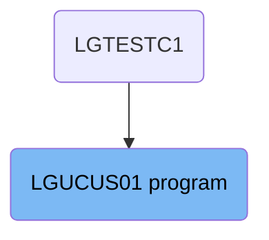

The <SwmToken path="base/src/lgucus01.cbl" pos="11:6:6" line-data="       PROGRAM-ID. LGUCUS01.">`LGUCUS01`</SwmToken> program is responsible for updating customer information in the system. This is achieved by checking the request ID and, if it matches <SwmToken path="base/src/lgucus01.cbl" pos="110:14:14" line-data="           If CA-REQUEST-ID NOT = &#39;01UCUS&#39;">`01UCUS`</SwmToken>, proceeding to update the customer details in the Db2 database through the <SwmToken path="base/src/lgucus01.cbl" pos="66:3:3" line-data="       01 LGUCDB01                     PIC X(8) VALUE &#39;LGUCDB01&#39;.">`LGUCDB01`</SwmToken> program.

The flow starts by checking if the request ID is <SwmToken path="base/src/lgucus01.cbl" pos="110:14:14" line-data="           If CA-REQUEST-ID NOT = &#39;01UCUS&#39;">`01UCUS`</SwmToken>. If it is, the program updates the customer details in the Db2 database using the <SwmToken path="base/src/lgucus01.cbl" pos="66:3:3" line-data="       01 LGUCDB01                     PIC X(8) VALUE &#39;LGUCDB01&#39;.">`LGUCDB01`</SwmToken> program. Finally, the program ends and returns control to the caller.

# Where is this program used?

This program is used once, in a flow starting from `LGTESTC1` as represented in the following diagram:



Lets' zoom into the flow:

```mermaid
graph TD
  A[MAINLINE - Parallel Execution Tools] --> B{Is CA-REQUEST-ID '01UCUS'?}
  B -- Yes --> C[UPDATE-CUSTOMER-INFO - Update customer details]
  B -- No --> D[END-PROGRAM - End the program]
  C --> E[LGUCDB01 - Update customer details in Db2]
  D --> C
  C --> D

%% Swimm:
%% graph TD
%%   A[MAINLINE - Parallel Execution Tools] --> B{Is <SwmToken path="base/src/lgucus01.cbl" pos="110:3:7" line-data="           If CA-REQUEST-ID NOT = &#39;01UCUS&#39;">`CA-REQUEST-ID`</SwmToken> '01UCUS'?}
%%   B -- Yes --> C[UPDATE-CUSTOMER-INFO - Update customer details]
%%   B -- No --> D[END-PROGRAM - End the program]
%%   C --> E[LGUCDB01 - Update customer details in Db2]
%%   D --> C
%%   C --> D
```



<SwmSnippet path="/base/src/lgucus01.cbl" line="185">

---

## Checking the Request ID

First, the program checks if the <SwmToken path="base/src/lgucus01.cbl" pos="110:3:7" line-data="           If CA-REQUEST-ID NOT = &#39;01UCUS&#39;">`CA-REQUEST-ID`</SwmToken> is not equal to <SwmToken path="base/src/lgucus01.cbl" pos="110:14:14" line-data="           If CA-REQUEST-ID NOT = &#39;01UCUS&#39;">`01UCUS`</SwmToken>. If it is not, the program sets the return code to '99' and goes to the <SwmToken path="base/src/lgucus01.cbl" pos="112:5:7" line-data="               GO TO END-PROGRAM">`END-PROGRAM`</SwmToken> paragraph, effectively ending the process.

```cobol

```

---

</SwmSnippet>

<SwmSnippet path="/base/src/lgucus01.cbl" line="191">

---

## Updating Customer Information

Next, if the <SwmToken path="base/src/lgucus01.cbl" pos="110:3:7" line-data="           If CA-REQUEST-ID NOT = &#39;01UCUS&#39;">`CA-REQUEST-ID`</SwmToken> is <SwmToken path="base/src/lgucus01.cbl" pos="110:14:14" line-data="           If CA-REQUEST-ID NOT = &#39;01UCUS&#39;">`01UCUS`</SwmToken>, the program proceeds to the <SwmToken path="base/src/lgucus01.cbl" pos="116:3:7" line-data="           PERFORM UPDATE-CUSTOMER-INFO.">`UPDATE-CUSTOMER-INFO`</SwmToken> paragraph. This paragraph calls the <SwmToken path="base/src/lgucus01.cbl" pos="66:3:3" line-data="       01 LGUCDB01                     PIC X(8) VALUE &#39;LGUCDB01&#39;.">`LGUCDB01`</SwmToken> program to update the customer details in the Db2 database.

More about <SwmToken path="base/src/lgucus01.cbl" pos="66:3:3" line-data="       01 LGUCDB01                     PIC X(8) VALUE &#39;LGUCDB01&#39;.">`LGUCDB01`</SwmToken>: <SwmLink doc-title="Updating Customer Information (LGUCDB01)">[Updating Customer Information (LGUCDB01)](/.swm/updating-customer-information-lgucdb01.qw5fu84a.sw.md)</SwmLink>

```cobol

```

---

</SwmSnippet>

<SwmSnippet path="/base/src/lgucus01.cbl" line="196">

---

## Ending the Program

Finally, after updating the customer information, the program goes to the <SwmToken path="base/src/lgucus01.cbl" pos="112:5:7" line-data="               GO TO END-PROGRAM">`END-PROGRAM`</SwmToken> paragraph, which returns control to the caller and ends the execution.

```cobol

```

---

</SwmSnippet>

&nbsp;

*This is an auto-generated document by Swimm 🌊 and has not yet been verified by a human*

<SwmMeta version="3.0.0" repo-id="Z2l0aHViJTNBJTNBa3luZHJ5bC1jaWNzLWdlbmFwcCUzQSUzQVN3aW1tLURlbW8=" repo-name="kyndryl-cics-genapp"><sup>Powered by [Swimm](/)</sup></SwmMeta>
