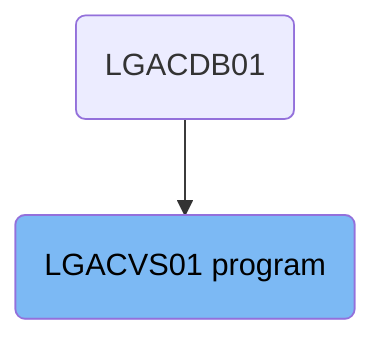
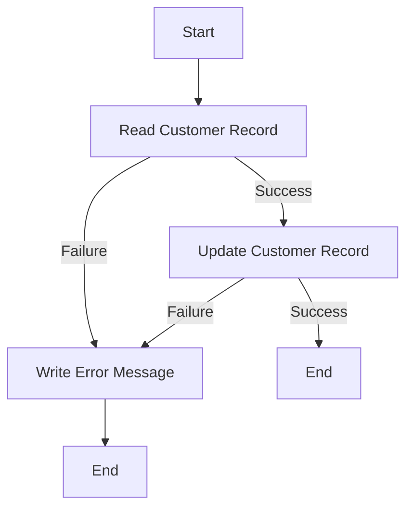

The <SwmToken path="base/src/lgacvs01.cbl" pos="11:6:6" line-data="       PROGRAM-ID. LGACVS01.">`LGACVS01`</SwmToken> program is responsible for updating customer records in the system. It reads customer records from the 'KSDSCUST' file, updates them, and handles any errors that occur during these operations. The program is used once in a flow starting from the LGACDB01 program.

The <SwmToken path="base/src/lgacvs01.cbl" pos="11:6:6" line-data="       PROGRAM-ID. LGACVS01.">`LGACVS01`</SwmToken> program starts by reading a customer record from the 'KSDSCUST' file. If the read operation is successful, it proceeds to update the customer record. If any errors occur during the read or update operations, the program writes an error message and handles the error appropriately.

# Where is this program used?

This program is used once, in a flow starting from `LGACDB01` as represented in the following diagram:



Lets' zoom into the flow:



<SwmSnippet path="/base/src/lgacvs01.cbl" line="169">

---

## Reading Customer Record

First, the program reads the customer record from the file 'KSDSCUST' into `WS-Customer-Area`. If the read operation is not successful (<SwmToken path="base/src/lgacvs01.cbl" pos="18:3:5" line-data="       01  WS-RESP                   PIC S9(8) COMP.">`WS-RESP`</SwmToken> not equal to <SwmToken path="base/src/lgacvs01.cbl" pos="75:11:14" line-data="           If WS-RESP Not = DFHRESP(NORMAL)">`DFHRESP(NORMAL)`</SwmToken>), it moves the error response code to <SwmToken path="base/src/lgacvs01.cbl" pos="19:3:5" line-data="       01  WS-RESP2                  PIC S9(8) COMP.">`WS-RESP2`</SwmToken>, sets the return code to '81', performs the <SwmToken path="base/src/lgacvs01.cbl" pos="78:3:7" line-data="             PERFORM WRITE-ERROR-MESSAGE">`WRITE-ERROR-MESSAGE`</SwmToken> routine, and then abends the transaction with code 'LGV1'.

```cobol

```

---

</SwmSnippet>

<SwmSnippet path="/base/src/lgacvs01.cbl" line="178">

---

## Updating Customer Record

Next, the program attempts to rewrite the customer record in the file 'KSDSCUST' from <SwmToken path="base/src/lgacvs01.cbl" pos="69:3:7" line-data="                     From(CA-Customer-Num)">`CA-Customer-Num`</SwmToken>. If the rewrite operation is not successful (<SwmToken path="base/src/lgacvs01.cbl" pos="18:3:5" line-data="       01  WS-RESP                   PIC S9(8) COMP.">`WS-RESP`</SwmToken> not equal to <SwmToken path="base/src/lgacvs01.cbl" pos="75:11:14" line-data="           If WS-RESP Not = DFHRESP(NORMAL)">`DFHRESP(NORMAL)`</SwmToken>), it moves the error response code to <SwmToken path="base/src/lgacvs01.cbl" pos="19:3:5" line-data="       01  WS-RESP2                  PIC S9(8) COMP.">`WS-RESP2`</SwmToken>, sets the return code to '82', performs the <SwmToken path="base/src/lgacvs01.cbl" pos="78:3:7" line-data="             PERFORM WRITE-ERROR-MESSAGE">`WRITE-ERROR-MESSAGE`</SwmToken> routine, and then abends the transaction with code 'LGV2'.

```cobol

```

---

</SwmSnippet>

<SwmSnippet path="/base/src/lgacvs01.cbl" line="187">

---

## Writing Error Message

Then, if any error occurs during the read or write operations, the <SwmToken path="base/src/lgacvs01.cbl" pos="78:3:7" line-data="             PERFORM WRITE-ERROR-MESSAGE">`WRITE-ERROR-MESSAGE`</SwmToken> routine is performed. This routine gets the current time, formats it, and moves the relevant data (date, time, customer number, response codes) to the error message structure. It then links to the <SwmToken path="base/src/lgacvs01.cbl" pos="102:10:10" line-data="           EXEC CICS LINK PROGRAM(&#39;LGSTSQ&#39;)">`LGSTSQ`</SwmToken> program to handle the error message.

More about LGSTSQ: <SwmLink doc-title="Handling Messages (LGSTSQ)">[Handling Messages (LGSTSQ)](/.swm/handling-messages-lgstsq.di7or3tb.sw.md)</SwmLink>

```cobol

```

---

</SwmSnippet>

&nbsp;

*This is an auto-generated document by Swimm 🌊 and has not yet been verified by a human*

<SwmMeta version="3.0.0" repo-id="Z2l0aHViJTNBJTNBa3luZHJ5bC1jaWNzLWdlbmFwcCUzQSUzQVN3aW1tLURlbW8=" repo-name="kyndryl-cics-genapp"><sup>Powered by [Swimm](/)</sup></SwmMeta>
