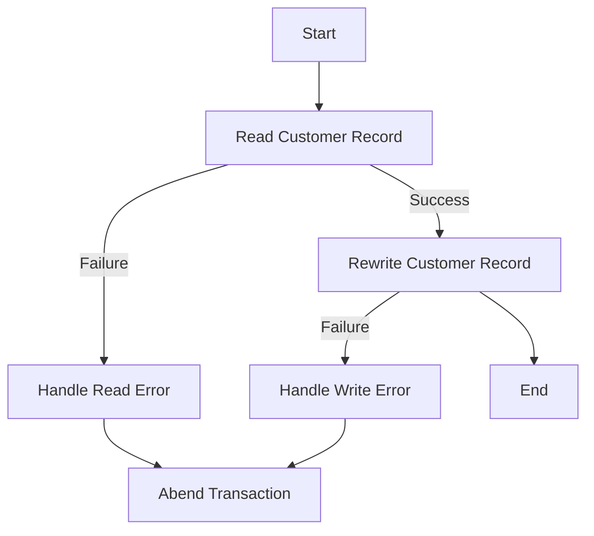

This document will cover the <SwmToken path="base/src/lgucvs01.cbl" pos="11:6:6" line-data="       PROGRAM-ID. LGUCVS01.">`LGUCVS01`</SwmToken> program. We'll cover:

1. What the Program Does
2. Program Flow
3. Program Sections

## What the Program Does

The <SwmToken path="base/src/lgucvs01.cbl" pos="11:6:6" line-data="       PROGRAM-ID. LGUCVS01.">`LGUCVS01`</SwmToken> program is designed to update a customer record in a VSAM Key-Sequenced Data Set (KSDS). It reads the customer record from the KSDS file, updates it, and then rewrites the record back to the file. If any errors occur during these operations, the program handles them by writing error messages and abending the transaction.

## Program Flow

The program flow involves the following high-level steps:

1. Read the customer record from the KSDS file.
2. If the read operation is successful, rewrite the customer record.
3. If any operation fails, handle the error by writing an error message and abending the transaction.



<SwmSnippet path="/base/src/lgucvs01.cbl" line="64">

---

## Program Sections

First, the program reads the customer record from the KSDS file using the <SwmToken path="base/src/lgucvs01.cbl" pos="81:1:1" line-data="             EXEC CICS ABEND ABCODE(&#39;LGV1&#39;) NODUMP END-EXEC">`EXEC`</SwmToken>` `<SwmToken path="base/src/lgucvs01.cbl" pos="69:3:3" line-data="           Exec CICS Read File(&#39;KSDSCUST&#39;)">`CICS`</SwmToken>` READ FILE` command. If the read operation is not successful, it moves the error response code to <SwmToken path="base/src/lgucvs01.cbl" pos="78:7:9" line-data="             Move EIBRESP2 To WS-RESP2">`WS-RESP2`</SwmToken>, sets the return code to '81', performs the <SwmToken path="base/src/lgucvs01.cbl" pos="80:3:7" line-data="             PERFORM WRITE-ERROR-MESSAGE">`WRITE-ERROR-MESSAGE`</SwmToken> section, and abends the transaction.

```cobol
       MAINLINE SECTION.
      *
      *---------------------------------------------------------------*
           Move EIBCALEN To WS-Commarea-Len.
      *---------------------------------------------------------------*
           Exec CICS Read File('KSDSCUST')
                     Into(WS-Customer-Area)
                     Length(WS-Commarea-Len)
                     Ridfld(CA-Customer-Num)
                     KeyLength(10)
                     RESP(WS-RESP)
                     Update
           End-Exec.
           If WS-RESP Not = DFHRESP(NORMAL)
             Move EIBRESP2 To WS-RESP2
             MOVE '81' TO CA-RETURN-CODE
             PERFORM WRITE-ERROR-MESSAGE
             EXEC CICS ABEND ABCODE('LGV1') NODUMP END-EXEC
             EXEC CICS RETURN END-EXEC
           End-If.
```

---

</SwmSnippet>

<SwmSnippet path="/base/src/lgucvs01.cbl" line="85">

---

Next, if the read operation is successful, the program rewrites the customer record using the <SwmToken path="base/src/lgucvs01.cbl" pos="94:1:1" line-data="             EXEC CICS ABEND ABCODE(&#39;LGV2&#39;) NODUMP END-EXEC">`EXEC`</SwmToken>` `<SwmToken path="base/src/lgucvs01.cbl" pos="85:3:3" line-data="           Exec CICS ReWrite File(&#39;KSDSCUST&#39;)">`CICS`</SwmToken>` REWRITE FILE` command. If the rewrite operation is not successful, it moves the error response code to <SwmToken path="base/src/lgucvs01.cbl" pos="91:7:9" line-data="             Move EIBRESP2 To WS-RESP2">`WS-RESP2`</SwmToken>, sets the return code to '82', performs the <SwmToken path="base/src/lgucvs01.cbl" pos="93:3:7" line-data="             PERFORM WRITE-ERROR-MESSAGE">`WRITE-ERROR-MESSAGE`</SwmToken> section, and abends the transaction.

```cobol
           Exec CICS ReWrite File('KSDSCUST')
                     From(CA-Customer-Num)
                     Length(CUSTOMER-RECORD-SIZE)
                     RESP(WS-RESP)
           End-Exec.
           If WS-RESP Not = DFHRESP(NORMAL)
             Move EIBRESP2 To WS-RESP2
             MOVE '82' TO CA-RETURN-CODE
             PERFORM WRITE-ERROR-MESSAGE
             EXEC CICS ABEND ABCODE('LGV2') NODUMP END-EXEC
             EXEC CICS RETURN END-EXEC
           End-If.
```

---

</SwmSnippet>

<SwmSnippet path="/base/src/lgucvs01.cbl" line="104">

---

Then, the <SwmToken path="base/src/lgucvs01.cbl" pos="104:1:5" line-data="       WRITE-ERROR-MESSAGE.">`WRITE-ERROR-MESSAGE`</SwmToken> section is executed when an error occurs. It retrieves the current time and date, formats them, and populates the error message structure. The program then calls the <SwmToken path="base/src/lgucvs01.cbl" pos="117:10:10" line-data="           EXEC CICS LINK PROGRAM(&#39;LGSTSQ&#39;)">`LGSTSQ`</SwmToken> program to handle the error message, passing the error message structure as the communication area.

```cobol
       WRITE-ERROR-MESSAGE.
           EXEC CICS ASKTIME ABSTIME(WS-ABSTIME)
           END-EXEC
           EXEC CICS FORMATTIME ABSTIME(WS-ABSTIME)
                     MMDDYYYY(WS-DATE)
                     TIME(WS-TIME)
           END-EXEC
      *
           MOVE WS-DATE TO EM-DATE
           MOVE WS-TIME TO EM-TIME
           Move CA-Customer-Num To EM-Cusnum
           Move WS-RESP         To EM-RespRC
           Move WS-RESP2        To EM-Resp2RC
           EXEC CICS LINK PROGRAM('LGSTSQ')
                     COMMAREA(ERROR-MSG)
                     LENGTH(LENGTH OF ERROR-MSG)
           END-EXEC.
           IF EIBCALEN > 0 THEN
             IF EIBCALEN < 91 THEN
               MOVE DFHCOMMAREA(1:EIBCALEN) TO CA-DATA
               EXEC CICS LINK PROGRAM('LGSTSQ')
```

---

</SwmSnippet>

&nbsp;

*This is an auto-generated document by Swimm 🌊 and has not yet been verified by a human*

<SwmMeta version="3.0.0" repo-id="Z2l0aHViJTNBJTNBa3luZHJ5bC1jaWNzLWdlbmFwcCUzQSUzQVN3aW1tLURlbW8=" repo-name="kyndryl-cics-genapp"><sup>Powered by [Swimm](/)</sup></SwmMeta>
