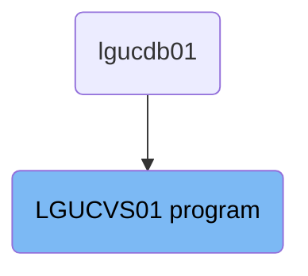
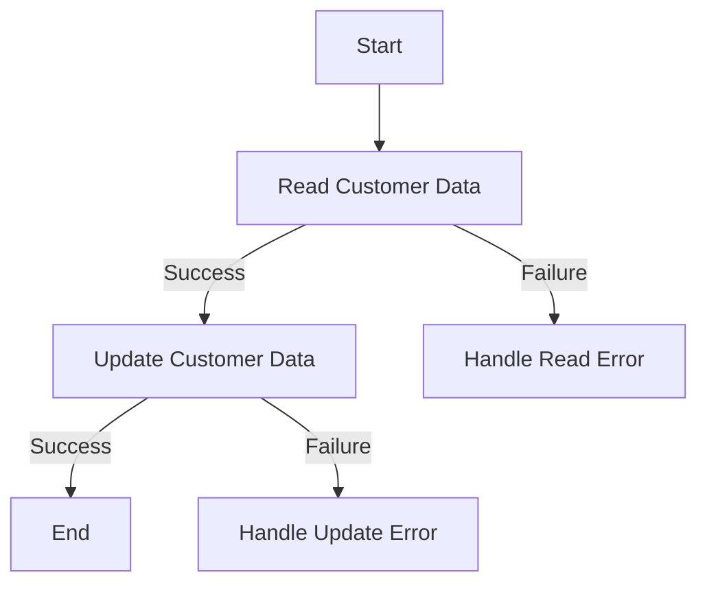

The <SwmToken path="base/src/lgucvs01.cbl" pos="11:6:6" line-data="       PROGRAM-ID. LGUCVS01.">`LGUCVS01`</SwmToken> program is responsible for updating customer data in the system. It reads customer data from a file, updates it, and handles any errors that occur during these operations. The program ensures data integrity by performing error handling routines and linking to the LGSTSQ program for error message processing.

The <SwmToken path="base/src/lgucvs01.cbl" pos="11:6:6" line-data="       PROGRAM-ID. LGUCVS01.">`LGUCVS01`</SwmToken> program starts by reading customer data from the 'KSDSCUST' file. If the read operation is successful, it proceeds to update the customer data. If any errors occur during the read or update operations, the program handles these errors by calling the <SwmToken path="base/src/lgucvs01.cbl" pos="80:3:7" line-data="             PERFORM WRITE-ERROR-MESSAGE">`WRITE-ERROR-MESSAGE`</SwmToken> routine and linking to the LGSTSQ program to process the error messages. This ensures that any issues are properly logged and managed.

# Where is this program used?

This program is used once, in a flow starting from `lgucdb01` as represented in the following diagram:



Lets' zoom into the flow:



<SwmSnippet path="/base/src/lgucvs01.cbl" line="67">

---

## Reading Customer Data

First, the program reads the customer data from the file 'KSDSCUST' into <SwmToken path="base/src/lgucvs01.cbl" pos="70:3:7" line-data="                     Into(WS-Customer-Area)">`WS-Customer-Area`</SwmToken>. If the read operation is not successful, it moves the error response code to <SwmToken path="base/src/lgucvs01.cbl" pos="78:7:9" line-data="             Move EIBRESP2 To WS-RESP2">`WS-RESP2`</SwmToken>, sets the return code to '81', performs the <SwmToken path="base/src/lgucvs01.cbl" pos="80:3:7" line-data="             PERFORM WRITE-ERROR-MESSAGE">`WRITE-ERROR-MESSAGE`</SwmToken> routine, and then abends the transaction with code <SwmToken path="base/src/lgucvs01.cbl" pos="81:10:10" line-data="             EXEC CICS ABEND ABCODE(&#39;LGV1&#39;) NODUMP END-EXEC">`LGV1`</SwmToken>.

```cobol
           Move EIBCALEN To WS-Commarea-Len.
      *---------------------------------------------------------------*
           Exec CICS Read File('KSDSCUST')
                     Into(WS-Customer-Area)
                     Length(WS-Commarea-Len)
                     Ridfld(CA-Customer-Num)
                     KeyLength(10)
                     RESP(WS-RESP)
                     Update
           End-Exec.
           If WS-RESP Not = DFHRESP(NORMAL)
             Move EIBRESP2 To WS-RESP2
             MOVE '81' TO CA-RETURN-CODE
             PERFORM WRITE-ERROR-MESSAGE
             EXEC CICS ABEND ABCODE('LGV1') NODUMP END-EXEC
             EXEC CICS RETURN END-EXEC
           End-If.
```

---

</SwmSnippet>

<SwmSnippet path="/base/src/lgucvs01.cbl" line="85">

---

## Updating Customer Data

Next, the program attempts to rewrite the customer data back to the file 'KSDSCUST'. If the rewrite operation fails, it moves the error response code to <SwmToken path="base/src/lgucvs01.cbl" pos="91:7:9" line-data="             Move EIBRESP2 To WS-RESP2">`WS-RESP2`</SwmToken>, sets the return code to '82', performs the <SwmToken path="base/src/lgucvs01.cbl" pos="93:3:7" line-data="             PERFORM WRITE-ERROR-MESSAGE">`WRITE-ERROR-MESSAGE`</SwmToken> routine, and then abends the transaction with code <SwmToken path="base/src/lgucvs01.cbl" pos="94:10:10" line-data="             EXEC CICS ABEND ABCODE(&#39;LGV2&#39;) NODUMP END-EXEC">`LGV2`</SwmToken>.

```cobol
           Exec CICS ReWrite File('KSDSCUST')
                     From(CA-Customer-Num)
                     Length(CUSTOMER-RECORD-SIZE)
                     RESP(WS-RESP)
           End-Exec.
           If WS-RESP Not = DFHRESP(NORMAL)
             Move EIBRESP2 To WS-RESP2
             MOVE '82' TO CA-RETURN-CODE
             PERFORM WRITE-ERROR-MESSAGE
             EXEC CICS ABEND ABCODE('LGV2') NODUMP END-EXEC
             EXEC CICS RETURN END-EXEC
           End-If.
```

---

</SwmSnippet>

<SwmSnippet path="/base/src/lgucvs01.cbl" line="104">

---

## Handling Errors

The <SwmToken path="base/src/lgucvs01.cbl" pos="104:1:5" line-data="       WRITE-ERROR-MESSAGE.">`WRITE-ERROR-MESSAGE`</SwmToken> routine is called when an error occurs during the read or rewrite operations. It retrieves the current date and time, formats them, and moves the relevant error information into the error message structure. It then links to the 'LGSTSQ' program to handle the error message.

More about LGSTSQ: <SwmLink doc-title="Handling Messages (LGSTSQ)">[Handling Messages (LGSTSQ)](/.swm/handling-messages-lgstsq.o6o7rslw.sw.md)</SwmLink>

```cobol
       WRITE-ERROR-MESSAGE.
           EXEC CICS ASKTIME ABSTIME(WS-ABSTIME)
           END-EXEC
           EXEC CICS FORMATTIME ABSTIME(WS-ABSTIME)
                     MMDDYYYY(WS-DATE)
                     TIME(WS-TIME)
           END-EXEC
      *
           MOVE WS-DATE TO EM-DATE
           MOVE WS-TIME TO EM-TIME
           Move CA-Customer-Num To EM-Cusnum
           Move WS-RESP         To EM-RespRC
           Move WS-RESP2        To EM-Resp2RC
           EXEC CICS LINK PROGRAM('LGSTSQ')
                     COMMAREA(ERROR-MSG)
                     LENGTH(LENGTH OF ERROR-MSG)
           END-EXEC.
           IF EIBCALEN > 0 THEN
             IF EIBCALEN < 91 THEN
               MOVE DFHCOMMAREA(1:EIBCALEN) TO CA-DATA
               EXEC CICS LINK PROGRAM('LGSTSQ')
```

---

</SwmSnippet>

&nbsp;

*This is an auto-generated document by Swimm 🌊 and has not yet been verified by a human*

<SwmMeta version="3.0.0" repo-id="Z2l0aHViJTNBJTNBa3luZHJ5bC1jaWNzLWdlbmFwcCUzQSUzQVN3aW1tLURlbW8=" repo-name="kyndryl-cics-genapp"><sup>Powered by [Swimm](/)</sup></SwmMeta>
