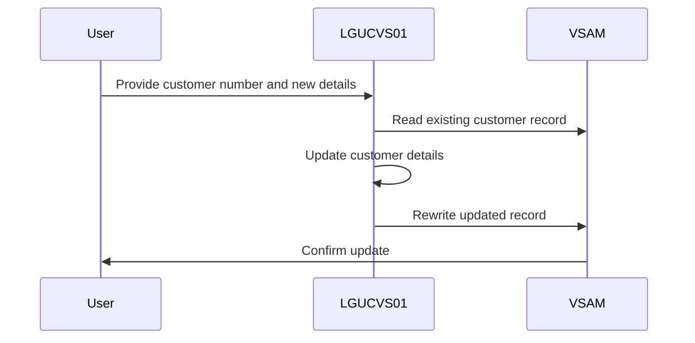
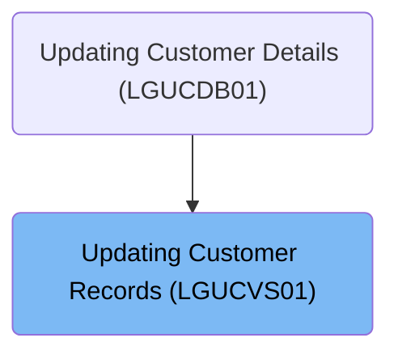

This document describes the process of updating customer records using the <SwmToken path="base/src/lgucvs01.cbl" pos="11:6:6" line-data="       PROGRAM-ID. LGUCVS01.">`LGUCVS01`</SwmToken> program. The program reads the existing customer record from the VSAM KSDS file, updates the necessary fields, and writes the updated record back to the file.

For example, if a customer's address changes, the program reads the existing record, updates the address field, and writes the updated record back to the database.

The main steps are:

- Read the customer record using the customer number as the key
- Update the customer details in the working storage area
- Rewrite the updated customer record back to the VSAM KSDS file



## Dependencies

### Program

- LGSTSQ (<SwmPath>[base/src/lgstsq.cbl](base/src/lgstsq.cbl)</SwmPath>) - <SwmLink doc-title="Message Queue Handler (LGSTSQ)">[Message Queue Handler (LGSTSQ)](/.swm/message-queue-handler-lgstsq.e7y8uelv.sw.md)</SwmLink>

### Copybook

- LGCMAREA (<SwmPath>[base/src/lgcmarea.cpy](base/src/lgcmarea.cpy)</SwmPath>)

# Where is this program used?

This program is used once, as represented in the following diagram:



# Initiating Customer Record Processing

<SwmSnippet path="/base/src/lgucvs01.cbl" line="64">

---

In <SwmToken path="base/src/lgucvs01.cbl" pos="64:1:1" line-data="       MAINLINE SECTION.">`MAINLINE`</SwmToken>, we move the communication area length to a variable and read the customer record using the customer number as the key.

```cobol
       MAINLINE SECTION.
      *
      *---------------------------------------------------------------*
           Move EIBCALEN To WS-Commarea-Len.
      *---------------------------------------------------------------*
           Exec CICS Read File('KSDSCUST')
                     Into(WS-Customer-Area)
                     Length(WS-Commarea-Len)
                     Ridfld(CA-Customer-Num)
                     KeyLength(10)
                     RESP(WS-RESP)
                     Update
           End-Exec.
```

---

</SwmSnippet>

<SwmSnippet path="/base/src/lgucvs01.cbl" line="85">

---

Finally, we rewrite the customer record back to the 'KSDSCUST' file using the customer number as the key, making sure the operation is successful by checking the response code.

```cobol
           Exec CICS ReWrite File('KSDSCUST')
                     From(CA-Customer-Num)
                     Length(CUSTOMER-RECORD-SIZE)
                     RESP(WS-RESP)
           End-Exec.
```

---

</SwmSnippet>

&nbsp;

*This is an auto-generated document by Swimm 🌊 and has not yet been verified by a human*

<SwmMeta version="3.0.0" repo-id="Z2l0aHViJTNBJTNBa3luZHJ5bC1jaWNzLWdlbmFwcCUzQSUzQVN3aW1tLURlbW8=" repo-name="kyndryl-cics-genapp"><sup>Powered by [Swimm](/)</sup></SwmMeta>
