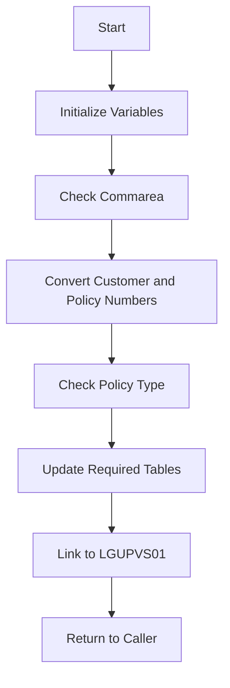

The <SwmToken path="base/src/lgupdb01.cbl" pos="10:6:6" line-data="       PROGRAM-ID. LGUPDB01.">`LGUPDB01`</SwmToken> program is a COBOL application designed to update policy details in an IBM Db2 database. This document will cover:

1. What the Program Does
2. Program Flow
3. Program Sections

## What the Program Does

The <SwmToken path="base/src/lgupdb01.cbl" pos="10:6:6" line-data="       PROGRAM-ID. LGUPDB01.">`LGUPDB01`</SwmToken> program updates policy details in an IBM Db2 database. It initializes working storage variables, checks the communication area (commarea), converts customer and policy numbers to <SwmToken path="base/src/lgupdb01.cbl" pos="175:5:5" line-data="      * initialize DB2 host variables">`DB2`</SwmToken> integer format, and updates the policy details based on the type of policy (Endowment, House, or Motor). The program also handles error messages and returns the updated information to the caller.

## Program Flow

The program flow of <SwmToken path="base/src/lgupdb01.cbl" pos="10:6:6" line-data="       PROGRAM-ID. LGUPDB01.">`LGUPDB01`</SwmToken> is as follows:

1. Initialize working storage variables and <SwmToken path="base/src/lgupdb01.cbl" pos="175:5:5" line-data="      * initialize DB2 host variables">`DB2`</SwmToken> host variables.
2. Check the commarea and obtain required details.
3. Convert commarea customer and policy numbers to <SwmToken path="base/src/lgupdb01.cbl" pos="175:5:5" line-data="      * initialize DB2 host variables">`DB2`</SwmToken> integer format.
4. Check which policy type is being requested and update the required tables.
5. Link to another program <SwmToken path="base/src/lgupdb01.cbl" pos="209:8:9" line-data="           EXEC CICS LINK Program(LGUPVS01)">`(LGUPVS01`</SwmToken>) with the commarea.
6. Return to the caller.



<SwmSnippet path="/base/src/lgupdb01.cbl" line="162">

---

### MAINLINE SECTION

First, the MAINLINE SECTION initializes working storage variables and <SwmToken path="base/src/lgupdb01.cbl" pos="175:5:5" line-data="      * initialize DB2 host variables">`DB2`</SwmToken> host variables. It then checks the commarea and obtains the required details. If no commarea is received, it issues an ABEND. It converts the commarea customer and policy numbers to <SwmToken path="base/src/lgupdb01.cbl" pos="175:5:5" line-data="      * initialize DB2 host variables">`DB2`</SwmToken> integer format and saves them in the error message field. Finally, it calls the procedure to update the required tables and links to another program <SwmToken path="base/src/lgupdb01.cbl" pos="209:8:9" line-data="           EXEC CICS LINK Program(LGUPVS01)">`(LGUPVS01`</SwmToken>) with the commarea.

```cobol
       MAINLINE SECTION.

      *----------------------------------------------------------------*
      * Common code                                                    *
      *----------------------------------------------------------------*
      * initialize working storage variables
           INITIALIZE WS-HEADER.
      * set up general variable
           MOVE EIBTRNID TO WS-TRANSID.
           MOVE EIBTRMID TO WS-TERMID.
           MOVE EIBTASKN TO WS-TASKNUM.
           MOVE SPACES   TO WS-RETRY.
      *----------------------------------------------------------------*
      * initialize DB2 host variables
           INITIALIZE DB2-POLICY.
           INITIALIZE DB2-IN-INTEGERS.

      *----------------------------------------------------------------*
      * Check commarea and obtain required details                     *
      *----------------------------------------------------------------*
      * If NO commarea received issue an ABEND
```

---

</SwmSnippet>

<SwmSnippet path="/base/src/lgupdb01.cbl" line="228">

---

### <SwmToken path="base/src/lgupdb01.cbl" pos="228:1:7" line-data="       FETCH-DB2-POLICY-ROW.">`FETCH-DB2-POLICY-ROW`</SwmToken>

Now, the <SwmToken path="base/src/lgupdb01.cbl" pos="228:1:7" line-data="       FETCH-DB2-POLICY-ROW.">`FETCH-DB2-POLICY-ROW`</SwmToken> section fetches a row from the policy tables using the <SwmToken path="base/src/lgupdb01.cbl" pos="223:17:19" line-data="      * Fetch a row from Policy tables using POLICY-CURSOR             *">`POLICY-CURSOR`</SwmToken>. It moves the fetched data into the corresponding <SwmToken path="base/src/lgupdb01.cbl" pos="228:3:3" line-data="       FETCH-DB2-POLICY-ROW.">`DB2`</SwmToken> host variables.

```cobol
       FETCH-DB2-POLICY-ROW.
           MOVE ' FETCH  ROW   ' TO EM-SQLREQ
           EXEC SQL
             FETCH POLICY_CURSOR
             INTO  :DB2-ISSUEDATE,
                   :DB2-EXPIRYDATE,
                   :DB2-LASTCHANGED,
                   :DB2-BROKERID-INT INDICATOR :IND-BROKERID,
                   :DB2-BROKERSREF INDICATOR :IND-BROKERSREF,
                   :DB2-PAYMENT-INT INDICATOR :IND-PAYMENT
           END-EXEC
           EXIT.
```

---

</SwmSnippet>

<SwmSnippet path="/base/src/lgupdb01.cbl" line="251">

---

### <SwmToken path="base/src/lgupdb01.cbl" pos="251:1:7" line-data="       UPDATE-POLICY-DB2-INFO.">`UPDATE-POLICY-DB2-INFO`</SwmToken>

Then, the <SwmToken path="base/src/lgupdb01.cbl" pos="251:1:7" line-data="       UPDATE-POLICY-DB2-INFO.">`UPDATE-POLICY-DB2-INFO`</SwmToken> section opens the <SwmToken path="base/src/lgupdb01.cbl" pos="223:17:19" line-data="      * Fetch a row from Policy tables using POLICY-CURSOR             *">`POLICY-CURSOR`</SwmToken> and fetches the first row. It compares the timestamp in the commarea with that in <SwmToken path="base/src/lgupdb01.cbl" pos="251:5:5" line-data="       UPDATE-POLICY-DB2-INFO.">`DB2`</SwmToken>. If they match, it updates the specific policy type table and then updates the policy table with the new timestamp. If the timestamps do not match, it sets the return code to indicate the mismatch.

```cobol
       UPDATE-POLICY-DB2-INFO.

      *    Open the cursor.
           MOVE ' OPEN   PCURSOR ' TO EM-SQLREQ
           EXEC SQL
             OPEN POLICY_CURSOR
           END-EXEC

           Evaluate SQLCODE
             When 0
               MOVE '00' TO CA-RETURN-CODE
             When -913
               MOVE '90' TO CA-RETURN-CODE
               PERFORM WRITE-ERROR-MESSAGE
               EXEC CICS RETURN END-EXEC
             When Other
               MOVE '90' TO CA-RETURN-CODE
               PERFORM WRITE-ERROR-MESSAGE
               EXEC CICS RETURN END-EXEC
           END-Evaluate.

```

---

</SwmSnippet>

<SwmSnippet path="/base/src/lgupdb01.cbl" line="387">

---

### <SwmToken path="base/src/lgupdb01.cbl" pos="387:1:7" line-data="       UPDATE-ENDOW-DB2-INFO.">`UPDATE-ENDOW-DB2-INFO`</SwmToken>

Going into the <SwmToken path="base/src/lgupdb01.cbl" pos="387:1:7" line-data="       UPDATE-ENDOW-DB2-INFO.">`UPDATE-ENDOW-DB2-INFO`</SwmToken> section, it updates the row in the Endowment table that matches the customer and policy number requested. It moves the numeric commarea fields to <SwmToken path="base/src/lgupdb01.cbl" pos="387:5:5" line-data="       UPDATE-ENDOW-DB2-INFO.">`DB2`</SwmToken> integer formats and updates the Endowment table with the data from the commarea.

```cobol
       UPDATE-ENDOW-DB2-INFO.

      *    Move numeric commarea fields to DB2 Integer formats
           MOVE CA-E-TERM        TO DB2-E-TERM-SINT
           MOVE CA-E-SUM-ASSURED TO DB2-E-SUMASSURED-INT

           MOVE ' UPDATE ENDOW ' TO EM-SQLREQ
           EXEC SQL
             UPDATE ENDOWMENT
               SET
                 WITHPROFITS   = :CA-E-WITH-PROFITS,
                   EQUITIES    = :CA-E-EQUITIES,
                   MANAGEDFUND = :CA-E-MANAGED-FUND,
                   FUNDNAME    = :CA-E-FUND-NAME,
                   TERM        = :DB2-E-TERM-SINT,
                   SUMASSURED  = :DB2-E-SUMASSURED-INT,
                   LIFEASSURED = :CA-E-LIFE-ASSURED
               WHERE
                   POLICYNUMBER = :DB2-POLICYNUM-INT
           END-EXEC

```

---

</SwmSnippet>

<SwmSnippet path="/base/src/lgupdb01.cbl" line="424">

---

### <SwmToken path="base/src/lgupdb01.cbl" pos="424:1:7" line-data="       UPDATE-HOUSE-DB2-INFO.">`UPDATE-HOUSE-DB2-INFO`</SwmToken>

Next, the <SwmToken path="base/src/lgupdb01.cbl" pos="424:1:7" line-data="       UPDATE-HOUSE-DB2-INFO.">`UPDATE-HOUSE-DB2-INFO`</SwmToken> section updates the row in the House table that matches the customer and policy number requested. It moves the numeric commarea fields to <SwmToken path="base/src/lgupdb01.cbl" pos="424:5:5" line-data="       UPDATE-HOUSE-DB2-INFO.">`DB2`</SwmToken> integer formats and updates the House table with the data from the commarea.

```cobol
       UPDATE-HOUSE-DB2-INFO.

      *    Move numeric commarea fields to DB2 Integer formats
           MOVE CA-H-BEDROOMS    TO DB2-H-BEDROOMS-SINT
           MOVE CA-H-VALUE       TO DB2-H-VALUE-INT

           MOVE ' UPDATE HOUSE ' TO EM-SQLREQ
           EXEC SQL
             UPDATE HOUSE
               SET
                    PROPERTYTYPE = :CA-H-PROPERTY-TYPE,
                    BEDROOMS     = :DB2-H-BEDROOMS-SINT,
                    VALUE        = :DB2-H-VALUE-INT,
                    HOUSENAME    = :CA-H-HOUSE-NAME,
                    HOUSENUMBER  = :CA-H-HOUSE-NUMBER,
                    POSTCODE     = :CA-H-POSTCODE
               WHERE
                    POLICYNUMBER = :DB2-POLICYNUM-INT
           END-EXEC

           IF SQLCODE NOT EQUAL 0
```

---

</SwmSnippet>

<SwmSnippet path="/base/src/lgupdb01.cbl" line="460">

---

### <SwmToken path="base/src/lgupdb01.cbl" pos="460:1:7" line-data="       UPDATE-MOTOR-DB2-INFO.">`UPDATE-MOTOR-DB2-INFO`</SwmToken>

Finally, the <SwmToken path="base/src/lgupdb01.cbl" pos="460:1:7" line-data="       UPDATE-MOTOR-DB2-INFO.">`UPDATE-MOTOR-DB2-INFO`</SwmToken> section updates the row in the Motor table that matches the customer and policy number requested. It moves the numeric commarea fields to <SwmToken path="base/src/lgupdb01.cbl" pos="460:5:5" line-data="       UPDATE-MOTOR-DB2-INFO.">`DB2`</SwmToken> integer formats and updates the Motor table with the data from the commarea.

```cobol
       UPDATE-MOTOR-DB2-INFO.

      *    Move numeric commarea fields to DB2 Integer formats
           MOVE CA-M-CC          TO DB2-M-CC-SINT
           MOVE CA-M-VALUE       TO DB2-M-VALUE-INT
           MOVE CA-M-PREMIUM     TO DB2-M-PREMIUM-INT
           MOVE CA-M-ACCIDENTS   TO DB2-M-ACCIDENTS-INT

           MOVE ' UPDATE MOTOR ' TO EM-SQLREQ
           EXEC SQL
             UPDATE MOTOR
               SET
                    MAKE              = :CA-M-MAKE,
                    MODEL             = :CA-M-MODEL,
                    VALUE             = :DB2-M-VALUE-INT,
                    REGNUMBER         = :CA-M-REGNUMBER,
                    COLOUR            = :CA-M-COLOUR,
                    CC                = :DB2-M-CC-SINT,
                    YEAROFMANUFACTURE = :CA-M-MANUFACTURED,
                    PREMIUM           = :DB2-M-PREMIUM-INT,
                    ACCIDENTS         = :DB2-M-ACCIDENTS-INT
```

---

</SwmSnippet>

&nbsp;

*This is an auto-generated document by Swimm 🌊 and has not yet been verified by a human*

<SwmMeta version="3.0.0" repo-id="Z2l0aHViJTNBJTNBa3luZHJ5bC1jaWNzLWdlbmFwcCUzQSUzQVN3aW1tLURlbW8=" repo-name="kyndryl-cics-genapp"><sup>Powered by [Swimm](/)</sup></SwmMeta>
