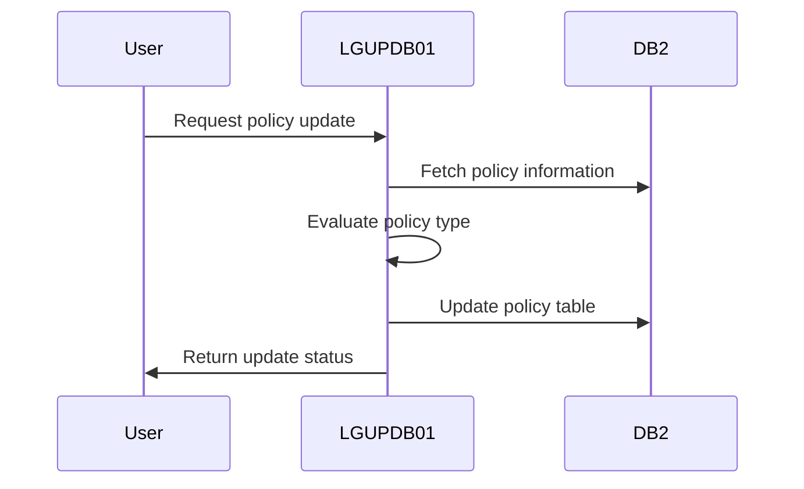
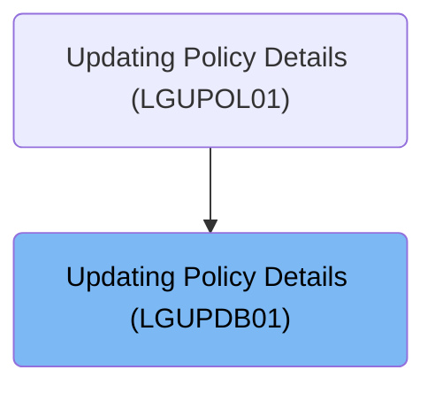
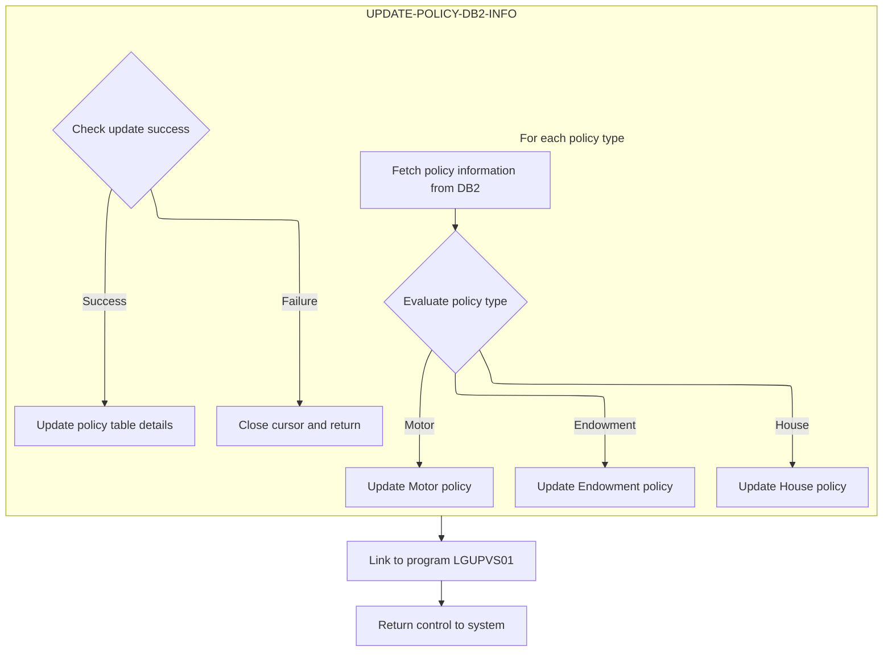
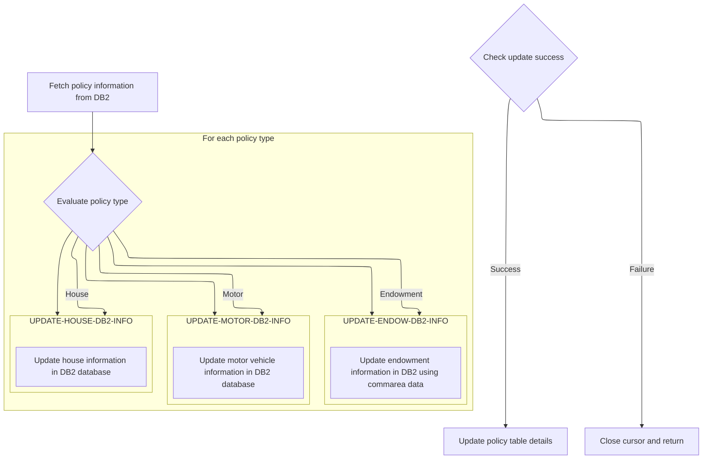
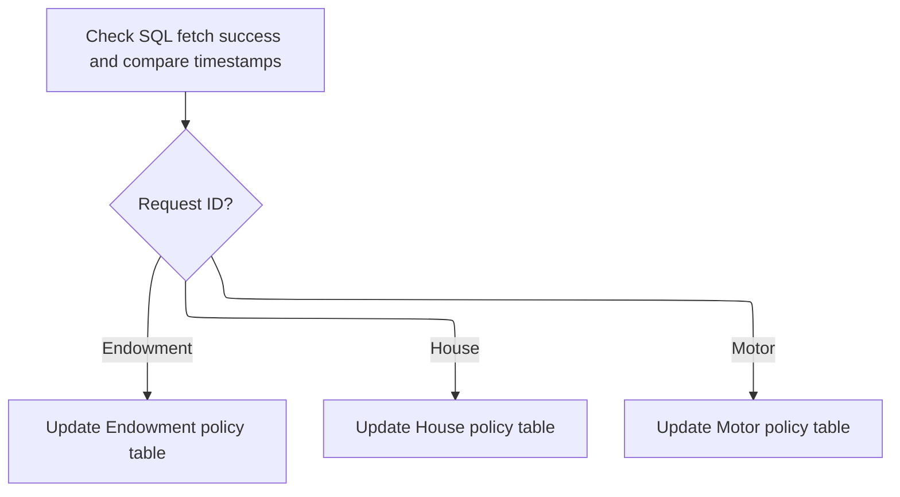

This document explains the process of updating policy details using the <SwmToken path="base/src/lgupdb01.cbl" pos="10:6:6" line-data="       PROGRAM-ID. LGUPDB01.">`LGUPDB01`</SwmToken> program. Within the insurance application, this program fetches policy information from the <SwmToken path="base/src/lgupdb01.cbl" pos="207:7:7" line-data="           PERFORM UPDATE-POLICY-DB2-INFO.">`DB2`</SwmToken> database, evaluates the policy type, and updates the corresponding policy table. It ensures that policy records are updated accurately based on the latest data.

For example, if a policy update request for a motor vehicle policy is received, the program fetches the current policy data, updates the motor policy table with new values, and returns a success status.

The main steps are:

- Fetch policy information from <SwmToken path="base/src/lgupdb01.cbl" pos="207:7:7" line-data="           PERFORM UPDATE-POLICY-DB2-INFO.">`DB2`</SwmToken>
- Evaluate policy type
- Update specific policy type table (Endowment, House, Motor)
- Check update success
- Update policy table details
- Close cursor and return control



## Dependencies

### Programs

- <SwmToken path="base/src/lgupdb01.cbl" pos="209:9:9" line-data="           EXEC CICS LINK Program(LGUPVS01)">`LGUPVS01`</SwmToken> (<SwmPath>[base/src/lgupvs01.cbl](base/src/lgupvs01.cbl)</SwmPath>) - <SwmLink doc-title="Updating Policy Records (LGUPVS01)">[Updating Policy Records (LGUPVS01)](/.swm/updating-policy-records-lgupvs01.j9n26r47.sw.md)</SwmLink>
- LGSTSQ (<SwmPath>[base/src/lgstsq.cbl](base/src/lgstsq.cbl)</SwmPath>) - <SwmLink doc-title="Message Queue Handler (LGSTSQ)">[Message Queue Handler (LGSTSQ)](/.swm/message-queue-handler-lgstsq.e7y8uelv.sw.md)</SwmLink>

### Copybooks

- LGCMAREA (<SwmPath>[base/src/lgcmarea.cpy](base/src/lgcmarea.cpy)</SwmPath>)
- LGPOLICY (<SwmPath>[base/src/lgpolicy.cpy](base/src/lgpolicy.cpy)</SwmPath>)
- SQLCA

# Where is this program used?

This program is used once, as represented in the following diagram:



# Initiating Policy Update



<SwmSnippet path="/base/src/lgupdb01.cbl" line="207">

---

<SwmToken path="base/src/lgupdb01.cbl" pos="162:1:1" line-data="       MAINLINE SECTION.">`MAINLINE`</SwmToken> starts by updating policy details and then calls <SwmToken path="base/src/lgupdb01.cbl" pos="209:9:9" line-data="           EXEC CICS LINK Program(LGUPVS01)">`LGUPVS01`</SwmToken> to manage policy records in a VSAM file.

```cobol
           PERFORM UPDATE-POLICY-DB2-INFO.

           EXEC CICS LINK Program(LGUPVS01)
                Commarea(DFHCOMMAREA)
                LENGTH(225)
           END-EXEC.
```

---

</SwmSnippet>

## Fetching and Updating Policy Data



<SwmSnippet path="/base/src/lgupdb01.cbl" line="273">

---

In <SwmToken path="base/src/lgupdb01.cbl" pos="207:3:9" line-data="           PERFORM UPDATE-POLICY-DB2-INFO.">`UPDATE-POLICY-DB2-INFO`</SwmToken>, we fetch current policy data to ensure updates are based on the latest information.

```cobol
           PERFORM FETCH-DB2-POLICY-ROW
```

---

</SwmSnippet>

<SwmSnippet path="/base/src/lgupdb01.cbl" line="228">

---

<SwmToken path="base/src/lgupdb01.cbl" pos="228:1:7" line-data="       FETCH-DB2-POLICY-ROW.">`FETCH-DB2-POLICY-ROW`</SwmToken> grabs the next row from the <SwmToken path="base/src/lgupdb01.cbl" pos="228:3:3" line-data="       FETCH-DB2-POLICY-ROW.">`DB2`</SwmToken> database using <SwmToken path="base/src/lgupdb01.cbl" pos="231:3:3" line-data="             FETCH POLICY_CURSOR">`POLICY_CURSOR`</SwmToken>, storing data like issue and expiry dates into host variables.

```cobol
       FETCH-DB2-POLICY-ROW.
           MOVE ' FETCH  ROW   ' TO EM-SQLREQ
           EXEC SQL
             FETCH POLICY_CURSOR
             INTO  :DB2-ISSUEDATE,
                   :DB2-EXPIRYDATE,
                   :DB2-LASTCHANGED,
                   :DB2-BROKERID-INT INDICATOR :IND-BROKERID,
                   :DB2-BROKERSREF INDICATOR :IND-BROKERSREF,
                   :DB2-PAYMENT-INT INDICATOR :IND-PAYMENT
           END-EXEC
           EXIT.
```

---

</SwmSnippet>

<SwmSnippet path="/base/src/lgupdb01.cbl" line="275">

---

We just returned from <SwmToken path="base/src/lgupdb01.cbl" pos="228:1:7" line-data="       FETCH-DB2-POLICY-ROW.">`FETCH-DB2-POLICY-ROW`</SwmToken>. Now, <SwmToken path="base/src/lgupdb01.cbl" pos="207:3:9" line-data="           PERFORM UPDATE-POLICY-DB2-INFO.">`UPDATE-POLICY-DB2-INFO`</SwmToken> checks if the timestamps match and uses an EVALUATE statement to decide which policy table to update, starting with <SwmToken path="base/src/lgupdb01.cbl" pos="288:3:9" line-data="                 PERFORM UPDATE-ENDOW-DB2-INFO">`UPDATE-ENDOW-DB2-INFO`</SwmToken> for endowment policies.

```cobol
           IF SQLCODE = 0
      *      Fetch was successful
      *      Compare timestamp in commarea with that in DB2
             IF CA-LASTCHANGED EQUAL TO DB2-LASTCHANGED

      *----------------------------------------------------------------*
      *      Select for Update and Update specific policy type table   *
      *----------------------------------------------------------------*
             EVALUATE CA-REQUEST-ID

      *** Endowment ***
               WHEN '01UEND'
      *          Call routine to update Endowment table
                 PERFORM UPDATE-ENDOW-DB2-INFO

      *** House ***
               WHEN '01UHOU'
      *          Call routine to update Housetable
                 PERFORM UPDATE-HOUSE-DB2-INFO

      *** Motor ***
               WHEN '01UMOT'
      *          Call routine to update Motor table
                 PERFORM UPDATE-MOTOR-DB2-INFO

             END-EVALUATE
```

---

</SwmSnippet>

### Updating Endowment Policy

<SwmSnippet path="/base/src/lgupdb01.cbl" line="387">

---

<SwmToken path="base/src/lgupdb01.cbl" pos="387:1:7" line-data="       UPDATE-ENDOW-DB2-INFO.">`UPDATE-ENDOW-DB2-INFO`</SwmToken> converts data types and updates the ENDOWMENT table with new values.

```cobol
       UPDATE-ENDOW-DB2-INFO.

      *    Move numeric commarea fields to DB2 Integer formats
           MOVE CA-E-TERM        TO DB2-E-TERM-SINT
           MOVE CA-E-SUM-ASSURED TO DB2-E-SUMASSURED-INT

           MOVE ' UPDATE ENDOW ' TO EM-SQLREQ
           EXEC SQL
             UPDATE ENDOWMENT
               SET
                 WITHPROFITS   = :CA-E-WITH-PROFITS,
                   EQUITIES    = :CA-E-EQUITIES,
                   MANAGEDFUND = :CA-E-MANAGED-FUND,
                   FUNDNAME    = :CA-E-FUND-NAME,
                   TERM        = :DB2-E-TERM-SINT,
                   SUMASSURED  = :DB2-E-SUMASSURED-INT,
                   LIFEASSURED = :CA-E-LIFE-ASSURED
               WHERE
                   POLICYNUMBER = :DB2-POLICYNUM-INT
           END-EXEC
```

---

</SwmSnippet>

<SwmSnippet path="/base/src/lgupdb01.cbl" line="408">

---

After the SQL UPDATE, the function checks SQLCODE. If it's not zero, it handles errors, like setting a return code if no data is found.

```cobol
           IF SQLCODE NOT EQUAL 0
      *      Non-zero SQLCODE from UPDATE statement
             IF SQLCODE EQUAL 100
               MOVE '01' TO CA-RETURN-CODE
```

---

</SwmSnippet>

<SwmSnippet path="/base/src/lgupdb01.cbl" line="417">

---

<SwmToken path="base/src/lgupdb01.cbl" pos="288:3:9" line-data="                 PERFORM UPDATE-ENDOW-DB2-INFO">`UPDATE-ENDOW-DB2-INFO`</SwmToken> returns a status code based on SQLCODE, indicating success or specific errors like 'no data found'.

```cobol
           END-IF.
           EXIT.
```

---

</SwmSnippet>

### Continuing Policy Updates



<SwmSnippet path="/base/src/lgupdb01.cbl" line="275">

---

We just returned from <SwmToken path="base/src/lgupdb01.cbl" pos="288:3:9" line-data="                 PERFORM UPDATE-ENDOW-DB2-INFO">`UPDATE-ENDOW-DB2-INFO`</SwmToken>. Now, <SwmToken path="base/src/lgupdb01.cbl" pos="207:3:9" line-data="           PERFORM UPDATE-POLICY-DB2-INFO.">`UPDATE-POLICY-DB2-INFO`</SwmToken> continues by checking the request ID to decide the next update, moving to <SwmToken path="base/src/lgupdb01.cbl" pos="293:3:9" line-data="                 PERFORM UPDATE-HOUSE-DB2-INFO">`UPDATE-HOUSE-DB2-INFO`</SwmToken> for house policies.

```cobol
           IF SQLCODE = 0
      *      Fetch was successful
      *      Compare timestamp in commarea with that in DB2
             IF CA-LASTCHANGED EQUAL TO DB2-LASTCHANGED

      *----------------------------------------------------------------*
      *      Select for Update and Update specific policy type table   *
      *----------------------------------------------------------------*
             EVALUATE CA-REQUEST-ID

      *** Endowment ***
               WHEN '01UEND'
      *          Call routine to update Endowment table
                 PERFORM UPDATE-ENDOW-DB2-INFO

      *** House ***
               WHEN '01UHOU'
      *          Call routine to update Housetable
                 PERFORM UPDATE-HOUSE-DB2-INFO

      *** Motor ***
               WHEN '01UMOT'
      *          Call routine to update Motor table
                 PERFORM UPDATE-MOTOR-DB2-INFO

             END-EVALUATE
```

---

</SwmSnippet>

### Updating House Policy

<SwmSnippet path="/base/src/lgupdb01.cbl" line="424">

---

In <SwmToken path="base/src/lgupdb01.cbl" pos="424:1:7" line-data="       UPDATE-HOUSE-DB2-INFO.">`UPDATE-HOUSE-DB2-INFO`</SwmToken>, numeric fields are converted to <SwmToken path="base/src/lgupdb01.cbl" pos="424:5:5" line-data="       UPDATE-HOUSE-DB2-INFO.">`DB2`</SwmToken> formats, and an SQL UPDATE modifies the HOUSE table with these values, targeting the correct policy.

```cobol
       UPDATE-HOUSE-DB2-INFO.

      *    Move numeric commarea fields to DB2 Integer formats
           MOVE CA-H-BEDROOMS    TO DB2-H-BEDROOMS-SINT
           MOVE CA-H-VALUE       TO DB2-H-VALUE-INT

           MOVE ' UPDATE HOUSE ' TO EM-SQLREQ
           EXEC SQL
             UPDATE HOUSE
               SET
                    PROPERTYTYPE = :CA-H-PROPERTY-TYPE,
                    BEDROOMS     = :DB2-H-BEDROOMS-SINT,
                    VALUE        = :DB2-H-VALUE-INT,
                    HOUSENAME    = :CA-H-HOUSE-NAME,
                    HOUSENUMBER  = :CA-H-HOUSE-NUMBER,
                    POSTCODE     = :CA-H-POSTCODE
               WHERE
                    POLICYNUMBER = :DB2-POLICYNUM-INT
           END-EXEC
```

---

</SwmSnippet>

<SwmSnippet path="/base/src/lgupdb01.cbl" line="444">

---

After the SQL UPDATE, it checks SQLCODE. If no rows were updated, it sets a specific return code; otherwise, it handles errors generally.

```cobol
           IF SQLCODE NOT EQUAL 0
      *      Non-zero SQLCODE from UPDATE statement
             IF SQLCODE = 100
               MOVE '01' TO CA-RETURN-CODE
```

---

</SwmSnippet>

<SwmSnippet path="/base/src/lgupdb01.cbl" line="417">

---

<SwmToken path="base/src/lgupdb01.cbl" pos="293:3:9" line-data="                 PERFORM UPDATE-HOUSE-DB2-INFO">`UPDATE-HOUSE-DB2-INFO`</SwmToken> returns a status code based on SQLCODE, indicating success or specific errors like 'no data found'.

```cobol
           END-IF.
           EXIT.
```

---

</SwmSnippet>

### Finalizing Policy Updates

<SwmSnippet path="/base/src/lgupdb01.cbl" line="275">

---

We just returned from <SwmToken path="base/src/lgupdb01.cbl" pos="293:3:9" line-data="                 PERFORM UPDATE-HOUSE-DB2-INFO">`UPDATE-HOUSE-DB2-INFO`</SwmToken>. Now, <SwmToken path="base/src/lgupdb01.cbl" pos="207:3:9" line-data="           PERFORM UPDATE-POLICY-DB2-INFO.">`UPDATE-POLICY-DB2-INFO`</SwmToken> checks the request ID again and moves to <SwmToken path="base/src/lgupdb01.cbl" pos="298:3:9" line-data="                 PERFORM UPDATE-MOTOR-DB2-INFO">`UPDATE-MOTOR-DB2-INFO`</SwmToken> for motor policies.

```cobol
           IF SQLCODE = 0
      *      Fetch was successful
      *      Compare timestamp in commarea with that in DB2
             IF CA-LASTCHANGED EQUAL TO DB2-LASTCHANGED

      *----------------------------------------------------------------*
      *      Select for Update and Update specific policy type table   *
      *----------------------------------------------------------------*
             EVALUATE CA-REQUEST-ID

      *** Endowment ***
               WHEN '01UEND'
      *          Call routine to update Endowment table
                 PERFORM UPDATE-ENDOW-DB2-INFO

      *** House ***
               WHEN '01UHOU'
      *          Call routine to update Housetable
                 PERFORM UPDATE-HOUSE-DB2-INFO

      *** Motor ***
               WHEN '01UMOT'
      *          Call routine to update Motor table
                 PERFORM UPDATE-MOTOR-DB2-INFO

             END-EVALUATE
```

---

</SwmSnippet>

### Updating Motor Policy

<SwmSnippet path="/base/src/lgupdb01.cbl" line="460">

---

<SwmToken path="base/src/lgupdb01.cbl" pos="460:1:7" line-data="       UPDATE-MOTOR-DB2-INFO.">`UPDATE-MOTOR-DB2-INFO`</SwmToken> converts data types and updates the MOTOR table.

```cobol
       UPDATE-MOTOR-DB2-INFO.

      *    Move numeric commarea fields to DB2 Integer formats
           MOVE CA-M-CC          TO DB2-M-CC-SINT
           MOVE CA-M-VALUE       TO DB2-M-VALUE-INT
           MOVE CA-M-PREMIUM     TO DB2-M-PREMIUM-INT
           MOVE CA-M-ACCIDENTS   TO DB2-M-ACCIDENTS-INT

           MOVE ' UPDATE MOTOR ' TO EM-SQLREQ
           EXEC SQL
             UPDATE MOTOR
               SET
                    MAKE              = :CA-M-MAKE,
                    MODEL             = :CA-M-MODEL,
                    VALUE             = :DB2-M-VALUE-INT,
                    REGNUMBER         = :CA-M-REGNUMBER,
                    COLOUR            = :CA-M-COLOUR,
                    CC                = :DB2-M-CC-SINT,
                    YEAROFMANUFACTURE = :CA-M-MANUFACTURED,
                    PREMIUM           = :DB2-M-PREMIUM-INT,
                    ACCIDENTS         = :DB2-M-ACCIDENTS-INT
               WHERE
                    POLICYNUMBER      = :DB2-POLICYNUM-INT
           END-EXEC
```

---

</SwmSnippet>

<SwmSnippet path="/base/src/lgupdb01.cbl" line="408">

---

After the SQL UPDATE, it checks SQLCODE. If no rows were updated, it sets a specific return code; otherwise, it handles errors generally.

```cobol
           IF SQLCODE NOT EQUAL 0
      *      Non-zero SQLCODE from UPDATE statement
             IF SQLCODE EQUAL 100
               MOVE '01' TO CA-RETURN-CODE
```

---

</SwmSnippet>

<SwmSnippet path="/base/src/lgupdb01.cbl" line="417">

---

<SwmToken path="base/src/lgupdb01.cbl" pos="298:3:9" line-data="                 PERFORM UPDATE-MOTOR-DB2-INFO">`UPDATE-MOTOR-DB2-INFO`</SwmToken> returns a status code based on SQLCODE, indicating success or specific errors like 'no data found'.

```cobol
           END-IF.
           EXIT.
```

---

</SwmSnippet>

### Completing Policy Update Process

<SwmSnippet path="/base/src/lgupdb01.cbl" line="302">

---

We just returned from <SwmToken path="base/src/lgupdb01.cbl" pos="298:3:9" line-data="                 PERFORM UPDATE-MOTOR-DB2-INFO">`UPDATE-MOTOR-DB2-INFO`</SwmToken>. Now, <SwmToken path="base/src/lgupdb01.cbl" pos="207:3:9" line-data="           PERFORM UPDATE-POLICY-DB2-INFO.">`UPDATE-POLICY-DB2-INFO`</SwmToken> checks if any updates failed. If so, it calls <SwmToken path="base/src/lgupdb01.cbl" pos="305:3:5" line-data="                PERFORM CLOSE-PCURSOR">`CLOSE-PCURSOR`</SwmToken> to close the cursor and end the transaction.

```cobol
              IF CA-RETURN-CODE NOT EQUAL '00'
      *         Update policy type specific table has failed
      *         So close cursor and return
                PERFORM CLOSE-PCURSOR
                EXEC CICS RETURN END-EXEC
              END-IF
```

---

</SwmSnippet>

### Closing the Cursor

<SwmSnippet path="/base/src/lgupdb01.cbl" line="362">

---

In <SwmToken path="base/src/lgupdb01.cbl" pos="362:1:3" line-data="       CLOSE-PCURSOR.">`CLOSE-PCURSOR`</SwmToken>, it closes the cursor and checks SQLCODE. A zero or -501 code sets a '00' return code, while other codes trigger error handling.

```cobol
       CLOSE-PCURSOR.
      *    Now close the Cursor and we're done!
           MOVE ' CLOSE  PCURSOR' TO EM-SQLREQ
           EXEC SQL
             CLOSE POLICY_CURSOR
           END-EXEC.
```

---

</SwmSnippet>

<SwmSnippet path="/base/src/lgupdb01.cbl" line="369">

---

It returns '00' for successful or already closed cursors.

```cobol
           Evaluate SQLCODE
             When 0
               MOVE '00' TO CA-RETURN-CODE
             When -501
               MOVE '00' TO CA-RETURN-CODE
               MOVE '-501 detected c' TO EM-SQLREQ
               EXEC CICS RETURN END-EXEC
```

---

</SwmSnippet>

### Finalizing Policy Update

<SwmSnippet path="/base/src/lgupdb01.cbl" line="313">

---

We just returned from <SwmToken path="base/src/lgupdb01.cbl" pos="305:3:5" line-data="                PERFORM CLOSE-PCURSOR">`CLOSE-PCURSOR`</SwmToken>. In <SwmToken path="base/src/lgupdb01.cbl" pos="207:3:9" line-data="           PERFORM UPDATE-POLICY-DB2-INFO.">`UPDATE-POLICY-DB2-INFO`</SwmToken>, this means the cursor is closed, and we proceed to update policy table details.

```cobol
               MOVE CA-BROKERID      TO DB2-BROKERID-INT
               MOVE CA-PAYMENT       TO DB2-PAYMENT-INT

      *        Update policy table details
               MOVE ' UPDATE POLICY  ' TO EM-SQLREQ
```

---

</SwmSnippet>

<SwmSnippet path="/base/src/lgupdb01.cbl" line="318">

---

It updates the POLICY table with new data.

```cobol
               EXEC SQL
                 UPDATE POLICY
                   SET ISSUEDATE        = :CA-ISSUE-DATE,
                       EXPIRYDATE       = :CA-EXPIRY-DATE,
                       LASTCHANGED      = CURRENT TIMESTAMP ,
                       BROKERID         = :DB2-BROKERID-INT,
                       BROKERSREFERENCE = :CA-BROKERSREF
                   WHERE CURRENT OF POLICY_CURSOR
               END-EXEC
```

---

</SwmSnippet>

<SwmSnippet path="/base/src/lgupdb01.cbl" line="329">

---

It fetches the latest timestamp for consistency.

```cobol
               EXEC SQL
                 SELECT LASTCHANGED
                   INTO :CA-LASTCHANGED
                   FROM POLICY
                   WHERE POLICYNUMBER = :DB2-POLICYNUM-INT
               END-EXEC
```

---

</SwmSnippet>

<SwmSnippet path="/base/src/lgupdb01.cbl" line="344">

---

If timestamps don't match, it sets a return code indicating a mismatch, preventing outdated updates.

```cobol
             ELSE
      *        Timestamps do not match (policy table v commarea)
               MOVE '02' TO CA-RETURN-CODE
             END-IF
```

---

</SwmSnippet>

<SwmSnippet path="/base/src/lgupdb01.cbl" line="349">

---

If the initial fetch fails, it sets a return code indicating no data was found, handling the error gracefully.

```cobol
           ELSE
      *      Non-zero SQLCODE from first SQL FETCH statement
             IF SQLCODE EQUAL 100
               MOVE '01' TO CA-RETURN-CODE
```

---

</SwmSnippet>

<SwmSnippet path="/base/src/lgupdb01.cbl" line="358">

---

<SwmToken path="base/src/lgupdb01.cbl" pos="207:3:9" line-data="           PERFORM UPDATE-POLICY-DB2-INFO.">`UPDATE-POLICY-DB2-INFO`</SwmToken> returns a status code reflecting the success or failure of the policy update process.

```cobol
           END-IF.
      *    Now close the Cursor and we're done!
           PERFORM CLOSE-PCURSOR.
```

---

</SwmSnippet>

## Concluding the Program

<SwmSnippet path="/base/src/lgupdb01.cbl" line="215">

---

<SwmToken path="base/src/lgupdb01.cbl" pos="215:1:3" line-data="       END-PROGRAM.">`END-PROGRAM`</SwmToken> marks the end of the COBOL program, using <SwmToken path="base/src/lgupdb01.cbl" pos="216:1:5" line-data="           EXEC CICS RETURN END-EXEC.">`EXEC CICS RETURN`</SwmToken> to hand control back to CICS, concluding the transaction.

```cobol
       END-PROGRAM.
           EXEC CICS RETURN END-EXEC.
```

---

</SwmSnippet>

&nbsp;

*This is an auto-generated document by Swimm 🌊 and has not yet been verified by a human*

<SwmMeta version="3.0.0" repo-id="Z2l0aHViJTNBJTNBa3luZHJ5bC1jaWNzLWdlbmFwcCUzQSUzQVN3aW1tLURlbW8=" repo-name="kyndryl-cics-genapp"><sup>Powered by [Swimm](https://app.swimm.io/)</sup></SwmMeta>
