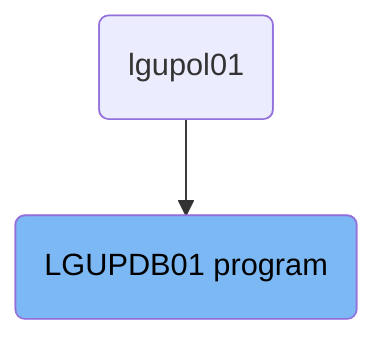
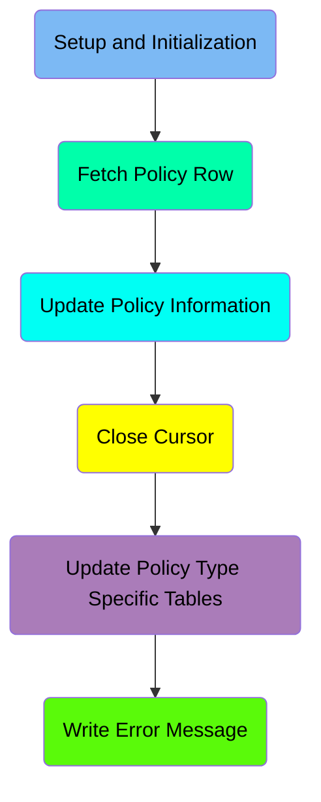
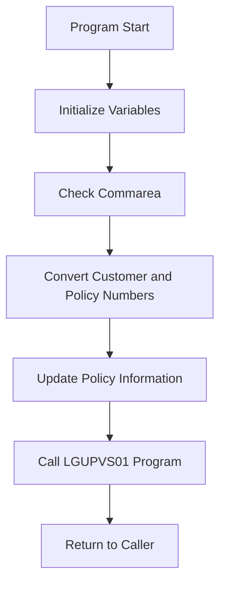
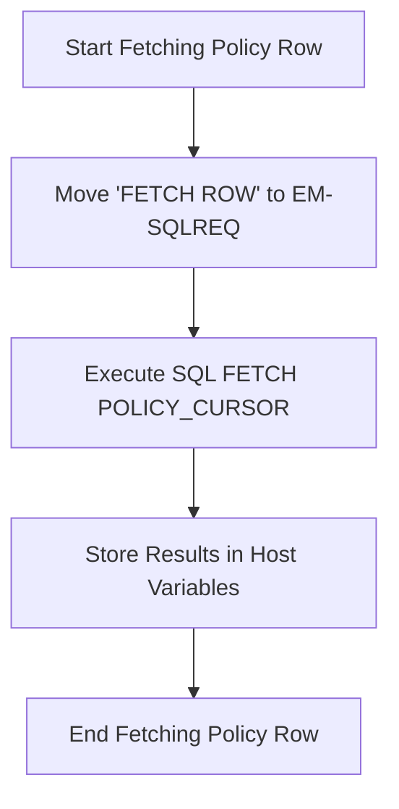
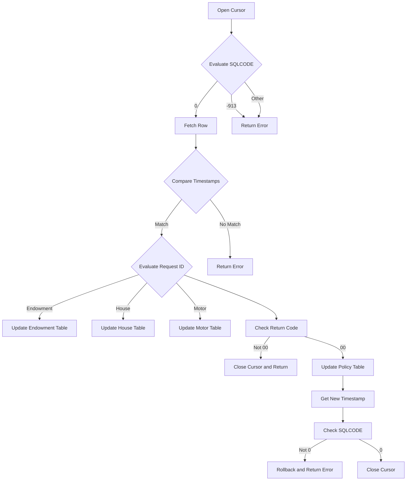
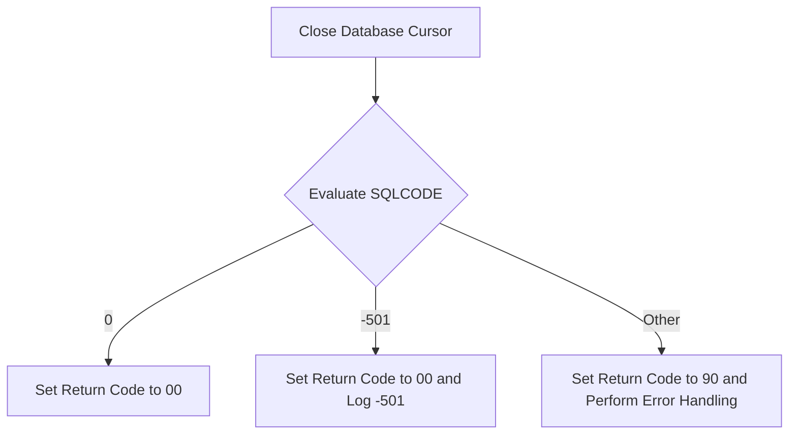
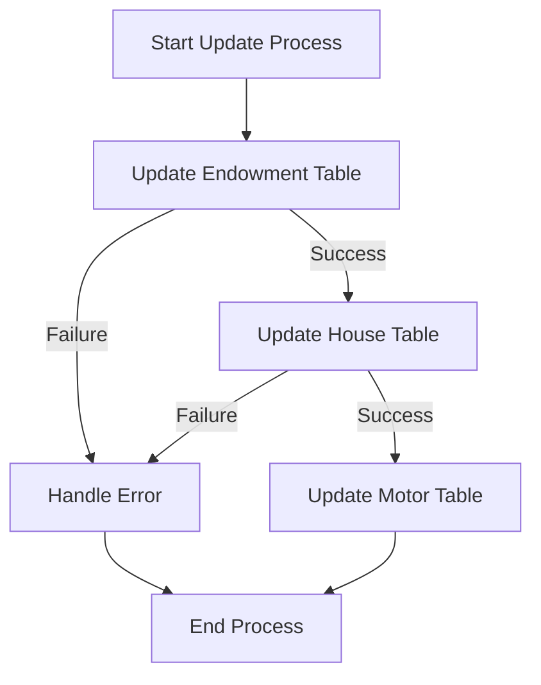
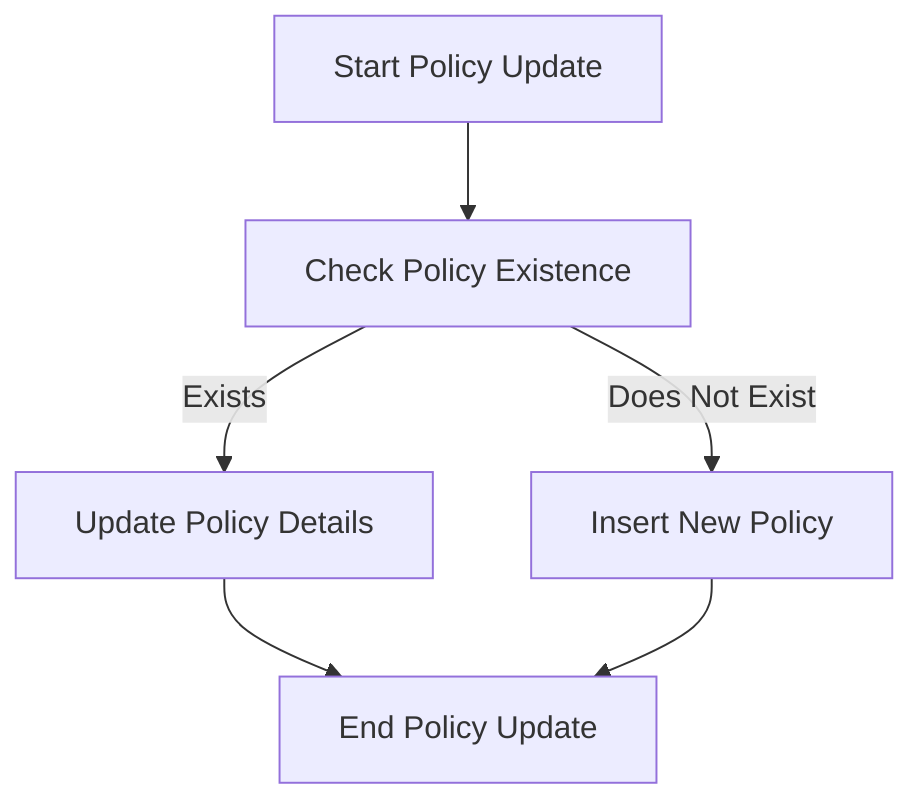

The <SwmToken path="base/src/lgupdb01.cbl" pos="10:6:6" line-data="       PROGRAM-ID. LGUPDB01.">`LGUPDB01`</SwmToken> program is responsible for updating policy information in the IBM Db2 database. This process involves several steps, including initializing variables, checking the communication area, converting customer and policy numbers, and updating various policy-related tables. The program ensures data consistency and handles errors appropriately to maintain the integrity of the database.

The flow starts with initializing necessary variables and checking if the communication area is received. If not, an error is raised. Customer and policy numbers are then converted to the appropriate format for database operations. The program proceeds to update the policy information by calling specific routines for different policy types (endowment, house, motor). After updating the policy tables, the program checks for errors, retrieves a new timestamp, and closes the database cursor to complete the process.

# Where is this program used?

This program is used once, in a flow starting from `lgupol01` as represented in the following diagram:



Here is a high level diagram of the program:



# Setup and Initialization



<SwmSnippet path="/base/src/lgupdb01.cbl" line="167">

---

## Initialize Variables

First, we initialize the working storage variables and <SwmToken path="base/src/lgupdb01.cbl" pos="175:5:5" line-data="      * initialize DB2 host variables">`DB2`</SwmToken> host variables. This sets up the necessary environment for the program to run by preparing the variables that will be used throughout the process.

```cobol
      * initialize working storage variables
           INITIALIZE WS-HEADER.
      * set up general variable
           MOVE EIBTRNID TO WS-TRANSID.
           MOVE EIBTRMID TO WS-TERMID.
           MOVE EIBTASKN TO WS-TASKNUM.
           MOVE SPACES   TO WS-RETRY.
      *----------------------------------------------------------------*
      * initialize DB2 host variables
           INITIALIZE DB2-POLICY.
           INITIALIZE DB2-IN-INTEGERS.

```

---

</SwmSnippet>

<SwmSnippet path="/base/src/lgupdb01.cbl" line="180">

---

## Check Commarea

Next, we check if the commarea (communication area) is received. If no commarea is received, an error message is written, and the program issues an ABEND (abnormal end) to terminate the process. This ensures that the necessary data is available for the program to proceed.

```cobol
      * Check commarea and obtain required details                     *
      *----------------------------------------------------------------*
      * If NO commarea received issue an ABEND
           IF EIBCALEN IS EQUAL TO ZERO
               MOVE ' NO COMMAREA RECEIVED' TO EM-VARIABLE
               PERFORM WRITE-ERROR-MESSAGE
               EXEC CICS ABEND ABCODE('LGCA') NODUMP END-EXEC
           END-IF
```

---

</SwmSnippet>

<SwmSnippet path="/base/src/lgupdb01.cbl" line="194">

---

## Convert Customer and Policy Numbers

Then, we convert the customer and policy numbers from the commarea to <SwmToken path="base/src/lgupdb01.cbl" pos="194:17:17" line-data="      * Convert commarea customer &amp; policy nums to DB2 integer format">`DB2`</SwmToken> integer format. This conversion is necessary for the subsequent database operations. The converted values are also saved in the error message fields in case they are needed later.

```cobol
      * Convert commarea customer & policy nums to DB2 integer format
           MOVE CA-CUSTOMER-NUM TO DB2-CUSTOMERNUM-INT
           MOVE CA-POLICY-NUM   TO DB2-POLICYNUM-INT
      * and save in error msg field incase required
           MOVE CA-CUSTOMER-NUM TO EM-CUSNUM
           MOVE CA-POLICY-NUM   TO EM-POLNUM
```

---

</SwmSnippet>

<SwmSnippet path="/base/src/lgupdb01.cbl" line="206">

---

## Update Policy Information

Moving to the next step, we call the <SwmToken path="base/src/lgupdb01.cbl" pos="207:3:9" line-data="           PERFORM UPDATE-POLICY-DB2-INFO.">`UPDATE-POLICY-DB2-INFO`</SwmToken> procedure to update the required tables with the policy information. This procedure handles the database operations needed to update the policy details.

```cobol
      *    Call procedure to update required tables
           PERFORM UPDATE-POLICY-DB2-INFO.
```

---

</SwmSnippet>

<SwmSnippet path="/base/src/lgupdb01.cbl" line="209">

---

## Call <SwmToken path="base/src/lgupdb01.cbl" pos="209:9:9" line-data="           EXEC CICS LINK Program(LGUPVS01)">`LGUPVS01`</SwmToken> Program

Next, we link to the <SwmToken path="base/src/lgupdb01.cbl" pos="209:9:9" line-data="           EXEC CICS LINK Program(LGUPVS01)">`LGUPVS01`</SwmToken> program using the CICS <SwmToken path="base/src/lgupdb01.cbl" pos="209:5:5" line-data="           EXEC CICS LINK Program(LGUPVS01)">`LINK`</SwmToken> command. This program is called with the commarea to perform additional processing as required.

More about <SwmToken path="base/src/lgupdb01.cbl" pos="209:9:9" line-data="           EXEC CICS LINK Program(LGUPVS01)">`LGUPVS01`</SwmToken>: <SwmLink doc-title="Updating Policy Records (LGUPVS01)">[Updating Policy Records (LGUPVS01)](/.swm/updating-policy-records-lgupvs01.65cn83to.sw.md)</SwmLink>

```cobol
           EXEC CICS LINK Program(LGUPVS01)
                Commarea(DFHCOMMAREA)
                LENGTH(225)
           END-EXEC.
```

---

</SwmSnippet>

<SwmSnippet path="/base/src/lgupdb01.cbl" line="215">

---

## Return to Caller

Finally, the program returns control to the caller using the CICS `RETURN` command. This marks the end of the <SwmToken path="base/src/lgupdb01.cbl" pos="162:1:1" line-data="       MAINLINE SECTION.">`MAINLINE`</SwmToken> section, completing the process of updating the policy information.

```cobol
       END-PROGRAM.
           EXEC CICS RETURN END-EXEC.
```

---

</SwmSnippet>

# Fetch Policy Row



<SwmSnippet path="/base/src/lgupdb01.cbl" line="228">

---

## Start Fetching Policy Row

First, we start the process of fetching a policy row from the database. This step sets up the context for the subsequent SQL operation.

```cobol
       FETCH-DB2-POLICY-ROW.
           MOVE ' FETCH  ROW   ' TO EM-SQLREQ
```

---

</SwmSnippet>

<SwmSnippet path="/base/src/lgupdb01.cbl" line="229">

---

## Move 'FETCH ROW' to <SwmToken path="base/src/lgupdb01.cbl" pos="229:13:15" line-data="           MOVE &#39; FETCH  ROW   &#39; TO EM-SQLREQ">`EM-SQLREQ`</SwmToken>

Next, we move the string 'FETCH ROW' to the variable <SwmToken path="base/src/lgupdb01.cbl" pos="229:13:15" line-data="           MOVE &#39; FETCH  ROW   &#39; TO EM-SQLREQ">`EM-SQLREQ`</SwmToken>. This variable is used to log or track the SQL request being made.

```cobol
           MOVE ' FETCH  ROW   ' TO EM-SQLREQ
```

---

</SwmSnippet>

<SwmSnippet path="/base/src/lgupdb01.cbl" line="230">

---

## Execute SQL FETCH <SwmToken path="base/src/lgupdb01.cbl" pos="231:3:3" line-data="             FETCH POLICY_CURSOR">`POLICY_CURSOR`</SwmToken>

Then, we execute the SQL FETCH command using the cursor <SwmToken path="base/src/lgupdb01.cbl" pos="231:3:3" line-data="             FETCH POLICY_CURSOR">`POLICY_CURSOR`</SwmToken>. This command retrieves the next row from the result set and stores the column values into the specified host variables.

```cobol
           EXEC SQL
             FETCH POLICY_CURSOR
             INTO  :DB2-ISSUEDATE,
                   :DB2-EXPIRYDATE,
                   :DB2-LASTCHANGED,
                   :DB2-BROKERID-INT INDICATOR :IND-BROKERID,
                   :DB2-BROKERSREF INDICATOR :IND-BROKERSREF,
                   :DB2-PAYMENT-INT INDICATOR :IND-PAYMENT
           END-EXEC
```

---

</SwmSnippet>

<SwmSnippet path="/base/src/lgupdb01.cbl" line="232">

---

## Store Results in Host Variables

The results of the FETCH operation are stored in the host variables <SwmToken path="base/src/lgupdb01.cbl" pos="232:4:6" line-data="             INTO  :DB2-ISSUEDATE,">`DB2-ISSUEDATE`</SwmToken>, <SwmToken path="base/src/lgupdb01.cbl" pos="233:2:4" line-data="                   :DB2-EXPIRYDATE,">`DB2-EXPIRYDATE`</SwmToken>, <SwmToken path="base/src/lgupdb01.cbl" pos="234:2:4" line-data="                   :DB2-LASTCHANGED,">`DB2-LASTCHANGED`</SwmToken>, <SwmToken path="base/src/lgupdb01.cbl" pos="235:2:6" line-data="                   :DB2-BROKERID-INT INDICATOR :IND-BROKERID,">`DB2-BROKERID-INT`</SwmToken>, <SwmToken path="base/src/lgupdb01.cbl" pos="236:2:4" line-data="                   :DB2-BROKERSREF INDICATOR :IND-BROKERSREF,">`DB2-BROKERSREF`</SwmToken>, and <SwmToken path="base/src/lgupdb01.cbl" pos="237:2:6" line-data="                   :DB2-PAYMENT-INT INDICATOR :IND-PAYMENT">`DB2-PAYMENT-INT`</SwmToken>. These variables will hold the corresponding column values from the fetched row.

```cobol
             INTO  :DB2-ISSUEDATE,
                   :DB2-EXPIRYDATE,
                   :DB2-LASTCHANGED,
                   :DB2-BROKERID-INT INDICATOR :IND-BROKERID,
                   :DB2-BROKERSREF INDICATOR :IND-BROKERSREF,
                   :DB2-PAYMENT-INT INDICATOR :IND-PAYMENT
```

---

</SwmSnippet>

<SwmSnippet path="/base/src/lgupdb01.cbl" line="238">

---

## End Fetching Policy Row

Finally, we exit the <SwmToken path="base/src/lgupdb01.cbl" pos="228:1:7" line-data="       FETCH-DB2-POLICY-ROW.">`FETCH-DB2-POLICY-ROW`</SwmToken> section, completing the process of fetching a policy row from the database.

```cobol
           END-EXEC
           EXIT.
```

---

</SwmSnippet>

## Interim Summary

So far, we saw the steps involved in fetching a policy row from the database, including starting the fetch process, executing the SQL FETCH command, and storing the results in host variables. Now, we will focus on updating the policy information, which involves opening the cursor, evaluating the SQLCODE, and performing the necessary updates to the policy tables.

# Update Policy Information



<SwmSnippet path="/base/src/lgupdb01.cbl" line="254">

---

## Opening the Cursor

First, the cursor is opened to start the process of updating the policy information. This step is crucial as it sets up the environment for subsequent database operations.

```cobol
           MOVE ' OPEN   PCURSOR ' TO EM-SQLREQ
           EXEC SQL
             OPEN POLICY_CURSOR
           END-EXEC
```

---

</SwmSnippet>

<SwmSnippet path="/base/src/lgupdb01.cbl" line="259">

---

## Evaluating SQLCODE

Next, the SQLCODE is evaluated to determine the outcome of the cursor opening. If the SQLCODE is 0, the process continues. If it is -913 or any other value, an error message is written, and the process returns to the user.

```cobol
           Evaluate SQLCODE
             When 0
               MOVE '00' TO CA-RETURN-CODE
             When -913
               MOVE '90' TO CA-RETURN-CODE
               PERFORM WRITE-ERROR-MESSAGE
               EXEC CICS RETURN END-EXEC
             When Other
               MOVE '90' TO CA-RETURN-CODE
               PERFORM WRITE-ERROR-MESSAGE
               EXEC CICS RETURN END-EXEC
           END-Evaluate.
```

---

</SwmSnippet>

<SwmSnippet path="/base/src/lgupdb01.cbl" line="272">

---

## Fetching the Row

Moving to the next step, the first row is fetched from the database. This row contains the policy information that needs to be updated.

```cobol
      *    Fetch the first row (we only expect one matching row)
           PERFORM FETCH-DB2-POLICY-ROW
```

---

</SwmSnippet>

<SwmSnippet path="/base/src/lgupdb01.cbl" line="275">

---

## Comparing Timestamps

Then, the timestamp in the commarea is compared with the timestamp in the database. If they match, the process continues; otherwise, an error is returned.

```cobol
           IF SQLCODE = 0
      *      Fetch was successful
      *      Compare timestamp in commarea with that in DB2
             IF CA-LASTCHANGED EQUAL TO DB2-LASTCHANGED
```

---

</SwmSnippet>

<SwmSnippet path="/base/src/lgupdb01.cbl" line="283">

---

## Evaluating Request ID

Next, the request ID is evaluated to determine which specific policy table needs to be updated. Depending on the request ID, the corresponding update routine is called.

```cobol
             EVALUATE CA-REQUEST-ID

      *** Endowment ***
               WHEN '01UEND'
      *          Call routine to update Endowment table
                 PERFORM UPDATE-ENDOW-DB2-INFO

      *** House ***
               WHEN '01UHOU'
      *          Call routine to update Housetable
                 PERFORM UPDATE-HOUSE-DB2-INFO

      *** Motor ***
               WHEN '01UMOT'
      *          Call routine to update Motor table
                 PERFORM UPDATE-MOTOR-DB2-INFO

             END-EVALUATE
```

---

</SwmSnippet>

<SwmSnippet path="/base/src/lgupdb01.cbl" line="387">

---

### Updating Endowment Table

If the request ID is for an endowment policy, the <SwmToken path="base/src/lgupdb01.cbl" pos="387:1:7" line-data="       UPDATE-ENDOW-DB2-INFO.">`UPDATE-ENDOW-DB2-INFO`</SwmToken> routine is called to update the endowment table with the new data.

```cobol
       UPDATE-ENDOW-DB2-INFO.

      *    Move numeric commarea fields to DB2 Integer formats
           MOVE CA-E-TERM        TO DB2-E-TERM-SINT
           MOVE CA-E-SUM-ASSURED TO DB2-E-SUMASSURED-INT

           MOVE ' UPDATE ENDOW ' TO EM-SQLREQ
           EXEC SQL
             UPDATE ENDOWMENT
               SET
                 WITHPROFITS   = :CA-E-WITH-PROFITS,
                   EQUITIES    = :CA-E-EQUITIES,
                   MANAGEDFUND = :CA-E-MANAGED-FUND,
                   FUNDNAME    = :CA-E-FUND-NAME,
                   TERM        = :DB2-E-TERM-SINT,
                   SUMASSURED  = :DB2-E-SUMASSURED-INT,
                   LIFEASSURED = :CA-E-LIFE-ASSURED
               WHERE
                   POLICYNUMBER = :DB2-POLICYNUM-INT
           END-EXEC

```

---

</SwmSnippet>

<SwmSnippet path="/base/src/lgupdb01.cbl" line="424">

---

### Updating House Table

If the request ID is for a house policy, the <SwmToken path="base/src/lgupdb01.cbl" pos="424:1:7" line-data="       UPDATE-HOUSE-DB2-INFO.">`UPDATE-HOUSE-DB2-INFO`</SwmToken> routine is called to update the house table with the new data.

```cobol
       UPDATE-HOUSE-DB2-INFO.

      *    Move numeric commarea fields to DB2 Integer formats
           MOVE CA-H-BEDROOMS    TO DB2-H-BEDROOMS-SINT
           MOVE CA-H-VALUE       TO DB2-H-VALUE-INT

           MOVE ' UPDATE HOUSE ' TO EM-SQLREQ
           EXEC SQL
             UPDATE HOUSE
               SET
                    PROPERTYTYPE = :CA-H-PROPERTY-TYPE,
                    BEDROOMS     = :DB2-H-BEDROOMS-SINT,
                    VALUE        = :DB2-H-VALUE-INT,
                    HOUSENAME    = :CA-H-HOUSE-NAME,
                    HOUSENUMBER  = :CA-H-HOUSE-NUMBER,
                    POSTCODE     = :CA-H-POSTCODE
               WHERE
                    POLICYNUMBER = :DB2-POLICYNUM-INT
           END-EXEC

           IF SQLCODE NOT EQUAL 0
```

---

</SwmSnippet>

<SwmSnippet path="/base/src/lgupdb01.cbl" line="460">

---

### Updating Motor Table

If the request ID is for a motor policy, the <SwmToken path="base/src/lgupdb01.cbl" pos="460:1:7" line-data="       UPDATE-MOTOR-DB2-INFO.">`UPDATE-MOTOR-DB2-INFO`</SwmToken> routine is called to update the motor table with the new data.

```cobol
       UPDATE-MOTOR-DB2-INFO.

      *    Move numeric commarea fields to DB2 Integer formats
           MOVE CA-M-CC          TO DB2-M-CC-SINT
           MOVE CA-M-VALUE       TO DB2-M-VALUE-INT
           MOVE CA-M-PREMIUM     TO DB2-M-PREMIUM-INT
           MOVE CA-M-ACCIDENTS   TO DB2-M-ACCIDENTS-INT

           MOVE ' UPDATE MOTOR ' TO EM-SQLREQ
           EXEC SQL
             UPDATE MOTOR
               SET
                    MAKE              = :CA-M-MAKE,
                    MODEL             = :CA-M-MODEL,
                    VALUE             = :DB2-M-VALUE-INT,
                    REGNUMBER         = :CA-M-REGNUMBER,
                    COLOUR            = :CA-M-COLOUR,
                    CC                = :DB2-M-CC-SINT,
                    YEAROFMANUFACTURE = :CA-M-MANUFACTURED,
                    PREMIUM           = :DB2-M-PREMIUM-INT,
                    ACCIDENTS         = :DB2-M-ACCIDENTS-INT
```

---

</SwmSnippet>

<SwmSnippet path="/base/src/lgupdb01.cbl" line="302">

---

## Checking Return Code

After updating the specific policy table, the return code is checked. If it is not '00', the cursor is closed, and the process returns to the user.

```cobol
              IF CA-RETURN-CODE NOT EQUAL '00'
      *         Update policy type specific table has failed
      *         So close cursor and return
                PERFORM CLOSE-PCURSOR
                EXEC CICS RETURN END-EXEC
              END-IF
```

---

</SwmSnippet>

<SwmSnippet path="/base/src/lgupdb01.cbl" line="310">

---

## Updating Policy Table

If the return code is '00', the policy table is updated with the new data and a new timestamp. This step finalizes the update process for the policy.

```cobol
      *        Now update Policy table and set new timestamp           *
      *----------------------------------------------------------------*
      *        Move numeric commarea fields to integer format
               MOVE CA-BROKERID      TO DB2-BROKERID-INT
               MOVE CA-PAYMENT       TO DB2-PAYMENT-INT

      *        Update policy table details
               MOVE ' UPDATE POLICY  ' TO EM-SQLREQ
               EXEC SQL
                 UPDATE POLICY
                   SET ISSUEDATE        = :CA-ISSUE-DATE,
                       EXPIRYDATE       = :CA-EXPIRY-DATE,
                       LASTCHANGED      = CURRENT TIMESTAMP ,
                       BROKERID         = :DB2-BROKERID-INT,
                       BROKERSREFERENCE = :CA-BROKERSREF
                   WHERE CURRENT OF POLICY_CURSOR
               END-EXEC
```

---

</SwmSnippet>

<SwmSnippet path="/base/src/lgupdb01.cbl" line="328">

---

## Getting New Timestamp

The new timestamp is then retrieved from the policy table and stored in the commarea for return to the user.

```cobol
      *        get value of assigned Timestamp for return in commarea
               EXEC SQL
                 SELECT LASTCHANGED
                   INTO :CA-LASTCHANGED
                   FROM POLICY
                   WHERE POLICYNUMBER = :DB2-POLICYNUM-INT
               END-EXEC
```

---

</SwmSnippet>

<SwmSnippet path="/base/src/lgupdb01.cbl" line="336">

---

## Checking SQLCODE

The SQLCODE is checked again to ensure the update was successful. If it is not 0, a rollback is performed, and an error message is returned to the user.

```cobol
               IF SQLCODE NOT EQUAL 0
      *          Non-zero SQLCODE from Update of policy table
                   EXEC CICS SYNCPOINT ROLLBACK END-EXEC
                   MOVE '90' TO CA-RETURN-CODE
      *            Write error message to TD QUEUE(CSMT)
                   PERFORM WRITE-ERROR-MESSAGE
               END-IF
```

---

</SwmSnippet>

<SwmSnippet path="/base/src/lgupdb01.cbl" line="360">

---

## Closing the Cursor

Finally, the cursor is closed to complete the process. This step ensures that all resources are properly released.

```cobol
           PERFORM CLOSE-PCURSOR.

       CLOSE-PCURSOR.
      *    Now close the Cursor and we're done!
           MOVE ' CLOSE  PCURSOR' TO EM-SQLREQ
           EXEC SQL
             CLOSE POLICY_CURSOR
           END-EXEC.
```

---

</SwmSnippet>

# Close Cursor



<SwmSnippet path="/base/src/lgupdb01.cbl" line="364">

---

## Closing the Database Cursor

First, the cursor <SwmToken path="base/src/lgupdb01.cbl" pos="366:3:3" line-data="             CLOSE POLICY_CURSOR">`POLICY_CURSOR`</SwmToken> is closed using the SQL command. This step ensures that the database resources are released properly after the operations are completed.

```cobol
           MOVE ' CLOSE  PCURSOR' TO EM-SQLREQ
           EXEC SQL
             CLOSE POLICY_CURSOR
           END-EXEC.
```

---

</SwmSnippet>

<SwmSnippet path="/base/src/lgupdb01.cbl" line="369">

---

## Evaluating SQLCODE

Next, the <SwmToken path="base/src/lgupdb01.cbl" pos="369:3:3" line-data="           Evaluate SQLCODE">`SQLCODE`</SwmToken> is evaluated to determine the outcome of the SQL operations. This evaluation helps in deciding the next steps based on the result of the SQL execution.

```cobol
           Evaluate SQLCODE
             When 0
               MOVE '00' TO CA-RETURN-CODE
             When -501
               MOVE '00' TO CA-RETURN-CODE
               MOVE '-501 detected c' TO EM-SQLREQ
               EXEC CICS RETURN END-EXEC
             When Other
               MOVE '90' TO CA-RETURN-CODE
               PERFORM WRITE-ERROR-MESSAGE
               EXEC CICS RETURN END-EXEC
           END-Evaluate.
```

---

</SwmSnippet>

<SwmSnippet path="/base/src/lgupdb01.cbl" line="370">

---

### Handling SQLCODE 0

When <SwmToken path="base/src/lgupdb01.cbl" pos="259:3:3" line-data="           Evaluate SQLCODE">`SQLCODE`</SwmToken> is 0, it indicates a successful operation. The return code <SwmToken path="base/src/lgupdb01.cbl" pos="371:9:13" line-data="               MOVE &#39;00&#39; TO CA-RETURN-CODE">`CA-RETURN-CODE`</SwmToken> is set to '00' to signify success.

```cobol
             When 0
               MOVE '00' TO CA-RETURN-CODE
```

---

</SwmSnippet>

<SwmSnippet path="/base/src/lgupdb01.cbl" line="372">

---

### Handling SQLCODE -501

When <SwmToken path="base/src/lgupdb01.cbl" pos="259:3:3" line-data="           Evaluate SQLCODE">`SQLCODE`</SwmToken> is -501, it indicates that the cursor is already closed. The return code <SwmToken path="base/src/lgupdb01.cbl" pos="373:9:13" line-data="               MOVE &#39;00&#39; TO CA-RETURN-CODE">`CA-RETURN-CODE`</SwmToken> is set to '00' to signify that this is not an error. Additionally, a message '-501 detected' is logged for informational purposes.

```cobol
             When -501
               MOVE '00' TO CA-RETURN-CODE
               MOVE '-501 detected c' TO EM-SQLREQ
               EXEC CICS RETURN END-EXEC
```

---

</SwmSnippet>

<SwmSnippet path="/base/src/lgupdb01.cbl" line="376">

---

### Handling Other SQLCODEs

When <SwmToken path="base/src/lgupdb01.cbl" pos="259:3:3" line-data="           Evaluate SQLCODE">`SQLCODE`</SwmToken> is any other value, it indicates an error. The return code <SwmToken path="base/src/lgupdb01.cbl" pos="377:9:13" line-data="               MOVE &#39;90&#39; TO CA-RETURN-CODE">`CA-RETURN-CODE`</SwmToken> is set to '90' to signify an error. The <SwmToken path="base/src/lgupdb01.cbl" pos="378:3:7" line-data="               PERFORM WRITE-ERROR-MESSAGE">`WRITE-ERROR-MESSAGE`</SwmToken> routine is performed to log the error details.

```cobol
             When Other
               MOVE '90' TO CA-RETURN-CODE
               PERFORM WRITE-ERROR-MESSAGE
               EXEC CICS RETURN END-EXEC
```

---

</SwmSnippet>

# Update Policy Type Specific Tables



<SwmSnippet path="/base/src/lgupdb01.cbl" line="387">

---

## Updating Endowment Table

First, we update the Endowment table with the provided customer and policy number. The numeric fields from the communication area are moved to <SwmToken path="base/src/lgupdb01.cbl" pos="387:5:5" line-data="       UPDATE-ENDOW-DB2-INFO.">`DB2`</SwmToken> integer formats. Then, an SQL UPDATE statement is executed to update the Endowment table with the new values. If the SQLCODE is not zero, an error handling routine is performed.

```cobol
       UPDATE-ENDOW-DB2-INFO.

      *    Move numeric commarea fields to DB2 Integer formats
           MOVE CA-E-TERM        TO DB2-E-TERM-SINT
           MOVE CA-E-SUM-ASSURED TO DB2-E-SUMASSURED-INT

           MOVE ' UPDATE ENDOW ' TO EM-SQLREQ
           EXEC SQL
             UPDATE ENDOWMENT
               SET
                 WITHPROFITS   = :CA-E-WITH-PROFITS,
                   EQUITIES    = :CA-E-EQUITIES,
                   MANAGEDFUND = :CA-E-MANAGED-FUND,
                   FUNDNAME    = :CA-E-FUND-NAME,
                   TERM        = :DB2-E-TERM-SINT,
                   SUMASSURED  = :DB2-E-SUMASSURED-INT,
                   LIFEASSURED = :CA-E-LIFE-ASSURED
               WHERE
                   POLICYNUMBER = :DB2-POLICYNUM-INT
           END-EXEC

```

---

</SwmSnippet>

<SwmSnippet path="/base/src/lgupdb01.cbl" line="424">

---

## Updating House Table

Next, we update the House table with the provided customer and policy number. Similar to the Endowment table update, numeric fields are moved to <SwmToken path="base/src/lgupdb01.cbl" pos="424:5:5" line-data="       UPDATE-HOUSE-DB2-INFO.">`DB2`</SwmToken> integer formats. An SQL UPDATE statement is executed to update the House table with the new values. If the SQLCODE is not zero, an error handling routine is performed.

```cobol
       UPDATE-HOUSE-DB2-INFO.

      *    Move numeric commarea fields to DB2 Integer formats
           MOVE CA-H-BEDROOMS    TO DB2-H-BEDROOMS-SINT
           MOVE CA-H-VALUE       TO DB2-H-VALUE-INT

           MOVE ' UPDATE HOUSE ' TO EM-SQLREQ
           EXEC SQL
             UPDATE HOUSE
               SET
                    PROPERTYTYPE = :CA-H-PROPERTY-TYPE,
                    BEDROOMS     = :DB2-H-BEDROOMS-SINT,
                    VALUE        = :DB2-H-VALUE-INT,
                    HOUSENAME    = :CA-H-HOUSE-NAME,
                    HOUSENUMBER  = :CA-H-HOUSE-NUMBER,
                    POSTCODE     = :CA-H-POSTCODE
               WHERE
                    POLICYNUMBER = :DB2-POLICYNUM-INT
           END-EXEC

           IF SQLCODE NOT EQUAL 0
```

---

</SwmSnippet>

# Write Error Message

This is the next section of the flow.



<SwmSnippet path="/base/src/lgupdb01.cbl" line="496">

---

## Start Policy Update

First, the program initializes the update process by setting up necessary variables and preparing the environment for the policy update operation.

```cobol

      *================================================================*
      * Procedure to write error message to Queues                     *
```

---

</SwmSnippet>

<SwmSnippet path="/base/src/lgupdb01.cbl" line="499">

---

## Check Policy Existence

Next, the program checks if the policy to be updated already exists in the database. This is crucial to determine whether to update an existing policy or insert a new one.

```cobol
      *   message will include Date, Time, Program Name, Customer      *
      *   Number, Policy Number and SQLCODE.                           *
      *================================================================*
```

---

</SwmSnippet>

<SwmSnippet path="/base/src/lgupdb01.cbl" line="502">

---

## Update Policy Details

If the policy exists, the program proceeds to update the policy details. This involves modifying the existing records with the new information provided.

```cobol
       WRITE-ERROR-MESSAGE.
      * Save SQLCODE in message
           MOVE SQLCODE TO EM-SQLRC
      * Obtain and format current time and date
```

---

</SwmSnippet>

<SwmSnippet path="/base/src/lgupdb01.cbl" line="506">

---

## Insert New Policy

If the policy does not exist, the program inserts a new policy into the database. This step ensures that new policies are correctly added to the system.

```cobol
           EXEC CICS ASKTIME ABSTIME(WS-ABSTIME)
           END-EXEC
           EXEC CICS FORMATTIME ABSTIME(WS-ABSTIME)
                     MMDDYYYY(WS-DATE)
```

---

</SwmSnippet>

<SwmSnippet path="/base/src/lgupdb01.cbl" line="510">

---

## End Policy Update

Finally, the program concludes the update process by performing any necessary cleanup and finalizing the transaction. This ensures that the database remains consistent and the update operation is completed successfully.

```cobol
                     TIME(WS-TIME)
           END-EXEC
           MOVE WS-DATE TO EM-DATE
           MOVE WS-TIME TO EM-TIME
      * Write output message to TDQ
           EXEC CICS LINK PROGRAM('LGSTSQ')
                     COMMAREA(ERROR-MSG)
                     LENGTH(LENGTH OF ERROR-MSG)
           END-EXEC.
      * Write 90 bytes or as much as we have of commarea to TDQ
           IF EIBCALEN > 0 THEN
             IF EIBCALEN < 91 THEN
               MOVE DFHCOMMAREA(1:EIBCALEN) TO CA-DATA
               EXEC CICS LINK PROGRAM('LGSTSQ')
                         COMMAREA(CA-ERROR-MSG)
                         LENGTH(LENGTH OF CA-ERROR-MSG)
               END-EXEC
             ELSE
               MOVE DFHCOMMAREA(1:90) TO CA-DATA
               EXEC CICS LINK PROGRAM('LGSTSQ')
                         COMMAREA(CA-ERROR-MSG)
```

---

</SwmSnippet>

&nbsp;

*This is an auto-generated document by Swimm 🌊 and has not yet been verified by a human*

<SwmMeta version="3.0.0" repo-id="Z2l0aHViJTNBJTNBa3luZHJ5bC1jaWNzLWdlbmFwcCUzQSUzQVN3aW1tLURlbW8=" repo-name="kyndryl-cics-genapp"><sup>Powered by [Swimm](/)</sup></SwmMeta>
