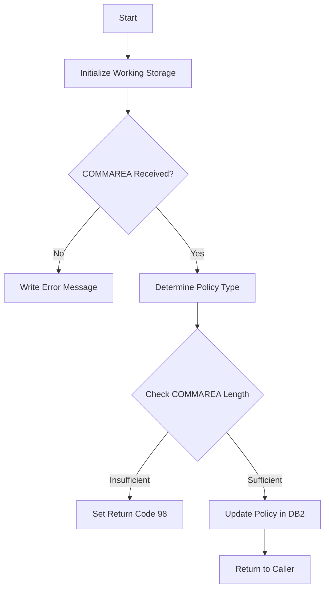

This document will cover the <SwmToken path="base/src/lgupol01.cbl" pos="11:6:6" line-data="       PROGRAM-ID. LGUPOL01.">`LGUPOL01`</SwmToken> program. We'll cover:

1. What the Program Does
2. Program Flow
3. Program Sections

## What the Program Does

The <SwmToken path="base/src/lgupol01.cbl" pos="11:6:6" line-data="       PROGRAM-ID. LGUPOL01.">`LGUPOL01`</SwmToken> program is designed to update policy details in the IBM CICS Transaction Server for z/OS. The program initializes working storage variables, checks the communication area (COMMAREA), determines the type of policy being requested, and then updates the policy information in the <SwmToken path="base/src/lgupol01.cbl" pos="143:7:7" line-data="           PERFORM UPDATE-POLICY-DB2-INFO.">`DB2`</SwmToken> database. The program also handles error messaging if no COMMAREA is received or if the COMMAREA length is insufficient.

## Program Flow

The program flow of <SwmToken path="base/src/lgupol01.cbl" pos="11:6:6" line-data="       PROGRAM-ID. LGUPOL01.">`LGUPOL01`</SwmToken> is as follows:

1. Initialize working storage variables.
2. Check if the COMMAREA is received.
3. Determine the type of policy being requested.
4. Check the COMMAREA length for the requested policy type.
5. Update the policy information in the <SwmToken path="base/src/lgupol01.cbl" pos="143:7:7" line-data="           PERFORM UPDATE-POLICY-DB2-INFO.">`DB2`</SwmToken> database by calling another program <SwmToken path="base/src/lgupol01.cbl" pos="157:8:9" line-data="           EXEC CICS LINK Program(LGUPDB01)">`(LGUPDB01`</SwmToken>).
6. Return control to the caller.



<SwmSnippet path="/base/src/lgupol01.cbl" line="83">

---

### MAINLINE SECTION

First, the MAINLINE SECTION initializes working storage variables and sets up general variables. It then checks if the COMMAREA is received. If not, it writes an error message and abends the transaction. If the COMMAREA is received, it initializes the COMMAREA return code to zero and sets the address of the COMMAREA.

```cobol
       MAINLINE SECTION.

      *----------------------------------------------------------------*
      * Common code                                                    *
      *----------------------------------------------------------------*
      * initialize working storage variables
           INITIALIZE WS-HEADER.
      * set up general variable
           MOVE EIBTRNID TO WS-TRANSID.
           MOVE EIBTRMID TO WS-TERMID.
           MOVE EIBTASKN TO WS-TASKNUM.

      *----------------------------------------------------------------*
      * Check commarea and obtain required details                     *
      *----------------------------------------------------------------*
      * If NO commarea received issue an ABEND
           IF EIBCALEN IS EQUAL TO ZERO
               MOVE ' NO COMMAREA RECEIVED' TO EM-VARIABLE
               PERFORM WRITE-ERROR-MESSAGE
               EXEC CICS ABEND ABCODE('LGCA') NODUMP END-EXEC
           END-IF
```

---

</SwmSnippet>

<SwmSnippet path="/base/src/lgupol01.cbl" line="109">

---

Now, the program checks which policy type is being requested and verifies the COMMAREA length for the requested policy type. If the COMMAREA length is insufficient, it sets the return code to 98 and returns control to the caller. If the length is sufficient, it proceeds to update the policy information.

```cobol
      *----------------------------------------------------------------*
      * Check which policy type is being requested                     *
      *   and chec commarea length                                     *
      *----------------------------------------------------------------*
           EVALUATE CA-REQUEST-ID

             WHEN '01UEND'
               ADD WS-CA-HEADER-LEN  TO WS-REQUIRED-CA-LEN
               ADD WS-FULL-ENDOW-LEN TO WS-REQUIRED-CA-LEN
               IF EIBCALEN IS LESS THAN WS-REQUIRED-CA-LEN
                 MOVE '98' TO CA-RETURN-CODE
                 EXEC CICS RETURN END-EXEC
               END-IF

             WHEN '01UHOU'
               ADD WS-CA-HEADER-LEN  TO WS-REQUIRED-CA-LEN
               ADD WS-FULL-HOUSE-LEN TO WS-REQUIRED-CA-LEN
               IF EIBCALEN IS LESS THAN WS-REQUIRED-CA-LEN
                 MOVE '98' TO CA-RETURN-CODE
                 EXEC CICS RETURN END-EXEC
               END-IF
```

---

</SwmSnippet>

<SwmSnippet path="/base/src/lgupol01.cbl" line="143">

---

Then, the program performs the <SwmToken path="base/src/lgupol01.cbl" pos="143:3:9" line-data="           PERFORM UPDATE-POLICY-DB2-INFO.">`UPDATE-POLICY-DB2-INFO`</SwmToken> section to update the policy information in the <SwmToken path="base/src/lgupol01.cbl" pos="143:7:7" line-data="           PERFORM UPDATE-POLICY-DB2-INFO.">`DB2`</SwmToken> database by calling the <SwmToken path="base/src/lgupol01.cbl" pos="157:9:9" line-data="           EXEC CICS LINK Program(LGUPDB01)">`LGUPDB01`</SwmToken> program.

```cobol
           PERFORM UPDATE-POLICY-DB2-INFO.

      * Return to caller
       END-PROGRAM.
           EXEC CICS RETURN END-EXEC.
```

---

</SwmSnippet>

<SwmSnippet path="/base/src/lgupol01.cbl" line="155">

---

### <SwmToken path="base/src/lgupol01.cbl" pos="155:1:7" line-data="       UPDATE-POLICY-DB2-INFO.">`UPDATE-POLICY-DB2-INFO`</SwmToken>

Going into the <SwmToken path="base/src/lgupol01.cbl" pos="155:1:7" line-data="       UPDATE-POLICY-DB2-INFO.">`UPDATE-POLICY-DB2-INFO`</SwmToken> section, the program links to the <SwmToken path="base/src/lgupol01.cbl" pos="157:9:9" line-data="           EXEC CICS LINK Program(LGUPDB01)">`LGUPDB01`</SwmToken> program, passing the COMMAREA to update the policy information in the <SwmToken path="base/src/lgupol01.cbl" pos="155:5:5" line-data="       UPDATE-POLICY-DB2-INFO.">`DB2`</SwmToken> database.

```cobol
       UPDATE-POLICY-DB2-INFO.

           EXEC CICS LINK Program(LGUPDB01)
                Commarea(DFHCOMMAREA)
                LENGTH(32500)
           END-EXEC.

           EXIT.
```

---

</SwmSnippet>

<SwmSnippet path="/base/src/lgupol01.cbl" line="169">

---

### <SwmToken path="base/src/lgupol01.cbl" pos="169:1:5" line-data="       WRITE-ERROR-MESSAGE.">`WRITE-ERROR-MESSAGE`</SwmToken>

Finally, the <SwmToken path="base/src/lgupol01.cbl" pos="169:1:5" line-data="       WRITE-ERROR-MESSAGE.">`WRITE-ERROR-MESSAGE`</SwmToken> section is used to write error messages to the queues. It formats the current time and date, and writes the error message to the TDQ. If the COMMAREA length is greater than zero, it writes up to 90 bytes of the COMMAREA to the TDQ.

```cobol
       WRITE-ERROR-MESSAGE.
      * Save SQLCODE in message
      * Obtain and format current time and date
           EXEC CICS ASKTIME ABSTIME(WS-ABSTIME)
           END-EXEC
           EXEC CICS FORMATTIME ABSTIME(WS-ABSTIME)
                     MMDDYYYY(WS-DATE)
                     TIME(WS-TIME)
           END-EXEC
           MOVE WS-DATE TO EM-DATE
           MOVE WS-TIME TO EM-TIME
      * Write output message to TDQ
           EXEC CICS LINK PROGRAM('LGSTSQ')
                     COMMAREA(ERROR-MSG)
                     LENGTH(LENGTH OF ERROR-MSG)
           END-EXEC.
      * Write 90 bytes or as much as we have of commarea to TDQ
           IF EIBCALEN > 0 THEN
             IF EIBCALEN < 91 THEN
               MOVE DFHCOMMAREA(1:EIBCALEN) TO CA-DATA
               EXEC CICS LINK PROGRAM('LGSTSQ')
```

---

</SwmSnippet>

&nbsp;

*This is an auto-generated document by Swimm 🌊 and has not yet been verified by a human*

<SwmMeta version="3.0.0" repo-id="Z2l0aHViJTNBJTNBa3luZHJ5bC1jaWNzLWdlbmFwcCUzQSUzQVN3aW1tLURlbW8=" repo-name="kyndryl-cics-genapp"><sup>Powered by [Swimm](/)</sup></SwmMeta>
