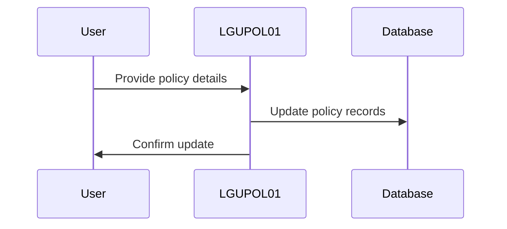
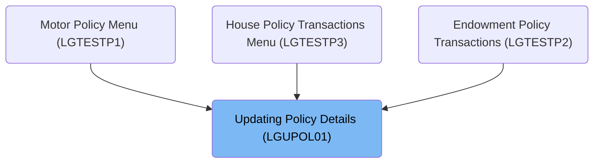

This document describes the process of updating policy details using the <SwmToken path="base/src/lgupol01.cbl" pos="11:6:6" line-data="       PROGRAM-ID. LGUPOL01.">`LGUPOL01`</SwmToken> program. The program receives policy details from the user interface and updates the corresponding records in the database, ensuring that policy information is accurately reflected in the system.

For example, if a user updates the coverage amount for a policy, the program receives this information and updates the corresponding record in the database.

The main steps are:

- Check policy type
- Update policy details in the database using <SwmToken path="base/src/lgupol01.cbl" pos="157:9:9" line-data="           EXEC CICS LINK Program(LGUPDB01)">`LGUPDB01`</SwmToken>
- Return control to CICS



## Dependencies

### Programs

- <SwmToken path="base/src/lgupol01.cbl" pos="157:9:9" line-data="           EXEC CICS LINK Program(LGUPDB01)">`LGUPDB01`</SwmToken> (<SwmPath>[base/src/lgupdb01.cbl](base/src/lgupdb01.cbl)</SwmPath>) - <SwmLink doc-title="Updating Policy Details (LGUPDB01)">[Updating Policy Details (LGUPDB01)](/.swm/updating-policy-details-lgupdb01.17dw3gy8.sw.md)</SwmLink>
- LGUPVS01 (<SwmPath>[base/src/lgupvs01.cbl](base/src/lgupvs01.cbl)</SwmPath>) - <SwmLink doc-title="Updating Policy Records (LGUPVS01)">[Updating Policy Records (LGUPVS01)](/.swm/updating-policy-records-lgupvs01.j9n26r47.sw.md)</SwmLink>
- LGSTSQ (<SwmPath>[base/src/lgstsq.cbl](base/src/lgstsq.cbl)</SwmPath>) - <SwmLink doc-title="Message Queue Handler (LGSTSQ)">[Message Queue Handler (LGSTSQ)](/.swm/message-queue-handler-lgstsq.e7y8uelv.sw.md)</SwmLink>

### Copybooks

- LGCMAREA (<SwmPath>[base/src/lgcmarea.cpy](base/src/lgcmarea.cpy)</SwmPath>)
- LGPOLICY (<SwmPath>[base/src/lgpolicy.cpy](base/src/lgpolicy.cpy)</SwmPath>)
- SQLCA

# Where is this program used?

This program is used multiple times in the codebase as represented in the following diagram:



# Managing Policy Updates and Finalizing Transactions

<SwmSnippet path="/base/src/lgupol01.cbl" line="139">

---

<SwmToken path="base/src/lgupol01.cbl" pos="83:1:1" line-data="       MAINLINE SECTION.">`MAINLINE`</SwmToken> starts by checking the policy type and commarea length. If the length is insufficient, it exits with a return code '98'. Then, it calls <SwmToken path="base/src/lgupol01.cbl" pos="143:3:9" line-data="           PERFORM UPDATE-POLICY-DB2-INFO.">`UPDATE-POLICY-DB2-INFO`</SwmToken> to update policy details in the database.

```cobol
             WHEN OTHER
               MOVE '99' TO CA-RETURN-CODE
           END-EVALUATE

           PERFORM UPDATE-POLICY-DB2-INFO.
```

---

</SwmSnippet>

<SwmSnippet path="/base/src/lgupol01.cbl" line="155">

---

<SwmToken path="base/src/lgupol01.cbl" pos="155:1:7" line-data="       UPDATE-POLICY-DB2-INFO.">`UPDATE-POLICY-DB2-INFO`</SwmToken> uses <SwmToken path="base/src/lgupol01.cbl" pos="157:1:5" line-data="           EXEC CICS LINK Program(LGUPDB01)">`EXEC CICS LINK`</SwmToken> to call <SwmToken path="base/src/lgupol01.cbl" pos="157:9:9" line-data="           EXEC CICS LINK Program(LGUPDB01)">`LGUPDB01`</SwmToken>, passing policy details in <SwmToken path="base/src/lgupol01.cbl" pos="158:3:3" line-data="                Commarea(DFHCOMMAREA)">`DFHCOMMAREA`</SwmToken> for database updates.

```cobol
       UPDATE-POLICY-DB2-INFO.

           EXEC CICS LINK Program(LGUPDB01)
                Commarea(DFHCOMMAREA)
                LENGTH(32500)
           END-EXEC.

           EXIT.
```

---

</SwmSnippet>

<SwmSnippet path="/base/src/lgupol01.cbl" line="146">

---

<SwmToken path="base/src/lgupol01.cbl" pos="146:1:3" line-data="       END-PROGRAM.">`END-PROGRAM`</SwmToken> signifies the end of the COBOL program, and <SwmToken path="base/src/lgupol01.cbl" pos="147:1:5" line-data="           EXEC CICS RETURN END-EXEC.">`EXEC CICS RETURN`</SwmToken> returns control to CICS, marking the transaction's completion.

```cobol
       END-PROGRAM.
           EXEC CICS RETURN END-EXEC.
```

---

</SwmSnippet>

&nbsp;

*This is an auto-generated document by Swimm 🌊 and has not yet been verified by a human*

<SwmMeta version="3.0.0" repo-id="Z2l0aHViJTNBJTNBa3luZHJ5bC1jaWNzLWdlbmFwcCUzQSUzQVN3aW1tLURlbW8=" repo-name="kyndryl-cics-genapp"><sup>Powered by [Swimm](/)</sup></SwmMeta>
