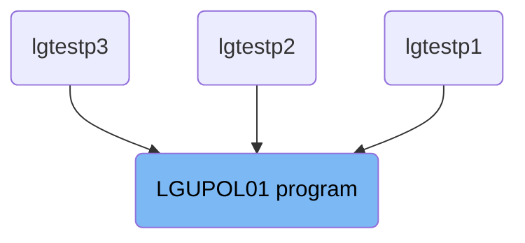
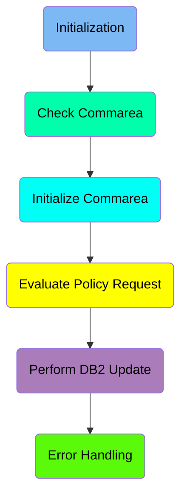
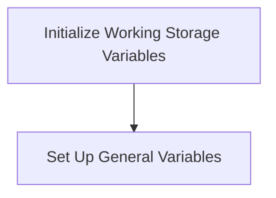
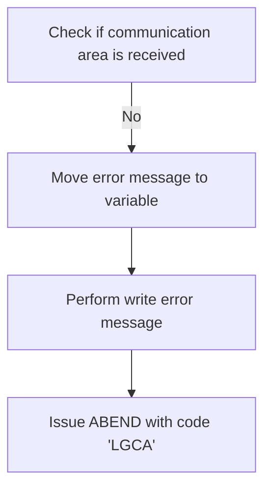
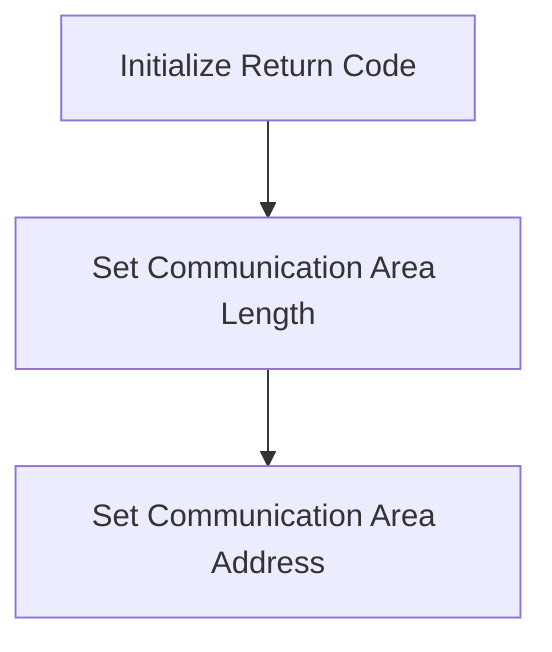
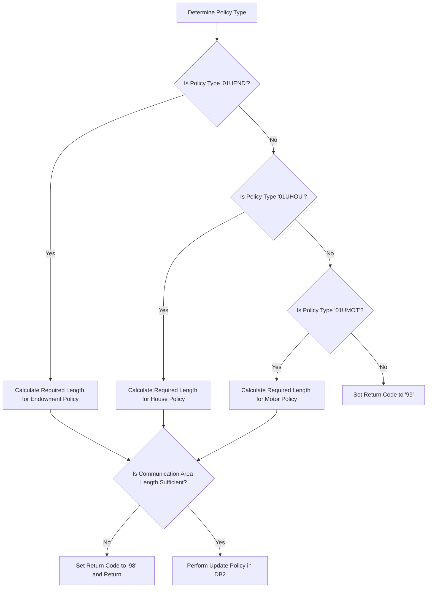
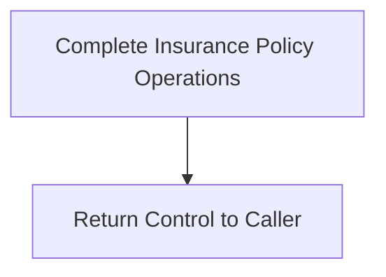
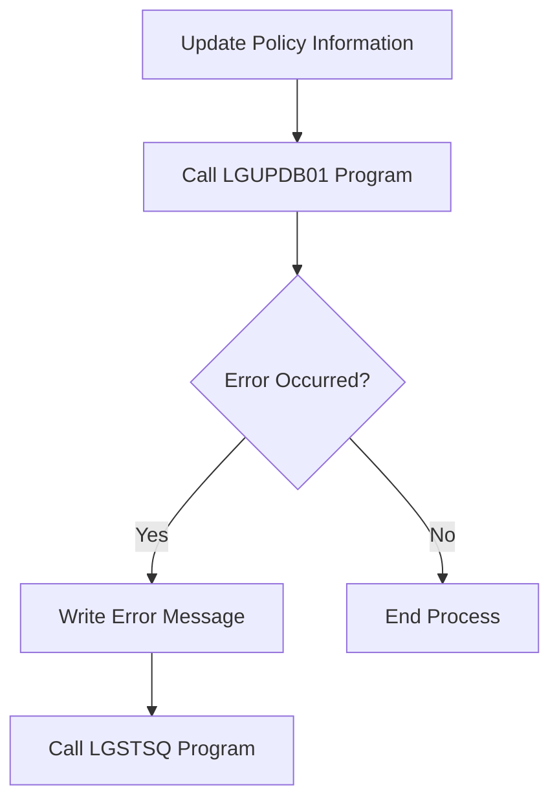

The <SwmToken path="base/src/lgupol01.cbl" pos="11:6:6" line-data="       PROGRAM-ID. LGUPOL01.">`LGUPOL01`</SwmToken> program is responsible for updating insurance policy information in the IBM Db2 database. It achieves this by initializing necessary variables, checking and handling the communication area, evaluating the policy request, and performing the database update. The program ensures that all required data is correctly processed and stored, providing a reliable way to manage insurance policies.

The <SwmToken path="base/src/lgupol01.cbl" pos="11:6:6" line-data="       PROGRAM-ID. LGUPOL01.">`LGUPOL01`</SwmToken> program starts by initializing variables and setting up the environment. It then checks if the communication area data is received and handles any errors if not. Next, it evaluates the type of insurance policy requested and calculates the required communication area length. Finally, it updates the policy information in the Db2 database and handles any errors that occur during the process.

# Where is this program used?

This program is used multiple times in the codebase as represented in the following diagram:



Here is a high level diagram of the program:



# Initialization



<SwmSnippet path="/base/src/lgupol01.cbl" line="88">

---

## Initialize Working Storage Variables

First, we initialize the working storage variables by calling <SwmToken path="base/src/lgupol01.cbl" pos="89:1:5" line-data="           INITIALIZE WS-HEADER.">`INITIALIZE WS-HEADER`</SwmToken>. This step ensures that all the necessary working storage fields are set to their initial values, preparing the environment for subsequent operations.

```cobol
      * initialize working storage variables
           INITIALIZE WS-HEADER.
```

---

</SwmSnippet>

<SwmSnippet path="/base/src/lgupol01.cbl" line="91">

---

## Set Up General Variables

Next, we set up general variables by moving values from the `EIB` (Execute Interface Block) to working storage fields. Specifically, <SwmToken path="base/src/lgupol01.cbl" pos="91:3:3" line-data="           MOVE EIBTRNID TO WS-TRANSID.">`EIBTRNID`</SwmToken> is moved to <SwmToken path="base/src/lgupol01.cbl" pos="91:7:9" line-data="           MOVE EIBTRNID TO WS-TRANSID.">`WS-TRANSID`</SwmToken>, <SwmToken path="base/src/lgupol01.cbl" pos="92:3:3" line-data="           MOVE EIBTRMID TO WS-TERMID.">`EIBTRMID`</SwmToken> to <SwmToken path="base/src/lgupol01.cbl" pos="92:7:9" line-data="           MOVE EIBTRMID TO WS-TERMID.">`WS-TERMID`</SwmToken>, and <SwmToken path="base/src/lgupol01.cbl" pos="93:3:3" line-data="           MOVE EIBTASKN TO WS-TASKNUM.">`EIBTASKN`</SwmToken> to <SwmToken path="base/src/lgupol01.cbl" pos="93:7:9" line-data="           MOVE EIBTASKN TO WS-TASKNUM.">`WS-TASKNUM`</SwmToken>. These steps capture the transaction ID, terminal ID, and task number, respectively, which are essential for tracking and managing the transaction.

```cobol
           MOVE EIBTRNID TO WS-TRANSID.
           MOVE EIBTRMID TO WS-TERMID.
           MOVE EIBTASKN TO WS-TASKNUM.
```

---

</SwmSnippet>

# Check Commarea

This is the next section of the flow.



<SwmSnippet path="/base/src/lgupol01.cbl" line="99">

---

## Checking for Communication Area

First, we check if the communication area length (<SwmToken path="base/src/lgupol01.cbl" pos="99:3:3" line-data="           IF EIBCALEN IS EQUAL TO ZERO">`EIBCALEN`</SwmToken>) is zero. This indicates that no communication area data has been received.

```cobol
           IF EIBCALEN IS EQUAL TO ZERO
```

---

</SwmSnippet>

<SwmSnippet path="/base/src/lgupol01.cbl" line="100">

---

## Handling Missing Communication Area

Next, if no communication area is received, we move the error message 'NO COMMAREA RECEIVED' to the variable <SwmToken path="base/src/lgupol01.cbl" pos="100:14:16" line-data="               MOVE &#39; NO COMMAREA RECEIVED&#39; TO EM-VARIABLE">`EM-VARIABLE`</SwmToken>. This prepares the error message for logging.

```cobol
               MOVE ' NO COMMAREA RECEIVED' TO EM-VARIABLE
```

---

</SwmSnippet>

<SwmSnippet path="/base/src/lgupol01.cbl" line="101">

---

## Writing Error Message

Then, we perform the <SwmToken path="base/src/lgupol01.cbl" pos="101:3:7" line-data="               PERFORM WRITE-ERROR-MESSAGE">`WRITE-ERROR-MESSAGE`</SwmToken> routine to log the error message. This ensures that the issue is recorded for further analysis.

```cobol
               PERFORM WRITE-ERROR-MESSAGE
```

---

</SwmSnippet>

<SwmSnippet path="/base/src/lgupol01.cbl" line="102">

---

## Issuing ABEND

Finally, we issue an ABEND with the code 'LGCA' and the <SwmToken path="base/src/lgupol01.cbl" pos="102:14:14" line-data="               EXEC CICS ABEND ABCODE(&#39;LGCA&#39;) NODUMP END-EXEC">`NODUMP`</SwmToken> option. This terminates the program due to the critical error of missing communication area data.

```cobol
               EXEC CICS ABEND ABCODE('LGCA') NODUMP END-EXEC
```

---

</SwmSnippet>

# Initialize Commarea

This is the next section of the flow.



<SwmSnippet path="/base/src/lgupol01.cbl" line="105">

---

## Initialize Return Code

First, we initialize the return code by setting <SwmToken path="base/src/lgupol01.cbl" pos="105:9:13" line-data="           MOVE &#39;00&#39; TO CA-RETURN-CODE">`CA-RETURN-CODE`</SwmToken> to '00'. This ensures that the process starts with a default success state.

```cobol
           MOVE '00' TO CA-RETURN-CODE
```

---

</SwmSnippet>

<SwmSnippet path="/base/src/lgupol01.cbl" line="106">

---

## Set Communication Area Length

Next, we set the length of the communication area by moving the value of <SwmToken path="base/src/lgupol01.cbl" pos="106:3:3" line-data="           MOVE EIBCALEN TO WS-CALEN.">`EIBCALEN`</SwmToken> to <SwmToken path="base/src/lgupol01.cbl" pos="106:7:9" line-data="           MOVE EIBCALEN TO WS-CALEN.">`WS-CALEN`</SwmToken>. This step is crucial for determining the size of the data being passed.

```cobol
           MOVE EIBCALEN TO WS-CALEN.
```

---

</SwmSnippet>

<SwmSnippet path="/base/src/lgupol01.cbl" line="107">

---

## Set Communication Area Address

Then, we set the address of the communication area by assigning the address of <SwmToken path="base/src/lgupol01.cbl" pos="107:7:7" line-data="           SET WS-ADDR-DFHCOMMAREA TO ADDRESS OF DFHCOMMAREA.">`DFHCOMMAREA`</SwmToken> to <SwmToken path="base/src/lgupol01.cbl" pos="107:3:7" line-data="           SET WS-ADDR-DFHCOMMAREA TO ADDRESS OF DFHCOMMAREA.">`WS-ADDR-DFHCOMMAREA`</SwmToken>. This allows the program to access the communication area for data exchange.

```cobol
           SET WS-ADDR-DFHCOMMAREA TO ADDRESS OF DFHCOMMAREA.
```

---

</SwmSnippet>

## Interim Summary

So far, we saw how to initialize working storage variables and set up general variables, followed by checking and handling the communication area. Now, we will focus on evaluating the policy request to determine the type of insurance policy and calculate the required communication area length.

# Evaluate Policy Request



<SwmSnippet path="/base/src/lgupol01.cbl" line="113">

---

## Determine Policy Type

First, the code evaluates the <SwmToken path="base/src/lgupol01.cbl" pos="113:3:7" line-data="           EVALUATE CA-REQUEST-ID">`CA-REQUEST-ID`</SwmToken> to determine the type of insurance policy being requested.

```cobol
           EVALUATE CA-REQUEST-ID

```

---

</SwmSnippet>

<SwmSnippet path="/base/src/lgupol01.cbl" line="115">

---

## Calculate Required Length for Endowment Policy

If the policy type is <SwmToken path="base/src/lgupol01.cbl" pos="115:4:4" line-data="             WHEN &#39;01UEND&#39;">`01UEND`</SwmToken>, the code calculates the required communication area length for an endowment policy by adding <SwmToken path="base/src/lgupol01.cbl" pos="116:3:9" line-data="               ADD WS-CA-HEADER-LEN  TO WS-REQUIRED-CA-LEN">`WS-CA-HEADER-LEN`</SwmToken> and <SwmToken path="base/src/lgupol01.cbl" pos="117:3:9" line-data="               ADD WS-FULL-ENDOW-LEN TO WS-REQUIRED-CA-LEN">`WS-FULL-ENDOW-LEN`</SwmToken>. It then checks if the actual communication area length (<SwmToken path="base/src/lgupol01.cbl" pos="118:3:3" line-data="               IF EIBCALEN IS LESS THAN WS-REQUIRED-CA-LEN">`EIBCALEN`</SwmToken>) is less than the required length. If it is, it sets the return code to '98' and returns.

```cobol
             WHEN '01UEND'
               ADD WS-CA-HEADER-LEN  TO WS-REQUIRED-CA-LEN
               ADD WS-FULL-ENDOW-LEN TO WS-REQUIRED-CA-LEN
               IF EIBCALEN IS LESS THAN WS-REQUIRED-CA-LEN
                 MOVE '98' TO CA-RETURN-CODE
                 EXEC CICS RETURN END-EXEC
               END-IF
```

---

</SwmSnippet>

<SwmSnippet path="/base/src/lgupol01.cbl" line="123">

---

## Calculate Required Length for House Policy

If the policy type is <SwmToken path="base/src/lgupol01.cbl" pos="123:4:4" line-data="             WHEN &#39;01UHOU&#39;">`01UHOU`</SwmToken>, the code calculates the required communication area length for a house policy by adding <SwmToken path="base/src/lgupol01.cbl" pos="124:3:9" line-data="               ADD WS-CA-HEADER-LEN  TO WS-REQUIRED-CA-LEN">`WS-CA-HEADER-LEN`</SwmToken> and <SwmToken path="base/src/lgupol01.cbl" pos="125:3:9" line-data="               ADD WS-FULL-HOUSE-LEN TO WS-REQUIRED-CA-LEN">`WS-FULL-HOUSE-LEN`</SwmToken>. It then checks if the actual communication area length (<SwmToken path="base/src/lgupol01.cbl" pos="126:3:3" line-data="               IF EIBCALEN IS LESS THAN WS-REQUIRED-CA-LEN">`EIBCALEN`</SwmToken>) is less than the required length. If it is, it sets the return code to '98' and returns.

```cobol
             WHEN '01UHOU'
               ADD WS-CA-HEADER-LEN  TO WS-REQUIRED-CA-LEN
               ADD WS-FULL-HOUSE-LEN TO WS-REQUIRED-CA-LEN
               IF EIBCALEN IS LESS THAN WS-REQUIRED-CA-LEN
                 MOVE '98' TO CA-RETURN-CODE
                 EXEC CICS RETURN END-EXEC
               END-IF
```

---

</SwmSnippet>

<SwmSnippet path="/base/src/lgupol01.cbl" line="131">

---

## Calculate Required Length for Motor Policy

If the policy type is <SwmToken path="base/src/lgupol01.cbl" pos="131:4:4" line-data="             WHEN &#39;01UMOT&#39;">`01UMOT`</SwmToken>, the code calculates the required communication area length for a motor policy by adding <SwmToken path="base/src/lgupol01.cbl" pos="132:3:9" line-data="               ADD WS-CA-HEADER-LEN  TO WS-REQUIRED-CA-LEN">`WS-CA-HEADER-LEN`</SwmToken> and <SwmToken path="base/src/lgupol01.cbl" pos="133:3:9" line-data="               ADD WS-FULL-MOTOR-LEN TO WS-REQUIRED-CA-LEN">`WS-FULL-MOTOR-LEN`</SwmToken>. It then checks if the actual communication area length (<SwmToken path="base/src/lgupol01.cbl" pos="134:3:3" line-data="               IF EIBCALEN IS LESS THAN WS-REQUIRED-CA-LEN">`EIBCALEN`</SwmToken>) is less than the required length. If it is, it sets the return code to '98' and returns.

```cobol
             WHEN '01UMOT'
               ADD WS-CA-HEADER-LEN  TO WS-REQUIRED-CA-LEN
               ADD WS-FULL-MOTOR-LEN TO WS-REQUIRED-CA-LEN
               IF EIBCALEN IS LESS THAN WS-REQUIRED-CA-LEN
                 MOVE '98' TO CA-RETURN-CODE
                 EXEC CICS RETURN END-EXEC
               END-IF
```

---

</SwmSnippet>

<SwmSnippet path="/base/src/lgupol01.cbl" line="139">

---

## Set Return Code for Other Policy Types

If the policy type does not match any of the specified types, the code sets the return code to '99'.

```cobol
             WHEN OTHER
               MOVE '99' TO CA-RETURN-CODE
           END-EVALUATE
```

---

</SwmSnippet>

<SwmSnippet path="/base/src/lgupol01.cbl" line="143">

---

## Perform Update Policy in <SwmToken path="base/src/lgupol01.cbl" pos="143:7:7" line-data="           PERFORM UPDATE-POLICY-DB2-INFO.">`DB2`</SwmToken>

Finally, the code performs the <SwmToken path="base/src/lgupol01.cbl" pos="143:3:9" line-data="           PERFORM UPDATE-POLICY-DB2-INFO.">`UPDATE-POLICY-DB2-INFO`</SwmToken> procedure to update the policy information in the <SwmToken path="base/src/lgupol01.cbl" pos="143:7:7" line-data="           PERFORM UPDATE-POLICY-DB2-INFO.">`DB2`</SwmToken> database.

```cobol
           PERFORM UPDATE-POLICY-DB2-INFO.

```

---

</SwmSnippet>

<SwmSnippet path="/base/src/lgupol01.cbl" line="155">

---

### Update Policy in <SwmToken path="base/src/lgupol01.cbl" pos="155:5:5" line-data="       UPDATE-POLICY-DB2-INFO.">`DB2`</SwmToken>

The <SwmToken path="base/src/lgupol01.cbl" pos="155:1:7" line-data="       UPDATE-POLICY-DB2-INFO.">`UPDATE-POLICY-DB2-INFO`</SwmToken> procedure links to the <SwmToken path="base/src/lgupol01.cbl" pos="157:9:9" line-data="           EXEC CICS LINK Program(LGUPDB01)">`LGUPDB01`</SwmToken> program to update the policy information in the <SwmToken path="base/src/lgupol01.cbl" pos="155:5:5" line-data="       UPDATE-POLICY-DB2-INFO.">`DB2`</SwmToken> database using the communication area (<SwmToken path="base/src/lgupol01.cbl" pos="158:3:3" line-data="                Commarea(DFHCOMMAREA)">`DFHCOMMAREA`</SwmToken>).

```cobol
       UPDATE-POLICY-DB2-INFO.

           EXEC CICS LINK Program(LGUPDB01)
                Commarea(DFHCOMMAREA)
                LENGTH(32500)
           END-EXEC.
```

---

</SwmSnippet>

# Perform <SwmToken path="base/src/lgupol01.cbl" pos="143:7:7" line-data="           PERFORM UPDATE-POLICY-DB2-INFO.">`DB2`</SwmToken> Update



<SwmSnippet path="/base/src/lgupol01.cbl" line="145">

---

First, the program reaches the end of its execution and prepares to return control to the caller. This is indicated by the <SwmToken path="base/src/lgupol01.cbl" pos="146:1:3" line-data="       END-PROGRAM.">`END-PROGRAM`</SwmToken> statement. Then, the <SwmToken path="base/src/lgupol01.cbl" pos="147:1:9" line-data="           EXEC CICS RETURN END-EXEC.">`EXEC CICS RETURN END-EXEC`</SwmToken> command is executed to return control to the CICS region, signaling that the program has completed its task.

```cobol
      * Return to caller
       END-PROGRAM.
           EXEC CICS RETURN END-EXEC.

```

---

</SwmSnippet>

# Error Handling



<SwmSnippet path="/base/src/lgupol01.cbl" line="155">

---

## Update Policy Information

First, the <SwmToken path="base/src/lgupol01.cbl" pos="155:1:7" line-data="       UPDATE-POLICY-DB2-INFO.">`UPDATE-POLICY-DB2-INFO`</SwmToken> section is responsible for updating the policy information in the database. It does this by calling the <SwmToken path="base/src/lgupol01.cbl" pos="157:9:9" line-data="           EXEC CICS LINK Program(LGUPDB01)">`LGUPDB01`</SwmToken> program using the <SwmToken path="base/src/lgupol01.cbl" pos="157:1:5" line-data="           EXEC CICS LINK Program(LGUPDB01)">`EXEC CICS LINK`</SwmToken> command, passing the <SwmToken path="base/src/lgupol01.cbl" pos="158:3:3" line-data="                Commarea(DFHCOMMAREA)">`DFHCOMMAREA`</SwmToken> which contains the necessary data.

```cobol
       UPDATE-POLICY-DB2-INFO.

           EXEC CICS LINK Program(LGUPDB01)
                Commarea(DFHCOMMAREA)
                LENGTH(32500)
           END-EXEC.
```

---

</SwmSnippet>

<SwmSnippet path="/base/src/lgupol01.cbl" line="169">

---

## Write Error Message

Next, the <SwmToken path="base/src/lgupol01.cbl" pos="169:1:5" line-data="       WRITE-ERROR-MESSAGE.">`WRITE-ERROR-MESSAGE`</SwmToken> section handles the writing of error messages to the queues. It first obtains and formats the current date and time using the <SwmToken path="base/src/lgupol01.cbl" pos="172:1:5" line-data="           EXEC CICS ASKTIME ABSTIME(WS-ABSTIME)">`EXEC CICS ASKTIME`</SwmToken> and <SwmToken path="base/src/lgupol01.cbl" pos="174:1:5" line-data="           EXEC CICS FORMATTIME ABSTIME(WS-ABSTIME)">`EXEC CICS FORMATTIME`</SwmToken> commands. Then, it moves the formatted date and time to the error message fields. The error message is then written to the TDQ by calling the <SwmToken path="base/src/lgupol01.cbl" pos="181:10:10" line-data="           EXEC CICS LINK PROGRAM(&#39;LGSTSQ&#39;)">`LGSTSQ`</SwmToken> program using the <SwmToken path="base/src/lgupol01.cbl" pos="181:1:5" line-data="           EXEC CICS LINK PROGRAM(&#39;LGSTSQ&#39;)">`EXEC CICS LINK`</SwmToken> command. If the <SwmToken path="base/src/lgupol01.cbl" pos="186:3:3" line-data="           IF EIBCALEN &gt; 0 THEN">`EIBCALEN`</SwmToken> is greater than 0, it writes up to 90 bytes of the <SwmToken path="base/src/lgupol01.cbl" pos="188:3:3" line-data="               MOVE DFHCOMMAREA(1:EIBCALEN) TO CA-DATA">`DFHCOMMAREA`</SwmToken> to the TDQ.

More about LGSTSQ: <SwmLink doc-title="Handling Messages (LGSTSQ)">[Handling Messages (LGSTSQ)](/.swm/handling-messages-lgstsq.o6o7rslw.sw.md)</SwmLink>

```cobol
       WRITE-ERROR-MESSAGE.
      * Save SQLCODE in message
      * Obtain and format current time and date
           EXEC CICS ASKTIME ABSTIME(WS-ABSTIME)
           END-EXEC
           EXEC CICS FORMATTIME ABSTIME(WS-ABSTIME)
                     MMDDYYYY(WS-DATE)
                     TIME(WS-TIME)
           END-EXEC
           MOVE WS-DATE TO EM-DATE
           MOVE WS-TIME TO EM-TIME
      * Write output message to TDQ
           EXEC CICS LINK PROGRAM('LGSTSQ')
                     COMMAREA(ERROR-MSG)
                     LENGTH(LENGTH OF ERROR-MSG)
           END-EXEC.
      * Write 90 bytes or as much as we have of commarea to TDQ
           IF EIBCALEN > 0 THEN
             IF EIBCALEN < 91 THEN
               MOVE DFHCOMMAREA(1:EIBCALEN) TO CA-DATA
               EXEC CICS LINK PROGRAM('LGSTSQ')
```

---

</SwmSnippet>

&nbsp;

*This is an auto-generated document by Swimm 🌊 and has not yet been verified by a human*

<SwmMeta version="3.0.0" repo-id="Z2l0aHViJTNBJTNBa3luZHJ5bC1jaWNzLWdlbmFwcCUzQSUzQVN3aW1tLURlbW8=" repo-name="kyndryl-cics-genapp"><sup>Powered by [Swimm](/)</sup></SwmMeta>
